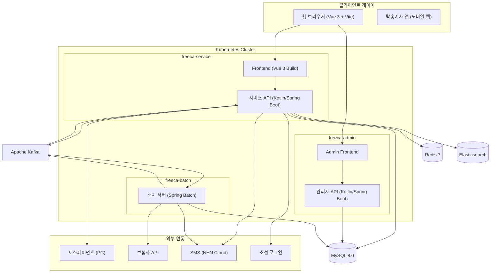
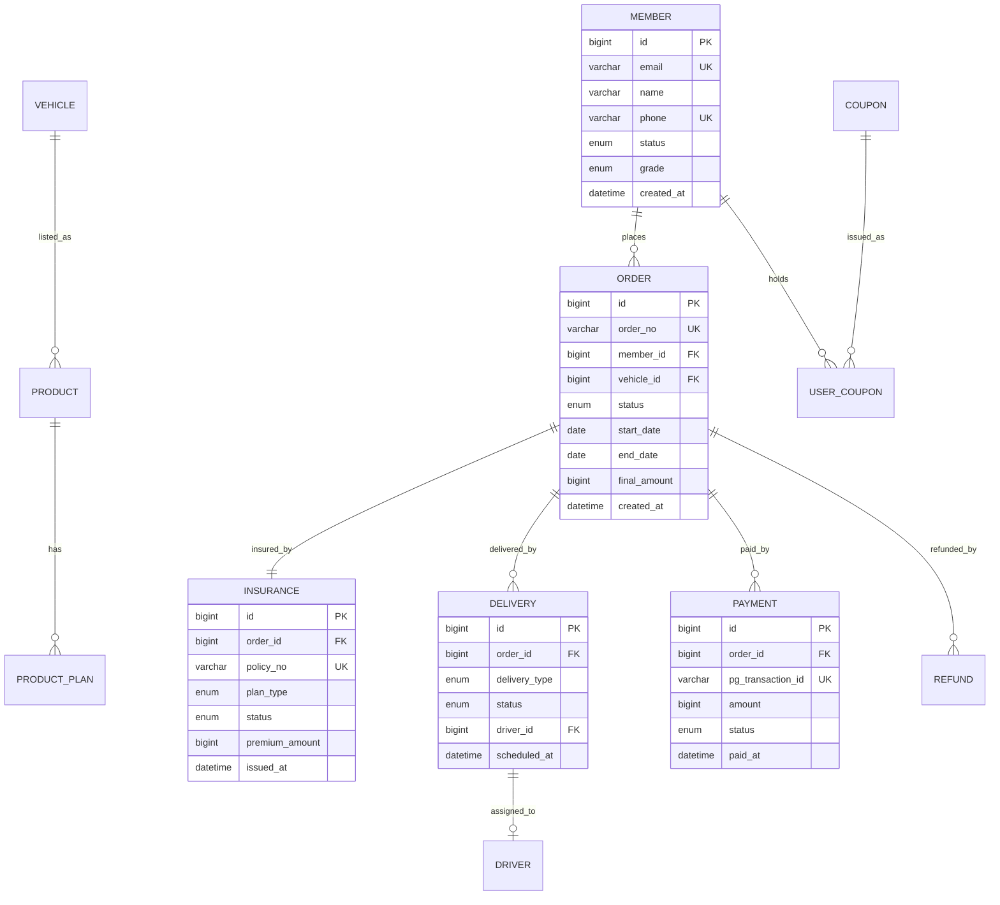

# 🚗 프리카 (FreeCar)

> **자동차 구독 이용권 이커머스 플랫폼**  
> Vue 3 · Kotlin/Spring Boot · Spring Batch · Kafka · Kubernetes · Docker

<br>

## 📌 목차

- [프로젝트 소개](#-프로젝트-소개)
- [기획 배경](#-기획-배경)
- [기술 스택](#️-기술-스택)
- [핵심 기능](#-핵심-기능)
- [시스템 아키텍처](#️-시스템-아키텍처)
- [서비스 정책](#-서비스-정책)
- [기술적 의사결정](#-기술적-의사결정)
- [프로젝트 구조](#-프로젝트-구조)
- [데이터베이스 설계](#️-데이터베이스-설계-erd)
- [API 명세](#-api-명세)
- [Kafka 이벤트 설계](#-kafka-이벤트-설계)
- [배포 및 인프라](#-배포-및-인프라)
- [실행 방법](#-실행-방법)
- [산출물 문서](#-산출물-문서)

<br>

---

## 📖 프로젝트 소개

프리카는 단순한 렌터카 예약 서비스가 아닙니다.

원하는 차량을 **이커머스 쇼핑하듯 고르고**, 기간을 선택해 결제하면 — **보험은 자동 가입**, **차량은 집 앞으로 배달**, **만료일엔 자동 회수**되는 **자동차 구독 이용권 플랫폼**입니다.

전기차·스포츠카·럭셔리카·SUV·미니밴 등 카테고리별 차량을 **7일~12개월** 단위로 자유롭게 구독하고, 별도 서류 없이 온라인에서 모든 절차를 완결합니다.

<br>

---

## 🎯 기획 배경

자동차 소유 패러다임이 변화하고 있습니다. MZ세대를 중심으로 **"소유"보다 "경험"** 을 중시하는 소비 문화가 확산되며, 기존 자동차 이동 서비스는 세 가지 한계를 안고 있습니다.

- **불편한 픽업/반납** — 카쉐어링·렌터카는 직접 방문해 차를 가져가고, 반납도 정해진 장소로 가야 합니다.
- **복잡한 보험 처리** — 금융 리스는 보험을 별도 가입해야 하고, 조건 확인만 해도 시간이 걸립니다.
- **쇼핑 경험의 부재** — 차량을 비교하고, 리뷰를 보고, 쿠폰을 쓰는 친숙한 이커머스 UX가 없습니다.

프리카는 이 세 가지를 각각 **도어투도어 탁송**, **보험 자동 가입 배치 처리**, **이커머스 기반 쇼핑 플로우**로 해결합니다.

| 구분 | 카쉐어링 | 단기렌터카 | 장기렌터카 | **프리카** |
|---|---|---|---|---|
| 이용 기간 | 시간 단위 | 1일~수 주 | 1개월~3년 | **7일~12개월 (유연)** |
| 보험 처리 | 포함(제한적) | 포함(표준) | 포함 | **자동 가입 (최적화)** |
| 차량 배달 | 직접 픽업 | 일부 가능 | 불가 | **지정 장소 배달** |
| 차량 회수 | 직접 반납 | 직접 반납 | 직접 반납 | **지정 장소 회수** |
| 쇼핑몰 형태 | 없음 | 없음 | 없음 | **이커머스 UX** |

<br>

---

## 🛠️ 기술 스택

| 구분 | 기술 | 버전 | 선택 이유 |
|---|---|---|---|
| **Frontend** | Vue.js + Vite | Vue 3.4 / Vite 5.x | Composition API로 코드 재사용성 향상, 빠른 HMR |
| **상태관리** | Pinia | 2.x | Vuex 대비 경량, TypeScript 친화적 |
| **라우팅** | Vue Router | 4.x | Navigation Guard로 인증 처리 |
| **Backend API** | Kotlin + Spring Boot | Kotlin 1.9 / Spring Boot 3.x | JVM 생태계, 간결한 코드, Spring Security·Data JPA 활용 |
| **배치** | Spring Batch | 5.x | Job/Step 모델, Chunk 처리, 재시작·스킵 기능 |
| **ORM** | Spring Data JPA + QueryDSL | — | 복잡한 동적 쿼리는 QueryDSL, 기본 CRUD는 JPA |
| **RDB** | MySQL | 8.0 | 트랜잭션 안정성, JSON 컬럼 지원 |
| **캐시** | Redis | 7.x | 세션 관리, 상품 캐싱, 분산락(Redisson), 재고 관리 |
| **검색** | Elasticsearch | 8.x | 차량 상품 full-text 검색, 필터·정렬 성능 |
| **메시징** | Apache Kafka | 3.x | 주문-보험-배송-회수 비동기 이벤트, 서비스 간 결합도 감소 |
| **컨테이너** | Docker | 24.x | 환경 일관성, CI/CD 이미지 배포 표준 |
| **오케스트레이션** | Kubernetes (k8s) | 1.29 | 자동 스케일링, 무중단 배포, 서비스 디스커버리 |
| **CI/CD** | GitHub Actions + ArgoCD | — | GitOps 기반 k8s 자동 배포 |
| **모니터링** | Prometheus + Grafana | — | 메트릭 수집, Kafka Consumer Lag 모니터링 |
| **로그** | EFK Stack | — | 중앙화 로그 수집 및 검색 |
| **PG** | 토스페이먼츠 | — | 결제·취소·환불 API, 웹훅 지원 |

> **가정사항**: MySQL, Redis, Elasticsearch, 토스페이먼츠, NHN Cloud SMS는 실제 계약·확정 전 합리적 가정으로 선택된 스택입니다.

<br>

---

## ✨ 핵심 기능

### 1. 이커머스 기반 차량 이용권 구매

카테고리(전기차·스포츠카·럭셔리카·SUV·미니밴)별로 차량을 탐색하고, 이용 기간(7일~12개월)을 선택해 장바구니에 담거나 바로 결제합니다. 상품 카드에는 최저 일 요금, 리뷰 평점, 할인율이 노출되며 찜하기·비교하기가 가능합니다.

### 2. 보험 자동 가입 (Spring Batch + Kafka)

결제 완료 순간 `order.created` 이벤트가 Kafka에 발행됩니다. 배치 시스템이 이 이벤트를 소비해 보험사 API를 호출하고 — 증권이 발행되면 `insurance.completed` 이벤트가 발행되어 다음 단계로 자동 연결됩니다. 회원이 별도로 할 일은 없습니다.

```
결제 완료 → order.created → 보험가입 배치 → 보험사 API 호출
         → insurance.completed → 배송 스케줄 생성 → delivery.scheduled
```

### 3. 도어투도어 차량 탁송·회수

보험 가입 완료 즉시 탁송기사가 배정되고, 지정 일시·장소로 차량이 배달됩니다. 배송 당일 회원은 앱에서 실시간 위치를 추적할 수 있습니다. 이용권 만료 3일·1일·당일 전 알림이 자동 발송되며, 만료일에는 차량이 자동 회수됩니다.

### 4. 구간별 환불 정책 자동 적용 (Saga 패턴)

환불 신청 시 이용 경과율을 계산해 환불 금액을 자동 산정합니다. PG 결제 취소 → 보험 해지 → 차량 조기 회수까지 Choreography Saga 패턴으로 보상 트랜잭션이 자동 처리됩니다.

| 취소 시점 | 환불율 |
|---|---|
| 결제 후 24h 이내 & 배송 3일 전 이상 | 100% |
| 배송 3일 전 ~ 1일 전 | 70% |
| 배송 당일 오전 10시 이후 | 20% |
| 이용 중 (25% 이하 경과) | 잔여일수 × 70% |
| 이용 중 (75% 초과) | 환불 불가 |

### 5. 쿠폰 시스템 (정률/정액, 배치 만료)

회원가입·생일·이벤트 쿠폰을 발급하고, 결제 시 적용합니다. 매일 자정 `CouponExpiryJob`이 실행되어 만료된 쿠폰을 일괄 비활성화하고 D-7, D-1 알림을 발송합니다.

### 6. 관리자 시스템 (Admin)

차량 재고·주문·보험·배송 현황을 실시간으로 모니터링하고, 기사 배정·쿠폰 발급·정산 관리를 수행합니다. 배치 Job 수동 실행 및 실행 로그 확인 기능을 제공합니다.

<br>

---

## 🏗️ 시스템 아키텍처



<br>

---

## 📋 서비스 정책

### 이용권 요금 구조 (가정 수치)

| 이용 기간 | 전기차 | 스포츠카 | 럭셔리카 | SUV | 미니밴 |
|---|---|---|---|---|---|
| 7일 | ₩120,000/일 | ₩350,000/일 | ₩280,000/일 | ₩150,000/일 | ₩180,000/일 |
| 1개월 | ₩95,000/일 | ₩290,000/일 | ₩240,000/일 | ₩125,000/일 | ₩150,000/일 |
| 3개월 | ₩80,000/일 | ₩260,000/일 | ₩210,000/일 | ₩110,000/일 | ₩130,000/일 |
| 12개월 | ₩60,000/일 | ₩200,000/일 | ₩160,000/일 | ₩85,000/일 | ₩100,000/일 |

```
총 결제금액 = (차량 일 기본요금 × 이용일수) + 보험료 + 배송비 - 쿠폰할인
```

### 보험 가입 자동 산정 로직

```
보험료 = 기본보험료(₩15,000/일) × 연령계수 × 경력계수 × 차종계수 × 기간계수
```

> **가입 조건**: 만 21세 이상, 면허 취득 후 1년 이상, 음주운전 이력 5년 내 없음

<br>

---

## 🔧 기술적 의사결정

### Kafka Choreography Saga로 분산 트랜잭션 처리

주문·결제·보험·배송은 서로 다른 서비스가 담당하며, 하나라도 실패하면 이전 단계를 모두 되돌려야 합니다.

Orchestration(중앙 조율자) 대신 **Choreography** 방식을 선택했습니다. 각 서비스가 이벤트를 발행·소비하며 자율적으로 보상 트랜잭션을 실행하기 때문에, 중앙 조율자에 대한 의존 없이 서비스별 독립 배포·확장이 가능합니다.

```
[정상 흐름]
order.created → insurance.completed → delivery.scheduled → delivery.completed → vehicle.returned

[보험 가입 실패 시 보상 흐름]
insurance.failed → 주문 취소 (order-service) → 결제 환불 (payment-service) → 회원 알림
```

### 재고 동시성 제어 — Redis Redisson 분산락

다수의 사용자가 같은 차량을 동시에 주문할 때 이중 예약이 발생할 수 있습니다. DB 트랜잭션 수준의 락만으로는 k8s 멀티 Pod 환경에서 레이스 컨디션을 막기 어렵습니다.

Redis Redisson의 분산락을 적용해, 주문 생성 시 차량 ID 기준으로 락을 획득한 단일 요청만 예약을 진행합니다. 락 획득 실패 시 즉시 `409 Conflict`를 반환합니다.

### 모듈러 모놀리스 → MSA 점진적 전환 전략

초기 런칭은 **Spring Boot 멀티모듈 구조의 모듈러 모놀리스**로 진행합니다. 도메인 경계(member·vehicle·order·payment·insurance·delivery·coupon)를 패키지 레벨에서 명확히 분리해, 추후 트래픽·팀 규모에 따라 MSA로 분리할 수 있는 구조를 유지합니다.

### Spring Batch Chunk 처리로 대용량 만료 처리

매일 자정 수천 건의 쿠폰 만료와 이용권 만료 회수 스케줄을 처리해야 합니다. Chunk 기반 처리(Read → Process → Write)로 메모리를 제어하고, Job 재시작 시 이미 처리된 Chunk는 스킵해 **멱등성**을 보장합니다.

<br>

---

## 📁 프로젝트 구조

```
freeca/
├── freeca-backend/                     # Spring Boot 멀티모듈
│   ├── build.gradle.kts
│   ├── settings.gradle.kts
│   ├── core/
│   │   ├── core-domain/                # 공통 도메인 (예외, 값객체, 이벤트)
│   │   ├── core-infrastructure/        # 공통 인프라 (JPA, 캐시, Kafka)
│   │   └── core-api/                   # 공통 응답 포맷, 에러 코드
│   ├── service-api/                    # 서비스 시스템 API
│   │   └── src/main/kotlin/kr/freeca/service/
│   │       ├── presentation/           # AuthController, ProductController, OrderController ...
│   │       ├── application/            # AuthService, OrderService, PaymentService ...
│   │       ├── domain/                 # member/ vehicle/ order/ payment/ insurance/ delivery/ coupon/
│   │       └── infrastructure/         # persistence/ kafka/ cache/ external/(pg, sms, oauth)
│   ├── admin-api/                      # 관리자 시스템 API
│   │   └── src/main/kotlin/kr/freeca/admin/
│   │       └── presentation/           # DashboardController, OrderAdminController ...
│   └── batch/                          # Spring Batch 시스템
│       └── src/main/kotlin/kr/freeca/batch/
│           ├── job/                    # InsuranceProcessJob, CouponExpiryJob, DailySettlementJob ...
│           ├── step/                   # InsuranceRequestStep, DeliveryAssignStep ...
│           ├── reader/ processor/ writer/
│           └── config/                 # BatchSchedulerConfig, BatchDataSourceConfig
│
├── freeca-frontend/                    # Vue 3 서비스 프론트엔드
│   └── src/
│       ├── pages/                      # MainPage, CategoryPage, ProductDetailPage, CheckoutPage ...
│       ├── components/                 # base/ layout/ product/ order/ common/
│       ├── stores/                     # authStore, productStore, cartStore, orderStore ...
│       ├── composables/                # useAuth, useCart, useProduct ...
│       ├── api/                        # Axios 인스턴스 및 API 클라이언트
│       └── types/                      # TypeScript 타입 정의
│
├── freeca-admin-frontend/              # Vue 3 관리자 프론트엔드
│
├── k8s/                                # Kubernetes 매니페스트
│   ├── service-api/                    # deployment.yaml, hpa.yaml, service.yaml
│   ├── admin-api/
│   ├── batch/
│   └── ingress.yaml
│
├── .github/workflows/
│   └── ci.yml                          # GitHub Actions CI 파이프라인
│
└── docs/                               # 프로젝트 산출물 문서
    ├── 01_사업_서비스_기획서.md
    ├── 02_기술_규격서.md
    ├── 03_분석단계_산출물.md
    ├── 04_설계단계_산출물.md
    ├── 05_개발단계_산출물.md
    └── 06_테스트_배포_산출물.md
```

<br>

---

## 🗄️ 데이터베이스 설계 (ERD)



### 주요 ORDER 상태 흐름

```
PAYMENT_PENDING → PAID → INSURANCE_PROCESSING → DELIVERY_SCHEDULED
               → IN_USE → RETURN_SCHEDULED → COMPLETED
               → REFUNDING → REFUNDED
               → CANCELLED (보험 실패 등 보상 트랜잭션)
```

<br>

---

## 📡 API 명세

### 인증 방식

```
Authorization: Bearer {JWT_Access_Token}
Access Token 만료: 30분 / Refresh Token: 14일 (RTR 방식)
```

### 공통 응답 포맷

```json
{
  "success": true,
  "code": "SUCCESS",
  "message": "요청이 성공적으로 처리되었습니다.",
  "data": { },
  "timestamp": "2026-09-18T12:00:00+09:00"
}
```

### 핵심 API 목록

| 메서드 | 엔드포인트 | 설명 | 인증 |
|---|---|---|---|
| `POST` | `/api/v1/auth/register` | 회원가입 (면허정보 포함) | ✗ |
| `POST` | `/api/v1/auth/login` | 로그인, JWT 발급 | ✗ |
| `GET` | `/api/v1/products` | 상품 목록 (카테고리/정렬/페이지) | ✗ |
| `GET` | `/api/v1/products/{id}` | 상품 상세 (차량정보, 요금제) | ✗ |
| `GET` | `/api/v1/search/products` | 키워드 검색 (ES 연동) | ✗ |
| `POST` | `/api/v1/orders` | 이용권 구매·주문 생성 | ✓ |
| `POST` | `/api/v1/payments/confirm` | 결제 최종 승인 (PG 연동) | ✓ |
| `POST` | `/api/v1/coupons/validate` | 쿠폰 유효성 검증 및 할인 계산 | ✓ |
| `GET` | `/api/v1/orders/{id}/insurance` | 보험 가입 상태 조회 | ✓ |
| `GET` | `/api/v1/orders/{id}/delivery` | 배송 예약·추적 정보 조회 | ✓ |
| `POST` | `/api/v1/orders/{id}/refunds` | 환불 신청 | ✓ |
| `GET` | `/api/v1/mypage/subscriptions` | 내 이용권 현황 (이용중/예정/완료) | ✓ |

<details>
<summary><b>📄 주문 생성 요청/응답 예시 (클릭)</b></summary>

**Request**
```json
POST /api/v1/orders
{
  "productId": 1001,
  "planId": 201,
  "startDate": "2026-10-01",
  "deliveryAddress": "서울시 강남구 테헤란로 123",
  "deliveryScheduledAt": "2026-10-01T10:00:00",
  "insurancePlanType": "PREMIUM",
  "couponId": 55
}
```

**Response 201**
```json
{
  "success": true,
  "code": "SUCCESS",
  "data": {
    "orderId": 9001,
    "orderNo": "FC-20261001-000001",
    "status": "PAYMENT_PENDING",
    "finalAmount": 1260000,
    "couponDiscount": 50000,
    "pgClientKey": "client_key_from_pg"
  }
}
```

</details>

<br>

---

## 📨 Kafka 이벤트 설계

| 토픽명 | 파티션 | 프로듀서 | 컨슈머 | 설명 |
|---|---|---|---|---|
| `order.created` | 6 | order-service | insurance-service, notification | 결제 완료 후 발행 |
| `insurance.completed` | 6 | batch | delivery-service, notification | 보험 발급 완료 |
| `insurance.failed` | 3 | batch | order-service, payment-service | Saga 보상 트랜잭션 트리거 |
| `delivery.scheduled` | 6 | delivery-service | notification, driver-app | 배송 예약 확정 |
| `delivery.completed` | 6 | driver-app | order-service, notification | 차량 인도 완료 |
| `vehicle.returned` | 6 | driver-app | order-service, vehicle-service | 차량 회수 완료 |
| `refund.requested` | 3 | order-service | payment-service, insurance-service | 환불 Saga 시작 |
| `refund.completed` | 3 | payment-service | order-service, notification | 환불 완료 |
| `coupon.expired` | 3 | batch | notification | 쿠폰 만료 알림 |

<details>
<summary><b>📄 order.created 이벤트 페이로드 예시 (클릭)</b></summary>

```json
{
  "eventId": "evt-uuid-001",
  "eventType": "ORDER_CREATED",
  "occurredAt": "2026-10-01T10:05:30+09:00",
  "payload": {
    "orderId": 9001,
    "orderNo": "FC-20261001-000001",
    "memberId": 1001,
    "vehicleId": 501,
    "startDate": "2026-10-01",
    "endDate": "2026-10-08",
    "insurancePlanType": "PREMIUM",
    "memberInfo": {
      "name": "김현준",
      "licenseNumber": "11-AB-123456-78",
      "licenseType": "FIRST_CLASS_REGULAR",
      "birthDate": "1994-05-15"
    }
  }
}
```

</details>

<br>

---

## 🚀 배포 및 인프라

### Kubernetes 구조

```yaml
Namespaces:
  freeca-service   # 서비스 API + Frontend
  freeca-admin     # 관리자 API + Admin Frontend
  freeca-batch     # Spring Batch
  freeca-infra     # Kafka, Redis, MySQL
  monitoring       # Prometheus, Grafana
  logging          # EFK Stack

HPA (Auto Scaling):
  service-api:  min 2 / max 10 / CPU 70% 트리거
  admin-api:    min 1 / max 5
```

### CI/CD 파이프라인

```
GitHub Push/PR
    │
    ▼
GitHub Actions (CI)
  1. Lint    — ktlint, ESLint
  2. Test    — JUnit 5 + JaCoCo (커버리지 70% 게이트)
  3. Build   — ./gradlew bootJar + Vite build
  4. Docker  — 이미지 빌드 & GHCR Push
    │
    ▼
ArgoCD (CD — GitOps)
  5. k8s 매니페스트 이미지 태그 자동 업데이트
  6. ArgoCD Sync → k8s 클러스터 Rolling Update
  7. 헬스체크 통과 or 자동 롤백
```

### 배포 전략

- **스테이징**: `develop` 브랜치 Push → 자동 배포
- **프로덕션**: `main` 브랜치 → ArgoCD 수동 승인 후 배포 (Blue-Green)
- **롤백**: `kubectl rollout undo` 또는 ArgoCD Revision 즉시 복원

<br>

---

## 💻 실행 방법

### 사전 요구사항

```
Java 21+, Kotlin 1.9+, Gradle 8+
Node.js 20+
Docker Desktop
```

### 로컬 개발 환경

```bash
# 저장소 클론
git clone https://github.com/your-org/freeca.git
cd freeca

# 인프라 (MySQL, Redis, Kafka, Elasticsearch) 구동
docker-compose up -d mysql redis kafka elasticsearch

# 백엔드 — 서비스 API 실행
cd freeca-backend
./gradlew :service-api:bootRun   # → http://localhost:8080

# 백엔드 — 관리자 API 실행 (별도 터미널)
./gradlew :admin-api:bootRun     # → http://localhost:8081

# 백엔드 — 배치 실행 (선택)
./gradlew :batch:bootRun

# 프론트엔드 — 서비스 (별도 터미널)
cd freeca-frontend
npm install
npm run dev                      # → http://localhost:5173

# 프론트엔드 — 관리자 (별도 터미널)
cd freeca-admin-frontend
npm install
npm run dev                      # → http://localhost:5174
```

### 환경 변수 (`application-local.yml`)

```yaml
spring:
  datasource:
    url: jdbc:mysql://localhost:3306/freeca
    username: freeca
    password: freeca1234
  redis:
    host: localhost
    port: 6379
  kafka:
    bootstrap-servers: localhost:9092

freeca:
  jwt:
    secret: your-secret-key-min-32-chars
  pg:
    secret-key: test_sk_...   # 토스페이먼츠 테스트 키
  insurance:
    api-url: https://api.insurance.example.com  # 보험사 API (Mock 가능)
```

### Docker Compose (개발 인프라만)

```bash
docker-compose up -d     # MySQL + Redis + Kafka + Elasticsearch
docker-compose down -v   # 전체 종료 및 볼륨 삭제
```

<br>

---

## 📚 산출물 문서

본 프로젝트의 기획부터 배포까지 전 과정의 산출물이 [`docs/`](./docs) 폴더에 정리되어 있습니다.

| 문서 | 내용 |
|---|---|
| [01. 사업/서비스 기획서](./docs/01_사업_서비스_기획서.md) | 시장 분석, 타겟 페르소나, 서비스 정책 (보험·배송·환불·쿠폰), 사이트맵 |
| [02. 기술 규격서](./docs/02_기술_규격서.md) | 전체 아키텍처, 기술 스택, MSA 전략, ERD, API 12종, Kafka 토픽, k8s, 비기능 요구사항 |
| [03. 분석 단계 산출물](./docs/03_분석단계_산출물.md) | 요구사항 정의서 (FR 28개 + NFR 10개), 유스케이스 21개, User Journey 플로우차트 |
| [04. 설계 단계 산출물](./docs/04_설계단계_산출물.md) | 컴포넌트 설계, 테이블 정의서, 배치 5개 Job 설계, 시퀀스 다이어그램, Saga 패턴 |
| [05. 개발 단계 산출물](./docs/05_개발단계_산출물.md) | Kotlin·Vue 컨벤션, 멀티모듈 디렉토리 구조, 스프린트 WBS, JWT·공통 응답·예외 처리 |
| [06. 테스트/배포 산출물](./docs/06_테스트_배포_산출물.md) | 테스트 계획, TC 15개, Blue-Green 배포, k8s 매니페스트, CI/CD, Kafka Lag 모니터링 |

<br>

---

## 🏃 스프린트 로드맵

| 스프린트 | 기간 | 마일스톤 |
|---|---|---|
| Sprint 0 | 2주 | 개발 환경·DB 스키마·CI/CD 구성 |
| Sprint 1~2 | 4주 | 인증 시스템, 상품 조회 |
| **Sprint 3** | 2주 | **M1 — 이용권 구매 → 결제 E2E 완성** |
| Sprint 4 | 2주 | 보험 가입 배치, Kafka 이벤트 연동 |
| **Sprint 5** | 2주 | **M2 — 보험 → 차량 배송 전체 자동화 완성** |
| Sprint 6~7 | 4주 | 환불, 회수 배치, 쿠폰·정산 어드민 |
| **Sprint 7** | 2주 | **M3 — 어드민 시스템 완성, 내부 테스트 가능** |
| Sprint 8~9 | 4주 | 검색, 리뷰, 성능·보안 QA |
| **Sprint 10** | 2주 | **M5 — 소프트 런칭 🚀** |

<br>

---

## 📄 License

This project is for commercial development purposes.  
© 2026 FreeCar. All rights reserved.
