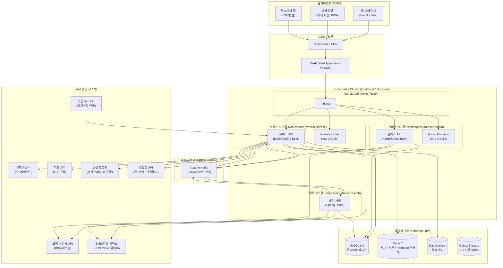
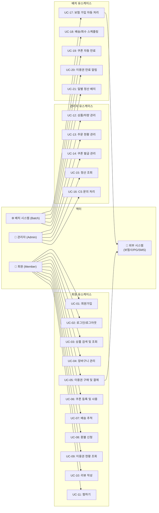
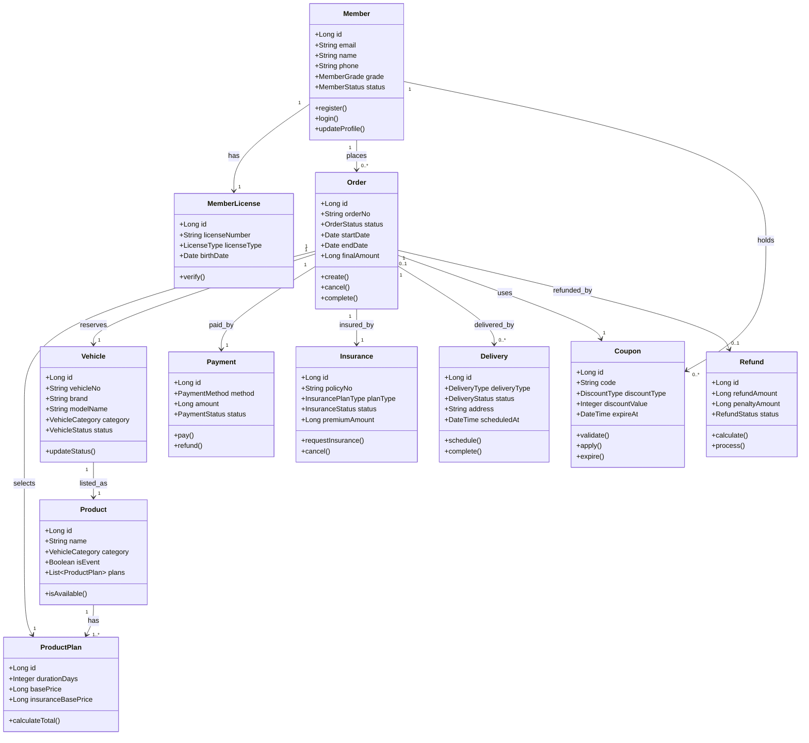
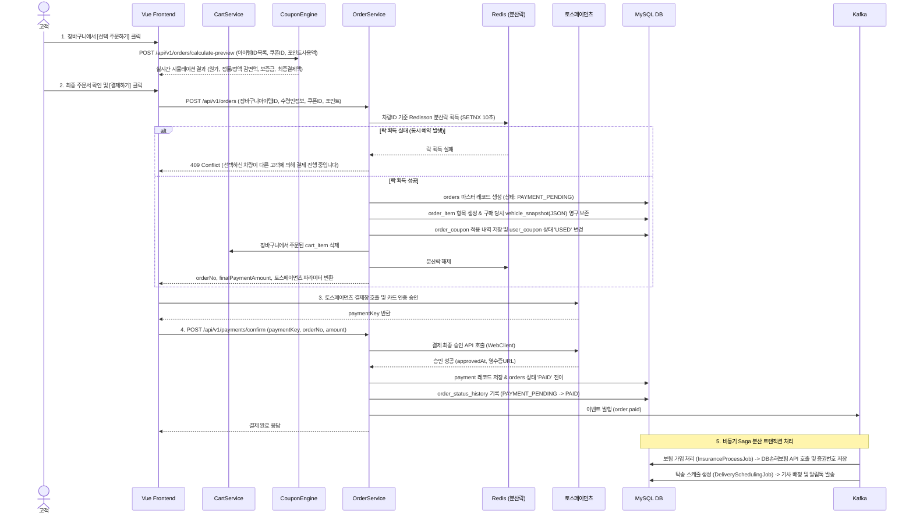

# 프리카(FreeCar) 자동차 구독 이커머스 플랫폼 — 전체 프로젝트 산출물

> **문서 버전**: v1.1 (DB 및 API 실무 프로덕션 수준 전면 고도화)  
> **작성일**: 2026-09-18  
> **작성자**: 수석 IT 컨설턴트 / SA  
> **상태**: 검토 요청

---


# 문서 1. 사업/서비스 기획서

> **프로젝트명**: 프리카(FreeCar) 자동차 구독 이커머스 플랫폼  
> **문서 버전**: v1.0  
> **작성일**: 2026-09-18  
> **작성자**: 수석 IT 컨설턴트 / SA  
> **상태**: 검토 요청

---

## 1.1 프로젝트 배경 및 목적

### 1.1.1 프로젝트 배경

자동차 소유 패러다임이 변화하고 있다. MZ세대를 중심으로 "소유"보다 "경험"을 중시하는 소비 문화가 확산되며, 자동차 역시 구매·리스 중심에서 구독·이용권 중심으로 전환되는 추세가 뚜렷하다.

| 지표 | 수치 | 출처(가정) |
|---|---|---|
| 국내 자동차 구독 시장 규모 (2025) | 약 4,200억 원 | 시장조사기관 가정 |
| 연평균 성장률 (CAGR, 2025~2030) | 22.3% | 가정 |
| 자동차 구독 경험자 중 재이용 의향 | 68% | 소비자조사 가정 |
| MZ세대(20~39세) 자동차 구독 선호율 | 54% | 가정 |

기존 자동차 이동 서비스(카쉐어링·렌터카·리스)는 각각의 명확한 한계를 가지며, 이를 극복하는 **"자동차 구독 이용권 이커머스"** 형태의 신규 플랫폼에 대한 시장 수요가 존재한다.

### 1.1.2 시장/경쟁 서비스 분석

| 구분 | 카쉐어링 (쏘카/그린카) | 단기렌터카 | 장기렌터카 | 금융리스 | **프리카 (자동차 구독)** |
|---|---|---|---|---|---|
| 이용 기간 | 시간 단위 (최소 30분) | 1일~수 주 | 1개월~3년 | 24~60개월 | 7일~12개월 (유연) |
| 계약 복잡도 | 낮음 | 낮음 | 중간 | 높음 | **낮음 (온라인 완결)** |
| 보험 처리 | 포함 (제한적) | 포함 (표준) | 포함 | 별도 가입 필요 | **자동 가입 (최적화)** |
| 차량 배달 | 불가 (직접 픽업) | 일부 가능 | 불가 | 불가 | **지정 장소 배달** |
| 차량 회수 | 직접 반납 | 직접 반납 | 직접 반납 | 직접 반납 | **지정 장소 회수** |
| 차량 선택 폭 | 중간 | 중간 | 제한적 | 제한적 | **넓음 (프리미엄 포함)** |
| 중도 해지 | 해당없음 | 간단 | 위약금 | 위약금 높음 | **정책기반 유연 환불** |
| 쇼핑몰 형태 | 없음 | 없음 | 없음 | 없음 | **이커머스 UX** |

**프리카의 핵심 차별점:**
1. **이커머스 UX**: 상품처럼 차량 이용권을 장바구니에 담고 구매 (익숙한 쇼핑 경험)
2. **보험 자동 완결**: 구매 즉시 보험 자동 가입, 별도 서류·방문 불필요
3. **도어투도어**: 지정 일시·장소로 차량 배달 및 만료 시 자동 회수
4. **다양한 프리미엄 카테고리**: 전기차·스포츠카·럭셔리카 등 일반 서비스에서 접하기 어려운 차종 구독 가능
5. **유연한 기간**: 7일부터 최대 12개월까지 세분화된 기간 선택

### 1.1.3 프로젝트 목적

- **비즈니스 목적**: 자동차 구독 이커머스 시장 선점 및 2027년 내 손익분기점(BEP) 달성
- **서비스 목적**: 번거로운 자동차 이용 과정을 온라인 완결형으로 단순화하여 고객 편의 극대화
- **기술 목적**: 확장 가능한 MSA 기반 플랫폼 구축으로 추후 B2B(법인 구독) 및 해외 확장 대응

---

## 1.2 타겟 사용자 및 페르소나

### 1.2.1 타겟 사용자 세그먼트

| 세그먼트 | 특성 | 주요 니즈 | 예상 이용 패턴 |
|---|---|---|---|
| 단기 출장자 | 30~50대, 직장인 | 출장 기간 편리한 이동수단 | 7일~1개월, 세단/SUV |
| 세컨카 니즈 | 40~60대, 차량 보유자 | 추가 차량 필요 (가족 행사 등) | 7일~1개월, SUV/미니밴 |
| 여행/레저족 | 20~40대 | 여행지에서 프리미엄 드라이빙 경험 | 7일~2주, 스포츠카/전기차 |
| 신차 구매 전 체험 | 20~40대 | 구매 전 장기 시승 | 1~3개월, 특정 차종 |
| 이사/이직 공백기 | 20~40대 | 차량 공백 기간 대응 | 1~3개월, 세단/SUV |
| 법인/기업 (미래 확장) | 기업 담당자 | 임직원 업무 차량 운영 효율화 | 3~12개월, 복수 대수 |

### 1.2.2 핵심 페르소나

#### 페르소나 A — 김현준 (32세, IT 직장인)
```
이름: 김현준
나이: 32세
직업: 스타트업 마케터 (서울 거주)
차량: 미보유 (대중교통 이용)
소득: 연봉 5,000만 원

Pain Point:
- 격주로 지방 출장이 있으나 렌터카 예약 및 차량 픽업이 번거로움
- 전기차를 구매하고 싶으나 고가라 망설여짐

Goal:
- 출장 시 원하는 날 집 앞에서 차를 받고, 반납 걱정 없이 이용하고 싶음
- 전기차를 1~2개월 경험해보고 싶음

이용 예상 패턴:
- 7~30일권, 전기차/세단 카테고리
- 앱/웹 온라인 완결 선호
```

#### 페르소나 B — 이서연 (42세, 자영업자)
```
이름: 이서연
나이: 42세
직업: 카페 운영 (경기도 거주)
차량: 소형차 1대 보유
소득: 연 매출 2억 원

Pain Point:
- 주말 가족 여행 시 세컨카 필요 (7인승 미니밴)
- 장기렌터카는 계약이 복잡하고 기간이 길어 부담

Goal:
- 주말/연휴에만 미니밴을 빌려 가족과 여행하고 싶음
- 보험 걱정 없이 편리하게 이용하고 싶음

이용 예상 패턴:
- 7~14일권, SUV/미니밴 카테고리
- PC/모바일 병행 이용, 쿠폰 활용 관심
```

#### 페르소나 C — 박지훈 (28세, 스포츠카 마니아)
```
이름: 박지훈
나이: 28세
직업: 콘텐츠 크리에이터 (서울 거주)
차량: 미보유
소득: 연 수입 4,500만 원

Pain Point:
- 슈퍼카/스포츠카를 직접 소유하기엔 가격이 너무 높음
- 콘텐츠 촬영용 프리미엄 차량을 단기 이용하고 싶음

Goal:
- 페라리, 포르쉐 등 스포츠카를 1~2주 이용하며 콘텐츠 제작
- 차량 이미지/스펙 정보를 디테일하게 확인하고 싶음

이용 예상 패턴:
- 7~14일권, 스포츠카/럭셔리카 카테고리
- SNS 공유 유도 이벤트 관심
```

---

## 1.3 서비스 정책 상세

### 1.3.1 이용권 상품 구성 (기간별 요금제)

#### 카테고리 정의 기준

| 카테고리 | 기준 | 예시 차종 |
|---|---|---|
| 전기차 | 순수 전기차(BEV) 전 차종 | 테슬라 Model 3/Y, 아이오닉 5/6, GV60 |
| 스포츠카 | 2도어 쿠페/컨버터블, 0→100km/h 5초 이내 또는 제조사 스포츠 분류 | 포르쉐 911, BMW M4, 페라리 Roma |
| 럭셔리카 | 프리미엄 브랜드(메르세데스, BMW, Audi, 제네시스 등) 차량 중 일반형 | S클래스, 7시리즈, G90 |
| SUV | 차체형식 SUV/크로스오버 (승용 기반) | 팰리세이드, 쏘렌토, BMW X5 |
| 미니밴 | 7인승 이상 MPV/미니밴 | 카니발, 시에나, 오딧세이 |

#### 기간별 요금제 예시 (가정 수치 — 실제 운영 시 조정 필요)

| 이용 기간 | 전기차 (₩/일) | 스포츠카 (₩/일) | 럭셔리카 (₩/일) | SUV (₩/일) | 미니밴 (₩/일) |
|---|---|---|---|---|---|
| 7일권 | 120,000 | 350,000 | 280,000 | 150,000 | 180,000 |
| 14일권 | 110,000 | 320,000 | 260,000 | 140,000 | 165,000 |
| 1개월권 (30일) | 95,000 | 290,000 | 240,000 | 125,000 | 150,000 |
| 3개월권 (90일) | 80,000 | 260,000 | 210,000 | 110,000 | 130,000 |
| 6개월권 (180일) | 70,000 | 230,000 | 185,000 | 95,000 | 115,000 |
| 12개월권 (365일) | 60,000 | 200,000 | 160,000 | 85,000 | 100,000 |

> **가정사항**: 위 요금은 차량 기본 요금이며, 보험료는 별도 산정되어 최종 결제금액에 합산됨.  
> **할인율**: 7일 대비 12개월 기준 약 50% 할인 구조 (장기 이용 인센티브)

#### 상품 총 결제금액 구성

```
총 결제금액 = (차량 일 기본요금 × 이용일수) + 보험료 + 배송비 - 쿠폰할인
```

---

### 1.3.2 보험 자동 가입 정책

#### 가입 가능 조건

| 조건 항목 | 세부 기준 |
|---|---|
| 운전면허 | 국내 1종 보통 또는 2종 보통 이상 (외국인: 국제운전면허 + 여권) |
| 최소 연령 | 만 21세 이상 |
| 최대 연령 | 만 70세 이하 (만 65세 이상 시 추가 심사) |
| 면허 취득 후 경력 | 최소 1년 이상 (스포츠카/럭셔리카: 2년 이상) |
| 면허 정지/취소 이력 | 최근 2년 내 없어야 함 |
| 음주운전 이력 | 최근 5년 내 없어야 함 |

#### 보장범위 옵션

| 보장 항목 | 기본 보장 | 프리미엄 보장 |
|---|---|---|
| 대인배상 I | 무한 | 무한 |
| 대인배상 II | 1억 원 | 무한 |
| 대물배상 | 1억 원 | 3억 원 |
| 자차손해 | 미포함 | 포함 (자기부담금 50만 원) |
| 자손/자상 | 5천만 원 | 1억 원 |
| 긴급출동 | 포함 | 포함 |
| 렌터카비용 | 미포함 | 포함 (일 5만 원, 최대 20일) |

#### 보험료 산정 로직 (가정)

```
보험료 = 기본보험료 × 연령계수 × 경력계수 × 차종계수 × 기간계수

- 기본보험료 (가정): 일 15,000원 (기본 보장 기준)
- 연령계수: 21~25세 = 1.5, 26~35세 = 1.0, 36~50세 = 0.9, 51~65세 = 1.1, 66~70세 = 1.3
- 경력계수: 1~2년 = 1.3, 3~5년 = 1.1, 5년 초과 = 1.0
- 차종계수: 전기차 = 1.0, SUV = 1.0, 미니밴 = 1.0, 럭셔리카 = 1.2, 스포츠카 = 1.5
- 기간계수: 7일 = 1.0, 30일 = 0.95, 90일 = 0.90, 180일 = 0.85, 365일 = 0.80
- 프리미엄 보장 추가금: 기본 보험료의 +40%
```

> **가정사항**: 실제 보험사 연동 후 보험사가 제공하는 실제 보험료 API를 기준으로 산정 로직 교체 예정. 위 로직은 MVP 단계 내부 산정 가정값.

---

### 1.3.3 배송/회수 정책

#### 서비스 가능 지역 (초기 런칭 기준)

| 단계 | 서비스 지역 | 런칭 시점 |
|---|---|---|
| Phase 1 | 서울특별시 전 구 | 런칭 시 |
| Phase 2 | 경기도 (수도권 주요 도시) | 런칭 후 3개월 |
| Phase 3 | 6대 광역시 (부산, 대구, 인천, 광주, 대전, 울산) | 런칭 후 6개월 |
| Phase 4 | 전국 (제주도 포함) | 런칭 후 12개월 |

#### 배송 리드타임

| 구분 | 리드타임 | 비고 |
|---|---|---|
| 당일 배송 | 주문 후 4시간 이내 | 오전 10시 이전 주문 시, 서울 한정 |
| 익일 배송 | 주문 다음 날 지정 시간 | 기본 옵션 |
| 예약 배송 | 최대 30일 후까지 예약 | 달력에서 날짜/시간 선택 |
| 배송 가능 시간대 | 08:00 ~ 20:00 | 1시간 단위 선택 |

#### 배송 정책 상세

- **배송비**: 서울 기준 무료. 서울 외 지역 30,000원 (Phase 2 이후 적용)
- **배송 담당**: 플랫폼 계약 탁송기사 (앱으로 위치 추적 제공)
- **노쇼 정책**: 지정 시간 +1시간 대기 후 미연락 시 배송 취소, 배송비 50,000원 청구
- **주소 변경**: 배송 출발 3시간 전까지 변경 가능. 이후 변경 불가
- **차량 인수 확인**: 탁송기사와 함께 차량 상태 확인 후 앱에서 사진 첨부 및 서명으로 인수 완료

#### 회수 정책 상세

- **회수 안내**: 만료 3일 전, 1일 전, 당일 오전 알림 발송 (앱 푸시/SMS/이메일)
- **회수 시간**: 이용권 만료일 사용자 지정 시간 (08:00 ~ 20:00)
- **회수 장소**: 인수 장소 기본 설정, 변경 시 만료 3일 전까지 신청
- **지연 반납**: 만료 후 1시간 이내 — 1일 추가 요금 50% 청구. 1시간 초과 시 1일 전액 청구
- **차량 상태 확인**: 회수 시 기사와 함께 상태 점검, 파손/오염 확인 후 추가 청구 가능

---

### 1.3.4 환불/취소 정책

#### 이용 전 취소 환불율

| 취소 시점 | 환불율 | 비고 |
|---|---|---|
| 결제 후 24시간 이내 & 배송 3일 전 이상 | 100% | 단순 변심 |
| 배송 3일 전 ~ 배송 1일 전 | 70% | 차량 준비 비용 발생 |
| 배송 1일 전 ~ 배송 당일 오전 10시 이전 | 50% | |
| 배송 당일 오전 10시 이후 | 20% | 탁송기사 출발 후 |
| 배송 완료 후 취소 불가 (이용 중 환불 정책 적용) | — | |

#### 이용 중 환불 정책 (일할 계산)

```
환불금액 = 일 기본요금 × 잔여일수 × 환불율
          - 보험 해지 위약금
          - 차량 회수 비용(50,000원)
```

| 이용 경과율 | 차량 요금 환불율 | 보험 환불 |
|---|---|---|
| 이용일수 25% 이하 | 잔여일수의 70% | 잔여일수 보험료 환불 - 해지수수료(10%) |
| 이용일수 25~50% | 잔여일수의 60% | 잔여일수 보험료 환불 - 해지수수료(15%) |
| 이용일수 50~75% | 잔여일수의 50% | 잔여일수 보험료 환불 - 해지수수료(20%) |
| 이용일수 75% 초과 | 환불 불가 | 환불 불가 |

> **가정사항**: 보험 환불 정책은 연동 보험사의 약관에 따라 변동될 수 있으며, 보험사 확정 후 해당 정책을 기준으로 업데이트 예정.

#### 이용 후 환불
- 차량 이용 완료 후 환불 없음 (단, 차량 결함으로 인한 운행 불가 등 귀책사유가 플랫폼에 있는 경우 별도 심사 후 환불 가능)

---

### 1.3.5 쿠폰 정책

| 정책 항목 | 세부 내용 |
|---|---|
| 쿠폰 유형 | 정률(%) 할인 / 정액(원) 할인 |
| 할인 한도 | 정률 쿠폰: 최대 50%, 정액 쿠폰: 최대 100,000원 |
| 최소 주문금액 | 쿠폰별 설정 가능 (예: 50만 원 이상 주문 시) |
| 중복 사용 | 1회 주문 시 쿠폰 1개만 사용 가능 (중복 불가) |
| 사용 기간 | 발급일로부터 30일 / 90일 / 180일 등 쿠폰별 설정 |
| 발급 조건 | 회원가입 환영 쿠폰, 첫 주문 쿠폰, 생일 쿠폰, 이벤트 응모, 관리자 수동 발급 |
| 만료 처리 | 만료일 D-7, D-1 알림 발송 / 만료일 00:00 자동 비활성화 (배치) |
| 환불 시 처리 | 쿠폰으로 할인받은 금액은 환불 제외 (쿠폰은 복원 안 됨) |
| 사용 제한 | 특정 카테고리 전용, 특정 차종 전용 등 설정 가능 |
| 관리자 기능 | 발급, 일괄 발급(CSV), 조기 만료, 사용 현황 조회 |

---

## 1.4 메인 페이지 IA(정보구조) 및 와이어프레임 설명

### 1.4.1 전체 사이트 IA

```
[프리카 (FreeCar)]
├── 헤더 GNB
│   ├── 로고
│   ├── 카테고리 (전기차 / 스포츠카 / 럭셔리카 / SUV / 미니밴 / 이벤트)
│   ├── 검색창
│   ├── [비로그인] 로그인 / 회원가입
│   └── [로그인] 장바구니 / 찜목록 / 마이페이지
│
├── 메인 페이지 (/)
│   ├── 메인 배너 (롤링)
│   ├── 전기차 상품 섹션
│   ├── 스포츠카 상품 섹션
│   ├── 럭셔리카 상품 섹션
│   ├── SUV 상품 섹션
│   ├── 미니밴 상품 섹션
│   └── 특별할인 이벤트 섹션
│
├── 카테고리 목록 페이지 (/category/:type)
│   └── 필터(기간/가격/차종), 정렬(인기순/신규순/저가순)
│
├── 상품 상세 페이지 (/product/:id)
│   ├── 차량 이미지 갤러리
│   ├── 차량 스펙
│   ├── 이용권 기간 선택
│   ├── 보험 옵션 선택
│   ├── 배송일/장소 선택
│   ├── 쿠폰 적용
│   └── 구매하기 / 장바구니 담기 / 찜하기
│
├── 장바구니 (/cart)
├── 결제 (/checkout)
├── 결제완료 (/checkout/complete)
│
├── 마이페이지 (/mypage)
│   ├── 이용권 현황 (이용 중 / 예정 / 완료)
│   ├── 주문/결제 내역
│   ├── 쿠폰함
│   ├── 찜목록
│   ├── 리뷰 작성
│   ├── 배송 추적
│   └── 회원정보 수정
│
├── 로그인 (/login)
├── 회원가입 (/register)
├── 회원가입 완료 (/register/complete)
│
├── 검색결과 (/search)
├── 이벤트 (/event)
├── 이벤트 상세 (/event/:id)
│
└── 고객센터 (/support)
    ├── 공지사항
    ├── FAQ
    └── 1:1 문의
```

### 1.4.2 메인 페이지 섹션별 노출 로직

| 섹션 | 노출 방식 | 정렬 기준 | 노출 개수 |
|---|---|---|---|
| 메인 배너 | 관리자 등록 배너 (롤링, 자동 5초) | 관리자 설정 순서 | 최대 10개 |
| 전기차 상품 | 전기차 카테고리 차량 | 인기순 (구독횟수) | 8개 (2행 × 4열) |
| 스포츠카 상품 | 스포츠카 카테고리 차량 | 인기순 | 8개 |
| 럭셔리카 상품 | 럭셔리카 카테고리 차량 | 신규 등록순 | 8개 |
| SUV 상품 | SUV 카테고리 차량 | 인기순 | 8개 |
| 미니밴 상품 | 미니밴 카테고리 차량 | 인기순 | 8개 |
| 특별할인 이벤트 | 할인율 10% 이상 상품 | 할인율 높은 순 | 4개 |

> **가정사항**: 로그인 사용자의 경우 Phase 2에서 개인화 추천(열람 이력 기반) 적용 예정. MVP에서는 인기순/신규순 노출.

---

## 1.5 회원 등급/멤버십 정책

### 1.5.1 회원 등급 체계

| 등급 | 이름 | 달성 조건 | 주요 혜택 |
|---|---|---|---|
| Lv.1 | FREE | 회원가입 | 회원가입 쿠폰 1장 |
| Lv.2 | SILVER | 누적 구독 횟수 3회 이상 또는 누적 결제금액 200만 원 이상 | 추가 할인 쿠폰 월 1장, 배송 우선 순위 |
| Lv.3 | GOLD | 누적 구독 횟수 7회 이상 또는 누적 결제금액 500만 원 이상 | 추가 할인 쿠폰 월 2장, 전담 CS, 스포츠카 전용 쿠폰 |
| Lv.4 | PLATINUM | 누적 구독 횟수 15회 이상 또는 누적 결제금액 1,000만 원 이상 | 무료 보험 업그레이드, VIP 전용 차량 우선 예약, 전담 매니저 |

### 1.5.2 등급 산정 기준
- 매월 1일 전월 기준 재산정
- 최근 12개월 이내 실적만 인정
- 환불된 주문은 실적 제외

---

## 1.6 화면 정의서 목록 (사이트맵)

### 1.6.1 서비스 시스템 화면 목록

| ID | 화면명 | URL | 설명 |
|---|---|---|---|
| S-001 | 메인 페이지 | / | 배너, 카테고리별 상품 섹션 |
| S-002 | 카테고리 목록 | /category/:type | 필터/정렬 포함 |
| S-003 | 상품 상세 | /product/:id | 차량정보, 이용권 선택, 결제 유도 |
| S-004 | 검색 결과 | /search?q= | 키워드 검색 결과 |
| S-005 | 장바구니 | /cart | 담은 이용권 목록, 쿠폰 적용 |
| S-006 | 결제 | /checkout | 개인정보입력, 보험선택, 배송일시, 최종금액 |
| S-007 | 결제 완료 | /checkout/complete | 주문번호, 이용 일정 요약 |
| S-008 | 로그인 | /login | 소셜/이메일 로그인 |
| S-009 | 회원가입 | /register | 이메일/휴대폰 인증, 면허정보 입력 |
| S-010 | 회원가입 완료 | /register/complete | 환영 쿠폰 지급 안내 |
| S-011 | 마이페이지 홈 | /mypage | 등급, 쿠폰, 최근 이용 현황 |
| S-012 | 이용권 현황 | /mypage/subscriptions | 이용 중/예정/완료 탭 |
| S-013 | 주문 상세 | /mypage/subscriptions/:id | 개별 주문 상세, 보험정보, 배송추적 |
| S-014 | 쿠폰함 | /mypage/coupons | 보유 쿠폰 목록, 만료예정 강조 |
| S-015 | 찜목록 | /mypage/wishlist | 찜한 차량 목록 |
| S-016 | 리뷰 작성 | /mypage/review/write/:id | 별점, 사진, 텍스트 리뷰 |
| S-017 | 회원정보 수정 | /mypage/profile | 기본정보, 면허정보, 주소 |
| S-018 | 이벤트 목록 | /event | 진행중 이벤트 |
| S-019 | 이벤트 상세 | /event/:id | 이벤트 내용, 참여 버튼 |
| S-020 | 공지사항 | /support/notices | |
| S-021 | FAQ | /support/faq | 카테고리별 FAQ |
| S-022 | 1:1 문의 | /support/inquiry | 문의 작성, 내역 조회 |
| S-023 | 배송 추적 | /mypage/subscriptions/:id/tracking | 실시간 탁송기사 위치 |
| S-024 | 환불 신청 | /mypage/subscriptions/:id/refund | 환불 사유, 예상 환불금액 |

### 1.6.2 관리자 시스템 화면 목록

| ID | 화면명 | URL (Admin) | 설명 |
|---|---|---|---|
| A-001 | 관리자 로그인 | /admin/login | |
| A-002 | 대시보드 | /admin/dashboard | KPI 요약, 주문현황, 배송현황 |
| A-003 | 상품 목록 | /admin/products | 차량 이용권 상품 관리 |
| A-004 | 상품 등록/수정 | /admin/products/edit | 차량정보, 기간별요금, 이미지 |
| A-005 | 차량 재고 관리 | /admin/vehicles | 차량 현황 (가용/이용중/정비중) |
| A-006 | 주문 목록 | /admin/orders | 전체 주문 목록, 상태별 필터 |
| A-007 | 주문 상세 | /admin/orders/:id | 주문/보험/배송 상세정보, 상태 변경 |
| A-008 | 보험 현황 | /admin/insurances | 보험가입 상태 모니터링 |
| A-009 | 배송 관리 | /admin/deliveries | 배송/회수 일정, 기사 배정 |
| A-010 | 기사 관리 | /admin/drivers | 탁송기사 등록/관리 |
| A-011 | 회원 목록 | /admin/members | 전체 회원 목록, 등급, 상태 |
| A-012 | 회원 상세 | /admin/members/:id | 개인정보, 이용이력, CS이력 |
| A-013 | 쿠폰 목록 | /admin/coupons | 쿠폰 발급/관리 |
| A-014 | 쿠폰 발급 | /admin/coupons/create | 쿠폰 조건 설정, 일괄 발급 |
| A-015 | 이벤트 관리 | /admin/events | 이벤트 등록/수정/삭제 |
| A-016 | 배너 관리 | /admin/banners | 메인 배너 등록/순서/노출기간 |
| A-017 | 정산 관리 | /admin/settlements | 기간별 매출, 정산내역 |
| A-018 | CS 문의 관리 | /admin/inquiries | 1:1 문의 답변 |
| A-019 | 공지사항 관리 | /admin/notices | 공지사항 CRUD |
| A-020 | 배치 실행 현황 | /admin/batch | 배치 Job 실행 로그, 수동 실행 |
| A-021 | 시스템 설정 | /admin/settings | 수수료율, 환불정책 등 운영 파라미터 |
| A-022 | 리뷰 관리 | /admin/reviews | 리뷰 노출/숨김, 신고 처리 |


---

> **프로젝트명**: 프리카(FreeCar) 자동차 구독 이커머스 플랫폼
> **문서 버전**: v1.1 (DB 및 API 실무 프로덕션 수준 전면 고도화)
> **작성일**: 2026-09-18
> **작성자**: 수석 IT 컨설턴트 / SA

---

# 문서 2. 기술 규격서 (기술 아키텍처)

## 2.1 전체 시스템 아키텍처 다이어그램



---

## 2.2 기술 스택 상세 및 선정 이유

| 레이어 | 기술 | 버전 | 선정 이유 |
|---|---|---|---|
| **Frontend** | Vue.js + Vite | Vue 3.4 / Vite 5.x | 컴포넌트 기반 개발, Composition API로 비즈니스 로직 재사용성 향상. Vite의 빠른 HMR 및 번들링 |
| **Frontend 상태관리** | Pinia | 2.x | Vuex 대비 경량, 완전한 TypeScript 지원, Pinia 플러그인을 통한 로컬 스토리지 동기화 용이 |
| **Frontend 라우팅** | Vue Router | 4.x | SPA 라우팅 지원, Navigation Guard 기반 인증/면허 등록 체크 |
| **Backend API** | Kotlin + Spring Boot | Kotlin 1.9 / Spring Boot 3.x | 간결한 문법(Null Safety), Spring Data JPA/Security/Validation 풍부한 생태계 활용 |
| **분산락** | Redisson | 3.x | Redis 기반 분산락(@DistributedLock AOP)으로 멀티 Pod 환경에서 차량 예약 동시성 완벽 제어 |
| **배치** | Spring Batch | 5.x | Job/Step 청크(Chunk) 지향 처리, 실패 시 재시작 및 멱등성 보장, 대용량 만료/정산 자동화 |
| **ORM** | Spring Data JPA + QueryDSL | 5.x | 정적 타입 기반 동적 검색 쿼리 작성, N+1 방지 Fetch Join 최적화 |
| **RDB** | MySQL | 8.0 | InnoDB 엔진의 외래키 및 트랜잭션 무결성 보장, JSON 스냅샷 컬럼 지원 |
| **캐시/세션** | Redis | 7.x | 상품/플랜 데이터 캐싱, 토큰 블랙리스트, 장바구니 세션 보조 |
| **검색** | Elasticsearch | 8.x | 브랜드, 모델, 차종, 가격대 N-gram 기반 Full-Text 검색 및 집계 |
| **메시징** | Apache Kafka | 3.x | Saga 패턴 기반 주문-결제-보험-배송 간 완전한 비동기 이벤트 분리 및 높은 처리량 |
| **컨테이너/배포** | Docker + Kubernetes | Docker 24+ / k8s 1.29 | 컨테이너 표준화, HPA 자동 오토스케일링, RollingUpdate 무중단 배포 |
| **CI/CD** | GitHub Actions + ArgoCD | GitOps | 브랜치 푸시 시 자동 테스트/빌드 후 매니페스트 저장소 PR 기반 배포 |
| **결제(PG)** | 토스페이먼츠 | 최신 v1/v2 | 결제위젯 지원, 카드/간편결제 통합 승인, 가상계좌 웹훅, 완벽한 취소/환불 API |

---

## 2.3 MSA/모듈 분할 전략

초기 런칭은 **Spring Boot 멀티모듈 기반의 모듈러 모놀리스**로 운영하며, 도메인 패키지 경계를 명확히 설정하여 추후 트래픽 증가 시 독립적인 마이크로서비스(MSA)로 무중단 분리가 가능하도록 설계합니다.

| 도메인 서비스 | 주요 책임 | 핵심 엔티티 | MVP/Phase |
|---|---|---|---|
| **auth-service** | 회원가입, 로그인, JWT(Access/Refresh) 발급, 본인인증 | Member, Token | MVP |
| **member-service** | 회원 정보, 회원 등급, 운전면허 진위확인 | Member, MemberLicense | MVP |
| **vehicle-service** | 실물 차량 제원, 등록번호, 주행거리, 거점 차고지, 차량 상태 | Vehicle, VehicleSpec, VehicleImage | MVP |
| **product-service** | 구독 이용권 상품, 기간별 요금 플랜(7일~12개월), 카테고리 | Product, ProductPlan | MVP |
| **cart-service** | 장바구니 담기, 옵션 변경, 선택 체크, 실시간 합계 금액 산정 | Cart, CartItem | MVP |
| **coupon-service** | 정률/정액 쿠폰 발급, 사용, 주문 전 할인액 실시간 시뮬레이션 | Coupon, UserCoupon, OrderCoupon | MVP |
| **order-service** | 주문서 생성, Redisson 분산락 재고 선점, 주문항목 스냅샷 | Order, OrderItem, OrderStatusHistory | MVP |
| **payment-service** | PG 결제창 파라미터 발행, 결제 최종 승인, 결제 취소/환불 | Payment, Refund | MVP |
| **insurance-service** | 단기 의무/종합보험 자동 가입 요청, 증권번호 관리, 보험 해지 | Insurance, InsurancePolicy | MVP |
| **delivery-service** | 차량 탁송 및 만료 회수 스케줄링, 기사 자동 배정, 위치 관제 | Delivery, Driver | MVP |
| **notification-service** | 카카오 알림톡, SMS, 앱 푸시 알림 발송 및 이력 관리 | Notification, NotificationTemplate | MVP |
| **settlement-service** | 일별/월별 매출 집계, PG 수수료 정산, 보험료 대사 | Settlement, DailySettlement | Phase 2 |

---

## 2.4 데이터베이스 설계 개요 및 ERD

```mermaid
erDiagram
    MEMBER ||--o{ MEMBER_LICENSE : "면허등록"
    MEMBER ||--o| CART : "장바구니보유"
    MEMBER ||--o{ USER_COUPON : "쿠폰보유"
    MEMBER ||--o{ ORDER : "주문수행"
    MEMBER ||--o{ NOTIFICATION : "알림수신"

    CART ||--o{ CART_ITEM : "담긴아이템"

    VEHICLE ||--o| VEHICLE_SPEC : "제원옵션보유"
    VEHICLE ||--o{ VEHICLE_IMAGE : "차량이미지"
    VEHICLE ||--o{ PRODUCT : "상품매핑"
    VEHICLE ||--o{ ORDER_ITEM : "배정실물"

    PRODUCT ||--o{ PRODUCT_PLAN : "구독플랜"
    PRODUCT ||--o{ CART_ITEM : "담긴상품참조"
    PRODUCT ||--o{ ORDER_ITEM : "주문상품참조"

    PRODUCT_PLAN ||--o{ CART_ITEM : "선택플랜"
    PRODUCT_PLAN ||--o{ ORDER_ITEM : "체결플랜"

    COUPON ||--o{ USER_COUPON : "발급이력"
    USER_COUPON ||--o| ORDER_COUPON : "사용스냅샷"

    ORDER ||--o{ ORDER_ITEM : "주문상세항목"
    ORDER ||--o{ ORDER_STATUS_HISTORY : "상태전이이력"
    ORDER ||--o| ORDER_COUPON : "적용쿠폰스냅샷"
    ORDER ||--o{ PAYMENT : "결제승인내역"
    ORDER ||--o{ REFUND : "취소환불내역"
    ORDER ||--o{ INSURANCE : "보험계약체결"
    ORDER ||--o{ DELIVERY : "탁송회수스케줄"

    DELIVERY ||--o| DRIVER : "기사배정"

    MEMBER {
        bigint id PK "회원 고유 식별자"
        varchar email UK "로그인 이메일"
        varchar password_hash "BCrypt 암호화 해시"
        varchar name "회원 실명"
        varchar phone UK "휴대전화번호"
        varchar ci UK "본인인증 연계정보 (CI)"
        varchar di "본인인증 중복가입확인정보 (DI)"
        date birth_date "생년월일 (YYYY-MM-DD)"
        varchar gender "성별 (MALE, FEMALE)"
        varchar zipcode "기본 배송지 우편번호"
        varchar base_address "기본 배송지 도로명주소"
        varchar detail_address "기본 배송지 상세주소"
        varchar status "회원 상태 (ACTIVE, SUSPENDED, WITHDRAWN)"
        varchar grade "회원 등급 (FREE, SILVER, GOLD, PLATINUM)"
        bigint point_balance "보유 포인트/적립금 잔액"
        boolean marketing_agree "마케팅 정보 수신동의 여부"
        varchar suspended_reason "계정 정지 사유"
        datetime last_login_at "최근 로그인 일시"
        datetime withdrawn_at "회원 탈퇴 일시"
        datetime created_at "가입 일시"
        datetime updated_at "수정 일시"
    }

    MEMBER_LICENSE {
        bigint id PK "면허 정보 고유 식별자"
        bigint member_id FK,UK "회원 식별자"
        varchar license_number UK "면허증 번호 (암호화)"
        varchar license_type "면허 종별 (1종보통, 2종보통, 1종대형)"
        date birth_date "면허증 상 생년월일"
        date issue_date "면허 최초/재발급 일자"
        date aptitude_test_end_date "적성검사/갱신 만료일자"
        varchar verify_status "진위확인 상태 (UNVERIFIED, VERIFIED, REJECTED, EXPIRED)"
        varchar verify_code "경찰청 연계 진위확인 검증일련값"
        varchar reject_reason "면허 진위확인 실패/반려 사유"
        datetime verified_at "진위 검증 완료 일시"
        datetime created_at "등록 일시"
        datetime updated_at "수정 일시"
    }

    VEHICLE {
        bigint id PK "차량 실물 고유 식별자"
        varchar vehicle_no UK "차량 번호판 (예: 12가 3456)"
        varchar vin UK "차대번호 (17자리)"
        varchar brand "제조사 (현대, 기아, 제네시스, 테슬라, 포르쉐 등)"
        varchar model_name "차량 모델명"
        varchar trim_name "세부 트림명"
        int model_year "연식 (예: 2025)"
        varchar category "차종 (ELECTRIC, SPORTS, LUXURY, SUV, MINIVAN)"
        varchar fuel_type "연료 (EV, GASOLINE, DIESEL, HYBRID)"
        int displacement "배기량 (cc, EV는 0)"
        decimal battery_capacity "배터리 용량 (kWh)"
        int driving_range "1회 충전/주유 주행가능거리 (km)"
        varchar transmission "변속기 (AUTO, MANUAL)"
        varchar drive_type "구동방식 (2WD, AWD)"
        int seating_capacity "승차 정원"
        varchar exterior_color "외장 색상명"
        varchar interior_color "내장 시트 색상명"
        decimal fuel_efficiency "복합 연비 (km/l 또는 km/kWh)"
        int mileage "현재 누적 주행거리 (km)"
        varchar obd_device_id "차량 원격 OBD 관제 단말기 ID"
        varchar gps_device_id "실시간 GPS 단말기 ID"
        varchar hipass_card_no "하이패스 단말기 일련번호"
        varchar status "차량 상태 (AVAILABLE, RESERVED, IN_USE, MAINTENANCE, RETIRED)"
        varchar location_address "현재 보관 차고지 거점 주소"
        varchar registration_doc_url "자동차등록증 사본 CDN URL"
        date last_maintenance_date "최근 정기점검 완료일"
        date next_maintenance_date "다음 정기점검 예정일"
        datetime created_at "차량 등록 일시"
        datetime updated_at "차량 정보 수정 일시"
    }

    VEHICLE_SPEC {
        bigint id PK "차량 옵션 제원 고유 식별자"
        bigint vehicle_id FK,UK "차량 식별자"
        boolean has_smart_cruise "어댑티브 스마트 크루즈 컨트롤 유무"
        boolean has_around_view "360도 서라운드 뷰 모니터 유무"
        boolean has_hud "헤드업 디스플레이 (HUD) 유무"
        boolean has_ventilated_seat "1열 통풍 시트 유무"
        boolean has_heated_seat "열선 시트 유무"
        boolean has_sunroof "선루프 장착 유무"
        boolean has_built_in_cam "빌트인 캠 / 블랙박스 유무"
        varchar sound_system "프리미엄 오디오 시스템 브랜드"
        int wheel_inch "알로이 휠 크기 (인치)"
        varchar tire_condition "타이어 상태 (GOOD, FAIR, REPLACE)"
        datetime created_at "등록 일시"
        datetime updated_at "수정 일시"
    }

    VEHICLE_IMAGE {
        bigint id PK "차량 이미지 식별자"
        bigint vehicle_id FK "차량 식별자"
        varchar image_type "부위 구분 (THUMBNAIL, FRONT, REAR, SIDE, INTERIOR, DASHBOARD)"
        varchar image_url "CDN 고화질 원본 이미지 URL"
        varchar thumb_url "CDN 썸네일 압축 이미지 URL"
        int sort_order "화면 노출 정렬 순서"
        boolean is_primary "대표 메인 이미지 여부"
        datetime created_at "업로드 일시"
    }

    PRODUCT {
        bigint id PK "구독 상품 고유 식별자"
        bigint vehicle_id FK "매핑 실물 차량 식별자"
        varchar title "상품 노출 제목"
        varchar summary "상품 한줄 소개 요약"
        text description "상품 상세 소개 설명 (Markdown/HTML)"
        varchar category "카테고리 구분"
        bigint view_count "누적 상품 상세 조회수"
        int wish_count "누적 고객 찜하기 횟수"
        varchar status "상품 판매 상태 (ON_SALE, RESERVED, HIDDEN)"
        boolean is_featured "메인 페이지 추천 상품 노출 여부"
        datetime created_at "상품 등록 일시"
        datetime updated_at "상품 수정 일시"
    }

    PRODUCT_PLAN {
        bigint id PK "구독 기간 플랜 식별자"
        bigint product_id FK "구독 상품 식별자"
        int duration_days "구독 기간 일수 (7, 14, 30, 90, 180, 365)"
        varchar plan_name "플랜 표기명 (7일 체험권, 1개월 자유권 등)"
        bigint daily_base_rate "1일 환산 기본 대여료 (원)"
        bigint total_plan_amount "기간 총 차량 대여료 (원)"
        int discount_percentage "기간 할인율 (%)"
        int daily_mileage_limit "1일 기본 제공 주행거리 (km, 예: 100km)"
        int excess_mileage_fee_per_km "초과 주행거리 km당 과금 요율 (원/km)"
        bigint deposit_amount "구독 계약 보증금 (원, 반납 시 전액 환급)"
        bigint basic_insurance_daily_rate "기본보험 1일 요금 (원)"
        bigint premium_insurance_daily_rate "프리미엄보험 1일 요금 (원)"
        bigint delivery_fee "기본 왕복 탁송비 (원)"
        boolean is_roundtrip_delivery_free "왕복 무료 탁송 지원 프로모션 여부"
        boolean is_active "플랜 활성 여부"
    }

    CART {
        bigint id PK "장바구니 고유 식별자"
        bigint member_id FK,UK "소유 회원 식별자"
        datetime created_at "생성 일시"
        datetime updated_at "최근 수정 일시"
    }

    CART_ITEM {
        bigint id PK "장바구니 항목 식별자"
        bigint cart_id FK "장바구니 식별자"
        bigint product_id FK "상품 식별자"
        bigint product_plan_id FK "구독 기간 플랜 식별자"
        bigint vehicle_id FK "예약 대상 차량 식별자"
        varchar insurance_type "선택 보험 유형 (BASIC, PREMIUM)"
        date start_date "이용 시작 희망일자"
        date end_date "이용 종료 희망일자"
        int duration_days "이용 일수"
        varchar delivery_zipcode "탁송 도착지 우편번호"
        varchar delivery_address "탁송 도착지 도로명 기본주소"
        varchar delivery_detail_address "탁송 도착지 상세주소"
        datetime delivery_scheduled_at "차량 수령 희망 일시"
        varchar return_address "반납 희망 거점/주소 (편도 구독 지원)"
        boolean has_child_seat "부가옵션: 유아용 카시트 신청 여부"
        boolean has_hipass_rental "부가옵션: 후불 하이패스 카드 대여 여부"
        boolean is_checked "주문 대상 선택 체크 여부 (1:선택, 0:해제)"
        datetime item_expire_at "장바구니 담김 유효 만료 시각"
        datetime created_at "담은 일시"
        datetime updated_at "옵션 변경 일시"
    }

    COUPON {
        bigint id PK "쿠폰 템플릿 식별자"
        varchar code UK "쿠폰 고유 발급 코드 (예: WELCOME2026)"
        varchar name "쿠폰명"
        varchar discount_type "할인 유형 (PERCENTAGE:정률, FIXED_AMOUNT:정액)"
        int discount_value "할인 수치 (정률: %, 정액: 원)"
        bigint max_discount_amount "정률 할인 시 최대 감면 한도액 (원, NULL=무제한)"
        bigint min_order_amount "쿠폰 사용 가능 최소 주문 결제금액 (원)"
        varchar target_category "적용 가능 차종 (ALL, ELECTRIC, SPORTS, LUXURY, SUV)"
        varchar min_member_grade "사용 가능 최소 회원 등급"
        boolean is_duplicatable "타 쿠폰과 중복 적용 허용 여부"
        int total_issuable_qty "총 발행 한도 수량 (-1: 무제한)"
        int current_issued_qty "현재까지 누적 발급된 수량"
        int valid_duration_days "발급일 기준 유효 기간 일수"
        datetime start_at "쿠폰 사용 시작 가능 일시"
        datetime expire_at "쿠폰 운영 종료 일시"
        boolean is_active "쿠폰 활성 상태 여부"
        datetime created_at "쿠폰 생성 일시"
    }

    USER_COUPON {
        bigint id PK "회원 보유 쿠폰 식별자"
        bigint coupon_id FK "쿠폰 템플릿 식별자"
        bigint member_id FK "소유 회원 식별자"
        varchar status "쿠폰 상태 (AVAILABLE:사용가능, USED:사용완료, EXPIRED:기간만료)"
        datetime issued_at "회원 보관함 발급 일시"
        datetime used_at "실제 결제 사용 일시"
        datetime expired_at "쿠폰 사용 만료 일시"
        bigint used_order_id "사용 체결된 주문 식별자"
    }

    ORDER {
        bigint id PK "주문 고유 식별자"
        varchar order_no UK "주문번호 (FC-YYYYMMDD-XXXXXX)"
        bigint member_id FK "주문 회원 식별자"
        varchar order_status "주문 상태 (PAYMENT_PENDING, PAID, INSURANCE_PROCESSING, DELIVERY_SCHEDULED, IN_USE, RETURN_SCHEDULED, COMPLETED, CANCELLED, REFUNDED)"
        varchar order_title "주문 대표 타이틀명"
        bigint total_item_amount "차량 순수 대여료 합계 (원)"
        bigint total_insurance_amount "보험료 총합계 (원)"
        bigint total_delivery_fee "탁송/배송비 총합계 (원)"
        bigint total_addon_amount "부가서비스 옵션 합계 (원)"
        bigint total_deposit_amount "구독 계약 보증금 합계 (원)"
        bigint coupon_discount_amount "쿠폰 총 감면 할인액 (원)"
        bigint point_discount_amount "포인트/적립금 사용액 (원)"
        bigint final_payment_amount "최종 실결제 승인 금액 (원)"
        varchar orderer_name "주문 고객 성명"
        varchar orderer_phone "주문 고객 연락처"
        varchar recipient_name "차량 실제 수령인 성명"
        varchar recipient_phone "차량 실제 수령인 연락처"
        varchar recipient_emergency_phone "수령인 비상 연락처"
        varchar delivery_zipcode "탁송지 우편번호"
        varchar delivery_address "탁송지 도로명 기본주소"
        varchar delivery_detail_address "탁송지 상세주소"
        varchar delivery_memo "탁송 기사 전달 요청사항"
        datetime payment_due_at "주문 결제 유효 시한"
        datetime cancelled_at "주문 취소 일시"
        varchar cancel_reason "주문 취소 원인 사유"
        varchar order_ip "주문 인입 클라이언트 IP"
        datetime created_at "주문 생성 일시"
        datetime updated_at "주문 정보 수정 일시"
    }

    ORDER_ITEM {
        bigint id PK "주문 항목 상세 식별자"
        bigint order_id FK "주문 마스터 식별자"
        bigint product_id FK "상품 식별자"
        bigint product_plan_id FK "선택 플랜 식별자"
        bigint vehicle_id FK "배정 차량 식별자"
        json vehicle_snapshot "체결 시점 차량 제원/번호판/주행거리 JSON 스냅샷"
        varchar item_status "이용 상태 (ORDERED, PREPARING, IN_DELIVERY, IN_USE, RETURNING, RETURNED, CANCELLED)"
        date start_date "구독 시작 일자"
        date end_date "구독 종료 일자"
        datetime actual_return_at "실제 차량 반납 완료 일시"
        int duration_days "구독 이용 일수"
        bigint item_amount "해당 항목 차량 대여료 (원)"
        varchar insurance_type "보험 플랜 (BASIC, PREMIUM)"
        bigint insurance_amount "해당 항목 보험료 (원)"
        bigint delivery_fee "탁송료 (원)"
        bigint addon_fee "부가옵션 요금 (원)"
        bigint deposit_amount "보증금 (원)"
        int start_mileage "인수 시점 계기판 누적 주행거리 (km)"
        int end_mileage "반납 시점 계기판 누적 주행거리 (km)"
        int excess_mileage "약정 초과 주행거리 (km)"
        bigint excess_mileage_charge "초과 주행거리 추가 정산금 (원)"
        bigint fuel_settlement_charge "유류/충전 잔량 부족 정산금 (원)"
        bigint damage_charge "차량 파손 면책금/수리비 청구액 (원)"
        varchar return_zipcode "반납 회수지 우편번호"
        varchar return_address "반납 회수지 도로명주소"
        varchar return_detail_address "반납 회수지 상세주소"
        datetime created_at "항목 생성 일시"
    }

    ORDER_STATUS_HISTORY {
        bigint id PK "상태 전이 이력 식별자"
        bigint order_id FK "주문 식별자"
        varchar previous_status "전이 전 상태"
        varchar current_status "전이 후 상태"
        varchar change_reason "상태 변경 사유"
        varchar changed_by "상태 변경 주체 (SYSTEM, USER, ADMIN)"
        datetime created_at "상태 변경 발생 일시"
    }

    ORDER_COUPON {
        bigint id PK "주문 쿠폰 적용 스냅샷 식별자"
        bigint order_id FK,UK "주문 식별자"
        bigint user_coupon_id FK "사용한 회원 쿠폰 식별자"
        varchar coupon_code "적용 당시 쿠폰 코드"
        varchar coupon_name "적용 당시 쿠폰명"
        varchar discount_type "할인 유형 스냅샷 (PERCENTAGE, FIXED_AMOUNT)"
        int discount_value "할인율 또는 할인금액"
        bigint applied_discount_amount "실제 계산 감면된 할인금액 (원)"
        datetime applied_at "적용 체결 일시"
    }

    PAYMENT {
        bigint id PK "결제 마스터 고유 식별자"
        bigint order_id FK "주문 식별자"
        varchar payment_key UK "토스페이먼츠 PG 트랜잭션 고유키"
        varchar payment_method "결제 수단 (CARD, NAVER_PAY, KAKAO_PAY, TOSS_PAY, VIRTUAL_ACCOUNT)"
        bigint payment_amount "실제 결제 승인 금액 (원)"
        bigint cancelable_amount "현재 환불 가능한 잔액 (원)"
        varchar card_company_code "승인 카드사 코드"
        varchar card_company_name "승인 카드사명"
        varchar card_number_masked "마스킹된 카드번호 (앞6 뒤4)"
        int installment_months "할부 개월 수 (0:일시불)"
        varchar pg_receipt_url "전자영수증 매출전표 확인 URL"
        varchar payment_status "결제 상태 (READY, DONE, CANCELLED, PARTIAL_CANCELLED, FAILED)"
        datetime approved_at "PG 승인 완료 일시"
        text pg_raw_response "PG사 응답 원본 JSON 전문"
        datetime created_at "결제 생성 일시"
    }

    REFUND {
        bigint id PK "환불 고유 식별자"
        bigint payment_id FK "결제 식별자"
        bigint order_id FK "주문 식별자"
        varchar refund_no UK "환불 번호 (RF-YYYYMMDD-XXXXXX)"
        varchar refund_type "환불 유형 (FULL:전액환불, PARTIAL:부분환불)"
        bigint refund_amount "실제 결제 취소 환불금액 (원)"
        bigint penalty_amount "취소 위약금 공제액 (원)"
        bigint deposit_refund_amount "반환된 보증금액 (원)"
        varchar refund_reason_code "환불 사유 코드"
        varchar refund_reason_detail "환불 사유 상세 설명"
        varchar pg_cancel_key "PG사 취소 트랜잭션 고유키"
        varchar status "환불 처리 상태 (REQUESTED, PROCESSING, COMPLETED, FAILED)"
        datetime completed_at "환불 완료 일시"
        datetime created_at "환불 접수 일시"
    }

    INSURANCE {
        bigint id PK "보험 계약 고유 식별자"
        bigint order_id FK "주문 식별자"
        bigint order_item_id FK,UK "주문 항목 식별자"
        varchar policy_no UK "보험 증권번호 (발급 후 기입)"
        varchar insurer_code "보험사 코드 (DB_INSURANCE)"
        varchar insurer_name "보험사명 (DB손해보험)"
        varchar plan_type "가입 플랜 (BASIC, PREMIUM)"
        date coverage_start_date "보장 시작일자"
        date coverage_end_date "보장 만료일자"
        varchar bodily_injury_limit "대인 배상 한도 (무한)"
        bigint property_damage_limit "대물 배상 한도 (원, 1억 또는 3억)"
        bigint self_injury_limit "자기신체사고 배상 한도 (원)"
        bigint own_damage_deductible "자기차량손해 고객부담 면책금 (원, 5만 또는 30만)"
        bigint premium_amount "산정된 총 보험료 (원)"
        varchar status "보험 계약 상태 (PENDING, ACTIVE, CANCELLED, EXPIRED)"
        varchar policy_pdf_url "전자 보험 증권 사본 다운로드 URL"
        datetime issued_at "보험 증권 발급 일시"
        datetime created_at "보험 생성 일시"
    }

    DELIVERY {
        bigint id PK "탁송 배송/회수 고유 식별자"
        bigint order_id FK "주문 식별자"
        bigint order_item_id FK "주문 항목 식별자"
        bigint driver_id FK "배정 탁송기사 식별자"
        varchar delivery_type "구분 (DELIVERY:출고탁송, RETURN:만료회수)"
        varchar status "탁송 상태 (PENDING, ASSIGNED, DEPARTED, IN_TRANSIT, DELIVERED, CANCELLED)"
        datetime scheduled_at "탁송 예정 일시"
        datetime departed_at "기사 출발 일시"
        datetime completed_at "고객 인도/인수 완료 일시"
        varchar origin_address "탁송 출발지 주소"
        varchar destination_address "탁송 도착지 주소"
        decimal dest_latitude "도착지 GPS 위도"
        decimal dest_longitude "도착지 GPS 경도"
        int start_mileage "출발 시점 주행거리 (km)"
        int end_mileage "도착 시점 주행거리 (km)"
        int start_battery_fuel_percent "출발 시 배터리/유류 잔량 (%)"
        int end_battery_fuel_percent "도착 시 배터리/유류 잔량 (%)"
        json inspection_photo_urls "외관 검수 사진 6종 URLs (전/후/좌/우/휠/계기판)"
        varchar customer_signature_url "고객 전자서명 서명 이미지 CDN URL"
        datetime created_at "생성 일시"
    }

    DRIVER {
        bigint id PK "탁송 기사 고유 식별자"
        varchar name "기사 실명"
        varchar phone UK "기사 휴대전화번호"
        varchar agency_name "소속 탁송 전문 협력사명"
        varchar license_type "소지 면허 종별 (1종보통, 1종대형)"
        int driving_experience_years "운전 경력 (년)"
        varchar status "현재 가용 상태 (AVAILABLE, ASSIGNED, ON_DUTY, OFF_DUTY)"
        decimal current_latitude "현재 실시간 GPS 위도"
        decimal current_longitude "현재 실시간 GPS 경도"
        decimal rating_avg "기사 서비스 누적 평균 평점"
        int total_delivery_count "누적 탁송 완료 건수"
        datetime created_at "기사 등록 일시"
    }

    NOTIFICATION {
        bigint id PK "알림 발송 이력 식별자"
        bigint member_id FK "수신 회원 식별자"
        bigint order_id FK "관련 주문 식별자"
        varchar type "알림 유형 (ORDER_PAID, INSURANCE_DONE, DELIVERY_STARTED, RETURN_ALERT)"
        varchar channel "발송 채널 (ALIMTALK, SMS, PUSH)"
        varchar title "알림 제목"
        text content "알림 본문 내용"
        varchar status "발송 상태 (PENDING, SENT, FAILED)"
        datetime sent_at "발송 완료 일시"
        datetime created_at "알림 생성 일시"
    }
```

---

## 2.5 RESTful API 상세 규격서 (핵심 실무 API 16종)

### 2.5.1 API 공통 규약
- **Base URL**: `https://api.freecar.kr/api/v1`
- **인증 헤더**: `Authorization: Bearer {JWT_ACCESS_TOKEN}`
- **공통 응답 JSON 구조**:
  - 성공: `{ "success": true, "code": "SUCCESS", "message": "정상 처리되었습니다.", "data": { ... }, "timestamp": "ISO-8601" }`
  - 오류: `{ "success": false, "code": "ERR-XXX-001", "message": "상세 원인", "data": null, "timestamp": "ISO-8601" }`

---

### [장바구니 API]

#### API-01. 장바구니 목록 조회 및 실시간 금액 산정
- **Method & Path**: `GET /api/v1/carts`
- **Headers**: `Authorization: Bearer {token}`
- **Response 200**:
```json
{
  "success": true,
  "code": "SUCCESS",
  "data": {
    "cartId": 401,
    "items": [
      {
        "cartItemId": 1201,
        "productId": 1001,
        "productTitle": "[완전무결 신차급] 테슬라 Model 3 롱레인지",
        "vehicle": {
          "vehicleId": 501,
          "brand": "Tesla",
          "modelName": "Model 3",
          "modelYear": 2025,
          "thumbnailUrl": "https://cdn.freecar.kr/vehicles/501/thumb.jpg",
          "category": "ELECTRIC"
        },
        "plan": {
          "planId": 201,
          "planName": "1개월 자유권",
          "durationDays": 30,
          "dailyBaseRate": 95000,
          "itemAmount": 2850000
        },
        "insuranceType": "PREMIUM",
        "insuranceAmount": 450000,
        "deliveryFee": 50000,
        "subtotalAmount": 3350000,
        "startDate": "2026-10-01",
        "endDate": "2026-10-31",
        "deliveryScheduledAt": "2026-10-01T10:00:00",
        "deliveryAddress": "서울시 강남구 테헤란로 123",
        "deliveryDetailAddress": "101동 202호",
        "isChecked": true
      }
    ],
    "summary": {
      "totalItemCount": 1,
      "checkedItemCount": 1,
      "totalItemAmount": 2850000,
      "totalInsuranceAmount": 450000,
      "totalDeliveryFee": 50000,
      "estimatedFinalAmount": 3350000
    }
  }
}
```

#### API-02. 장바구니 담기
- **Method & Path**: `POST /api/v1/carts/items`
- **Request Body**:
```json
{
  "productId": 1001,
  "productPlanId": 201,
  "vehicleId": 501,
  "insuranceType": "PREMIUM",
  "startDate": "2026-10-01",
  "endDate": "2026-10-31",
  "durationDays": 30,
  "deliveryZipcode": "06234",
  "deliveryAddress": "서울시 강남구 테헤란로 123",
  "deliveryDetailAddress": "101동 202호",
  "deliveryScheduledAt": "2026-10-01T10:00:00"
}
```
- **Response 201**:
```json
{
  "success": true,
  "code": "SUCCESS",
  "message": "장바구니에 담겼습니다.",
  "data": { "cartItemId": 1201 }
}
```

#### API-03. 장바구니 항목 수정 (옵션 변경 및 선택 체크)
- **Method & Path**: `PATCH /api/v1/carts/items/{cartItemId}`
- **Request Body**:
```json
{
  "productPlanId": 202,
  "insuranceType": "BASIC",
  "isChecked": true,
  "deliveryScheduledAt": "2026-10-02T14:00:00"
}
```
- **Response 200**:
```json
{
  "success": true,
  "code": "SUCCESS",
  "message": "장바구니 옵션이 변경되었습니다.",
  "data": { "cartItemId": 1201, "isChecked": true }
}
```

#### API-04. 장바구니 선택 항목 삭제
- **Method & Path**: `DELETE /api/v1/carts/items`
- **Request Body**:
```json
{
  "cartItemIds": [1201, 1202]
}
```
- **Response 200**:
```json
{
  "success": true,
  "code": "SUCCESS",
  "message": "선택한 항목이 장바구니에서 삭제되었습니다.",
  "data": { "deletedCount": 2 }
}
```

---

### [쿠폰 & 결제금액 사전 계산 API]

#### API-05. 발급 가능 쿠폰 목록 조회
- **Method & Path**: `GET /api/v1/coupons`
- **Response 200**:
```json
{
  "success": true,
  "code": "SUCCESS",
  "data": [
    {
      "couponId": 10,
      "code": "WELCOME2026",
      "name": "신규 회원 가입 축하 20% 할인 쿠폰",
      "discountType": "PERCENTAGE",
      "discountValue": 20,
      "maxDiscountAmount": 100000,
      "minOrderAmount": 500000,
      "targetCategory": "ALL",
      "expireAt": "2026-12-31T23:59:59",
      "isDownloaded": false
    },
    {
      "couponId": 11,
      "code": "EV50000",
      "name": "전기차 전용 5만원 정액 할인권",
      "discountType": "FIXED_AMOUNT",
      "discountValue": 50000,
      "maxDiscountAmount": 50000,
      "minOrderAmount": 300000,
      "targetCategory": "ELECTRIC",
      "expireAt": "2026-11-30T23:59:59",
      "isDownloaded": true
    }
  ]
}
```

#### API-06. 쿠폰 다운로드(발급)
- **Method & Path**: `POST /api/v1/coupons/{couponId}/download`
- **Response 201**:
```json
{
  "success": true,
  "code": "SUCCESS",
  "message": "쿠폰이 발급되었습니다.",
  "data": {
    "userCouponId": 5001,
    "couponName": "신규 회원 가입 축하 20% 할인 쿠폰",
    "expiredAt": "2026-10-18T23:59:59"
  }
}
```

#### API-07. 내 보유 쿠폰 목록 조회
- **Method & Path**: `GET /api/v1/me/coupons?status=AVAILABLE`
- **Response 200**:
```json
{
  "success": true,
  "code": "SUCCESS",
  "data": [
    {
      "userCouponId": 5001,
      "couponCode": "WELCOME2026",
      "name": "신규 회원 가입 축하 20% 할인 쿠폰",
      "discountType": "PERCENTAGE",
      "discountValue": 20,
      "maxDiscountAmount": 100000,
      "minOrderAmount": 500000,
      "targetCategory": "ALL",
      "status": "AVAILABLE",
      "expiredAt": "2026-10-18T23:59:59",
      "dDay": 30
    }
  ]
}
```

#### API-08. [핵심] 주문서 진입 시 결제금액 및 쿠폰 사전 계산 시뮬레이션
- **Method & Path**: `POST /api/v1/orders/calculate-preview`
- **Description**: 선택된 장바구니 아이템 또는 단건 상품에 특정 쿠폰을 적용했을 때의 정률/정액 할인액, 최대 할인 한도액, 최소 주문 금액 만족 여부를 검증하고 최종 실결제액을 사전 시뮬레이션합니다.
- **Request Body**:
```json
{
  "cartItemIds": [1201],
  "userCouponId": 5001
}
```
- **Response 200**:
```json
{
  "success": true,
  "code": "SUCCESS",
  "data": {
    "totalItemAmount": 2850000,
    "totalInsuranceAmount": 450000,
    "totalDeliveryFee": 50000,
    "subtotalBeforeDiscount": 3350000,
    "couponValidation": {
      "userCouponId": 5001,
      "couponName": "신규 회원 가입 축하 20% 할인 쿠폰",
      "isValid": true,
      "discountType": "PERCENTAGE",
      "discountValue": 20,
      "rawCalculatedDiscount": 570000,
      "appliedDiscountAmount": 100000,
      "appliedRule": "MAX_LIMIT_REACHED (원 계산액 570,000원 중 최대한도 100,000원 적용)"
    },
    "finalPaymentAmount": 3250000
  }
}
```

---

### [주문 & 결제 승인 API]

#### API-09. [핵심] 주문서 생성 (Order & OrderItem 생성, Redisson 분산락 선점)
- **Method & Path**: `POST /api/v1/orders`
- **Description**: 차량 ID 기준으로 Redis Redisson 분산락을 획득하여 동일 차량 이중 예약을 원천 차단하고 `PAYMENT_PENDING` 상태의 주문을 생성합니다.
- **Request Body**:
```json
{
  "cartItemIds": [1201],
  "userCouponId": 5001,
  "recipientName": "홍길동",
  "recipientPhone": "010-1234-5678",
  "deliveryZipcode": "06234",
  "deliveryAddress": "서울시 강남구 테헤란로 123",
  "deliveryDetailAddress": "101동 202호",
  "deliveryMemo": "도착 전 전화 부탁드립니다."
}
```
- **Response 201**:
```json
{
  "success": true,
  "code": "SUCCESS",
  "message": "주문서가 생성되었습니다. 결제를 진행해 주세요.",
  "data": {
    "orderId": 9001,
    "orderNo": "FC-20261001-000001",
    "finalPaymentAmount": 3250000,
    "tossPgParams": {
      "orderId": "FC-20261001-000001",
      "orderName": "테슬라 Model 3 롱레인지 1개월 외 0건",
      "amount": 3250000,
      "successUrl": "https://freecar.kr/checkout/success",
      "failUrl": "https://freecar.kr/checkout/fail"
    }
  }
}
```

#### API-10. [핵심] 결제 최종 승인 요청 (토스페이먼츠 연동 및 Saga 발행)
- **Method & Path**: `POST /api/v1/payments/confirm`
- **Description**: 토스페이먼츠 결제위젯에서 리턴된 `paymentKey`, `orderId`, `amount`를 검증하고 PG 최종 승인을 처리합니다. 승인 완료 즉시 Kafka `order.paid` 이벤트를 발행하여 비동기 보험 가입 및 탁송 배차를 트리거합니다.
- **Request Body**:
```json
{
  "orderNo": "FC-20261001-000001",
  "paymentKey": "toss_pk_live_20261001_xxxxxx",
  "amount": 3250000
}
```
- **Response 200**:
```json
{
  "success": true,
  "code": "SUCCESS",
  "message": "결제가 안전하게 완료되었습니다. 차량 구독이 시작됩니다.",
  "data": {
    "paymentId": 8001,
    "orderNo": "FC-20261001-000001",
    "paymentMethod": "CARD",
    "approvedAmount": 3250000,
    "approvedAt": "2026-10-01T10:05:30+09:00",
    "orderStatus": "PAID",
    "nextStep": "INSURANCE_AND_DELIVERY_PROCESSING"
  }
}
```

#### API-11. 주문 상세 조회 (스냅샷, 보험, 탁송 배정 확인)
- **Method & Path**: `GET /api/v1/orders/{orderNo}`
- **Response 200**:
```json
{
  "success": true,
  "code": "SUCCESS",
  "data": {
    "orderId": 9001,
    "orderNo": "FC-20261001-000001",
    "orderStatus": "DELIVERY_SCHEDULED",
    "createdAt": "2026-10-01T10:00:00",
    "payment": {
      "paymentMethod": "CARD",
      "finalPaymentAmount": 3250000,
      "approvedAt": "2026-10-01T10:05:30"
    },
    "coupon": {
      "couponCode": "WELCOME2026",
      "discountAmount": 100000
    },
    "items": [
      {
        "orderItemId": 3001,
        "itemStatus": "PREPARING",
        "startDate": "2026-10-01",
        "endDate": "2026-10-31",
        "durationDays": 30,
        "itemAmount": 2850000,
        "vehicleSnapshot": {
          "vehicleNo": "12가 3456",
          "brand": "Tesla",
          "modelName": "Model 3 롱레인지",
          "modelYear": 2025,
          "color": "Pearl White",
          "mileageAtPurchase": 12000
        },
        "insurance": {
          "status": "ACTIVE",
          "policyNo": "DB-2026-0100001",
          "insurerName": "DB손해보험",
          "planType": "PREMIUM",
          "premiumAmount": 450000
        },
        "delivery": {
          "status": "ASSIGNED",
          "deliveryType": "DELIVERY",
          "driverName": "이탁송 기사",
          "driverPhone": "010-9876-5432",
          "scheduledAt": "2026-10-01T10:00:00",
          "trackingUrl": "https://track.freecar.kr/d/6001"
        }
      }
    ]
  }
}
```

#### API-12. 주문 취소 및 환불 요청
- **Method & Path**: `POST /api/v1/orders/{orderNo}/cancel`
- **Request Body**:
```json
{
  "reason": "단순 변심 및 일정 변경"
}
```
- **Response 200**:
```json
{
  "success": true,
  "code": "SUCCESS",
  "message": "주문 취소 및 환불 처리가 접수되었습니다.",
  "data": {
    "orderNo": "FC-20261001-000001",
    "orderStatus": "CANCELLED",
    "refundAmount": 3250000,
    "penaltyAmount": 0,
    "couponRestored": true
  }
}
```

---

### [차량/상품/배송 조회 API]

#### API-13. 차량 예약 가용성 실시간 조회
- **Method & Path**: `GET /api/v1/vehicles/{vehicleId}/availability?startDate=2026-10-01&endDate=2026-10-31`
- **Response 200**:
```json
{
  "success": true,
  "code": "SUCCESS",
  "data": {
    "vehicleId": 501,
    "isAvailable": true,
    "conflictingOrderCount": 0,
    "earliestAvailableDate": "2026-10-01"
  }
}
```

#### API-14. 상품 목록 조회 (필터/정렬/페이징)
- **Method & Path**: `GET /api/v1/products?category=ELECTRIC&sort=PRICE_ASC&page=0&size=10`
- **Response 200**:
```json
{
  "success": true,
  "code": "SUCCESS",
  "data": {
    "content": [
      {
        "productId": 1001,
        "title": "[완전무결 신차급] 테슬라 Model 3 롱레인지",
        "category": "ELECTRIC",
        "brand": "Tesla",
        "modelName": "Model 3",
        "thumbnailUrl": "https://cdn.freecar.kr/vehicles/501/thumb.jpg",
        "startingDailyRate": 60000,
        "availablePlans": [
          { "durationDays": 7, "dailyRate": 120000, "totalAmount": 840000 },
          { "durationDays": 30, "dailyRate": 95000, "totalAmount": 2850000 }
        ]
      }
    ],
    "totalElements": 24,
    "totalPages": 3,
    "currentPage": 0
  }
}
```

#### API-15. 실시간 탁송 위치 및 배송 추적
- **Method & Path**: `GET /api/v1/deliveries/{deliveryId}/tracking`
- **Response 200**:
```json
{
  "success": true,
  "code": "SUCCESS",
  "data": {
    "deliveryId": 6001,
    "orderNo": "FC-20261001-000001",
    "deliveryType": "DELIVERY",
    "status": "DEPARTED",
    "driver": {
      "name": "이탁송 기사",
      "phone": "010-9876-5432"
    },
    "currentLocation": {
      "latitude": 37.501234,
      "longitude": 127.039876,
      "address": "서울시 서초구 서초대로 인근 주행 중"
    },
    "estimatedArrivalTime": "2026-10-01T09:45:00",
    "departureMileage": 12000
  }
}
```

#### API-16. 회원가입 및 운전면허 진위확인
- **Method & Path**: `POST /api/v1/auth/register`
- **Request Body**:
```json
{
  "email": "user@example.com",
  "password": "Password1234!",
  "name": "김현준",
  "phone": "010-1234-5678",
  "license": {
    "licenseNumber": "11-AB-123456-78",
    "licenseType": "TYPE_1_NORMAL",
    "birthDate": "1994-05-15",
    "issueDate": "2016-03-20"
  },
  "marketingAgree": true
}
```
- **Response 201**:
```json
{
  "success": true,
  "code": "SUCCESS",
  "message": "회원가입 및 운전면허 진위확인이 완료되었습니다.",
  "data": {
    "memberId": 1001,
    "email": "user@example.com",
    "name": "김현준",
    "licenseVerified": true,
    "accessToken": "eyJhbGciOiJIUzI1NiJ9...",
    "refreshToken": "rt_uuid_xxxx"
  }
}
```

---

## 2.6 Kafka 이벤트 설계

### 2.6.1 토픽 및 페이로드 스펙

| 토픽명 | 파티션 | 프로듀서 | 주요 컨슈머 | 설명 |
|---|---|---|---|---|
| `order.paid` | 6 | order-service | batch(보험가입), delivery-service, notification-service | 결제 승인 완료 이벤트 (Saga 시작) |
| `insurance.requested` | 6 | insurance-service | batch(보험사API연동) | 단기 의무/종합보험 가입 요청 |
| `insurance.completed` | 6 | batch | order-service, delivery-service, notification-service | 보험 증권 발급 완료 이벤트 |
| `insurance.failed` | 3 | batch | order-service, payment-service (보상 트랜잭션) | 보험 거절 시 자동 환불 트리거 |
| `delivery.scheduled` | 6 | delivery-service | notification-service, driver-app | 탁송 배차 완료 알림 |
| `delivery.completed` | 6 | driver-app | order-service (상태 IN_USE 전환) | 차량 고객 인도 완료 |
| `coupon.expired` | 3 | batch | notification-service | 쿠폰 만료 일괄 처리 |

#### `order.paid` 이벤트 페이로드
```json
{
  "eventId": "evt-20261001-0001",
  "eventType": "ORDER_PAID",
  "occurredAt": "2026-10-01T10:05:30+09:00",
  "payload": {
    "orderId": 9001,
    "orderNo": "FC-20261001-000001",
    "memberId": 1001,
    "finalPaymentAmount": 3250000,
    "paymentKey": "toss_pk_live_20261001_xxxxxx",
    "items": [
      {
        "orderItemId": 3001,
        "vehicleId": 501,
        "productId": 1001,
        "productPlanId": 201,
        "insuranceType": "PREMIUM",
        "startDate": "2026-10-01",
        "endDate": "2026-10-31",
        "deliveryScheduledAt": "2026-10-01T10:00:00",
        "deliveryAddress": "서울시 강남구 테헤란로 123"
      }
    ]
  }
}
```

---

## 2.7 인프라 및 컨테이너 아키텍처

- **Docker 이미지 명**:
  - `freecar/service-api:latest` (포트 8080)
  - `freecar/admin-api:latest` (포트 8081)
  - `freecar/batch:latest` (Spring Batch)
  - `freecar/service-front:latest` (Nginx, 포트 80)
  - `freecar/admin-front:latest` (Nginx, 포트 80)
- **Kubernetes Namespace**: `freecar-service`, `freecar-admin`, `freecar-batch`, `freecar-infra`
- **도메인**: `freecar.kr` (프론트), `api.freecar.kr` (서비스 API), `admin.freecar.kr` (관리자 웹), `admin-api.freecar.kr` (관리자 API)


---

> **프로젝트명**: 프리카(FreeCar) 자동차 구독 이커머스 플랫폼
> **문서 버전**: v1.0
> **작성일**: 2026-09-18
> **작성자**: 수석 IT 컨설턴트 / SA

---

# 문서 3. 분석 단계 산출물

## 3.1 요구사항 정의서

### 3.1.1 기능 요구사항 (FR)

| ID | 요구사항명 | 상세 내용 | 우선순위 | 출처 | 도메인 |
|---|---|---|---|---|---|
| FR-001 | 회원가입 | 이메일/비밀번호 + 운전면허 정보 입력으로 가입. 이메일/휴대폰 인증 필수 | Must | 기획서 1.1 | 회원 |
| FR-002 | 소셜 로그인 | 카카오, 네이버, 구글 OAuth 2.0 로그인 지원 | Should | 기획서 1.1 | 회원 |
| FR-003 | 회원 정보 수정 | 주소, 연락처, 면허정보 수정 가능. 면허정보 변경 시 재인증 | Must | 기획서 | 회원 |
| FR-004 | 상품 목록 조회 | 카테고리별, 정렬(인기/신규/가격), 페이지네이션 지원 | Must | 기획서 1.4 | 상품 |
| FR-005 | 상품 상세 조회 | 차량 정보, 이미지, 기간별 요금, 보험 옵션 표시 | Must | 기획서 1.4 | 상품 |
| FR-006 | 상품 검색 | 키워드로 차량 브랜드/모델 검색, 카테고리/가격 필터 | Must | 기획서 1.4 | 검색 |
| FR-007 | 찜하기 | 상품을 찜 목록에 추가/제거, 찜 목록 조회 | Should | 기획서 | 상품 |
| FR-008 | 장바구니 | 이용권 장바구니 추가/제거, 최대 5개 | Should | 기획서 | 주문 |
| FR-009 | 이용권 구매 | 기간 선택 → 배송일시/장소 선택 → 보험 선택 → 결제 | Must | 기획서 1.3 | 주문 |
| FR-010 | 결제 처리 | PG사 연동 카드/간편결제, 결제 완료 후 보험가입 프로세스 자동 시작 | Must | 기획서 1.3 | 결제 |
| FR-011 | 보험 자동 가입 | 주문 완료 후 보험사 API 연동하여 자동 가입, 증권 발행 | Must | 기획서 1.3.2 | 보험 |
| FR-012 | 배송 예약 | 보험 가입 완료 후 지정 일시·장소에 차량 배달 예약 | Must | 기획서 1.3.3 | 배송 |
| FR-013 | 배송 추적 | 탁송기사 실시간 위치 추적 (배송 당일) | Should | 기획서 | 배송 |
| FR-014 | 차량 회수 | 만료 D-3/D-1/당일 알림, 지정 장소 자동 회수 스케줄링 | Must | 기획서 1.3.3 | 배송 |
| FR-015 | 환불 신청 | 이용 전/중 구간별 환불 정책 적용하여 환불 처리 | Must | 기획서 1.3.4 | 환불 |
| FR-016 | 쿠폰 발급/사용 | 쿠폰 코드 등록, 결제 시 쿠폰 적용, 만료 관리 | Must | 기획서 1.3.5 | 쿠폰 |
| FR-017 | 이용권 현황 조회 | 마이페이지에서 이용 중/예정/완료 이용권 목록 조회 | Must | 기획서 1.4 | 마이페이지 |
| FR-018 | 리뷰 작성 | 이용 완료 후 별점/사진/텍스트 리뷰 작성 | Could | 기획서 | 리뷰 |
| FR-019 | 알림 발송 | 주문완료/보험가입/배송출발/회수예정/쿠폰만료 SMS/앱푸시 알림 | Must | 기획서 | 알림 |
| FR-020 | 관리자 상품 관리 | 차량 등록/수정/삭제, 이용권 요금 설정 | Must | 기획서 1.6 | 관리자 |
| FR-021 | 관리자 주문 관리 | 전체 주문 조회, 상태 변경, CS 처리 | Must | 기획서 1.6 | 관리자 |
| FR-022 | 관리자 쿠폰 관리 | 쿠폰 발급, 조기 만료, 사용 현황 조회 | Must | 기획서 1.6 | 관리자 |
| FR-023 | 관리자 정산 관리 | 기간별 매출 집계, 정산 내역 다운로드 | Must | 기획서 1.6 | 관리자 |
| FR-024 | 배치 — 보험가입 처리 | 주문 이벤트 수신 후 보험사 API 호출하여 보험 가입 | Must | 기획서 1.1 | 배치 |
| FR-025 | 배치 — 만료회수 스케줄 | 이용권 만료일에 차량 회수 프로세스 자동 실행 | Must | 기획서 1.3.3 | 배치 |
| FR-026 | 배치 — 쿠폰 만료 | 만료일 도래한 쿠폰 자동 비활성화 | Must | 기획서 1.3.5 | 배치 |
| FR-027 | 배치 — 정산 | 매일 전일 매출/환불 집계 및 정산 데이터 생성 | Must | 기획서 1.6 | 배치 |
| FR-028 | 회원 등급 관리 | 월 1회 이용 실적 기반 회원 등급 재산정 | Should | 기획서 1.5 | 회원 |

### 3.1.2 비기능 요구사항 (NFR)

| ID | 요구사항명 | 상세 내용 | 우선순위 |
|---|---|---|---|
| NFR-001 | 성능 — 응답시간 | 상품 목록 P95 ≤ 300ms, 결제 API P95 ≤ 1000ms | Must |
| NFR-002 | 성능 — 동시접속 | 동시 접속자 1,000명 정상 처리 | Must |
| NFR-003 | 가용성 | 서비스 시스템 99.9% 이상 | Must |
| NFR-004 | 보안 — 개인정보 | 면허번호/생년월일 AES-256 암호화 저장 | Must |
| NFR-005 | 보안 — 통신 | 전 구간 TLS 1.2+ | Must |
| NFR-006 | 보안 — 결제 | PCI-DSS 준수, 카드정보 비저장 | Must |
| NFR-007 | 확장성 | HPA 기반 자동 스케일아웃, 배포 무중단 | Must |
| NFR-008 | 유지보수성 | 코드 커버리지 70% 이상, CI/CD 자동화 | Should |
| NFR-009 | 법규 준수 | 개인정보보호법, 전자상거래법, 보험업법 준수 | Must |
| NFR-010 | 로그/감사 | 민감 API 접근 로그 1년 이상 보관 | Must |

---

## 3.2 유스케이스 다이어그램 및 유스케이스 명세서

### 3.2.1 유스케이스 다이어그램



### 3.2.2 유스케이스 명세서 (핵심 5개 상세)

#### UC-05: 이용권 구매 및 결제

| 항목 | 내용 |
|---|---|
| **유스케이스 ID** | UC-05 |
| **유스케이스명** | 이용권 구매 및 결제 |
| **액터** | 회원 (주), PG사 (부) |
| **사전 조건** | 회원 로그인 상태, 운전면허 정보 등록 완료, 선택한 차량이 가용 상태 |
| **사후 조건** | 주문 생성, 결제 완료, 보험가입 요청 이벤트 발행, 배송 예약 시작 |
| **기본 흐름** | 1. 회원이 상품 상세 페이지에서 이용 기간 선택 → 2. 배송 일시/장소 입력 → 3. 보험 옵션 선택 → 4. 쿠폰 적용(선택) → 5. 결제 정보 입력 → 6. 결제 승인 요청 → 7. PG사 승인 → 8. 주문 완료, 보험가입 이벤트 발행 |
| **대안 흐름** | 5a. 재고 소진: 구매 불가 안내, 찜하기 유도. 6a. 결제 실패: 오류 메시지 표시, 재시도 유도 |
| **예외 흐름** | 결제 중 보험가입 조건 미충족 시 → 주문 자동 취소, 결제 환불 처리 |

#### UC-17: 보험 가입 자동 처리

| 항목 | 내용 |
|---|---|
| **유스케이스 ID** | UC-17 |
| **유스케이스명** | 보험 가입 자동 처리 |
| **액터** | 배치 시스템 (주), 보험사 API (부) |
| **사전 조건** | `order.created` Kafka 이벤트 수신 |
| **사후 조건** | 보험 증권 발행 완료, `insurance.completed` 이벤트 발행 또는 실패 시 `insurance.failed` 발행 |
| **기본 흐름** | 1. Kafka 이벤트 소비 → 2. 보험가입 요청 생성 → 3. 보험사 API 호출 → 4. 증권 발행 응답 수신 → 5. INSURANCE 테이블 업데이트 → 6. `insurance.completed` 발행 |
| **대안 흐름** | 3a. 보험사 API 타임아웃: 최대 3회 재시도(지수 백오프) |
| **예외 흐름** | 3회 재시도 후 실패: `insurance.failed` 발행 → Saga 보상 트랜잭션 (주문 취소, 결제 환불) |

#### UC-08: 환불 신청

| 항목 | 내용 |
|---|---|
| **유스케이스 ID** | UC-08 |
| **유스케이스명** | 환불 신청 |
| **액터** | 회원 (주) |
| **사전 조건** | 결제 완료 상태 주문 존재, 이용 완료(75% 초과) 상태가 아님 |
| **사후 조건** | 환불금액 산정, 환불 처리, 보험 해지, 차량 회수 스케줄 변경 |
| **기본 흐름** | 1. 마이페이지 → 이용권 상세 → 환불 신청 → 2. 환불 사유 선택 → 3. 예상 환불금액 확인 → 4. 환불 신청 → 5. `refund.requested` 이벤트 발행 → 6. PG 환불 처리 → 7. 보험 해지 요청 → 8. 회수 스케줄 생성 |
| **예외 흐름** | PG 환불 실패 시 관리자 수동 처리 큐에 등록 |

---

## 3.3 사용자 시나리오/User Journey

### 3.3.1 구매→보험가입→배송→이용→회수 전 과정 플로우

```mermaid
flowchart TD
    START([회원 로그인]) --> BROWSE[상품 목록/검색]
    BROWSE --> DETAIL[상품 상세 페이지]
    DETAIL --> SELECT_PLAN[이용 기간 선택]
    SELECT_PLAN --> CHECK_AVAIL{차량 가용 여부}
    CHECK_AVAIL -- 가용 --> SET_DELIVERY[배송 일시/장소 설정]
    CHECK_AVAIL -- 불가 --> NOTIFY_WISH[재고 알림 신청/찜]
    SET_DELIVERY --> SELECT_INS[보험 옵션 선택\n기본/프리미엄]
    SELECT_INS --> APPLY_COUPON{쿠폰 보유?}
    APPLY_COUPON -- 있음 --> COUPON_APPLY[쿠폰 적용]
    APPLY_COUPON -- 없음 --> PAYMENT_PAGE
    COUPON_APPLY --> PAYMENT_PAGE[결제 화면]
    PAYMENT_PAGE --> PAYMENT[결제 진행]
    PAYMENT --> PG_RESULT{PG 승인}
    PG_RESULT -- 실패 --> PAY_FAIL[결제 실패 안내\n재시도 유도]
    PG_RESULT -- 성공 --> ORDER_COMPLETE[주문 완료\n주문번호 발급]
    ORDER_COMPLETE --> KAFKA_ORDER[Kafka: order.created 발행]
    KAFKA_ORDER --> INS_REQUEST[보험가입 요청\n보험사 API 호출]
    INS_REQUEST --> INS_RESULT{보험 가입 결과}
    INS_RESULT -- 실패 --> INS_FAIL[보험가입 실패\n주문취소/환불 Saga]
    INS_RESULT -- 성공 --> INS_COMPLETE[보험 증권 발행\nKafka: insurance.completed]
    INS_COMPLETE --> DELIVERY_SCHEDULE[배송 스케줄 생성\n기사 배정]
    DELIVERY_SCHEDULE --> DELIVERY_NOTIFY[배송 예정 알림\nSMS/앱푸시]
    DELIVERY_NOTIFY --> WAIT_DELIVERY[이용 시작일 대기]
    WAIT_DELIVERY --> DRIVER_DEPART[배송 당일\n탁송기사 출발]
    DRIVER_DEPART --> TRACK[회원 배송 추적 가능]
    TRACK --> VEHICLE_DELIVERED[차량 인도 완료\n기사-회원 상태 확인]
    VEHICLE_DELIVERED --> IN_USE[이용 중]
    IN_USE --> EXPIRY_D3[만료 D-3 알림]
    EXPIRY_D3 --> EXPIRY_D1[만료 D-1 알림]
    EXPIRY_D1 --> EXPIRY_DAY[만료 당일 알림]
    EXPIRY_DAY --> RETURN_SCHEDULE[회수 스케줄 실행]
    RETURN_SCHEDULE --> VEHICLE_RETURNED[차량 회수 완료\nKafka: vehicle.returned]
    VEHICLE_RETURNED --> ORDER_CLOSED[이용권 이용 완료]
    ORDER_CLOSED --> REVIEW[리뷰 작성 유도]
    REVIEW --> END([종료])
```



### 3.3.2 환불 처리 플로우


---

## 3.4 도메인 모델 (개념 클래스 다이어그램)



---


---

> **프로젝트명**: 프리카(FreeCar) 자동차 구독 이커머스 플랫폼
> **문서 버전**: v1.2 (전 테이블 모든 컬럼 포함 ERD 및 완전한 테이블 명세서 수록)
> **작성일**: 2026-09-18
> **작성자**: 수석 IT 컨설턴트 / SA

---

# 문서 4. 설계 단계 산출물

## 4.1 시스템 컴포넌트 설계

### 4.1.1 서비스 시스템 컴포넌트 설계 (service-api)

```
[service-api — Kotlin / Spring Boot 3.x]
├── presentation
│   ├── AuthController              # 로그인, 회원가입, JWT 갱신, PASS 본인인증 연계
│   ├── MemberController            # 내 정보 조회, 면허증 등록 및 적성검사 유효성 검증
│   ├── ProductController           # 이용권 상품 목록/상세, 기간 플랜별 요금표
│   ├── VehicleController           # 실시간 예약 가용성, 차고지 위치, 제원 조회
│   ├── SearchController            # Elasticsearch 연동 차량/옵션/가격 다차원 검색
│   ├── CartController              # 장바구니 목록 조회, 담기, 옵션변경, 선택삭제
│   ├── CouponController            # 발급 가능 쿠폰, 내 보유 쿠폰, 주문 전 할인액 시뮬레이션
│   ├── OrderController             # 주문서 생성 (Cart/단건), Redisson 분산락 재고 선점, 주문 상세/취소
│   ├── PaymentController           # PG 결제 파라미터 생성, 결제 최종 승인, 웹훅 수신
│   ├── InsuranceController         # 단기 의무/종합보험 상품 안내, 증권번호 조회
│   ├── DeliveryController          # 배송/회수 스케줄 조회, 실시간 탁송 위치 추적
│   ├── MyPageController            # 구독 이용권 현황, 주문 이력, 결제 영수증, 보증금 환급 내역
│   └── NotificationController      # 알림톡/SMS 수신 목록 조회, 읽음 처리
│
├── application (Service & Engine Layer)
│   ├── AuthService                 # 본인인증(CI/DI) 검증 및 JWT 발급/블랙리스트 관리
│   ├── MemberLicenseService        # 도로교통공단/경찰청 API 연계 면허 진위 및 적성검사 검증
│   ├── ProductService              # 상품/플랜/차량 제원 Redis 캐싱
│   ├── CartService                 # 장바구니 CRUD 및 실시간 합계 금액(대여료+보험+배송비) 계산
│   ├── CouponEngine                # 정률(%) / 정액(원) 할인 계산 엔진, 최대 할인한도 및 최소금액 검증
│   ├── OrderService                # Redisson 분산락 기반 차량 선점, 주문/주문항목 생성, 스냅샷 불변 보존
│   ├── PaymentService              # 토스페이먼츠 승인/망취소/부분환불/보증금 환급 처리
│   ├── InsuranceSagaHandler        # Kafka 이벤트 기반 보험 가입/해지 Saga 오케스트레이션
│   ├── DeliverySagaHandler         # 탁송 기사 자동 배정, 출발/도착 검수 사진 연동
│   └── NotificationService         # 알림톡(NHN Cloud) / SMS 발송
│
├── domain
│   ├── member                      # Member, MemberLicense, Grade
│   ├── vehicle                     # Vehicle, VehicleSpec, VehicleImage, Category
│   ├── product                     # Product, ProductPlan
│   ├── cart                        # Cart, CartItem
│   ├── coupon                      # Coupon, UserCoupon, OrderCoupon, DiscountPolicy
│   ├── order                       # Order, OrderItem, OrderStatusHistory
│   ├── payment                     # Payment, Refund, PaymentMethod
│   ├── insurance                   # Insurance, InsuranceCoverage
│   ├── delivery                    # Delivery, Driver, InspectionPhoto
│   └── notification                # Notification
│
├── infrastructure
│   ├── persistence                 # Spring Data JPA, QueryDSL Repository 구현체
│   ├── lock                        # Redisson 분산락 템플릿 (@DistributedLock AOP)
│   ├── kafka                       # KafkaEventProducer, OrderSagaConsumer
│   ├── cache                       # RedisCacheManager (@Cacheable)
│   └── external
│       ├── TossPaymentClient       # 토스페이먼츠 REST WebClient
│       ├── PoliceLicenseClient     # 운전면허 진위확인 연계 클라이언트
│       ├── DbInsuranceClient       # DB손해보험 단기보험 가입/해지 API 연동
│       ├── KakaoAlimtalkClient     # 알림톡 전송 클라이언트
│       └── KakaoMapClient          # 배송지 좌표 변환 및 경로 연산
│
└── config
    ├── SecurityConfig              # Spring Security + JWT 필터체인
    ├── RedissonConfig              # Redis 분산락 클러스터 설정
    ├── KafkaTopicConfig            # Saga 토픽 파티션 설정
    └── WebMvcConfig                # 공통 인터셉터, ArgumentResolver
```

---

## 4.2 전체 데이터베이스 ERD (모든 테이블 전 컬럼 100% 수록)

> 본 ERD는 시스템에 존재하는 **19개 핵심 엔티티의 모든 컬럼, 데이터 타입, 키(PK/FK/UK) 관계를 단 하나의 생략 없이 100% 완벽하게 표현**합니다.

```mermaid
erDiagram
    MEMBER ||--o{ MEMBER_LICENSE : "면허등록"
    MEMBER ||--o| CART : "장바구니보유"
    MEMBER ||--o{ USER_COUPON : "쿠폰보유"
    MEMBER ||--o{ ORDER : "주문수행"
    MEMBER ||--o{ NOTIFICATION : "알림수신"

    CART ||--o{ CART_ITEM : "담긴아이템"

    VEHICLE ||--o| VEHICLE_SPEC : "제원옵션보유"
    VEHICLE ||--o{ VEHICLE_IMAGE : "차량이미지"
    VEHICLE ||--o{ PRODUCT : "상품매핑"
    VEHICLE ||--o{ ORDER_ITEM : "배정실물"

    PRODUCT ||--o{ PRODUCT_PLAN : "구독플랜"
    PRODUCT ||--o{ CART_ITEM : "담긴상품참조"
    PRODUCT ||--o{ ORDER_ITEM : "주문상품참조"

    PRODUCT_PLAN ||--o{ CART_ITEM : "선택플랜"
    PRODUCT_PLAN ||--o{ ORDER_ITEM : "체결플랜"

    COUPON ||--o{ USER_COUPON : "발급이력"
    USER_COUPON ||--o| ORDER_COUPON : "사용스냅샷"

    ORDER ||--o{ ORDER_ITEM : "주문상세항목"
    ORDER ||--o{ ORDER_STATUS_HISTORY : "상태전이이력"
    ORDER ||--o| ORDER_COUPON : "적용쿠폰스냅샷"
    ORDER ||--o{ PAYMENT : "결제승인내역"
    ORDER ||--o{ REFUND : "취소환불내역"
    ORDER ||--o{ INSURANCE : "보험계약체결"
    ORDER ||--o{ DELIVERY : "탁송회수스케줄"

    DELIVERY ||--o| DRIVER : "기사배정"

    MEMBER {
        bigint id PK "회원 고유 식별자"
        varchar email UK "로그인 이메일"
        varchar password_hash "BCrypt 암호화 해시"
        varchar name "회원 실명"
        varchar phone UK "휴대전화번호"
        varchar ci UK "본인인증 연계정보 (CI)"
        varchar di "본인인증 중복가입확인정보 (DI)"
        date birth_date "생년월일 (YYYY-MM-DD)"
        varchar gender "성별 (MALE, FEMALE)"
        varchar zipcode "기본 배송지 우편번호"
        varchar base_address "기본 배송지 도로명주소"
        varchar detail_address "기본 배송지 상세주소"
        varchar status "회원 상태 (ACTIVE, SUSPENDED, WITHDRAWN)"
        varchar grade "회원 등급 (FREE, SILVER, GOLD, PLATINUM)"
        bigint point_balance "보유 포인트/적립금 잔액"
        boolean marketing_agree "마케팅 정보 수신동의 여부"
        varchar suspended_reason "계정 정지 사유"
        datetime last_login_at "최근 로그인 일시"
        datetime withdrawn_at "회원 탈퇴 일시"
        datetime created_at "가입 일시"
        datetime updated_at "수정 일시"
    }

    MEMBER_LICENSE {
        bigint id PK "면허 정보 고유 식별자"
        bigint member_id FK,UK "회원 식별자"
        varchar license_number UK "면허증 번호 (암호화)"
        varchar license_type "면허 종별 (1종보통, 2종보통, 1종대형)"
        date birth_date "면허증 상 생년월일"
        date issue_date "면허 최초/재발급 일자"
        date aptitude_test_end_date "적성검사/갱신 만료일자"
        varchar verify_status "진위확인 상태 (UNVERIFIED, VERIFIED, REJECTED, EXPIRED)"
        varchar verify_code "경찰청 연계 진위확인 검증일련값"
        varchar reject_reason "면허 진위확인 실패/반려 사유"
        datetime verified_at "진위 검증 완료 일시"
        datetime created_at "등록 일시"
        datetime updated_at "수정 일시"
    }

    VEHICLE {
        bigint id PK "차량 실물 고유 식별자"
        varchar vehicle_no UK "차량 번호판 (예: 12가 3456)"
        varchar vin UK "차대번호 (17자리)"
        varchar brand "제조사 (현대, 기아, 제네시스, 테슬라, 포르쉐 등)"
        varchar model_name "차량 모델명"
        varchar trim_name "세부 트림명"
        int model_year "연식 (예: 2025)"
        varchar category "차종 (ELECTRIC, SPORTS, LUXURY, SUV, MINIVAN)"
        varchar fuel_type "연료 (EV, GASOLINE, DIESEL, HYBRID)"
        int displacement "배기량 (cc, EV는 0)"
        decimal battery_capacity "배터리 용량 (kWh)"
        int driving_range "1회 충전/주유 주행가능거리 (km)"
        varchar transmission "변속기 (AUTO, MANUAL)"
        varchar drive_type "구동방식 (2WD, AWD)"
        int seating_capacity "승차 정원"
        varchar exterior_color "외장 색상명"
        varchar interior_color "내장 시트 색상명"
        decimal fuel_efficiency "복합 연비 (km/l 또는 km/kWh)"
        int mileage "현재 누적 주행거리 (km)"
        varchar obd_device_id "차량 원격 OBD 관제 단말기 ID"
        varchar gps_device_id "실시간 GPS 단말기 ID"
        varchar hipass_card_no "하이패스 단말기 일련번호"
        varchar status "차량 상태 (AVAILABLE, RESERVED, IN_USE, MAINTENANCE, RETIRED)"
        varchar location_address "현재 보관 차고지 거점 주소"
        varchar registration_doc_url "자동차등록증 사본 CDN URL"
        date last_maintenance_date "최근 정기점검 완료일"
        date next_maintenance_date "다음 정기점검 예정일"
        datetime created_at "차량 등록 일시"
        datetime updated_at "차량 정보 수정 일시"
    }

    VEHICLE_SPEC {
        bigint id PK "차량 옵션 제원 고유 식별자"
        bigint vehicle_id FK,UK "차량 식별자"
        boolean has_smart_cruise "어댑티브 스마트 크루즈 컨트롤 유무"
        boolean has_around_view "360도 서라운드 뷰 모니터 유무"
        boolean has_hud "헤드업 디스플레이 (HUD) 유무"
        boolean has_ventilated_seat "1열 통풍 시트 유무"
        boolean has_heated_seat "열선 시트 유무"
        boolean has_sunroof "선루프 장착 유무"
        boolean has_built_in_cam "빌트인 캠 / 블랙박스 유무"
        varchar sound_system "프리미엄 오디오 시스템 브랜드"
        int wheel_inch "알로이 휠 크기 (인치)"
        varchar tire_condition "타이어 상태 (GOOD, FAIR, REPLACE)"
        datetime created_at "등록 일시"
        datetime updated_at "수정 일시"
    }

    VEHICLE_IMAGE {
        bigint id PK "차량 이미지 식별자"
        bigint vehicle_id FK "차량 식별자"
        varchar image_type "부위 구분 (THUMBNAIL, FRONT, REAR, SIDE, INTERIOR, DASHBOARD)"
        varchar image_url "CDN 고화질 원본 이미지 URL"
        varchar thumb_url "CDN 썸네일 압축 이미지 URL"
        int sort_order "화면 노출 정렬 순서"
        boolean is_primary "대표 메인 이미지 여부"
        datetime created_at "업로드 일시"
    }

    PRODUCT {
        bigint id PK "구독 상품 고유 식별자"
        bigint vehicle_id FK "매핑 실물 차량 식별자"
        varchar title "상품 노출 제목"
        varchar summary "상품 한줄 소개 요약"
        text description "상품 상세 소개 설명 (Markdown/HTML)"
        varchar category "카테고리 구분"
        bigint view_count "누적 상품 상세 조회수"
        int wish_count "누적 고객 찜하기 횟수"
        varchar status "상품 판매 상태 (ON_SALE, RESERVED, HIDDEN)"
        boolean is_featured "메인 페이지 추천 상품 노출 여부"
        datetime created_at "상품 등록 일시"
        datetime updated_at "상품 수정 일시"
    }

    PRODUCT_PLAN {
        bigint id PK "구독 기간 플랜 식별자"
        bigint product_id FK "구독 상품 식별자"
        int duration_days "구독 기간 일수 (7, 14, 30, 90, 180, 365)"
        varchar plan_name "플랜 표기명 (7일 체험권, 1개월 자유권 등)"
        bigint daily_base_rate "1일 환산 기본 대여료 (원)"
        bigint total_plan_amount "기간 총 차량 대여료 (원)"
        int discount_percentage "기간 할인율 (%)"
        int daily_mileage_limit "1일 기본 제공 주행거리 (km, 예: 100km)"
        int excess_mileage_fee_per_km "초과 주행거리 km당 과금 요율 (원/km)"
        bigint deposit_amount "구독 계약 보증금 (원, 반납 시 전액 환급)"
        bigint basic_insurance_daily_rate "기본보험 1일 요금 (원)"
        bigint premium_insurance_daily_rate "프리미엄보험 1일 요금 (원)"
        bigint delivery_fee "기본 왕복 탁송비 (원)"
        boolean is_roundtrip_delivery_free "왕복 무료 탁송 지원 프로모션 여부"
        boolean is_active "플랜 활성 여부"
    }

    CART {
        bigint id PK "장바구니 고유 식별자"
        bigint member_id FK,UK "소유 회원 식별자"
        datetime created_at "생성 일시"
        datetime updated_at "최근 수정 일시"
    }

    CART_ITEM {
        bigint id PK "장바구니 항목 식별자"
        bigint cart_id FK "장바구니 식별자"
        bigint product_id FK "상품 식별자"
        bigint product_plan_id FK "구독 기간 플랜 식별자"
        bigint vehicle_id FK "예약 대상 차량 식별자"
        varchar insurance_type "선택 보험 유형 (BASIC, PREMIUM)"
        date start_date "이용 시작 희망일자"
        date end_date "이용 종료 희망일자"
        int duration_days "이용 일수"
        varchar delivery_zipcode "탁송 도착지 우편번호"
        varchar delivery_address "탁송 도착지 도로명 기본주소"
        varchar delivery_detail_address "탁송 도착지 상세주소"
        datetime delivery_scheduled_at "차량 수령 희망 일시"
        varchar return_address "반납 희망 거점/주소 (편도 구독 지원)"
        boolean has_child_seat "부가옵션: 유아용 카시트 신청 여부"
        boolean has_hipass_rental "부가옵션: 후불 하이패스 카드 대여 여부"
        boolean is_checked "주문 대상 선택 체크 여부 (1:선택, 0:해제)"
        datetime item_expire_at "장바구니 담김 유효 만료 시각"
        datetime created_at "담은 일시"
        datetime updated_at "옵션 변경 일시"
    }

    COUPON {
        bigint id PK "쿠폰 템플릿 식별자"
        varchar code UK "쿠폰 고유 발급 코드 (예: WELCOME2026)"
        varchar name "쿠폰명"
        varchar discount_type "할인 유형 (PERCENTAGE:정률, FIXED_AMOUNT:정액)"
        int discount_value "할인 수치 (정률: %, 정액: 원)"
        bigint max_discount_amount "정률 할인 시 최대 감면 한도액 (원, NULL=무제한)"
        bigint min_order_amount "쿠폰 사용 가능 최소 주문 결제금액 (원)"
        varchar target_category "적용 가능 차종 (ALL, ELECTRIC, SPORTS, LUXURY, SUV)"
        varchar min_member_grade "사용 가능 최소 회원 등급"
        boolean is_duplicatable "타 쿠폰과 중복 적용 허용 여부"
        int total_issuable_qty "총 발행 한도 수량 (-1: 무제한)"
        int current_issued_qty "현재까지 누적 발급된 수량"
        int valid_duration_days "발급일 기준 유효 기간 일수"
        datetime start_at "쿠폰 사용 시작 가능 일시"
        datetime expire_at "쿠폰 운영 종료 일시"
        boolean is_active "쿠폰 활성 상태 여부"
        datetime created_at "쿠폰 생성 일시"
    }

    USER_COUPON {
        bigint id PK "회원 보유 쿠폰 식별자"
        bigint coupon_id FK "쿠폰 템플릿 식별자"
        bigint member_id FK "소유 회원 식별자"
        varchar status "쿠폰 상태 (AVAILABLE:사용가능, USED:사용완료, EXPIRED:기간만료)"
        datetime issued_at "회원 보관함 발급 일시"
        datetime used_at "실제 결제 사용 일시"
        datetime expired_at "쿠폰 사용 만료 일시"
        bigint used_order_id "사용 체결된 주문 식별자"
    }

    ORDER {
        bigint id PK "주문 고유 식별자"
        varchar order_no UK "주문번호 (FC-YYYYMMDD-XXXXXX)"
        bigint member_id FK "주문 회원 식별자"
        varchar order_status "주문 상태 (PAYMENT_PENDING, PAID, INSURANCE_PROCESSING, DELIVERY_SCHEDULED, IN_USE, RETURN_SCHEDULED, COMPLETED, CANCELLED, REFUNDED)"
        varchar order_title "주문 대표 타이틀명"
        bigint total_item_amount "차량 순수 대여료 합계 (원)"
        bigint total_insurance_amount "보험료 총합계 (원)"
        bigint total_delivery_fee "탁송/배송비 총합계 (원)"
        bigint total_addon_amount "부가서비스 옵션 합계 (원)"
        bigint total_deposit_amount "구독 계약 보증금 합계 (원)"
        bigint coupon_discount_amount "쿠폰 총 감면 할인액 (원)"
        bigint point_discount_amount "포인트/적립금 사용액 (원)"
        bigint final_payment_amount "최종 실결제 승인 금액 (원)"
        varchar orderer_name "주문 고객 성명"
        varchar orderer_phone "주문 고객 연락처"
        varchar recipient_name "차량 실제 수령인 성명"
        varchar recipient_phone "차량 실제 수령인 연락처"
        varchar recipient_emergency_phone "수령인 비상 연락처"
        varchar delivery_zipcode "탁송지 우편번호"
        varchar delivery_address "탁송지 도로명 기본주소"
        varchar delivery_detail_address "탁송지 상세주소"
        varchar delivery_memo "탁송 기사 전달 요청사항"
        datetime payment_due_at "주문 결제 유효 시한"
        datetime cancelled_at "주문 취소 일시"
        varchar cancel_reason "주문 취소 원인 사유"
        varchar order_ip "주문 인입 클라이언트 IP"
        datetime created_at "주문 생성 일시"
        datetime updated_at "주문 정보 수정 일시"
    }

    ORDER_ITEM {
        bigint id PK "주문 항목 상세 식별자"
        bigint order_id FK "주문 마스터 식별자"
        bigint product_id FK "상품 식별자"
        bigint product_plan_id FK "선택 플랜 식별자"
        bigint vehicle_id FK "배정 차량 식별자"
        json vehicle_snapshot "체결 시점 차량 제원/번호판/주행거리 JSON 스냅샷"
        varchar item_status "이용 상태 (ORDERED, PREPARING, IN_DELIVERY, IN_USE, RETURNING, RETURNED, CANCELLED)"
        date start_date "구독 시작 일자"
        date end_date "구독 종료 일자"
        datetime actual_return_at "실제 차량 반납 완료 일시"
        int duration_days "구독 이용 일수"
        bigint item_amount "해당 항목 차량 대여료 (원)"
        varchar insurance_type "보험 플랜 (BASIC, PREMIUM)"
        bigint insurance_amount "해당 항목 보험료 (원)"
        bigint delivery_fee "탁송료 (원)"
        bigint addon_fee "부가옵션 요금 (원)"
        bigint deposit_amount "보증금 (원)"
        int start_mileage "인수 시점 계기판 누적 주행거리 (km)"
        int end_mileage "반납 시점 계기판 누적 주행거리 (km)"
        int excess_mileage "약정 초과 주행거리 (km)"
        bigint excess_mileage_charge "초과 주행거리 추가 정산금 (원)"
        bigint fuel_settlement_charge "유류/충전 잔량 부족 정산금 (원)"
        bigint damage_charge "차량 파손 면책금/수리비 청구액 (원)"
        varchar return_zipcode "반납 회수지 우편번호"
        varchar return_address "반납 회수지 도로명주소"
        varchar return_detail_address "반납 회수지 상세주소"
        datetime created_at "항목 생성 일시"
    }

    ORDER_STATUS_HISTORY {
        bigint id PK "상태 전이 이력 식별자"
        bigint order_id FK "주문 식별자"
        varchar previous_status "전이 전 상태"
        varchar current_status "전이 후 상태"
        varchar change_reason "상태 변경 사유"
        varchar changed_by "상태 변경 주체 (SYSTEM, USER, ADMIN)"
        datetime created_at "상태 변경 발생 일시"
    }

    ORDER_COUPON {
        bigint id PK "주문 쿠폰 적용 스냅샷 식별자"
        bigint order_id FK,UK "주문 식별자"
        bigint user_coupon_id FK "사용한 회원 쿠폰 식별자"
        varchar coupon_code "적용 당시 쿠폰 코드"
        varchar coupon_name "적용 당시 쿠폰명"
        varchar discount_type "할인 유형 스냅샷 (PERCENTAGE, FIXED_AMOUNT)"
        int discount_value "할인율 또는 할인금액"
        bigint applied_discount_amount "실제 계산 감면된 할인금액 (원)"
        datetime applied_at "적용 체결 일시"
    }

    PAYMENT {
        bigint id PK "결제 마스터 고유 식별자"
        bigint order_id FK "주문 식별자"
        varchar payment_key UK "토스페이먼츠 PG 트랜잭션 고유키"
        varchar payment_method "결제 수단 (CARD, NAVER_PAY, KAKAO_PAY, TOSS_PAY, VIRTUAL_ACCOUNT)"
        bigint payment_amount "실제 결제 승인 금액 (원)"
        bigint cancelable_amount "현재 환불 가능한 잔액 (원)"
        varchar card_company_code "승인 카드사 코드"
        varchar card_company_name "승인 카드사명"
        varchar card_number_masked "마스킹된 카드번호 (앞6 뒤4)"
        int installment_months "할부 개월 수 (0:일시불)"
        varchar pg_receipt_url "전자영수증 매출전표 확인 URL"
        varchar payment_status "결제 상태 (READY, DONE, CANCELLED, PARTIAL_CANCELLED, FAILED)"
        datetime approved_at "PG 승인 완료 일시"
        text pg_raw_response "PG사 응답 원본 JSON 전문"
        datetime created_at "결제 생성 일시"
    }

    REFUND {
        bigint id PK "환불 고유 식별자"
        bigint payment_id FK "결제 식별자"
        bigint order_id FK "주문 식별자"
        varchar refund_no UK "환불 번호 (RF-YYYYMMDD-XXXXXX)"
        varchar refund_type "환불 유형 (FULL:전액환불, PARTIAL:부분환불)"
        bigint refund_amount "실제 결제 취소 환불금액 (원)"
        bigint penalty_amount "취소 위약금 공제액 (원)"
        bigint deposit_refund_amount "반환된 보증금액 (원)"
        varchar refund_reason_code "환불 사유 코드"
        varchar refund_reason_detail "환불 사유 상세 설명"
        varchar pg_cancel_key "PG사 취소 트랜잭션 고유키"
        varchar status "환불 처리 상태 (REQUESTED, PROCESSING, COMPLETED, FAILED)"
        datetime completed_at "환불 완료 일시"
        datetime created_at "환불 접수 일시"
    }

    INSURANCE {
        bigint id PK "보험 계약 고유 식별자"
        bigint order_id FK "주문 식별자"
        bigint order_item_id FK,UK "주문 항목 식별자"
        varchar policy_no UK "보험 증권번호 (발급 후 기입)"
        varchar insurer_code "보험사 코드 (DB_INSURANCE)"
        varchar insurer_name "보험사명 (DB손해보험)"
        varchar plan_type "가입 플랜 (BASIC, PREMIUM)"
        date coverage_start_date "보장 시작일자"
        date coverage_end_date "보장 만료일자"
        varchar bodily_injury_limit "대인 배상 한도 (무한)"
        bigint property_damage_limit "대물 배상 한도 (원, 1억 또는 3억)"
        bigint self_injury_limit "자기신체사고 배상 한도 (원)"
        bigint own_damage_deductible "자기차량손해 고객부담 면책금 (원, 5만 또는 30만)"
        bigint premium_amount "산정된 총 보험료 (원)"
        varchar status "보험 계약 상태 (PENDING, ACTIVE, CANCELLED, EXPIRED)"
        varchar policy_pdf_url "전자 보험 증권 사본 다운로드 URL"
        datetime issued_at "보험 증권 발급 일시"
        datetime created_at "보험 생성 일시"
    }

    DELIVERY {
        bigint id PK "탁송 배송/회수 고유 식별자"
        bigint order_id FK "주문 식별자"
        bigint order_item_id FK "주문 항목 식별자"
        bigint driver_id FK "배정 탁송기사 식별자"
        varchar delivery_type "구분 (DELIVERY:출고탁송, RETURN:만료회수)"
        varchar status "탁송 상태 (PENDING, ASSIGNED, DEPARTED, IN_TRANSIT, DELIVERED, CANCELLED)"
        datetime scheduled_at "탁송 예정 일시"
        datetime departed_at "기사 출발 일시"
        datetime completed_at "고객 인도/인수 완료 일시"
        varchar origin_address "탁송 출발지 주소"
        varchar destination_address "탁송 도착지 주소"
        decimal dest_latitude "도착지 GPS 위도"
        decimal dest_longitude "도착지 GPS 경도"
        int start_mileage "출발 시점 주행거리 (km)"
        int end_mileage "도착 시점 주행거리 (km)"
        int start_battery_fuel_percent "출발 시 배터리/유류 잔량 (%)"
        int end_battery_fuel_percent "도착 시 배터리/유류 잔량 (%)"
        json inspection_photo_urls "외관 검수 사진 6종 URLs (전/후/좌/우/휠/계기판)"
        varchar customer_signature_url "고객 전자서명 서명 이미지 CDN URL"
        datetime created_at "생성 일시"
    }

    DRIVER {
        bigint id PK "탁송 기사 고유 식별자"
        varchar name "기사 실명"
        varchar phone UK "기사 휴대전화번호"
        varchar agency_name "소속 탁송 전문 협력사명"
        varchar license_type "소지 면허 종별 (1종보통, 1종대형)"
        int driving_experience_years "운전 경력 (년)"
        varchar status "현재 가용 상태 (AVAILABLE, ASSIGNED, ON_DUTY, OFF_DUTY)"
        decimal current_latitude "현재 실시간 GPS 위도"
        decimal current_longitude "현재 실시간 GPS 경도"
        decimal rating_avg "기사 서비스 누적 평균 평점"
        int total_delivery_count "누적 탁송 완료 건수"
        datetime created_at "기사 등록 일시"
    }

    NOTIFICATION {
        bigint id PK "알림 발송 이력 식별자"
        bigint member_id FK "수신 회원 식별자"
        bigint order_id FK "관련 주문 식별자"
        varchar type "알림 유형 (ORDER_PAID, INSURANCE_DONE, DELIVERY_STARTED, RETURN_ALERT)"
        varchar channel "발송 채널 (ALIMTALK, SMS, PUSH)"
        varchar title "알림 제목"
        text content "알림 본문 내용"
        varchar status "발송 상태 (PENDING, SENT, FAILED)"
        datetime sent_at "발송 완료 일시"
        datetime created_at "알림 생성 일시"
    }
```

---

## 4.3 전체 테이블 상세 명세서 (19개 테이블 정규 명세)

### [테이블 명세서 01] 회원 마스터 (`member`)

| 컬럼명 (Physical) | 논리명 (Logical) | 데이터 타입 & 길이 | Nullable | 기본값 | Key | 제약조건 및 상세 설명 |
|---|---|---|---|---|---|---|
| `id` | 회원 고유 식별자 | BIGINT | N | AUTO_INCREMENT | PK | 기본키 |
| `email` | 로그인 이메일 | VARCHAR(255) | N | - | UK | 로그인 계정 식별자 |
| `password_hash` | 비밀번호 해시 | VARCHAR(255) | Y | NULL | - | BCrypt 암호화 (소셜 계정은 NULL) |
| `name` | 회원 성명 | VARCHAR(100) | N | - | - | 실명 |
| `phone` | 휴대전화번호 | VARCHAR(20) | N | - | UK | 본인인증 완료된 연락처 |
| `ci` | 연계정보 (CI) | VARCHAR(100) | N | - | UK | KCB/NICE 본인확인 암호화 연계값 |
| `di` | 중복가입확인정보 (DI) | VARCHAR(100) | Y | NULL | - | 중복 가입 방지 식별값 |
| `birth_date` | 생년월일 | DATE | N | - | - | YYYY-MM-DD (만 21세 이상 가입제약) |
| `gender` | 성별 | VARCHAR(10) | N | - | - | `MALE`, `FEMALE` |
| `zipcode` | 기본 배송지 우편번호 | VARCHAR(10) | Y | NULL | - | 5자리 신우편번호 |
| `base_address` | 기본 배송지 도로명주소 | VARCHAR(255) | Y | NULL | - | 기본 배송 도로명주소 |
| `detail_address` | 기본 배송지 상세주소 | VARCHAR(255) | Y | NULL | - | 동/호수 등 상세 |
| `status` | 회원 상태 | VARCHAR(20) | N | 'ACTIVE' | - | `ACTIVE`, `SUSPENDED`, `WITHDRAWN` |
| `grade` | 회원 등급 | VARCHAR(20) | N | 'FREE' | - | `FREE`, `SILVER`, `GOLD`, `PLATINUM` |
| `point_balance` | 보유 포인트 잔액 | BIGINT | N | 0 | - | 적립금 잔액 (원 단위) |
| `marketing_agree` | 마케팅 수신동의 | TINYINT(1) | N | 0 | - | 1: 동의, 0: 미동의 |
| `suspended_reason` | 계정 정지 사유 | VARCHAR(255) | Y | NULL | - | 패널티/정지 원인 사유 |
| `last_login_at` | 최근 로그인 일시 | DATETIME | Y | NULL | - | 최근 접속 시간 |
| `withdrawn_at` | 탈퇴 일시 | DATETIME | Y | NULL | - | 회원 탈퇴 접수 시각 |
| `created_at` | 회원 가입 일시 | DATETIME | N | CURRENT_TIMESTAMP | - | 생성 시점 |
| `updated_at` | 회원 정보 수정 일시 | DATETIME | N | CURRENT_TIMESTAMP | - | ON UPDATE CURRENT_TIMESTAMP |

---

### [테이블 명세서 02] 회원 운전면허 (`member_license`)

| 컬럼명 (Physical) | 논리명 (Logical) | 데이터 타입 & 길이 | Nullable | 기본값 | Key | 제약조건 및 상세 설명 |
|---|---|---|---|---|---|---|
| `id` | 면허 식별자 | BIGINT | N | AUTO_INCREMENT | PK | 기본키 |
| `member_id` | 회원 식별자 | BIGINT | N | - | FK, UK | 회원당 1개의 면허 정보 |
| `license_number` | 운전면허 번호 | VARCHAR(100) | N | - | UK | AES-256 암호화 저장 |
| `license_type` | 면허 종별 | VARCHAR(20) | N | '1종보통' | - | `1종보통`, `2종보통`, `1종대형` |
| `birth_date` | 면허증 생년월일 | DATE | N | - | - | 면허증 기재 생년월일 |
| `issue_date` | 면허 발급 일자 | DATE | N | - | - | 면허 취득 후 1년 이상 경과 검증용 |
| `aptitude_test_end_date`| 적성검사 만료일자 | DATE | N | - | - | 갱신 기간 만료 여부 확인 |
| `verify_status` | 진위확인 상태 | VARCHAR(20) | N | 'UNVERIFIED' | - | `UNVERIFIED`, `VERIFIED`, `REJECTED`, `EXPIRED` |
| `verify_code` | 진위확인 일련번호 | VARCHAR(100) | Y | NULL | - | 도로교통공단/경찰청 승인 토큰 |
| `reject_reason` | 검증 실패 사유 | VARCHAR(255) | Y | NULL | - | 불일치/정지 면허 등 사유 |
| `verified_at` | 진위 검증 일시 | DATETIME | Y | NULL | - | 검증 성공 시각 |
| `created_at` | 등록 일시 | DATETIME | N | CURRENT_TIMESTAMP | - | |
| `updated_at` | 수정 일시 | DATETIME | N | CURRENT_TIMESTAMP | - | |

---

### [테이블 명세서 03] 실물 차량 마스터 (`vehicle`)

| 컬럼명 (Physical) | 논리명 (Logical) | 데이터 타입 & 길이 | Nullable | 기본값 | Key | 제약조건 및 상세 설명 |
|---|---|---|---|---|---|---|
| `id` | 차량 실물 식별자 | BIGINT | N | AUTO_INCREMENT | PK | 기본키 |
| `vehicle_no` | 차량 등록번호판 | VARCHAR(20) | N | - | UK | 예: 12가 3456 |
| `vin` | 차대번호 | VARCHAR(50) | N | - | UK | 국제표준 17자리 고유번호 |
| `brand` | 제조사 브랜드 | VARCHAR(50) | N | - | - | 현대, 기아, 제네시스, 테슬라, 포르쉐 등 |
| `model_name` | 차량 모델명 | VARCHAR(100) | N | - | - | 아이오닉 6, 모델 3, GV80 등 |
| `trim_name` | 세부 트림명 | VARCHAR(100) | N | - | - | 롱레인지 AWD, 3.5T 가솔린 등 |
| `model_year` | 연식 | INT | N | - | - | 2024, 2025, 2026 |
| `category` | 차종 카테고리 | VARCHAR(30) | N | - | - | `ELECTRIC`, `SPORTS`, `LUXURY`, `SUV`, `MINIVAN` |
| `fuel_type` | 연료 방식 | VARCHAR(30) | N | - | - | `EV`, `GASOLINE`, `DIESEL`, `HYBRID` |
| `displacement` | 배기량 (cc) | INT | N | 0 | - | EV는 0 |
| `battery_capacity` | 배터리 용량 | DECIMAL(5,1) | Y | NULL | - | 단위: kWh (전기차 전용) |
| `driving_range` | 완충 주행거리 | INT | N | - | - | 1회 충전/주유 시 공인 주행거리 (km) |
| `transmission` | 변속기 | VARCHAR(20) | N | 'AUTO' | - | `AUTO`, `MANUAL` |
| `drive_type` | 구동 방식 | VARCHAR(20) | N | '2WD' | - | `2WD`, `AWD` |
| `seating_capacity` | 탑승 정원 | INT | N | 5 | - | 승차 정원 |
| `exterior_color` | 외장 색상 | VARCHAR(50) | N | - | - | 펄 화이트, 미드나잇 블랙 등 |
| `interior_color` | 내장 색상 | VARCHAR(50) | N | - | - | 블랙 모노톤, 베이지 등 |
| `fuel_efficiency` | 복합 연비 | DECIMAL(4,1) | N | - | - | km/l 또는 km/kWh |
| `mileage` | 현재 누적 주행거리 | INT | N | 0 | - | 단위: km |
| `obd_device_id` | OBD 단말기 ID | VARCHAR(100) | Y | NULL | - | 원격 진단 단말기 번호 |
| `gps_device_id` | GPS 단말기 ID | VARCHAR(100) | Y | NULL | - | 실시간 위치 관제 단말기 번호 |
| `hipass_card_no` | 하이패스 단말 카드번호 | VARCHAR(50) | Y | NULL | - | 정산용 일련번호 |
| `status` | 차량 가용 상태 | VARCHAR(30) | N | 'AVAILABLE' | - | `AVAILABLE`, `RESERVED`, `IN_USE`, `MAINTENANCE`, `RETIRED` |
| `location_address` | 거점 차고지 주소 | VARCHAR(255) | N | - | - | 현재 보관 거점지 |
| `registration_doc_url` | 차량등록증 사본 URL | VARCHAR(500) | Y | NULL | - | CDN PDF/이미지 링크 |
| `last_maintenance_date` | 최근 정비일자 | DATE | Y | NULL | - | 소모품 교환/점검일 |
| `next_maintenance_date` | 다음 정비예정일 | DATE | Y | NULL | - | 정기 점검 알람용 |
| `created_at` | 등록 일시 | DATETIME | N | CURRENT_TIMESTAMP | - | |
| `updated_at` | 정보 수정 일시 | DATETIME | N | CURRENT_TIMESTAMP | - | |

---

### [테이블 명세서 04] 차량 제원 및 옵션 (`vehicle_spec`)

| 컬럼명 (Physical) | 논리명 (Logical) | 데이터 타입 & 길이 | Nullable | 기본값 | Key | 제약조건 및 상세 설명 |
|---|---|---|---|---|---|---|
| `id` | 제원 식별자 | BIGINT | N | AUTO_INCREMENT | PK | 기본키 |
| `vehicle_id` | 차량 식별자 | BIGINT | N | - | FK, UK | 1:1 차량 매핑 |
| `has_smart_cruise` | 스마트 크루즈 여부 | TINYINT(1) | N | 0 | - | 반자율 주행 지원 |
| `has_around_view` | 어라운드 뷰 여부 | TINYINT(1) | N | 0 | - | 360도 카메라 |
| `has_hud` | HUD 여부 | TINYINT(1) | N | 0 | - | 헤드업 디스플레이 |
| `has_ventilated_seat` | 통풍 시트 여부 | TINYINT(1) | N | 0 | - | 1열 통풍 시트 |
| `has_heated_seat` | 열선 시트 여부 | TINYINT(1) | N | 0 | - | 열선 시트 |
| `has_sunroof` | 선루프 여부 | TINYINT(1) | N | 0 | - | 파노라마 선루프 |
| `has_built_in_cam` | 빌트인 캠 여부 | TINYINT(1) | N | 0 | - | 블랙박스 내장형 |
| `sound_system` | 오디오 브랜드 | VARCHAR(50) | Y | '기본' | - | BOSE, 하만카돈, 뱅앤올룹슨 등 |
| `wheel_inch` | 휠 크기 | INT | N | 19 | - | 인치 단위 |
| `tire_condition` | 타이어 상태 | VARCHAR(20) | N | 'GOOD' | - | `GOOD`, `FAIR`, `REPLACE` |
| `created_at` | 생성 일시 | DATETIME | N | CURRENT_TIMESTAMP | - | |
| `updated_at` | 수정 일시 | DATETIME | N | CURRENT_TIMESTAMP | - | |

---

### [테이블 명세서 05] 차량 갤러리 이미지 (`vehicle_image`)

| 컬럼명 (Physical) | 논리명 (Logical) | 데이터 타입 & 길이 | Nullable | 기본값 | Key | 제약조건 및 상세 설명 |
|---|---|---|---|---|---|---|
| `id` | 이미지 식별자 | BIGINT | N | AUTO_INCREMENT | PK | 기본키 |
| `vehicle_id` | 차량 식별자 | BIGINT | N | - | FK | 소속 차량 |
| `image_type` | 부위 구분 | VARCHAR(30) | N | 'FRONT' | - | `THUMBNAIL`, `FRONT`, `REAR`, `SIDE`, `INTERIOR`, `DASHBOARD`, `WHEEL` |
| `image_url` | 원본 CDN URL | VARCHAR(500) | N | - | - | 고해상도 이미지 |
| `thumb_url` | 썸네일 CDN URL | VARCHAR(500) | N | - | - | 목록 노출용 경량 이미지 |
| `sort_order` | 노출 순서 | INT | N | 0 | - | 작을수록 우선 노출 |
| `is_primary` | 대표 이미지 여부 | TINYINT(1) | N | 0 | - | 1: 대표, 0: 일반 |
| `created_at` | 업로드 일시 | DATETIME | N | CURRENT_TIMESTAMP | - | |

---

### [테이블 명세서 06] 이용권 상품 마스터 (`product`)

| 컬럼명 (Physical) | 논리명 (Logical) | 데이터 타입 & 길이 | Nullable | 기본값 | Key | 제약조건 및 상세 설명 |
|---|---|---|---|---|---|---|
| `id` | 상품 식별자 | BIGINT | N | AUTO_INCREMENT | PK | 기본키 |
| `vehicle_id` | 대표 차량 식별자 | BIGINT | N | - | FK | 실물 차량 매핑 |
| `title` | 상품 노출명 | VARCHAR(150) | N | - | - | [신차급] 테슬라 모델 3 롱레인지 등 |
| `summary` | 상품 한줄 요약 | VARCHAR(255) | N | - | - | 무사고 비흡연 신차급 컨디션 등 |
| `description` | 상세 설명 | MEDIUMTEXT | N | - | - | Markdown / HTML 포맷 |
| `category` | 카테고리 | VARCHAR(30) | N | - | - | 차종 카테고리와 일치 |
| `view_count` | 누적 조회수 | BIGINT | N | 0 | - | 상세페이지 PV 집계 |
| `wish_count` | 찜 횟수 | INT | N | 0 | - | 위시리스트 담긴 수 |
| `status` | 판매 상태 | VARCHAR(20) | N | 'ON_SALE' | - | `ON_SALE`, `RESERVED`, `HIDDEN` |
| `is_featured` | 홈 추천 노출 | TINYINT(1) | N | 0 | - | 메인 기획전 노출 플래그 |
| `created_at` | 등록 일시 | DATETIME | N | CURRENT_TIMESTAMP | - | |
| `updated_at` | 수정 일시 | DATETIME | N | CURRENT_TIMESTAMP | - | |

---

### [테이블 명세서 07] 구독 기간 플랜 (`product_plan`)

| 컬럼명 (Physical) | 논리명 (Logical) | 데이터 타입 & 길이 | Nullable | 기본값 | Key | 제약조건 및 상세 설명 |
|---|---|---|---|---|---|---|
| `id` | 플랜 식별자 | BIGINT | N | AUTO_INCREMENT | PK | 기본키 |
| `product_id` | 상품 식별자 | BIGINT | N | - | FK | 소속 상품 |
| `duration_days` | 구독 기간 일수 | INT | N | - | - | 7, 14, 30, 90, 180, 365 |
| `plan_name` | 플랜 표기명 | VARCHAR(50) | N | - | - | 7일 체험권, 1개월 자유권 등 |
| `daily_base_rate` | 1일 기본 대여료 | BIGINT | N | - | - | 단위: 원 |
| `total_plan_amount` | 기간 총 대여료 | BIGINT | N | - | - | `daily_base_rate * duration_days * 할인` |
| `discount_percentage` | 기간 할인율 | INT | N | 0 | - | 0 ~ 50 (%) |
| `daily_mileage_limit` | 1일 기본 주행한도 | INT | N | 100 | - | 일일 기본 100km 제공 |
| `excess_mileage_fee_per_km`| 초과 주행 과금액 | INT | N | 150 | - | 1km 초과 시 150원 과금 |
| `deposit_amount` | 계약 보증금 | BIGINT | N | 300000 | - | 반납 검수 후 전액 환급 (원) |
| `basic_insurance_daily_rate`| 기본보험 일일요금 | BIGINT | N | 15000 | - | 자차 면책금 30만원 기준 |
| `premium_insurance_daily_rate`| 프리미엄보험 일일요금| BIGINT | N | 25000 | - | 자차 면책금 5만원 기준 |
| `delivery_fee` | 기본 탁송료 | BIGINT | N | 50000 | - | 왕복 기준 기본 요금 |
| `is_roundtrip_delivery_free`| 왕복 무료 탁송 여부 | TINYINT(1) | N | 0 | - | 1개월 이상 계약 시 무료 지원 등 |
| `is_active` | 플랜 활성 여부 | TINYINT(1) | N | 1 | - | 1: 사용, 0: 숨김 |

---

### [테이블 명세서 08] 장바구니 마스터 (`cart`)

| 컬럼명 (Physical) | 논리명 (Logical) | 데이터 타입 & 길이 | Nullable | 기본값 | Key | 제약조건 및 상세 설명 |
|---|---|---|---|---|---|---|
| `id` | 장바구니 식별자 | BIGINT | N | AUTO_INCREMENT | PK | 기본키 |
| `member_id` | 소유 회원 식별자 | BIGINT | N | - | FK, UK | 회원당 1개의 장바구니 |
| `created_at` | 생성 일시 | DATETIME | N | CURRENT_TIMESTAMP | - | |
| `updated_at` | 수정 일시 | DATETIME | N | CURRENT_TIMESTAMP | - | |

---

### [테이블 명세서 09] 장바구니 상세 항목 (`cart_item`)

| 컬럼명 (Physical) | 논리명 (Logical) | 데이터 타입 & 길이 | Nullable | 기본값 | Key | 제약조건 및 상세 설명 |
|---|---|---|---|---|---|---|
| `id` | 장바구니 항목 식별자 | BIGINT | N | AUTO_INCREMENT | PK | 기본키 |
| `cart_id` | 장바구니 식별자 | BIGINT | N | - | FK | 소속 장바구니 |
| `product_id` | 상품 식별자 | BIGINT | N | - | FK | 담긴 상품 |
| `product_plan_id` | 플랜 식별자 | BIGINT | N | - | FK | 선택 구독 플랜 |
| `vehicle_id` | 예약 대상 차량 | BIGINT | N | - | FK | 실물 차량 |
| `insurance_type` | 보험 옵션 | VARCHAR(20) | N | 'BASIC' | - | `BASIC`, `PREMIUM` |
| `start_date` | 이용 시작 희망일 | DATE | N | - | - | YYYY-MM-DD |
| `end_date` | 이용 종료 희망일 | DATE | N | - | - | YYYY-MM-DD |
| `duration_days` | 이용 일수 | INT | N | - | - | 7, 14, 30 등 |
| `delivery_zipcode` | 탁송지 우편번호 | VARCHAR(10) | N | - | - | 5자리 |
| `delivery_address` | 탁송지 도로명주소 | VARCHAR(255) | N | - | - | 차량 인도 희망 장소 |
| `delivery_detail_address`| 탁송지 상세주소 | VARCHAR(255) | N | - | - | 동/호수 또는 주차장 위치 |
| `delivery_scheduled_at` | 수령 희망 일시 | DATETIME | N | - | - | 인도 예약 시간 |
| `return_address` | 반납 희망 주소 | VARCHAR(255) | Y | NULL | - | 편도 구독 지원 (미입력 시 배송지와 동일) |
| `has_child_seat` | 유아용 카시트 | TINYINT(1) | N | 0 | - | 부가옵션 (일 3,000원) |
| `has_hipass_rental` | 후불 하이패스 대여 | TINYINT(1) | N | 0 | - | 부가옵션 (무료 장착) |
| `is_checked` | 선택 체크 여부 | TINYINT(1) | N | 1 | - | 1: 선택주문, 0: 보관 |
| `item_expire_at` | 아이템 유효 시한 | DATETIME | N | - | - | 담긴 시점 + 30일 |
| `created_at` | 담은 일시 | DATETIME | N | CURRENT_TIMESTAMP | - | |
| `updated_at` | 옵션 수정 일시 | DATETIME | N | CURRENT_TIMESTAMP | - | |

---

### [테이블 명세서 10] 프로모션 쿠폰 마스터 (`coupon`)

| 컬럼명 (Physical) | 논리명 (Logical) | 데이터 타입 & 길이 | Nullable | 기본값 | Key | 제약조건 및 상세 설명 |
|---|---|---|---|---|---|---|
| `id` | 쿠폰 식별자 | BIGINT | N | AUTO_INCREMENT | PK | 기본키 |
| `code` | 쿠폰 발급 코드 | VARCHAR(50) | N | - | UK | 예: WELCOME2026, EV50000 |
| `name` | 쿠폰 명칭 | VARCHAR(100) | N | - | - | 신규회원 20% 특별할인 등 |
| `discount_type` | 할인 종류 | VARCHAR(20) | N | - | - | `PERCENTAGE`(정률), `FIXED_AMOUNT`(정액) |
| `discount_value` | 할인 수치 | INT | N | - | - | 정률: 1~100 (%), 정액: 금액 (원) |
| `max_discount_amount` | 최대 할인 한도액 | BIGINT | Y | NULL | - | 정률 할인 시 최대 감면 상한 (원) |
| `min_order_amount` | 최소 주문 금액 | BIGINT | N | 0 | - | 쿠폰 사용 가능 기준금액 (원) |
| `target_category` | 적용 대상 차종 | VARCHAR(50) | N | 'ALL' | - | `ALL`, `ELECTRIC`, `SPORTS`, `LUXURY`, `SUV` |
| `min_member_grade` | 최소 회원 등급 | VARCHAR(20) | N | 'FREE' | - | `FREE`, `SILVER`, `GOLD`, `PLATINUM` |
| `is_duplicatable` | 중복 적용 여부 | TINYINT(1) | N | 0 | - | 타 쿠폰과 동시 적용 가능 여부 |
| `total_issuable_qty` | 총 발행 한도 | INT | N | -1 | - | -1: 무제한, 0 이상: 선착순 |
| `current_issued_qty` | 현재 발급 수량 | INT | N | 0 | - | 현재까지 다운로드된 수 |
| `valid_duration_days` | 발급일 기준 유효일 | INT | Y | NULL | - | 발급일로부터 N일 유효 |
| `start_at` | 프로모션 시작일 | DATETIME | N | - | - | 사용 시작 가능 시각 |
| `expire_at` | 프로모션 종료일 | DATETIME | N | - | - | 쿠폰 소멸 시각 |
| `is_active` | 활성 상태 | TINYINT(1) | N | 1 | - | 1: 활성, 0: 비활성/중단 |
| `created_at` | 등록 일시 | DATETIME | N | CURRENT_TIMESTAMP | - | |

---

### [테이블 명세서 11] 회원 발급 쿠폰 (`user_coupon`)

| 컬럼명 (Physical) | 논리명 (Logical) | 데이터 타입 & 길이 | Nullable | 기본값 | Key | 제약조건 및 상세 설명 |
|---|---|---|---|---|---|---|
| `id` | 보유 쿠폰 식별자 | BIGINT | N | AUTO_INCREMENT | PK | 기본키 |
| `coupon_id` | 쿠폰 마스터 식별자 | BIGINT | N | - | FK | 쿠폰 템플릿 참조 |
| `member_id` | 소유 회원 식별자 | BIGINT | N | - | FK | 발급 대상 회원 |
| `status` | 쿠폰 상태 | VARCHAR(20) | N | 'AVAILABLE' | - | `AVAILABLE`(사용가능), `USED`(사용완료), `EXPIRED`(기간만료) |
| `issued_at` | 발급 일시 | DATETIME | N | CURRENT_TIMESTAMP | - | 발급 수령 시각 |
| `used_at` | 사용 일시 | DATETIME | Y | NULL | - | 주문 결제 시점 |
| `expired_at` | 만료 일시 | DATETIME | N | - | - | 소멸 예정 시각 |
| `used_order_id` | 체결 주문 식별자 | BIGINT | Y | NULL | - | 사용된 주문 ID |

---

### [테이블 명세서 12] 주문 마스터 (`orders`)

| 컬럼명 (Physical) | 논리명 (Logical) | 데이터 타입 & 길이 | Nullable | 기본값 | Key | 제약조건 및 상세 설명 |
|---|---|---|---|---|---|---|
| `id` | 주문 고유 식별자 | BIGINT | N | AUTO_INCREMENT | PK | 기본키 |
| `order_no` | 주문 번호 | VARCHAR(50) | N | - | UK | `FC-YYYYMMDD-XXXXXX` |
| `member_id` | 주문 회원 식별자 | BIGINT | N | - | FK | 주문자 회원 ID |
| `order_status` | 주문 상태 | VARCHAR(30) | N | 'PAYMENT_PENDING' | - | `PAYMENT_PENDING`, `PAID`, `INSURANCE_PROCESSING`, `DELIVERY_SCHEDULED`, `IN_USE`, `RETURN_SCHEDULED`, `COMPLETED`, `CANCELLED`, `REFUNDED` |
| `order_title` | 주문 대표명 | VARCHAR(150) | N | - | - | 테슬라 Model 3 롱레인지 1개월 외 0건 등 |
| `total_item_amount` | 차량 대여료 합계 | BIGINT | N | 0 | - | 순수 차량 렌트비 (원) |
| `total_insurance_amount`| 총 보험료 합계 | BIGINT | N | 0 | - | 보험료 총액 (원) |
| `total_delivery_fee` | 총 탁송료 합계 | BIGINT | N | 0 | - | 탁송/배송비 (원) |
| `total_addon_amount` | 부가서비스 합계 | BIGINT | N | 0 | - | 카시트/하이패스 등 요금 (원) |
| `total_deposit_amount` | 보증금 합계 | BIGINT | N | 0 | - | 반납 시 환급 보증금 (원) |
| `coupon_discount_amount`| 쿠폰 할인 감면액 | BIGINT | N | 0 | - | 쿠폰 엔진 계산 할인액 (원) |
| `point_discount_amount` | 포인트 사용액 | BIGINT | N | 0 | - | 적립금 차감액 (원) |
| `final_payment_amount` | 최종 실결제 금액 | BIGINT | N | 0 | - | PG사에 결제 요청한 실 금액 |
| `orderer_name` | 주문 고객 성명 | VARCHAR(50) | N | - | - | 회원명 |
| `orderer_phone` | 주문 고객 연락처 | VARCHAR(20) | N | - | - | 주문자 휴대폰 |
| `recipient_name` | 실제 수령인 성명 | VARCHAR(50) | N | - | - | 차량 인수자 |
| `recipient_phone` | 실제 수령인 연락처 | VARCHAR(20) | N | - | - | 인수자 연락처 |
| `recipient_emergency_phone`| 비상 연락처 | VARCHAR(20) | Y | NULL | - | 가족/회사 비상 번호 |
| `delivery_zipcode` | 탁송지 우편번호 | VARCHAR(10) | N | - | - | 5자리 |
| `delivery_address` | 탁송지 기본주소 | VARCHAR(255) | N | - | - | 차량 도착지 |
| `delivery_detail_address`| 탁송지 상세주소 | VARCHAR(255) | N | - | - | 주차장/동호수 |
| `delivery_memo` | 탁송 요청 메모 | VARCHAR(255) | Y | NULL | - | 기사 전달사항 |
| `payment_due_at` | 결제 마감 시한 | DATETIME | N | - | - | 주문서 생성 + 30분 |
| `cancelled_at` | 주문 취소 일시 | DATETIME | Y | NULL | - | 결제 전 취소/환불 시각 |
| `cancel_reason` | 취소 사유 | VARCHAR(255) | Y | NULL | - | 고객/시스템 취소 사유 |
| `order_ip` | 인입 IP 주소 | VARCHAR(50) | N | - | - | 보안 및 이상거래 탐지 |
| `created_at` | 주문 일시 | DATETIME | N | CURRENT_TIMESTAMP | - | |
| `updated_at` | 수정 일시 | DATETIME | N | CURRENT_TIMESTAMP | - | |

---

### [테이블 명세서 13] 주문 상세 항목 & 차량 스냅샷 (`order_item`)

| 컬럼명 (Physical) | 논리명 (Logical) | 데이터 타입 & 길이 | Nullable | 기본값 | Key | 제약조건 및 상세 설명 |
|---|---|---|---|---|---|---|
| `id` | 주문 항목 식별자 | BIGINT | N | AUTO_INCREMENT | PK | 기본키 |
| `order_id` | 주문 마스터 식별자 | BIGINT | N | - | FK | 소속 주문 마스터 |
| `product_id` | 상품 식별자 | BIGINT | N | - | FK | 원 상품 |
| `product_plan_id` | 구독 플랜 식별자 | BIGINT | N | - | FK | 체결 플랜 |
| `vehicle_id` | 배정 차량 식별자 | BIGINT | N | - | FK | 배정된 실물 차량 |
| `vehicle_snapshot` | 차량 정보 스냅샷 | JSON | N | - | - | 주문 체결 시점 차량 제원/번호판/주행거리 JSON 영구 보존 |
| `item_status` | 이용 상태 | VARCHAR(30) | N | 'ORDERED' | - | `ORDERED`, `PREPARING`, `IN_DELIVERY`, `IN_USE`, `RETURNING`, `RETURNED`, `CANCELLED` |
| `start_date` | 구독 시작일 | DATE | N | - | - | 계약 개시일 |
| `end_date` | 구독 종료일 | DATE | N | - | - | 계약 만료일 |
| `actual_return_at` | 실제 반납 완료일시 | DATETIME | Y | NULL | - | 기사 회수 완료 시각 |
| `duration_days` | 이용 일수 | INT | N | - | - | 계약 일수 |
| `item_amount` | 차량 대여료 | BIGINT | N | - | - | 원 단위 |
| `insurance_type` | 보험 플랜 | VARCHAR(20) | N | 'BASIC' | - | `BASIC`, `PREMIUM` |
| `insurance_amount` | 보험료 | BIGINT | N | - | - | 원 단위 |
| `delivery_fee` | 탁송료 | BIGINT | N | - | - | 원 단위 |
| `addon_fee` | 부가서비스 요금 | BIGINT | N | 0 | - | 원 단위 |
| `deposit_amount` | 보증금 | BIGINT | N | 0 | - | 반납 시 환급액 |
| `start_mileage` | 인수 시 주행거리 | INT | Y | NULL | - | 단위: km (기사 검수) |
| `end_mileage` | 반납 시 주행거리 | INT | Y | NULL | - | 단위: km (기사 검수) |
| `excess_mileage` | 초과 주행거리 | INT | N | 0 | - | 단위: km |
| `excess_mileage_charge` | 초과 주행 정산금 | BIGINT | N | 0 | - | `excess_mileage * 초과요율` |
| `fuel_settlement_charge` | 유류/충전 정산금 | BIGINT | N | 0 | - | 잔량 부족 시 추가 청구액 |
| `damage_charge` | 파손 면책/수리비 | BIGINT | N | 0 | - | 사고 발생 시 자기부담금 |
| `return_zipcode` | 반납지 우편번호 | VARCHAR(10) | Y | NULL | - | 편도 구독 시 반납지 |
| `return_address` | 반납지 기본주소 | VARCHAR(255) | Y | NULL | - | 회수 희망 장소 |
| `return_detail_address`| 반납지 상세주소 | VARCHAR(255) | Y | NULL | - | |
| `created_at` | 생성 일시 | DATETIME | N | CURRENT_TIMESTAMP | - | |

---

### [테이블 명세서 14] 주문 상태 전이 이력 (`order_status_history`)

| 컬럼명 (Physical) | 논리명 (Logical) | 데이터 타입 & 길이 | Nullable | 기본값 | Key | 제약조건 및 상세 설명 |
|---|---|---|---|---|---|---|
| `id` | 이력 식별자 | BIGINT | N | AUTO_INCREMENT | PK | 기본키 |
| `order_id` | 주문 식별자 | BIGINT | N | - | FK | 주문 마스터 |
| `previous_status` | 이전 상태 | VARCHAR(30) | Y | NULL | - | 전이 전 상태 코드 |
| `current_status` | 변경 상태 | VARCHAR(30) | N | - | - | 전이 후 상태 코드 |
| `change_reason` | 변경 사유 | VARCHAR(255) | Y | NULL | - | 결제 완료, 보험 심사 완료 등 |
| `changed_by` | 처리 주체 | VARCHAR(50) | N | 'SYSTEM' | - | `SYSTEM`, `USER`, `ADMIN`, `BATCH` |
| `created_at` | 발생 일시 | DATETIME | N | CURRENT_TIMESTAMP | - | 상태 변경 기록 시간 |

---

### [테이블 명세서 15] 주문 적용 쿠폰 스냅샷 (`order_coupon`)

| 컬럼명 (Physical) | 논리명 (Logical) | 데이터 타입 & 길이 | Nullable | 기본값 | Key | 제약조건 및 상세 설명 |
|---|---|---|---|---|---|---|
| `id` | 스냅샷 식별자 | BIGINT | N | AUTO_INCREMENT | PK | 기본키 |
| `order_id` | 주문 식별자 | BIGINT | N | - | FK, UK | 주문당 1개 쿠폰 적용 |
| `user_coupon_id` | 회원 보유 쿠폰 | BIGINT | N | - | FK | 사용된 보유 쿠폰 ID |
| `coupon_code` | 쿠폰 코드 스냅샷 | VARCHAR(50) | N | - | - | 적용 시점 코드 |
| `coupon_name` | 쿠폰 명칭 스냅샷 | VARCHAR(100) | N | - | - | 적용 시점 쿠폰명 |
| `discount_type` | 할인 유형 | VARCHAR(20) | N | - | - | `PERCENTAGE`, `FIXED_AMOUNT` |
| `discount_value` | 할인 수치 | INT | N | - | - | % 또는 원 |
| `applied_discount_amount`| 실제 감면된 할인액 | BIGINT | N | - | - | 원 단위 실 차감액 |
| `applied_at` | 적용 체결 일시 | DATETIME | N | CURRENT_TIMESTAMP | - | 결제 체결 시점 |

---

### [테이블 명세서 16] 결제 마스터 (`payment`)

| 컬럼명 (Physical) | 논리명 (Logical) | 데이터 타입 & 길이 | Nullable | 기본값 | Key | 제약조건 및 상세 설명 |
|---|---|---|---|---|---|---|
| `id` | 결제 식별자 | BIGINT | N | AUTO_INCREMENT | PK | 기본키 |
| `order_id` | 주문 식별자 | BIGINT | N | - | FK | 결제 대상 주문 |
| `payment_key` | PG 결제 고유키 | VARCHAR(200) | N | - | UK | 토스페이먼츠 발급 결제키 |
| `payment_method` | 결제 수단 | VARCHAR(50) | N | - | - | `CARD`, `EASY_PAY`, `VIRTUAL_ACCOUNT` |
| `payment_amount` | 승인 금액 | BIGINT | N | - | - | 실 결제 승인 금액 (원) |
| `cancelable_amount` | 취소 가능 잔액 | BIGINT | N | - | - | 부분 취소 시 잔여 취소 가능액 |
| `card_company_code` | 카드사 코드 | VARCHAR(20) | Y | NULL | - | 41(신한), 51(삼성) 등 |
| `card_company_name` | 카드사 명칭 | VARCHAR(50) | Y | NULL | - | 신한카드, 현대카드 등 |
| `card_number_masked`| 마스킹 카드번호 | VARCHAR(30) | Y | NULL | - | 1234-56**-****-1234 |
| `installment_months` | 할부 개월 수 | INT | N | 0 | - | 0: 일시불, 2~12: 할부 |
| `pg_receipt_url` | 매출전표 영수증 URL | VARCHAR(500) | Y | NULL | - | 전자 영수증 웹 링크 |
| `payment_status` | 결제 상태 | VARCHAR(30) | N | 'READY' | - | `READY`, `DONE`, `CANCELLED`, `PARTIAL_CANCELLED`, `FAILED` |
| `approved_at` | PG 승인 일시 | DATETIME | Y | NULL | - | PG사 승인 완료 시각 |
| `pg_raw_response` | PG 원본 응답 로그 | TEXT | Y | NULL | - | 감사 추적용 JSON 전문 |
| `created_at` | 생성 일시 | DATETIME | N | CURRENT_TIMESTAMP | - | |

---

### [테이블 명세서 17] 결제 취소 및 환불 (`refund`)

| 컬럼명 (Physical) | 논리명 (Logical) | 데이터 타입 & 길이 | Nullable | 기본값 | Key | 제약조건 및 상세 설명 |
|---|---|---|---|---|---|---|
| `id` | 환불 식별자 | BIGINT | N | AUTO_INCREMENT | PK | 기본키 |
| `payment_id` | 결제 식별자 | BIGINT | N | - | FK | 원 결제 내역 |
| `order_id` | 주문 식별자 | BIGINT | N | - | FK | 소속 주문 |
| `refund_no` | 환불 번호 | VARCHAR(50) | N | - | UK | `RF-YYYYMMDD-XXXXXX` |
| `refund_type` | 환불 유형 | VARCHAR(20) | N | 'FULL' | - | `FULL`(전액), `PARTIAL`(부분) |
| `refund_amount` | 실 환불 금액 | BIGINT | N | - | - | 고객에게 실 환불된 원금 |
| `penalty_amount` | 취소 위약금 | BIGINT | N | 0 | - | 취소 수수료 공제액 |
| `deposit_refund_amount` | 반환 보증금 | BIGINT | N | 0 | - | 보증금 환급액 |
| `refund_reason_code` | 환불 사유 코드 | VARCHAR(50) | N | - | - | `CUSTOMER_CANCEL`, `INSURANCE_REJECT` 등 |
| `refund_reason_detail` | 상세 사유 | VARCHAR(255) | Y | NULL | - | 상세 설명 |
| `pg_cancel_key` | PG 취소 고유키 | VARCHAR(200) | Y | NULL | - | PG사 취소 트랜잭션 식별키 |
| `status` | 환불 상태 | VARCHAR(30) | N | 'REQUESTED' | - | `REQUESTED`, `PROCESSING`, `COMPLETED`, `FAILED` |
| `completed_at` | 환불 완료 일시 | DATETIME | Y | NULL | - | PG 취소 승인 완료 시각 |
| `created_at` | 접수 일시 | DATETIME | N | CURRENT_TIMESTAMP | - | |

---

### [테이블 명세서 18] 자동차 구독 보험 계약 (`insurance`)

| 컬럼명 (Physical) | 논리명 (Logical) | 데이터 타입 & 길이 | Nullable | 기본값 | Key | 제약조건 및 상세 설명 |
|---|---|---|---|---|---|---|
| `id` | 보험 계약 식별자 | BIGINT | N | AUTO_INCREMENT | PK | 기본키 |
| `order_id` | 주문 식별자 | BIGINT | N | - | FK | 소속 주문 |
| `order_item_id` | 주문 항목 식별자 | BIGINT | N | - | FK, UK | 항목당 1개 보험 계약 체결 |
| `policy_no` | 보험 증권번호 | VARCHAR(100) | Y | NULL | UK | 보험사 발급 증권번호 |
| `insurer_code` | 보험사 코드 | VARCHAR(50) | N | 'DB_INSURANCE'| - | 제휴 보험사 식별자 |
| `insurer_name` | 보험사 명칭 | VARCHAR(50) | N | 'DB손해보험' | - | DB손해보험 |
| `plan_type` | 보험 플랜 | VARCHAR(20) | N | 'BASIC' | - | `BASIC`, `PREMIUM` |
| `coverage_start_date` | 보장 시작일 | DATE | N | - | - | 차량 인수 시작일 |
| `coverage_end_date` | 보장 만료일 | DATE | N | - | - | 차량 반납 만료일 |
| `bodily_injury_limit` | 대인배상 한도 | VARCHAR(50) | N | '무한' | - | 대인 I, II (무한) |
| `property_damage_limit`| 대물배상 한도 | BIGINT | N | 100000000 | - | BASIC: 1억, PREMIUM: 3억 |
| `self_injury_limit` | 자기신체사고 한도 | BIGINT | N | 50000000 | - | 5천만원 또는 1억원 |
| `own_damage_deductible`| 자차 자기부담금 | BIGINT | N | 300000 | - | BASIC: 30만원, PREMIUM: 5만원 |
| `premium_amount` | 총 산정 보험료 | BIGINT | N | - | - | 원 단위 |
| `status` | 계약 상태 | VARCHAR(20) | N | 'PENDING' | - | `PENDING`, `ACTIVE`, `CANCELLED`, `EXPIRED` |
| `policy_pdf_url` | 증권 사본 PDF URL | VARCHAR(500) | Y | NULL | - | 전자 증권 다운로드 링크 |
| `issued_at` | 증권 발급 일시 | DATETIME | Y | NULL | - | 보험사 API 승인 시각 |
| `created_at` | 생성 일시 | DATETIME | N | CURRENT_TIMESTAMP | - | |

---

### [테이블 명세서 19] 차량 탁송 배송 및 회수 (`delivery`)

| 컬럼명 (Physical) | 논리명 (Logical) | 데이터 타입 & 길이 | Nullable | 기본값 | Key | 제약조건 및 상세 설명 |
|---|---|---|---|---|---|---|
| `id` | 탁송 식별자 | BIGINT | N | AUTO_INCREMENT | PK | 기본키 |
| `order_id` | 주문 식별자 | BIGINT | N | - | FK | 소속 주문 |
| `order_item_id` | 주문 항목 식별자 | BIGINT | N | - | FK | 소속 주문 항목 |
| `driver_id` | 배정 탁송기사 식별자 | BIGINT | Y | NULL | FK | 탁송 전문 기사 ID |
| `delivery_type` | 탁송 구분 | VARCHAR(20) | N | 'DELIVERY' | - | `DELIVERY`(출고탁송), `RETURN`(만료회수) |
| `status` | 탁송 진행 상태 | VARCHAR(30) | N | 'PENDING' | - | `PENDING`, `ASSIGNED`, `DEPARTED`, `IN_TRANSIT`, `DELIVERED`, `CANCELLED` |
| `scheduled_at` | 탁송 예정 일시 | DATETIME | N | - | - | 고객 약속 일시 |
| `departed_at` | 출발 일시 | DATETIME | Y | NULL | - | 거점 출발 시각 |
| `completed_at` | 인도 완료 일시 | DATETIME | Y | NULL | - | 고객 인도/서명 완료 시각 |
| `origin_address` | 출발지 주소 | VARCHAR(255) | N | - | - | 거점 차고지 |
| `destination_address` | 도착지 주소 | VARCHAR(255) | N | - | - | 고객 지정 장소 |
| `dest_latitude` | 도착지 GPS 위도 | DECIMAL(10,7) | Y | NULL | - | 경로 및 도착 안내용 |
| `dest_longitude` | 도착지 GPS 경도 | DECIMAL(10,7) | Y | NULL | - | 경로 및 도착 안내용 |
| `start_mileage` | 출발 시 주행거리 | INT | Y | NULL | - | 계기판 기록 (km) |
| `end_mileage` | 도착 시 주행거리 | INT | Y | NULL | - | 계기판 기록 (km) |
| `start_battery_fuel_percent`| 출발 시 잔량 | INT | Y | NULL | - | 0 ~ 100 (%) |
| `end_battery_fuel_percent` | 도착 시 잔량 | INT | Y | NULL | - | 0 ~ 100 (%) |
| `inspection_photo_urls` | 외관 검수 사진 | JSON | Y | NULL | - | 전/후/좌/우/휠/계기판 6종 CDN URLs |
| `customer_signature_url` | 고객 전자서명 URL | VARCHAR(500) | Y | NULL | - | 태블릿 전자서명 이미지 |
| `created_at` | 등록 일시 | DATETIME | N | CURRENT_TIMESTAMP | - | |

---

## 4.4 프로덕션 수준 MySQL 8.0 DDL SQL 스크립트

```sql
-- ====================================================================
-- FreeCar(프리카) 자동차 구독 이커머스 플랫폼 정식 DDL 스크립트
-- Engine: InnoDB, Charset: utf8mb4, Collation: utf8mb4_unicode_ci
-- ====================================================================

SET FOREIGN_KEY_CHECKS = 0;

-- 1. 회원 마스터
CREATE TABLE IF NOT EXISTS `member` (
    `id` BIGINT NOT NULL AUTO_INCREMENT COMMENT '회원 고유 PK',
    `email` VARCHAR(255) NOT NULL COMMENT '로그인 이메일 (UK)',
    `password_hash` VARCHAR(255) NULL COMMENT 'BCrypt 비밀번호 해시',
    `name` VARCHAR(100) NOT NULL COMMENT '회원 실명',
    `phone` VARCHAR(20) NOT NULL COMMENT '휴대전화번호 (UK)',
    `ci` VARCHAR(100) NOT NULL COMMENT '본인인증 연계정보 (CI UK)',
    `di` VARCHAR(100) NULL COMMENT '중복가입확인정보 (DI)',
    `birth_date` DATE NOT NULL COMMENT '생년월일 (YYYY-MM-DD)',
    `gender` VARCHAR(10) NOT NULL COMMENT '성별 (MALE, FEMALE)',
    `zipcode` VARCHAR(10) NULL COMMENT '기본 배송지 우편번호',
    `base_address` VARCHAR(255) NULL COMMENT '기본 배송지 도로명주소',
    `detail_address` VARCHAR(255) NULL COMMENT '기본 배송지 상세주소',
    `status` VARCHAR(20) NOT NULL DEFAULT 'ACTIVE' COMMENT '회원 상태 (ACTIVE, SUSPENDED, WITHDRAWN)',
    `grade` VARCHAR(20) NOT NULL DEFAULT 'FREE' COMMENT '회원 등급 (FREE, SILVER, GOLD, PLATINUM)',
    `point_balance` BIGINT NOT NULL DEFAULT 0 COMMENT '보유 적립 포인트 (원)',
    `marketing_agree` TINYINT(1) NOT NULL DEFAULT 0 COMMENT '마케팅 정보 수신동의',
    `suspended_reason` VARCHAR(255) NULL COMMENT '계정 정지 사유',
    `last_login_at` DATETIME NULL COMMENT '최근 로그인 일시',
    `withdrawn_at` DATETIME NULL COMMENT '회원 탈퇴 일시',
    `created_at` DATETIME NOT NULL DEFAULT CURRENT_TIMESTAMP COMMENT '가입 일시',
    `updated_at` DATETIME NOT NULL DEFAULT CURRENT_TIMESTAMP ON UPDATE CURRENT_TIMESTAMP COMMENT '정보 수정 일시',
    PRIMARY KEY (`id`),
    UNIQUE KEY `uk_member_email` (`email`),
    UNIQUE KEY `uk_member_phone` (`phone`),
    UNIQUE KEY `uk_member_ci` (`ci`),
    KEY `idx_member_status_grade` (`status`, `grade`)
) ENGINE=InnoDB DEFAULT CHARSET=utf8mb4 COLLATE=utf8mb4_unicode_ci COMMENT='회원 기본 정보';

-- 2. 회원 운전면허
CREATE TABLE IF NOT EXISTS `member_license` (
    `id` BIGINT NOT NULL AUTO_INCREMENT COMMENT '면허 PK',
    `member_id` BIGINT NOT NULL COMMENT '회원 FK (UK)',
    `license_number` VARCHAR(100) NOT NULL COMMENT '운전면허증 번호 (암호화, UK)',
    `license_type` VARCHAR(20) NOT NULL DEFAULT '1종보통' COMMENT '면허 종별',
    `birth_date` DATE NOT NULL COMMENT '면허 생년월일',
    `issue_date` DATE NOT NULL COMMENT '면허 발급 일자',
    `aptitude_test_end_date` DATE NOT NULL COMMENT '적성검사/갱신 만료일자',
    `verify_status` VARCHAR(20) NOT NULL DEFAULT 'UNVERIFIED' COMMENT '진위확인 상태',
    `verify_code` VARCHAR(100) NULL COMMENT '경찰청 진위확인 검증일련값',
    `reject_reason` VARCHAR(255) NULL COMMENT '검증 실패 사유',
    `verified_at` DATETIME NULL COMMENT '진위 검증 완료 일시',
    `created_at` DATETIME NOT NULL DEFAULT CURRENT_TIMESTAMP,
    `updated_at` DATETIME NOT NULL DEFAULT CURRENT_TIMESTAMP ON UPDATE CURRENT_TIMESTAMP,
    PRIMARY KEY (`id`),
    UNIQUE KEY `uk_license_member` (`member_id`),
    UNIQUE KEY `uk_license_number` (`license_number`),
    CONSTRAINT `fk_license_member` FOREIGN KEY (`member_id`) REFERENCES `member` (`id`) ON DELETE CASCADE
) ENGINE=InnoDB DEFAULT CHARSET=utf8mb4 COLLATE=utf8mb4_unicode_ci COMMENT='회원 운전면허증 및 진위확인 정보';

-- 3. 실물 차량 마스터
CREATE TABLE IF NOT EXISTS `vehicle` (
    `id` BIGINT NOT NULL AUTO_INCREMENT COMMENT '차량 실물 PK',
    `vehicle_no` VARCHAR(20) NOT NULL COMMENT '차량 번호판 (UK)',
    `vin` VARCHAR(50) NOT NULL COMMENT '차대번호 (UK)',
    `brand` VARCHAR(50) NOT NULL COMMENT '제조사 브랜드',
    `model_name` VARCHAR(100) NOT NULL COMMENT '차량 모델명',
    `trim_name` VARCHAR(100) NOT NULL COMMENT '세부 트림명',
    `model_year` INT NOT NULL COMMENT '연식',
    `category` VARCHAR(30) NOT NULL COMMENT '차종 (ELECTRIC, SPORTS, LUXURY, SUV, MINIVAN)',
    `fuel_type` VARCHAR(30) NOT NULL COMMENT '연료 (EV, GASOLINE, DIESEL, HYBRID)',
    `displacement` INT NOT NULL DEFAULT 0 COMMENT '배기량 (cc)',
    `battery_capacity` DECIMAL(5,1) NULL COMMENT '배터리 용량 (kWh)',
    `driving_range` INT NOT NULL COMMENT '1회 충전/주유 주행가능거리 (km)',
    `transmission` VARCHAR(20) NOT NULL DEFAULT 'AUTO' COMMENT '변속기',
    `drive_type` VARCHAR(20) NOT NULL DEFAULT '2WD' COMMENT '구동방식 (2WD, AWD)',
    `seating_capacity` INT NOT NULL DEFAULT 5 COMMENT '탑승 정원',
    `exterior_color` VARCHAR(50) NOT NULL COMMENT '외장 색상',
    `interior_color` VARCHAR(50) NOT NULL COMMENT '내장 색상',
    `fuel_efficiency` DECIMAL(4,1) NOT NULL COMMENT '복합 연비',
    `mileage` INT NOT NULL DEFAULT 0 COMMENT '현재 누적 주행거리 (km)',
    `obd_device_id` VARCHAR(100) NULL COMMENT 'OBD 단말기 ID',
    `gps_device_id` VARCHAR(100) NULL COMMENT 'GPS 단말기 ID',
    `hipass_card_no` VARCHAR(50) NULL COMMENT '하이패스 단말 카드번호',
    `status` VARCHAR(30) NOT NULL DEFAULT 'AVAILABLE' COMMENT '차량 상태',
    `location_address` VARCHAR(255) NOT NULL COMMENT '현재 차고지 주소',
    `registration_doc_url` VARCHAR(500) NULL COMMENT '자동차등록증 사본 URL',
    `last_maintenance_date` DATE NULL COMMENT '최근 정기정비일',
    `next_maintenance_date` DATE NULL COMMENT '다음 정비예정일',
    `created_at` DATETIME NOT NULL DEFAULT CURRENT_TIMESTAMP,
    `updated_at` DATETIME NOT NULL DEFAULT CURRENT_TIMESTAMP ON UPDATE CURRENT_TIMESTAMP,
    PRIMARY KEY (`id`),
    UNIQUE KEY `uk_vehicle_no` (`vehicle_no`),
    UNIQUE KEY `uk_vehicle_vin` (`vin`),
    KEY `idx_vehicle_cat_status` (`category`, `status`),
    KEY `idx_vehicle_mileage` (`mileage`)
) ENGINE=InnoDB DEFAULT CHARSET=utf8mb4 COLLATE=utf8mb4_unicode_ci COMMENT='실물 구독 차량 마스터';

-- 4. 차량 제원 및 옵션
CREATE TABLE IF NOT EXISTS `vehicle_spec` (
    `id` BIGINT NOT NULL AUTO_INCREMENT COMMENT '제원 PK',
    `vehicle_id` BIGINT NOT NULL COMMENT '차량 FK (UK)',
    `has_smart_cruise` TINYINT(1) NOT NULL DEFAULT 0 COMMENT '스마트 크루즈',
    `has_around_view` TINYINT(1) NOT NULL DEFAULT 0 COMMENT '어라운드 뷰',
    `has_hud` TINYINT(1) NOT NULL DEFAULT 0 COMMENT 'HUD',
    `has_ventilated_seat` TINYINT(1) NOT NULL DEFAULT 0 COMMENT '통풍 시트',
    `has_heated_seat` TINYINT(1) NOT NULL DEFAULT 0 COMMENT '열선 시트',
    `has_sunroof` TINYINT(1) NOT NULL DEFAULT 0 COMMENT '선루프',
    `has_built_in_cam` TINYINT(1) NOT NULL DEFAULT 0 COMMENT '빌트인 캠',
    `sound_system` VARCHAR(50) NULL DEFAULT '기본' COMMENT '오디오 브랜드',
    `wheel_inch` INT NOT NULL DEFAULT 19 COMMENT '휠 크기',
    `tire_condition` VARCHAR(20) NOT NULL DEFAULT 'GOOD' COMMENT '타이어 상태',
    `created_at` DATETIME NOT NULL DEFAULT CURRENT_TIMESTAMP,
    `updated_at` DATETIME NOT NULL DEFAULT CURRENT_TIMESTAMP ON UPDATE CURRENT_TIMESTAMP,
    PRIMARY KEY (`id`),
    UNIQUE KEY `uk_spec_vehicle` (`vehicle_id`),
    CONSTRAINT `fk_spec_vehicle` FOREIGN KEY (`vehicle_id`) REFERENCES `vehicle` (`id`) ON DELETE CASCADE
) ENGINE=InnoDB DEFAULT CHARSET=utf8mb4 COLLATE=utf8mb4_unicode_ci COMMENT='차량 세부 옵션 제원';

-- 5. 차량 이미지
CREATE TABLE IF NOT EXISTS `vehicle_image` (
    `id` BIGINT NOT NULL AUTO_INCREMENT,
    `vehicle_id` BIGINT NOT NULL,
    `image_type` VARCHAR(30) NOT NULL DEFAULT 'FRONT',
    `image_url` VARCHAR(500) NOT NULL COMMENT '고해상도 이미지 CDN URL',
    `thumb_url` VARCHAR(500) NOT NULL COMMENT '썸네일 CDN URL',
    `sort_order` INT NOT NULL DEFAULT 0,
    `is_primary` TINYINT(1) NOT NULL DEFAULT 0,
    `created_at` DATETIME NOT NULL DEFAULT CURRENT_TIMESTAMP,
    PRIMARY KEY (`id`),
    KEY `idx_vehicle_image_vid` (`vehicle_id`),
    CONSTRAINT `fk_vehicle_image_vid` FOREIGN KEY (`vehicle_id`) REFERENCES `vehicle` (`id`) ON DELETE CASCADE
) ENGINE=InnoDB DEFAULT CHARSET=utf8mb4 COLLATE=utf8mb4_unicode_ci COMMENT='차량 갤러리 이미지';

-- 6. 구독 상품
CREATE TABLE IF NOT EXISTS `product` (
    `id` BIGINT NOT NULL AUTO_INCREMENT COMMENT '상품 PK',
    `vehicle_id` BIGINT NOT NULL COMMENT '실물 차량 FK',
    `title` VARCHAR(150) NOT NULL COMMENT '상품 노출 제목',
    `summary` VARCHAR(255) NOT NULL COMMENT '한줄 요약',
    `description` MEDIUMTEXT NOT NULL COMMENT '상세 소개',
    `category` VARCHAR(30) NOT NULL,
    `view_count` BIGINT NOT NULL DEFAULT 0,
    `wish_count` INT NOT NULL DEFAULT 0,
    `status` VARCHAR(20) NOT NULL DEFAULT 'ON_SALE',
    `is_featured` TINYINT(1) NOT NULL DEFAULT 0,
    `created_at` DATETIME NOT NULL DEFAULT CURRENT_TIMESTAMP,
    `updated_at` DATETIME NOT NULL DEFAULT CURRENT_TIMESTAMP ON UPDATE CURRENT_TIMESTAMP,
    PRIMARY KEY (`id`),
    KEY `idx_product_status` (`status`, `is_featured`),
    CONSTRAINT `fk_product_vehicle` FOREIGN KEY (`vehicle_id`) REFERENCES `vehicle` (`id`)
) ENGINE=InnoDB DEFAULT CHARSET=utf8mb4 COLLATE=utf8mb4_unicode_ci COMMENT='구독 이용권 상품';

-- 7. 구독 기간 플랜
CREATE TABLE IF NOT EXISTS `product_plan` (
    `id` BIGINT NOT NULL AUTO_INCREMENT COMMENT '플랜 PK',
    `product_id` BIGINT NOT NULL COMMENT '상품 FK',
    `duration_days` INT NOT NULL COMMENT '이용 일수',
    `plan_name` VARCHAR(50) NOT NULL COMMENT '플랜명',
    `daily_base_rate` BIGINT NOT NULL COMMENT '1일 기본료 (원)',
    `total_plan_amount` BIGINT NOT NULL COMMENT '총 대여료 (원)',
    `discount_percentage` INT NOT NULL DEFAULT 0 COMMENT '할인율 (%)',
    `daily_mileage_limit` INT NOT NULL DEFAULT 100 COMMENT '1일 주행한도 (km)',
    `excess_mileage_fee_per_km` INT NOT NULL DEFAULT 150 COMMENT '초과 주행 요율 (원/km)',
    `deposit_amount` BIGINT NOT NULL DEFAULT 300000 COMMENT '보증금 (원)',
    `basic_insurance_daily_rate` BIGINT NOT NULL DEFAULT 15000 COMMENT '기본보험료/일',
    `premium_insurance_daily_rate` BIGINT NOT NULL DEFAULT 25000 COMMENT '프리미엄보험료/일',
    `delivery_fee` BIGINT NOT NULL DEFAULT 50000 COMMENT '기본 탁송비',
    `is_roundtrip_delivery_free` TINYINT(1) NOT NULL DEFAULT 0,
    `is_active` TINYINT(1) NOT NULL DEFAULT 1,
    PRIMARY KEY (`id`),
    KEY `idx_plan_product` (`product_id`),
    CONSTRAINT `fk_plan_product` FOREIGN KEY (`product_id`) REFERENCES `product` (`id`) ON DELETE CASCADE
) ENGINE=InnoDB DEFAULT CHARSET=utf8mb4 COLLATE=utf8mb4_unicode_ci COMMENT='구독 기간별 요금 정책';

-- 8. 장바구니 마스터
CREATE TABLE IF NOT EXISTS `cart` (
    `id` BIGINT NOT NULL AUTO_INCREMENT,
    `member_id` BIGINT NOT NULL,
    `created_at` DATETIME NOT NULL DEFAULT CURRENT_TIMESTAMP,
    `updated_at` DATETIME NOT NULL DEFAULT CURRENT_TIMESTAMP ON UPDATE CURRENT_TIMESTAMP,
    PRIMARY KEY (`id`),
    UNIQUE KEY `uk_cart_member` (`member_id`),
    CONSTRAINT `fk_cart_member` FOREIGN KEY (`member_id`) REFERENCES `member` (`id`) ON DELETE CASCADE
) ENGINE=InnoDB DEFAULT CHARSET=utf8mb4 COLLATE=utf8mb4_unicode_ci COMMENT='회원 장바구니 마스터';

-- 9. 장바구니 상세 항목
CREATE TABLE IF NOT EXISTS `cart_item` (
    `id` BIGINT NOT NULL AUTO_INCREMENT,
    `cart_id` BIGINT NOT NULL,
    `product_id` BIGINT NOT NULL,
    `product_plan_id` BIGINT NOT NULL,
    `vehicle_id` BIGINT NOT NULL,
    `insurance_type` VARCHAR(20) NOT NULL DEFAULT 'BASIC',
    `start_date` DATE NOT NULL,
    `end_date` DATE NOT NULL,
    `duration_days` INT NOT NULL,
    `delivery_zipcode` VARCHAR(10) NOT NULL,
    `delivery_address` VARCHAR(255) NOT NULL,
    `delivery_detail_address` VARCHAR(255) NOT NULL,
    `delivery_scheduled_at` DATETIME NOT NULL,
    `return_address` VARCHAR(255) NULL,
    `has_child_seat` TINYINT(1) NOT NULL DEFAULT 0,
    `has_hipass_rental` TINYINT(1) NOT NULL DEFAULT 0,
    `is_checked` TINYINT(1) NOT NULL DEFAULT 1,
    `item_expire_at` DATETIME NOT NULL,
    `created_at` DATETIME NOT NULL DEFAULT CURRENT_TIMESTAMP,
    `updated_at` DATETIME NOT NULL DEFAULT CURRENT_TIMESTAMP ON UPDATE CURRENT_TIMESTAMP,
    PRIMARY KEY (`id`),
    KEY `idx_cart_item_cart` (`cart_id`),
    CONSTRAINT `fk_cart_item_cart` FOREIGN KEY (`cart_id`) REFERENCES `cart` (`id`) ON DELETE CASCADE,
    CONSTRAINT `fk_cart_item_product` FOREIGN KEY (`product_id`) REFERENCES `product` (`id`),
    CONSTRAINT `fk_cart_item_plan` FOREIGN KEY (`product_plan_id`) REFERENCES `product_plan` (`id`),
    CONSTRAINT `fk_cart_item_vehicle` FOREIGN KEY (`vehicle_id`) REFERENCES `vehicle` (`id`)
) ENGINE=InnoDB DEFAULT CHARSET=utf8mb4 COLLATE=utf8mb4_unicode_ci COMMENT='장바구니 상세 항목';

-- 10. 프로모션 쿠폰 마스터
CREATE TABLE IF NOT EXISTS `coupon` (
    `id` BIGINT NOT NULL AUTO_INCREMENT,
    `code` VARCHAR(50) NOT NULL,
    `name` VARCHAR(100) NOT NULL,
    `discount_type` VARCHAR(20) NOT NULL,
    `discount_value` INT NOT NULL,
    `max_discount_amount` BIGINT NULL,
    `min_order_amount` BIGINT NOT NULL DEFAULT 0,
    `target_category` VARCHAR(50) NOT NULL DEFAULT 'ALL',
    `min_member_grade` VARCHAR(20) NOT NULL DEFAULT 'FREE',
    `is_duplicatable` TINYINT(1) NOT NULL DEFAULT 0,
    `total_issuable_qty` INT NOT NULL DEFAULT -1,
    `current_issued_qty` INT NOT NULL DEFAULT 0,
    `valid_duration_days` INT NULL,
    `start_at` DATETIME NOT NULL,
    `expire_at` DATETIME NOT NULL,
    `is_active` TINYINT(1) NOT NULL DEFAULT 1,
    `created_at` DATETIME NOT NULL DEFAULT CURRENT_TIMESTAMP,
    PRIMARY KEY (`id`),
    UNIQUE KEY `uk_coupon_code` (`code`),
    KEY `idx_coupon_validity` (`is_active`, `start_at`, `expire_at`)
) ENGINE=InnoDB DEFAULT CHARSET=utf8mb4 COLLATE=utf8mb4_unicode_ci COMMENT='프로모션 할인 쿠폰 템플릿';

-- 11. 회원 보유 쿠폰
CREATE TABLE IF NOT EXISTS `user_coupon` (
    `id` BIGINT NOT NULL AUTO_INCREMENT,
    `coupon_id` BIGINT NOT NULL,
    `member_id` BIGINT NOT NULL,
    `status` VARCHAR(20) NOT NULL DEFAULT 'AVAILABLE',
    `issued_at` DATETIME NOT NULL DEFAULT CURRENT_TIMESTAMP,
    `used_at` DATETIME NULL,
    `expired_at` DATETIME NOT NULL,
    `used_order_id` BIGINT NULL,
    PRIMARY KEY (`id`),
    KEY `idx_user_coupon_member` (`member_id`, `status`),
    KEY `idx_user_coupon_expire` (`status`, `expired_at`),
    CONSTRAINT `fk_user_coupon_coupon` FOREIGN KEY (`coupon_id`) REFERENCES `coupon` (`id`),
    CONSTRAINT `fk_user_coupon_member` FOREIGN KEY (`member_id`) REFERENCES `member` (`id`) ON DELETE CASCADE
) ENGINE=InnoDB DEFAULT CHARSET=utf8mb4 COLLATE=utf8mb4_unicode_ci COMMENT='회원 발급 쿠폰 보관함';

-- 12. 주문 마스터
CREATE TABLE IF NOT EXISTS `orders` (
    `id` BIGINT NOT NULL AUTO_INCREMENT,
    `order_no` VARCHAR(50) NOT NULL,
    `member_id` BIGINT NOT NULL,
    `order_status` VARCHAR(30) NOT NULL DEFAULT 'PAYMENT_PENDING',
    `order_title` VARCHAR(150) NOT NULL,
    `total_item_amount` BIGINT NOT NULL DEFAULT 0,
    `total_insurance_amount` BIGINT NOT NULL DEFAULT 0,
    `total_delivery_fee` BIGINT NOT NULL DEFAULT 0,
    `total_addon_amount` BIGINT NOT NULL DEFAULT 0,
    `total_deposit_amount` BIGINT NOT NULL DEFAULT 0,
    `coupon_discount_amount` BIGINT NOT NULL DEFAULT 0,
    `point_discount_amount` BIGINT NOT NULL DEFAULT 0,
    `final_payment_amount` BIGINT NOT NULL DEFAULT 0,
    `orderer_name` VARCHAR(50) NOT NULL,
    `orderer_phone` VARCHAR(20) NOT NULL,
    `recipient_name` VARCHAR(50) NOT NULL,
    `recipient_phone` VARCHAR(20) NOT NULL,
    `recipient_emergency_phone` VARCHAR(20) NULL,
    `delivery_zipcode` VARCHAR(10) NOT NULL,
    `delivery_address` VARCHAR(255) NOT NULL,
    `delivery_detail_address` VARCHAR(255) NOT NULL,
    `delivery_memo` VARCHAR(255) NULL,
    `payment_due_at` DATETIME NOT NULL,
    `cancelled_at` DATETIME NULL,
    `cancel_reason` VARCHAR(255) NULL,
    `order_ip` VARCHAR(50) NOT NULL,
    `created_at` DATETIME NOT NULL DEFAULT CURRENT_TIMESTAMP,
    `updated_at` DATETIME NOT NULL DEFAULT CURRENT_TIMESTAMP ON UPDATE CURRENT_TIMESTAMP,
    PRIMARY KEY (`id`),
    UNIQUE KEY `uk_orders_order_no` (`order_no`),
    KEY `idx_orders_member_status` (`member_id`, `order_status`),
    KEY `idx_orders_created` (`created_at`),
    CONSTRAINT `fk_orders_member` FOREIGN KEY (`member_id`) REFERENCES `member` (`id`)
) ENGINE=InnoDB DEFAULT CHARSET=utf8mb4 COLLATE=utf8mb4_unicode_ci COMMENT='주문 마스터';

-- 13. 주문 상세 항목 (스냅샷 보존)
CREATE TABLE IF NOT EXISTS `order_item` (
    `id` BIGINT NOT NULL AUTO_INCREMENT,
    `order_id` BIGINT NOT NULL,
    `product_id` BIGINT NOT NULL,
    `product_plan_id` BIGINT NOT NULL,
    `vehicle_id` BIGINT NOT NULL,
    `vehicle_snapshot` JSON NOT NULL,
    `item_status` VARCHAR(30) NOT NULL DEFAULT 'ORDERED',
    `start_date` DATE NOT NULL,
    `end_date` DATE NOT NULL,
    `actual_return_at` DATETIME NULL,
    `duration_days` INT NOT NULL,
    `item_amount` BIGINT NOT NULL,
    `insurance_type` VARCHAR(20) NOT NULL DEFAULT 'BASIC',
    `insurance_amount` BIGINT NOT NULL,
    `delivery_fee` BIGINT NOT NULL,
    `addon_fee` BIGINT NOT NULL DEFAULT 0,
    `deposit_amount` BIGINT NOT NULL DEFAULT 0,
    `start_mileage` INT NULL,
    `end_mileage` INT NULL,
    `excess_mileage` INT NOT NULL DEFAULT 0,
    `excess_mileage_charge` BIGINT NOT NULL DEFAULT 0,
    `fuel_settlement_charge` BIGINT NOT NULL DEFAULT 0,
    `damage_charge` BIGINT NOT NULL DEFAULT 0,
    `return_zipcode` VARCHAR(10) NULL,
    `return_address` VARCHAR(255) NULL,
    `return_detail_address` VARCHAR(255) NULL,
    `created_at` DATETIME NOT NULL DEFAULT CURRENT_TIMESTAMP,
    PRIMARY KEY (`id`),
    KEY `idx_order_item_order` (`order_id`),
    KEY `idx_order_item_veh_period` (`vehicle_id`, `start_date`, `end_date`),
    CONSTRAINT `fk_order_item_order` FOREIGN KEY (`order_id`) REFERENCES `orders` (`id`) ON DELETE CASCADE,
    CONSTRAINT `fk_order_item_product` FOREIGN KEY (`product_id`) REFERENCES `product` (`id`),
    CONSTRAINT `fk_order_item_plan` FOREIGN KEY (`product_plan_id`) REFERENCES `product_plan` (`id`),
    CONSTRAINT `fk_order_item_vehicle` FOREIGN KEY (`vehicle_id`) REFERENCES `vehicle` (`id`)
) ENGINE=InnoDB DEFAULT CHARSET=utf8mb4 COLLATE=utf8mb4_unicode_ci COMMENT='주문 상세 아이템 및 스냅샷';

-- 14. 주문 상태 전이 이력
CREATE TABLE IF NOT EXISTS `order_status_history` (
    `id` BIGINT NOT NULL AUTO_INCREMENT,
    `order_id` BIGINT NOT NULL,
    `previous_status` VARCHAR(30) NULL,
    `current_status` VARCHAR(30) NOT NULL,
    `change_reason` VARCHAR(255) NULL,
    `changed_by` VARCHAR(50) NOT NULL DEFAULT 'SYSTEM',
    `created_at` DATETIME NOT NULL DEFAULT CURRENT_TIMESTAMP,
    PRIMARY KEY (`id`),
    KEY `idx_order_status_history_order` (`order_id`),
    CONSTRAINT `fk_osh_order` FOREIGN KEY (`order_id`) REFERENCES `orders` (`id`) ON DELETE CASCADE
) ENGINE=InnoDB DEFAULT CHARSET=utf8mb4 COLLATE=utf8mb4_unicode_ci COMMENT='주문 상태 변경 이력';

-- 15. 주문 적용 쿠폰
CREATE TABLE IF NOT EXISTS `order_coupon` (
    `id` BIGINT NOT NULL AUTO_INCREMENT,
    `order_id` BIGINT NOT NULL,
    `user_coupon_id` BIGINT NOT NULL,
    `coupon_code` VARCHAR(50) NOT NULL,
    `coupon_name` VARCHAR(100) NOT NULL,
    `discount_type` VARCHAR(20) NOT NULL,
    `discount_value` INT NOT NULL,
    `applied_discount_amount` BIGINT NOT NULL,
    `applied_at` DATETIME NOT NULL DEFAULT CURRENT_TIMESTAMP,
    PRIMARY KEY (`id`),
    UNIQUE KEY `uk_order_coupon_order` (`order_id`),
    CONSTRAINT `fk_order_coupon_order` FOREIGN KEY (`order_id`) REFERENCES `orders` (`id`) ON DELETE CASCADE,
    CONSTRAINT `fk_order_coupon_uc` FOREIGN KEY (`user_coupon_id`) REFERENCES `user_coupon` (`id`)
) ENGINE=InnoDB DEFAULT CHARSET=utf8mb4 COLLATE=utf8mb4_unicode_ci COMMENT='주문 쿠폰 적용 스냅샷';

-- 16. 결제 마스터
CREATE TABLE IF NOT EXISTS `payment` (
    `id` BIGINT NOT NULL AUTO_INCREMENT,
    `order_id` BIGINT NOT NULL,
    `payment_key` VARCHAR(200) NOT NULL,
    `payment_method` VARCHAR(50) NOT NULL,
    `payment_amount` BIGINT NOT NULL,
    `cancelable_amount` BIGINT NOT NULL,
    `card_company_code` VARCHAR(20) NULL,
    `card_company_name` VARCHAR(50) NULL,
    `card_number_masked` VARCHAR(30) NULL,
    `installment_months` INT NOT NULL DEFAULT 0,
    `pg_receipt_url` VARCHAR(500) NULL,
    `payment_status` VARCHAR(30) NOT NULL DEFAULT 'READY',
    `approved_at` DATETIME NULL,
    `pg_raw_response` TEXT NULL,
    `created_at` DATETIME NOT NULL DEFAULT CURRENT_TIMESTAMP,
    PRIMARY KEY (`id`),
    UNIQUE KEY `uk_payment_key` (`payment_key`),
    KEY `idx_payment_order` (`order_id`),
    CONSTRAINT `fk_payment_order` FOREIGN KEY (`order_id`) REFERENCES `orders` (`id`)
) ENGINE=InnoDB DEFAULT CHARSET=utf8mb4 COLLATE=utf8mb4_unicode_ci COMMENT='결제 승인 마스터';

-- 17. 환불 내역
CREATE TABLE IF NOT EXISTS `refund` (
    `id` BIGINT NOT NULL AUTO_INCREMENT,
    `payment_id` BIGINT NOT NULL,
    `order_id` BIGINT NOT NULL,
    `refund_no` VARCHAR(50) NOT NULL,
    `refund_type` VARCHAR(20) NOT NULL DEFAULT 'FULL',
    `refund_amount` BIGINT NOT NULL,
    `penalty_amount` BIGINT NOT NULL DEFAULT 0,
    `deposit_refund_amount` BIGINT NOT NULL DEFAULT 0,
    `refund_reason_code` VARCHAR(50) NOT NULL,
    `refund_reason_detail` VARCHAR(255) NULL,
    `pg_cancel_key` VARCHAR(200) NULL,
    `status` VARCHAR(30) NOT NULL DEFAULT 'REQUESTED',
    `completed_at` DATETIME NULL,
    `created_at` DATETIME NOT NULL DEFAULT CURRENT_TIMESTAMP,
    PRIMARY KEY (`id`),
    UNIQUE KEY `uk_refund_no` (`refund_no`),
    KEY `idx_refund_order` (`order_id`),
    CONSTRAINT `fk_refund_payment` FOREIGN KEY (`payment_id`) REFERENCES `payment` (`id`),
    CONSTRAINT `fk_refund_order` FOREIGN KEY (`order_id`) REFERENCES `orders` (`id`)
) ENGINE=InnoDB DEFAULT CHARSET=utf8mb4 COLLATE=utf8mb4_unicode_ci COMMENT='결제 취소 및 환불 내역';

-- 18. 보험 계약
CREATE TABLE IF NOT EXISTS `insurance` (
    `id` BIGINT NOT NULL AUTO_INCREMENT,
    `order_id` BIGINT NOT NULL,
    `order_item_id` BIGINT NOT NULL,
    `policy_no` VARCHAR(100) NULL,
    `insurer_code` VARCHAR(50) NOT NULL DEFAULT 'DB_INSURANCE',
    `insurer_name` VARCHAR(50) NOT NULL DEFAULT 'DB손해보험',
    `plan_type` VARCHAR(20) NOT NULL DEFAULT 'BASIC',
    `coverage_start_date` DATE NOT NULL,
    `coverage_end_date` DATE NOT NULL,
    `bodily_injury_limit` VARCHAR(50) NOT NULL DEFAULT '무한',
    `property_damage_limit` BIGINT NOT NULL DEFAULT 100000000,
    `self_injury_limit` BIGINT NOT NULL DEFAULT 50000000,
    `own_damage_deductible` BIGINT NOT NULL DEFAULT 300000,
    `premium_amount` BIGINT NOT NULL,
    `status` VARCHAR(20) NOT NULL DEFAULT 'PENDING',
    `policy_pdf_url` VARCHAR(500) NULL,
    `issued_at` DATETIME NULL,
    `created_at` DATETIME NOT NULL DEFAULT CURRENT_TIMESTAMP,
    PRIMARY KEY (`id`),
    UNIQUE KEY `uk_insurance_policy_no` (`policy_no`),
    UNIQUE KEY `uk_insurance_item` (`order_item_id`),
    KEY `idx_insurance_order` (`order_id`),
    CONSTRAINT `fk_insurance_order` FOREIGN KEY (`order_id`) REFERENCES `orders` (`id`),
    CONSTRAINT `fk_insurance_item` FOREIGN KEY (`order_item_id`) REFERENCES `order_item` (`id`)
) ENGINE=InnoDB DEFAULT CHARSET=utf8mb4 COLLATE=utf8mb4_unicode_ci COMMENT='자동차 구독 보험 계약';

-- 19. 탁송 배송 및 회수
CREATE TABLE IF NOT EXISTS `delivery` (
    `id` BIGINT NOT NULL AUTO_INCREMENT,
    `order_id` BIGINT NOT NULL,
    `order_item_id` BIGINT NOT NULL,
    `driver_id` BIGINT NULL,
    `delivery_type` VARCHAR(20) NOT NULL DEFAULT 'DELIVERY',
    `status` VARCHAR(30) NOT NULL DEFAULT 'PENDING',
    `scheduled_at` DATETIME NOT NULL,
    `departed_at` DATETIME NULL,
    `completed_at` DATETIME NULL,
    `origin_address` VARCHAR(255) NOT NULL,
    `destination_address` VARCHAR(255) NOT NULL,
    `dest_latitude` DECIMAL(10,7) NULL,
    `dest_longitude` DECIMAL(10,7) NULL,
    `start_mileage` INT NULL,
    `end_mileage` INT NULL,
    `start_battery_fuel_percent` INT NULL,
    `end_battery_fuel_percent` INT NULL,
    `inspection_photo_urls` JSON NULL,
    `customer_signature_url` VARCHAR(500) NULL,
    `created_at` DATETIME NOT NULL DEFAULT CURRENT_TIMESTAMP,
    PRIMARY KEY (`id`),
    KEY `idx_delivery_order` (`order_id`),
    KEY `idx_delivery_status_time` (`status`, `scheduled_at`),
    CONSTRAINT `fk_delivery_order` FOREIGN KEY (`order_id`) REFERENCES `orders` (`id`),
    CONSTRAINT `fk_delivery_item` FOREIGN KEY (`order_item_id`) REFERENCES `order_item` (`id`),
    CONSTRAINT `fk_delivery_driver` FOREIGN KEY (`driver_id`) REFERENCES `driver` (`id`)
) ENGINE=InnoDB DEFAULT CHARSET=utf8mb4 COLLATE=utf8mb4_unicode_ci COMMENT='차량 탁송 배송 및 회수';

-- 20. 탁송 기사
CREATE TABLE IF NOT EXISTS `driver` (
    `id` BIGINT NOT NULL AUTO_INCREMENT,
    `name` VARCHAR(50) NOT NULL,
    `phone` VARCHAR(20) NOT NULL,
    `agency_name` VARCHAR(100) NOT NULL,
    `license_type` VARCHAR(20) NOT NULL DEFAULT '1종보통',
    `driving_experience_years` INT NOT NULL DEFAULT 5,
    `status` VARCHAR(20) NOT NULL DEFAULT 'AVAILABLE',
    `current_latitude` DECIMAL(10,7) NULL,
    `current_longitude` DECIMAL(10,7) NULL,
    `rating_avg` DECIMAL(3,2) NOT NULL DEFAULT 5.00,
    `total_delivery_count` INT NOT NULL DEFAULT 0,
    `created_at` DATETIME NOT NULL DEFAULT CURRENT_TIMESTAMP,
    PRIMARY KEY (`id`),
    UNIQUE KEY `uk_driver_phone` (`phone`),
    KEY `idx_driver_status` (`status`)
) ENGINE=InnoDB DEFAULT CHARSET=utf8mb4 COLLATE=utf8mb4_unicode_ci COMMENT='탁송 전문 기사 마스터';

-- 21. 알림 이력
CREATE TABLE IF NOT EXISTS `notification` (
    `id` BIGINT NOT NULL AUTO_INCREMENT,
    `member_id` BIGINT NOT NULL,
    `order_id` BIGINT NULL,
    `type` VARCHAR(50) NOT NULL,
    `channel` VARCHAR(20) NOT NULL DEFAULT 'ALIMTALK',
    `title` VARCHAR(150) NOT NULL,
    `content` TEXT NOT NULL,
    `status` VARCHAR(20) NOT NULL DEFAULT 'SENT',
    `sent_at` DATETIME NULL,
    `created_at` DATETIME NOT NULL DEFAULT CURRENT_TIMESTAMP,
    PRIMARY KEY (`id`),
    KEY `idx_noti_member` (`member_id`),
    CONSTRAINT `fk_noti_member` FOREIGN KEY (`member_id`) REFERENCES `member` (`id`) ON DELETE CASCADE
) ENGINE=InnoDB DEFAULT CHARSET=utf8mb4 COLLATE=utf8mb4_unicode_ci COMMENT='알림 발송 이력';

SET FOREIGN_KEY_CHECKS = 1;
```

---

## 4.5 화면 설계서 (주요 UI 컴포넌트)

### 4.5.1 장바구니 페이지 컴포넌트 (`CartPage.vue`)

```
CartPage.vue
├── CartHeader.vue                 # 전체 선택 체크박스, 선택 삭제 버튼, 장바구니 품목 수량 표시
├── CartItemList.vue               # 담긴 이용권 목록 래퍼
│   └── CartItemCard.vue           # 개별 품목 카드
│       ├── ItemCheckbox.vue       # 단일 선택 체크박스
│       ├── VehicleThumbnail.vue   # 차량 대표 사진, 브랜드, 모델명, 트림
│       ├── PlanBadge.vue          # 구독 플랜 라벨 (1개월 자유권, 12개월 장기권 등)
│       ├── OptionSelector.vue     # 보험 변경 (기본/프리미엄), 이용 일정 변경 팝업
│       ├── AddonToggle.vue        # 유아용 카시트, 후불 하이패스 부가옵션 토글
│       ├── DeliveryAddressBox.vue # 배송 도착지 주소 및 희망 예약 일시
│       ├── OneWayReturnBox.vue    # [신규] 편도 반납 장소 설정
│       ├── PriceBreakdownTag.vue  # 항목별 차량 대여료 + 보험료 + 탁송비 + 보증금 표시
│       └── DeleteButton.vue       # 단일 항목 삭제
└── CartOrderSummary.vue           # 하단/우측 고정 금액 결제 바
    ├── DepositNotice.vue          # 반납 시 환급되는 보증금 안내 툴팁
    ├── PriceCalculator.vue        # 선택 항목 차량 합계 + 보험 합계 + 배송비 합계 + 보증금 합계 실시간 계산
    └── CheckoutButton.vue         # [N건 주문하기 (총 ₩XXX,XXX원)] 버튼
```

### 4.5.2 주문/결제서 페이지 컴포넌트 (`CheckoutPage.vue`)

```
CheckoutPage.vue
├── OrderItemReview.vue            # 주문할 차량 및 플랜 목록 (체결 시점 스냅샷 미리보기)
├── DeliveryInfoForm.vue           # 주문자 성명/연락처, 실제 수령인 성명/연락처/비상연락처 입력
├── ReturnLocationForm.vue         # 차량 반납 장소 확인 (편도 탁송 지원)
├── DriverLicenseCheck.vue         # 면허 진위 확인 여부 뱃지 (미인증 시 즉시 인증 팝업 호출)
├── CouponSelectSection.vue        # [쿠폰 선택 및 할인 적용]
│   ├── CouponModal.vue            # 보유 쿠폰 목록 팝업 (정률/정액 할인액 및 최대할인한도 자동 계산 표기)
│   └── AppliedCouponBadge.vue     # 적용된 쿠폰명 및 감면액 (-₩100,000)
├── PointInputSection.vue          # 보유 포인트 조회 및 사용 입력창
├── PaymentBreakdownBox.vue        # 상세 투명 금액표
│   ├── 차량 기본 대여료 합계
│   ├── 자차/종합 보험료 합계
│   ├── 배송/탁송비 합계 (왕복 무료 프로모션 여부)
│   ├── 부가서비스 옵션 이용료 합계
│   ├── 구독 계약 보증금 합계 (반납 시 전액 환급)
│   ├── 쿠폰 할인 감면액 (-)
│   ├── 포인트 사용 감면액 (-)
│   └── 최종 결제 승인 금액 (강조)
├── TossPaymentWidget.vue          # 토스페이먼츠 통합 결제창 위젯 (신용카드, 카카오페이, 네이버페이, 토스페이)
└── PaySubmitButton.vue            # [₩XXX,XXX원 결제 및 구독 시작]
```

---

## 4.6 시퀀스 다이어그램: 장바구니 ~ 주문 ~ 쿠폰엔진 ~ 결제 및 분산 트랜잭션(Saga)




---

> **프로젝트명**: 프리카(FreeCar) 자동차 구독 이커머스 플랫폼
> **문서 버전**: v1.0
> **작성일**: 2026-09-18
> **작성자**: 수석 IT 컨설턴트 / SA

---

# 문서 5. 개발 단계 산출물

## 5.1 개발 표준 및 컨벤션

### 5.1.1 Kotlin 코딩 컨벤션

```kotlin
// 패키지 구조: kr.freecar.{domain}.{layer}
package kr.freecar.order.application

// 클래스명: UpperCamelCase
class OrderService(
    private val orderRepository: OrderRepository,
    private val paymentClient: PaymentClient,
    private val eventPublisher: ApplicationEventPublisher
) {
    // 함수명: lowerCamelCase
    // 메서드는 단일 책임 원칙 준수
    @Transactional
    fun createOrder(command: CreateOrderCommand): OrderResult {
        // 비즈니스 로직
        val order = Order.create(command)
        val savedOrder = orderRepository.save(order)
        eventPublisher.publishEvent(OrderCreatedEvent(savedOrder.id))
        return OrderResult.from(savedOrder)
    }
}

// DTO: Request/Response 접미사
data class CreateOrderCommand(
    val memberId: Long,
    val productId: Long,
    val planId: Long,
    val startDate: LocalDate,
    val deliveryAddress: String,
    val deliveryScheduledAt: LocalDateTime,
    val insurancePlanType: InsurancePlanType,
    val couponId: Long?
)

// 상수: UPPER_SNAKE_CASE
companion object {
    const val MAX_CART_SIZE = 5
    const val ORDER_NO_PREFIX = "FC"
}

// Enum 사용 권장 (매직 스트링 지양)
enum class OrderStatus {
    PAYMENT_PENDING, PAID, INSURANCE_PROCESSING, 
    DELIVERY_SCHEDULED, IN_USE, COMPLETED, CANCELLED, REFUNDING, REFUNDED
}

// 예외: 도메인 예외 클래스 정의
class InsufficientStockException(vehicleId: Long) :
    BusinessException("ERR-PRODUCT-002", "차량 재고가 부족합니다. vehicleId=$vehicleId")
```

**코드 품질 도구**:
- `ktlint`: 코드 포매팅 자동화 (`./gradlew ktlintFormat`)
- `detekt`: 정적 분석
- 코드 커버리지: JaCoCo, 목표 70% 이상

### 5.1.2 Vue 컴포넌트 구조/네이밍 컨벤션

```
컴포넌트 파일명: PascalCase (예: ProductCard.vue, OrderSummary.vue)
페이지 컴포넌트: xxxPage.vue (예: MainPage.vue, CheckoutPage.vue)
공통 컴포넌트: 접두사 Base, App (예: BaseButton.vue, AppHeader.vue)
아이콘 컴포넌트: xxxIcon.vue

컴포넌트 구조 순서:
<script setup lang="ts">
  // 1. import
  // 2. props / emits
  // 3. composables
  // 4. refs / computed
  // 5. methods
  // 6. lifecycle hooks
</script>

<template>
  <!-- 최상위 단일 루트 또는 Fragment -->
</template>

<style scoped>
  /* BEM 방식 권장 또는 CSS Modules */
</style>

예시:
<script setup lang="ts">
import { ref, computed } from 'vue'
import { useProductStore } from '@/stores/productStore'
import type { Product } from '@/types/product'

interface Props {
  product: Product
  showWishlist?: boolean
}

const props = withDefaults(defineProps<Props>(), {
  showWishlist: true
})

const emit = defineEmits<{
  (e: 'wish', productId: number): void
}>()

const productStore = useProductStore()
const isWishlisted = computed(() => productStore.isWishlisted(props.product.id))
</script>
```

### 5.1.3 Git 브랜치 전략

```
브랜치 전략: GitHub Flow + 환경별 브랜치

브랜치 구조:
  main            ← 프로덕션 배포 (태그 버전 관리)
  develop         ← 통합 개발 브랜치 (스테이징 배포)
  feature/{이슈번호}-{기능명}  ← 기능 개발 (예: feature/123-order-create)
  bugfix/{이슈번호}-{버그명}   ← 버그 수정 (예: bugfix/456-payment-fail)
  hotfix/{이슈번호}-{버그명}   ← 프로덕션 긴급 수정
  release/{버전}              ← 배포 준비 (예: release/1.2.0)

커밋 메시지 규칙 (Conventional Commits):
  feat: 이용권 구매 API 구현 (#123)
  fix: 쿠폰 적용 시 음수 금액 오류 수정 (#456)
  refactor: OrderService 트랜잭션 분리
  test: OrderServiceTest 단위 테스트 추가
  docs: API 명세서 업데이트
  chore: ktlint 설정 추가

PR 규칙:
  - 모든 코드는 PR을 통해 develop 또는 main에 머지
  - 최소 1명 코드 리뷰 승인 필요
  - CI(빌드+테스트) 통과 필수
```

---

## 5.2 모듈/디렉토리 구조 예시

### 5.2.1 Spring Boot 멀티모듈 구조

```
freecar-backend/                     # 루트 프로젝트
├── build.gradle.kts                # 루트 빌드 설정
├── settings.gradle.kts             # 모듈 등록
├── gradle/
│
├── core/                           # 공통 코어 모듈
│   ├── core-domain/                # 도메인 공통 (예외, 값객체, 이벤트)
│   ├── core-infrastructure/        # 공통 인프라 (JPA 기반, 캐시, Kafka)
│   └── core-api/                   # 공통 응답 포맷, 에러 코드
│
├── service-api/                    # 서비스 API 모듈
│   └── src/main/kotlin/kr/freecar/service/
│       ├── ServiceApiApplication.kt
│       ├── presentation/
│       │   ├── auth/
│       │   ├── product/
│       │   ├── order/
│       │   ├── payment/
│       │   ├── coupon/
│       │   └── mypage/
│       ├── application/
│       │   ├── AuthService.kt
│       │   ├── ProductService.kt
│       │   ├── OrderService.kt
│       │   └── ...
│       ├── domain/
│       │   ├── member/
│       │   │   ├── Member.kt
│       │   │   ├── MemberRepository.kt
│       │   │   └── MemberLicense.kt
│       │   ├── vehicle/
│       │   ├── product/
│       │   ├── order/
│       │   ├── payment/
│       │   ├── insurance/
│       │   ├── delivery/
│       │   └── coupon/
│       └── infrastructure/
│           ├── persistence/        # JPA Repositories
│           ├── kafka/
│           ├── cache/
│           └── external/
│               ├── pg/
│               ├── sms/
│               └── oauth/
│
├── admin-api/                      # 관리자 API 모듈
│   └── src/main/kotlin/kr/freecar/admin/
│       ├── AdminApiApplication.kt
│       ├── presentation/
│       ├── application/
│       └── infrastructure/
│
└── batch/                          # 배치 모듈
    └── src/main/kotlin/kr/freecar/batch/
        ├── BatchApplication.kt
        ├── job/
        │   ├── InsuranceProcessJobConfig.kt
        │   ├── DeliverySchedulingJobConfig.kt
        │   ├── ExpiredVehicleReturnJobConfig.kt
        │   ├── CouponExpiryJobConfig.kt
        │   └── DailySettlementJobConfig.kt
        ├── step/
        ├── reader/
        ├── processor/
        └── writer/
```

### 5.2.2 Vue 3 프로젝트 폴더 구조

```
freecar-frontend/
├── index.html
├── vite.config.ts
├── tsconfig.json
├── package.json
│
└── src/
    ├── main.ts                     # 앱 진입점
    ├── App.vue
    │
    ├── assets/                     # 정적 리소스 (이미지, 폰트)
    ├── styles/                     # 전역 CSS (variables, reset, typography)
    │
    ├── components/                 # 재사용 공통 컴포넌트
    │   ├── base/                   # BaseButton, BaseInput, BaseModal...
    │   ├── layout/                 # AppHeader, AppFooter, GnbMenu
    │   ├── product/                # ProductCard, ProductSection, VehicleGallery
    │   ├── order/                  # OrderSummary, PlanSelector
    │   └── common/                 # LoadingSpinner, ErrorMessage, Pagination
    │
    ├── pages/                      # 라우트 페이지 컴포넌트
    │   ├── MainPage.vue
    │   ├── CategoryPage.vue
    │   ├── ProductDetailPage.vue
    │   ├── CartPage.vue
    │   ├── CheckoutPage.vue
    │   ├── CheckoutCompletePage.vue
    │   ├── auth/
    │   │   ├── LoginPage.vue
    │   │   └── RegisterPage.vue
    │   ├── mypage/
    │   │   ├── MyPage.vue
    │   │   ├── SubscriptionPage.vue
    │   │   ├── CouponPage.vue
    │   │   └── ProfilePage.vue
    │   └── support/
    │       ├── FaqPage.vue
    │       └── InquiryPage.vue
    │
    ├── router/                     # Vue Router 설정
    │   └── index.ts
    │
    ├── stores/                     # Pinia 상태관리
    │   ├── authStore.ts            # 인증 상태
    │   ├── productStore.ts
    │   ├── cartStore.ts
    │   ├── orderStore.ts
    │   └── couponStore.ts
    │
    ├── composables/                # Composition API 훅
    │   ├── useAuth.ts
    │   ├── useCart.ts
    │   ├── useProduct.ts
    │   └── useToast.ts
    │
    ├── api/                        # API 클라이언트 (Axios 인스턴스)
    │   ├── index.ts                # Axios 기본 설정, 인터셉터
    │   ├── auth.ts
    │   ├── product.ts
    │   ├── order.ts
    │   └── coupon.ts
    │
    └── types/                      # TypeScript 타입 정의
        ├── product.ts
        ├── order.ts
        ├── member.ts
        └── coupon.ts
```

---

## 5.3 개발 우선순위 및 로드맵

### 5.3.1 스프린트 단위 WBS (2주 스프린트)

| 스프린트 | 기간 | 주요 태스크 | 마일스톤 |
|---|---|---|---|
| Sprint 0 | 2주 | 개발 환경 구성, DB 스키마 확정, API 명세 확정, CI/CD 구성 | 개발 환경 완료 |
| Sprint 1 | 2주 | 회원가입/로그인/JWT 인증, 소셜 로그인 | 인증 시스템 완료 |
| Sprint 2 | 2주 | 상품 목록/상세 API, 차량 관리 어드민, 기본 메인페이지 | 상품 조회 완료 |
| Sprint 3 | 2주 | 주문 생성, 결제 PG 연동(토스페이먼츠), 쿠폰 적용 | 주문/결제 완료 |
| Sprint 4 | 2주 | 보험 가입 배치 처리 (Mock API), Kafka 이벤트 연동 | 보험 처리 완료 |
| Sprint 5 | 2주 | 배송 스케줄링 배치, 탁송기사 앱 API, 실시간 추적 | 배송 처리 완료 |
| Sprint 6 | 2주 | 환불 처리, Saga 보상 트랜잭션, 만료 회수 배치 | 환불/회수 완료 |
| Sprint 7 | 2주 | 쿠폰 관리 어드민, 정산 배치, 알림 서비스 | 운영 기능 완료 |
| Sprint 8 | 2주 | 검색(ES 연동), 리뷰, 이벤트/배너 관리 | 부가 기능 완료 |
| Sprint 9 | 2주 | 성능 테스트, 보안 점검, UAT, 버그 수정 | QA 완료 |
| Sprint 10 | 2주 | 최종 안정화, 운영 인프라 구성, 소프트 런칭 | **런칭** |

### 5.3.2 주요 마일스톤

```
M1 (Sprint 3 완료): 이용권 구매 → 결제 E2E 흐름 완성
M2 (Sprint 5 완료): 보험가입 → 차량 배송까지 전체 자동화 흐름 완성
M3 (Sprint 7 완료): 어드민 시스템 + 정산 배치 완성 → 내부 테스트 가능
M4 (Sprint 9 완료): QA 완료, 프로덕션 배포 준비
M5 (Sprint 10 완료): 소프트 런칭 → 베타 서비스 오픈
```

---

## 5.4 공통 컴포넌트 정의

### 5.4.1 인증/인가 (JWT)

```kotlin
// JWT 전략: Access Token (30분) + Refresh Token (14일, RTR 방식)

// Access Token 페이로드
{
  "sub": "1001",           // memberId
  "email": "user@example.com",
  "grade": "SILVER",
  "role": "MEMBER",        // MEMBER | ADMIN
  "iat": 1727660400,
  "exp": 1727662200        // 30분 후
}

// Refresh Token: Redis 저장
Key: "refresh_token:{memberId}" 
Value: {refreshToken}
TTL: 14일

// RTR(Refresh Token Rotation): 
// 재발급 시마다 새 Refresh Token 발급, 이전 토큰 즉시 무효화
// → 토큰 탈취 감지 가능

// Spring Security 설정
@Bean
fun securityFilterChain(http: HttpSecurity): SecurityFilterChain {
    http
        .csrf { it.disable() }
        .sessionManagement { it.sessionCreationPolicy(STATELESS) }
        .authorizeHttpRequests {
            it.requestMatchers("/api/v1/auth/**", "/api/v1/products/**", "/api/v1/search/**").permitAll()
            it.requestMatchers("/api/v1/admin/**").hasRole("ADMIN")
            it.anyRequest().authenticated()
        }
        .addFilterBefore(JwtAuthenticationFilter(jwtProvider), UsernamePasswordAuthenticationFilter::class.java)
    return http.build()
}
```

### 5.4.2 공통 응답 포맷

```kotlin
// 공통 API 응답 클래스
data class ApiResponse<T>(
    val success: Boolean,
    val code: String,
    val message: String,
    val data: T?,
    val timestamp: ZonedDateTime = ZonedDateTime.now()
) {
    companion object {
        fun <T> ok(data: T, message: String = "요청이 성공적으로 처리되었습니다.") =
            ApiResponse(true, "SUCCESS", message, data)
        
        fun error(code: String, message: String) =
            ApiResponse<Nothing>(false, code, message, null)
    }
}

// 페이지네이션 응답
data class PageResponse<T>(
    val content: List<T>,
    val totalElements: Long,
    val totalPages: Int,
    val currentPage: Int,
    val size: Int
)
```

### 5.4.3 예외 처리 전략

```kotlin
// 비즈니스 예외 계층
sealed class FreeCarException(
    val errorCode: String,
    override val message: String,
    val httpStatus: HttpStatus
) : RuntimeException(message)

class BusinessException(errorCode: String, message: String) :
    FreeCarException(errorCode, message, HttpStatus.BAD_REQUEST)

class NotFoundException(errorCode: String, message: String) :
    FreeCarException(errorCode, message, HttpStatus.NOT_FOUND)

class ConflictException(errorCode: String, message: String) :
    FreeCarException(errorCode, message, HttpStatus.CONFLICT)

// 전역 예외 핸들러
@RestControllerAdvice
class GlobalExceptionHandler {
    
    @ExceptionHandler(FreeCarException::class)
    fun handleFreeCarException(ex: FreeCarException): ResponseEntity<ApiResponse<Nothing>> {
        log.warn("Business exception: ${ex.errorCode} - ${ex.message}")
        return ResponseEntity.status(ex.httpStatus)
            .body(ApiResponse.error(ex.errorCode, ex.message))
    }
    
    @ExceptionHandler(MethodArgumentNotValidException::class)
    fun handleValidationException(ex: MethodArgumentNotValidException): ResponseEntity<ApiResponse<Nothing>> {
        val message = ex.bindingResult.fieldErrors.joinToString(", ") { "${it.field}: ${it.defaultMessage}" }
        return ResponseEntity.badRequest()
            .body(ApiResponse.error("ERR-VALID-001", message))
    }
}
```

### 5.4.4 로깅 표준

```kotlin
// MDC 기반 요청 추적
@Component
class RequestLoggingFilter : OncePerRequestFilter() {
    override fun doFilterInternal(request: HttpServletRequest, response: HttpServletResponse, filterChain: FilterChain) {
        val requestId = UUID.randomUUID().toString()
        MDC.put("requestId", requestId)
        MDC.put("memberId", extractMemberId(request))
        try {
            filterChain.doFilter(request, response)
        } finally {
            MDC.clear()
        }
    }
}

// 로그 포맷 (JSON, EFK 수집용)
// logback-spring.xml — JSON 형식 출력
// {
//   "timestamp": "2026-09-18T12:00:00+09:00",
//   "level": "INFO",
//   "requestId": "uuid",
//   "memberId": "1001",
//   "logger": "kr.freecar.order.application.OrderService",
//   "message": "주문 생성 완료. orderId=9001"
// }

// 로깅 원칙:
// - INFO: 비즈니스 이벤트 (주문 생성, 결제 완료, 보험 가입 완료)
// - WARN: 비즈니스 예외, 외부 API 재시도
// - ERROR: 예상치 못한 예외, Saga 보상 트랜잭션 실패
// - 민감 정보(면허번호, 카드번호) 절대 로깅 금지
```

---


---

> **프로젝트명**: 프리카(FreeCar) 자동차 구독 이커머스 플랫폼
> **문서 버전**: v1.0
> **작성일**: 2026-09-18
> **작성자**: 수석 IT 컨설턴트 / SA

---

# 문서 6. 테스트 및 배포 단계 산출물

## 6.1 테스트 계획서

### 6.1.1 테스트 전략 전체 구성

| 테스트 종류 | 범위 | 도구 | 실행 시점 | 담당 |
|---|---|---|---|---|
| **단위 테스트** | Service, Domain 클래스, Util | JUnit 5, Mockito | PR 생성 시 (CI) | 개발자 |
| **통합 테스트** | API + DB + Redis | Spring Boot Test, Testcontainers | PR 머지 시 (CI) | 개발자 |
| **E2E 테스트** | 주요 사용자 시나리오 | Playwright (또는 Cypress) | develop 배포 후 | QA |
| **API 계약 테스트** | 외부 연동 인터페이스 (보험사, PG) | WireMock, Pact | 통합 테스트와 함께 | 개발자 |
| **성능 테스트** | 주요 API 부하 테스트 | k6 (또는 Gatling) | 프리-릴리즈 | 개발/QA |
| **보안 테스트** | OWASP Top 10, 취약점 스캔 | OWASP ZAP, Snyk | 프리-릴리즈 | 보안/개발 |

### 6.1.2 코드 커버리지 목표

| 모듈 | 목표 커버리지 |
|---|---|
| core-domain | 80% 이상 |
| service-api (application/domain) | 70% 이상 |
| admin-api (application/domain) | 65% 이상 |
| batch (Job/Step) | 65% 이상 |
| infrastructure (외부 연동) | Mock 테스트 위주 |

---

## 6.2 테스트 케이스 목록

| TC-ID | 시나리오명 | 구분 | 전제 조건 | 입력 | 기대 결과 | 우선순위 |
|---|---|---|---|---|---|---|
| TC-001 | 정상 이용권 구매 (전체 흐름) | E2E | 회원 로그인, 차량 가용 | 7일권 선택 → 배송일시 → 프리미엄 보험 → 카드 결제 | 주문 완료, 보험 가입, 배송 예약 완료 | Must |
| TC-002 | 차량 재고 소진 시 구매 시도 | 통합 | 차량 재고 0 | 이용권 구매 요청 | 409 Conflict, 재고 없음 메시지 | Must |
| TC-003 | 보험가입 API 3회 실패 → Saga 보상 | 통합 | 주문/결제 완료 | 보험사 API 500 응답 3회 | 주문 취소, 결제 환불, 회원 알림 발송 | Must |
| TC-004 | 결제 금액 불일치 (위변조 시도) | 통합 | 정상 주문 생성 | PG paymentKey + 변조된 금액 | 400, ERR-PAY-002, 주문 취소 | Must |
| TC-005 | 정율 쿠폰 적용 정상 | 단위 | 유효 쿠폰 보유, 최소금액 충족 | 20% 할인 쿠폰 ID 전달 | 할인금액 = 주문금액 × 20%, 최대 할인 한도 적용 | Must |
| TC-006 | 만료 쿠폰 사용 시도 | 단위 | 만료된 쿠폰 | 만료 쿠폰 ID 전달 | 400, ERR-COUPON-001, 만료된 쿠폰 안내 | Must |
| TC-007 | 이용 전 취소 환불 (24시간 이내) | 통합 | 결제 완료 후 1시간 경과 | 환불 신청 | 100% 환불, 보험 해지, ORDER.REFUNDED | Must |
| TC-008 | 이용 중 취소 환불 (이용 50% 시점) | 통합 | 이용 중 상태 | 환불 신청 | 잔여일 × 60% 환불, 위약금 적용 확인 | Must |
| TC-009 | 이용 75% 초과 후 환불 시도 | 단위 | 이용 75% 초과 상태 | 환불 신청 | 400, 환불 불가 안내 | Must |
| TC-010 | 배치: 쿠폰 만료 배치 정상 실행 | 통합 | 만료 쿠폰 100건 존재 | CouponExpiryJob 실행 | 100건 EXPIRED 상태 변경, 알림 100건 발송 | Must |
| TC-011 | 배치: 보험가입 처리 재시작 (멱등성) | 통합 | Job 중간 실패 후 재시작 | InsuranceProcessJob 재실행 | 이미 처리된 건 Skip, 미처리 건만 재처리 | Must |
| TC-012 | 동시 주문 — 재고 1대, 동시 요청 5건 | 성능/통합 | 차량 재고 1대 | 동시에 5개 구매 요청 | 1건만 성공, 나머지 4건 409 오류 | Must |
| TC-013 | 만료일 당일 자동 회수 배치 실행 | 통합 | 만료일 = 오늘인 주문 3건 | ExpiredVehicleReturnJob 실행 | 3건 회수 스케줄 생성, 알림 3건 발송 | Must |
| TC-014 | 비로그인 주문 API 접근 | 단위 | 비로그인 | POST /api/v1/orders | 401 Unauthorized | Must |
| TC-015 | 성능: 상품 목록 API 100 VUser 동시 | 성능 | k6 부하 테스트 | 100 VUser, 60초 | P95 ≤ 300ms, 에러율 ≤ 0.1% | Should |

---

## 6.3 배포 전략

### 6.3.1 Blue-Green 배포 전략

```
Blue-Green 배포 (프로덕션 기준):

[현재 상태]
  Ingress → Service (Blue) → Pod (v1.0)
  
[배포 시작]
  1. Green 배포 (새 버전 v1.1 Pod 시작)
  2. Green 헬스체크 통과 확인
  3. Ingress 트래픽 전환: Blue → Green
  4. Blue 종료 (일정 시간 대기 후)

[롤백]
  Ingress 트래픽 Green → Blue 즉시 전환 (수초 내)
```

### 6.3.2 k8s 배포 매니페스트 예시

```yaml
# service-api Deployment
apiVersion: apps/v1
kind: Deployment
metadata:
  name: service-api-deployment
  namespace: freecar-service
  labels:
    app: service-api
    version: v1.1.0
spec:
  replicas: 3
  selector:
    matchLabels:
      app: service-api
  strategy:
    type: RollingUpdate
    rollingUpdate:
      maxSurge: 1
      maxUnavailable: 0   # 무중단 배포
  template:
    metadata:
      labels:
        app: service-api
        version: v1.1.0
    spec:
      containers:
        - name: service-api
          image: freecar/service-api:v1.1.0
          ports:
            - containerPort: 8080
          env:
            - name: SPRING_PROFILES_ACTIVE
              value: "prod"
            - name: DB_URL
              valueFrom:
                secretKeyRef:
                  name: freecar-db-secret
                  key: url
          resources:
            requests:
              cpu: "500m"
              memory: "512Mi"
            limits:
              cpu: "1000m"
              memory: "1Gi"
          livenessProbe:
            httpGet:
              path: /actuator/health/liveness
              port: 8080
            initialDelaySeconds: 30
            periodSeconds: 10
          readinessProbe:
            httpGet:
              path: /actuator/health/readiness
              port: 8080
            initialDelaySeconds: 20
            periodSeconds: 5
---
# HPA 설정
apiVersion: autoscaling/v2
kind: HorizontalPodAutoscaler
metadata:
  name: service-api-hpa
  namespace: freecar-service
spec:
  scaleTargetRef:
    apiVersion: apps/v1
    kind: Deployment
    name: service-api-deployment
  minReplicas: 2
  maxReplicas: 10
  metrics:
    - type: Resource
      resource:
        name: cpu
        target:
          type: Utilization
          averageUtilization: 70
---
# Service
apiVersion: v1
kind: Service
metadata:
  name: service-api-svc
  namespace: freecar-service
spec:
  selector:
    app: service-api
  ports:
    - port: 80
      targetPort: 8080
  type: ClusterIP
---
# Ingress
apiVersion: networking.k8s.io/v1
kind: Ingress
metadata:
  name: freecar-ingress
  namespace: freecar-service
  annotations:
    nginx.ingress.kubernetes.io/ssl-redirect: "true"
    cert-manager.io/cluster-issuer: "letsencrypt-prod"
spec:
  ingressClassName: nginx
  tls:
    - hosts:
        - api.freecar.kr
      secretName: freecar-api-tls
  rules:
    - host: api.freecar.kr
      http:
        paths:
          - path: /
            pathType: Prefix
            backend:
              service:
                name: service-api-svc
                port:
                  number: 80
```

### 6.3.3 롤백 전략

| 상황 | 롤백 방법 | 소요 시간 |
|---|---|---|
| 배포 직후 헬스체크 실패 | ArgoCD 자동 롤백 (이전 리비전) | ~2분 |
| 프로덕션 배포 후 오류 발생 | `kubectl rollout undo deployment/service-api-deployment -n freecar-service` | ~1분 |
| DB 마이그레이션 포함 롤백 | Flyway 마이그레이션 V 버전 롤백 스크립트 실행 → 이전 이미지 배포 | ~10분 |
| 최악의 경우 | Blue 환경으로 Ingress 즉시 전환 | ~30초 |

---

## 6.4 CI/CD 파이프라인 정의

### 6.4.1 GitHub Actions CI 파이프라인

```yaml
# .github/workflows/ci.yml
name: CI Pipeline

on:
  push:
    branches: [ develop, main ]
  pull_request:
    branches: [ develop, main ]

jobs:
  # Step 1: Lint
  lint:
    runs-on: ubuntu-latest
    steps:
      - uses: actions/checkout@v4
      - name: Kotlin Lint (ktlint)
        run: ./gradlew ktlintCheck
      - name: Frontend Lint (ESLint)
        working-directory: freecar-frontend
        run: npm ci && npm run lint

  # Step 2: Unit Test + Coverage
  test:
    runs-on: ubuntu-latest
    needs: lint
    steps:
      - uses: actions/checkout@v4
      - uses: actions/setup-java@v4
        with:
          java-version: '21'
          distribution: 'temurin'
      - name: Run Tests
        run: ./gradlew test jacocoTestReport
      - name: Coverage Gate (70%)
        run: ./gradlew jacocoTestCoverageVerification

  # Step 3: Build + Integration Test (Testcontainers)
  integration-test:
    runs-on: ubuntu-latest
    needs: test
    steps:
      - uses: actions/checkout@v4
      - name: Integration Test
        run: ./gradlew integrationTest
        env:
          DOCKER_HOST: unix:///var/run/docker.sock

  # Step 4: Build Docker Image & Push
  build-and-push:
    runs-on: ubuntu-latest
    needs: integration-test
    if: github.ref == 'refs/heads/develop' || github.ref == 'refs/heads/main'
    steps:
      - uses: actions/checkout@v4
      - name: Build JAR
        run: ./gradlew :service-api:bootJar :admin-api:bootJar :batch:bootJar
      - name: Build & Push Docker Images
        run: |
          docker build -t ghcr.io/freecar/service-api:${{ github.sha }} -f service-api/Dockerfile .
          docker push ghcr.io/freecar/service-api:${{ github.sha }}
          # ... admin-api, batch 동일
      - name: Update k8s manifest image tag
        run: |
          sed -i "s|freecar/service-api:.*|freecar/service-api:${{ github.sha }}|" k8s/service-api/deployment.yaml
          git commit -am "ci: update image tag to ${{ github.sha }}"
          git push
```

### 6.4.2 ArgoCD CD 파이프라인

```
[GitOps CD 흐름]

1. GitHub Actions가 k8s 매니페스트 저장소의 이미지 태그 자동 업데이트 (PR)
2. PR 자동 머지 (develop 브랜치 기준 자동 승인)
3. ArgoCD가 k8s 매니페스트 저장소의 변경 감지 (Sync)
4. ArgoCD가 k8s 클러스터에 새 Deployment 적용
5. Rolling Update 진행 (maxUnavailable=0)
6. 헬스체크 통과 → Sync 완료
7. 실패 시 → ArgoCD 자동 롤백 알림 (Slack)

환경별 배포 트리거:
  develop 브랜치 → 스테이징 클러스터 자동 배포
  main 브랜치 → 프로덕션 클러스터 수동 승인 후 배포 (ArgoCD Sync Policy: Manual)
```

---

## 6.5 운영/모니터링 계획

### 6.5.1 모니터링 아키텍처

```
[메트릭 수집]
  서비스 Pod → Prometheus Scraping → Grafana 대시보드

[로그 수집]
  Pod 로그 → Fluentd → Elasticsearch → Kibana

[알람]
  Prometheus AlertManager → Slack (장애 채널) + PagerDuty (Critical)
```

### 6.5.2 핵심 모니터링 지표 및 알람

| 지표 | 모니터링 방법 | 알람 기준 | 알람 채널 |
|---|---|---|---|
| API 응답시간 P95 | Prometheus + Grafana | > 1,000ms 5분 지속 | Slack #알람-warning |
| API 에러율 | Prometheus | > 1% 3분 지속 | Slack #알람-critical |
| Pod CPU 사용률 | k8s Metrics Server | > 80% 10분 지속 | Slack #알람-warning |
| Pod 재시작 횟수 | k8s Events | > 3회/시간 | Slack #알람-critical |
| **Kafka Consumer Lag** | Kafka Exporter + Prometheus | Lag > 1,000 3분 지속 | Slack #알람-critical |
| DB 커넥션 풀 | Actuator + Prometheus | 사용률 > 85% | Slack #알람-warning |
| DB 응답시간 | Prometheus | 쿼리 P95 > 500ms | Slack #알람-warning |
| 결제 실패율 | 커스텀 메트릭 | > 2% 5분 지속 | Slack #결제-알람 + PagerDuty |
| 보험가입 실패율 | 커스텀 메트릭 | > 1% 10분 지속 | Slack #보험-알람 |
| 배치 Job 실패 | Spring Batch Listener | Job FAILED | Slack #배치-알람 + 담당자 이메일 |
| 디스크 사용률 | Node Exporter | > 80% | Slack #인프라-알람 |

### 6.5.3 Kafka Consumer Lag 모니터링

```
[Kafka Consumer Lag 모니터링 구성]

1. kafka-exporter (Prometheus Exporter) 배포
   - kafka_consumergroup_lag{consumergroup="batch-insurance-consumer", topic="insurance.requested"} 메트릭 수집

2. Prometheus Rule 설정
   - alert: KafkaConsumerLagHigh
     expr: kafka_consumergroup_lag > 1000
     for: 3m
     labels:
       severity: critical
     annotations:
       summary: "Kafka Consumer Lag 급증"
       description: "{{ $labels.consumergroup }} - {{ $labels.topic }} lag: {{ $value }}"

3. Grafana 대시보드
   - 토픽별 Lag 실시간 그래프
   - 소비 속도 (records/sec)
   - 파티션별 오프셋

4. 대응 절차
   - Lag > 1,000: 배치 서버 Pod 수 수동 증설 또는 HPA 스케일아웃 확인
   - Lag > 5,000: PagerDuty 알람, 담당 엔지니어 즉시 대응
   - 배치 Dead Letter Queue(DLQ) 토픽 모니터링 (처리 실패 메시지)
```

### 6.5.4 장애 대응 프로세스 (Runbook 요약)

```
[장애 감지 → 대응 프로세스]

Step 1. 감지
  - 모니터링 알람 수신 (Slack/PagerDuty)
  - 온콜 담당자 5분 이내 확인

Step 2. 초기 분류
  - P1 (Critical): 서비스 전체 다운, 결제 불가 → 즉시 대응, 대표 보고
  - P2 (High): 일부 기능 장애 (보험 가입 지연 등) → 30분 이내 대응
  - P3 (Medium): 성능 저하, 비핵심 기능 오류 → 2시간 이내 대응

Step 3. 진단
  - Grafana → 해당 시간대 메트릭 확인
  - Kibana → 에러 로그 검색
  - k8s → Pod 상태, 이벤트 확인 (kubectl get events -n freecar-service)
  - Kafka → Consumer Lag 확인

Step 4. 대응
  - 공통: 장애 원인별 Runbook 참조
  - 빠른 롤백: kubectl rollout undo
  - Kafka: 컨슈머 재시작, Dead Letter Queue 처리
  - DB: 슬로우 쿼리 확인, 필요 시 Read Replica로 트래픽 우회

Step 5. 사후 처리
  - 장애 보고서 작성 (원인, 대응, 재발방지)
  - 모니터링 보완 (알람 임계값 조정)
  - 코드/인프라 개선 티켓 생성
```

---

> **문서 작성 완료**  
> 본 산출물은 프리카(FreeCar) 자동차 구독 이커머스 플랫폼의 기획~배포 단계에 걸친 전체 프로젝트 산출물입니다.  
> 외부 연동(보험사 API, PG사 API, SMS 서비스)과 관련된 스펙은 실제 계약 및 협의 후 업데이트가 필요합니다.  
> 수치(요금, 환불율, 보험료 등)는 가정값이며, 실제 운영 정책 확정 후 반드시 검토·수정 바랍니다.


---


---

> **문서 작성 완료**  
> 본 산출물은 프리카(FreeCar) 자동차 구독 이커머스 플랫폼의 기획~배포 단계에 걸친 전체 프로젝트 산출물입니다.  
> 외부 연동(보험사 API, PG사 API, SMS 서비스)과 관련된 스펙은 실제 계약 및 협의 후 업데이트가 필요합니다.  
> 수치(요금, 환불율, 보험료 등)는 가정값이며, 실제 운영 정책 확정 후 반드시 검토·수정 바랍니다.

