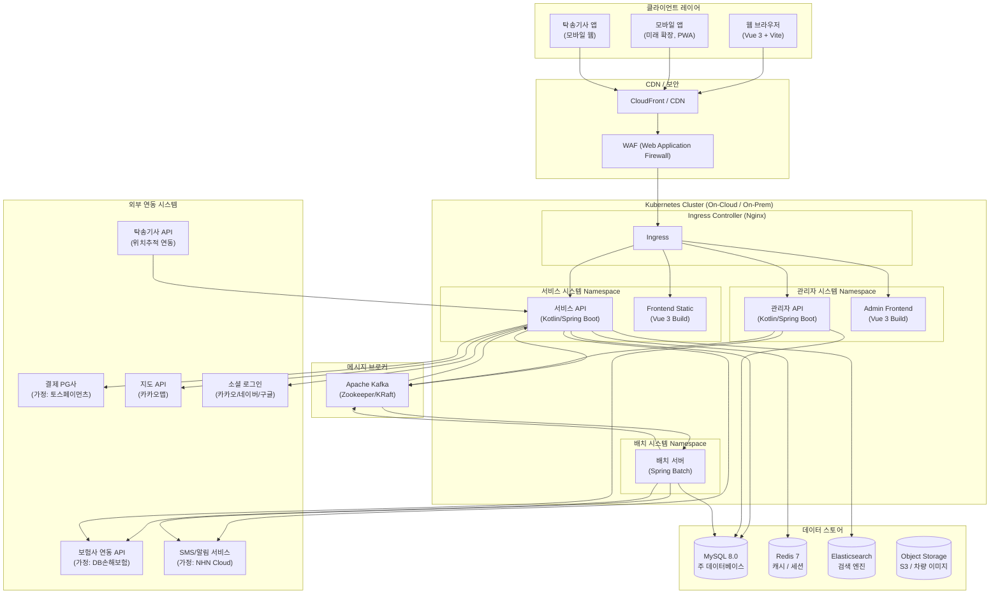
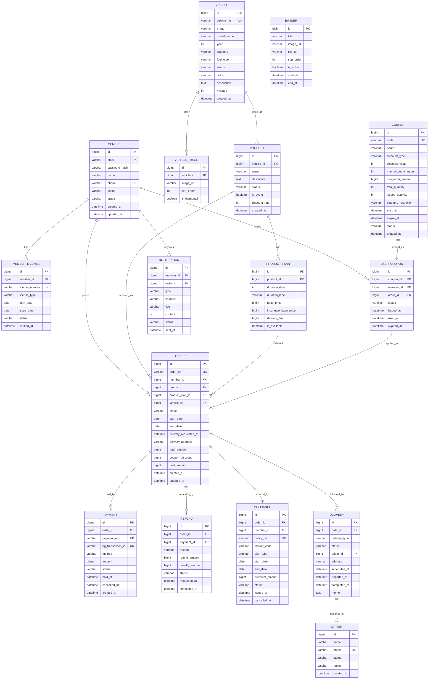
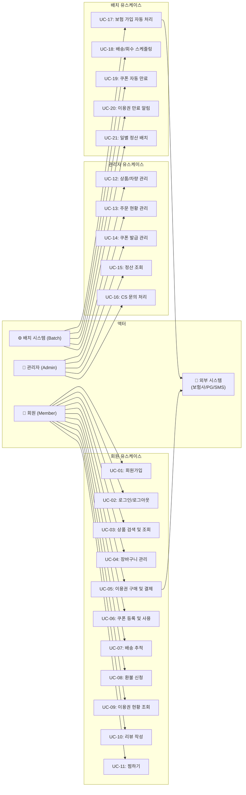
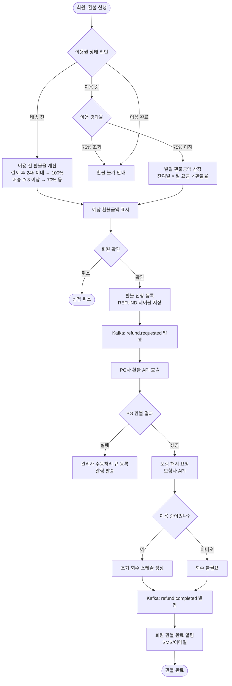
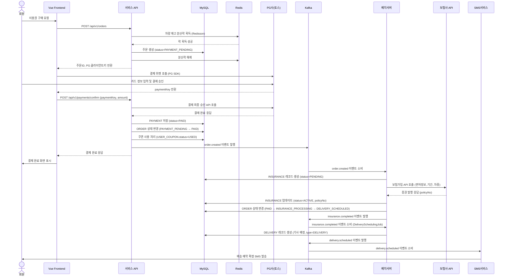
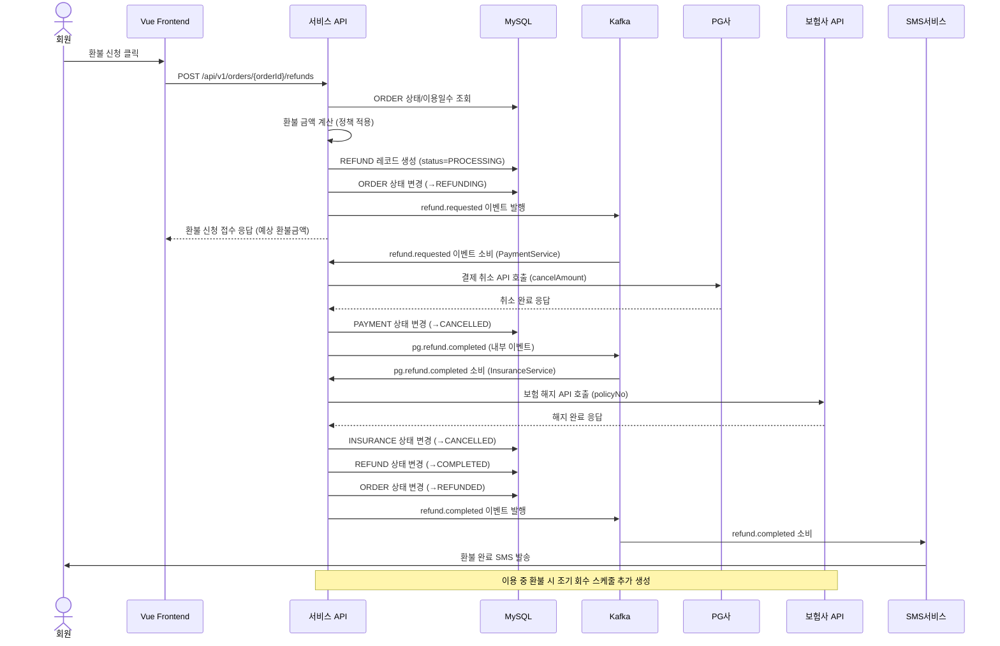

# 프리카(FreeCar) 자동차 구독 이커머스 플랫폼 — 전체 프로젝트 산출물

> **문서 버전**: v1.0  
> **작성일**: 2026-09-18  
> **작성자**: 수석 IT 컨설턴트 / SA  
> **상태**: 검토 요청

---

# 문서 1. 사업/서비스 기획서

## 1.1 프로젝트 배경 및 목적

### 1.1.1 프로젝트 배경

자동차 소유 패러다임이 변화하고 있다. MZ세대를 중심으로 "소유"보다 "경험"을 중시하는 소비 문화가 확산되며, 자동차 역시 구매·리스 중심에서 구독·이용권 중심으로 전환되는 추세가 뚜렷하다.

| 지표 | 수치 | 출처(가정) |
|---|---|---|
| 국내 자동차 구독 시장 규모 (2025) | 약 4,200억 원 | 시장조사기관 가정 |
| 연평균 성장률 (CAGR, 2025~2030) | 22.3% | 가정 |
| 자동차 구독 경험자 중 재이용 의향 | 68% | 소비자조사 가정 |
| MZ세대(20~39세) 자동차 구독 선호율 | 54% | 가정 |

기존 자동차 이동 서비스(카쉐어링·렌터카·리스)는 각각의 명확한 한계를 가지며, 이를 극복하는 **"자동차 구독 이용권 이커머스"** 형태의 신규 플랫폼에 대한 시장 수요가 존재한다.

### 1.1.2 시장/경쟁 서비스 분석

| 구분 | 카쉐어링 (쏘카/그린카) | 단기렌터카 | 장기렌터카 | 금융리스 | **프리카 (자동차 구독)** |
|---|---|---|---|---|---|
| 이용 기간 | 시간 단위 (최소 30분) | 1일~수 주 | 1개월~3년 | 24~60개월 | 7일~12개월 (유연) |
| 계약 복잡도 | 낮음 | 낮음 | 중간 | 높음 | **낮음 (온라인 완결)** |
| 보험 처리 | 포함 (제한적) | 포함 (표준) | 포함 | 별도 가입 필요 | **자동 가입 (최적화)** |
| 차량 배달 | 불가 (직접 픽업) | 일부 가능 | 불가 | 불가 | **지정 장소 배달** |
| 차량 회수 | 직접 반납 | 직접 반납 | 직접 반납 | 직접 반납 | **지정 장소 회수** |
| 차량 선택 폭 | 중간 | 중간 | 제한적 | 제한적 | **넓음 (프리미엄 포함)** |
| 중도 해지 | 해당없음 | 간단 | 위약금 | 위약금 높음 | **정책기반 유연 환불** |
| 쇼핑몰 형태 | 없음 | 없음 | 없음 | 없음 | **이커머스 UX** |

**프리카의 핵심 차별점:**
1. **이커머스 UX**: 상품처럼 차량 이용권을 장바구니에 담고 구매 (익숙한 쇼핑 경험)
2. **보험 자동 완결**: 구매 즉시 보험 자동 가입, 별도 서류·방문 불필요
3. **도어투도어**: 지정 일시·장소로 차량 배달 및 만료 시 자동 회수
4. **다양한 프리미엄 카테고리**: 전기차·스포츠카·럭셔리카 등 일반 서비스에서 접하기 어려운 차종 구독 가능
5. **유연한 기간**: 7일부터 최대 12개월까지 세분화된 기간 선택

### 1.1.3 프로젝트 목적

- **비즈니스 목적**: 자동차 구독 이커머스 시장 선점 및 2027년 내 손익분기점(BEP) 달성
- **서비스 목적**: 번거로운 자동차 이용 과정을 온라인 완결형으로 단순화하여 고객 편의 극대화
- **기술 목적**: 확장 가능한 MSA 기반 플랫폼 구축으로 추후 B2B(법인 구독) 및 해외 확장 대응

---

## 1.2 타겟 사용자 및 페르소나

### 1.2.1 타겟 사용자 세그먼트

| 세그먼트 | 특성 | 주요 니즈 | 예상 이용 패턴 |
|---|---|---|---|
| 단기 출장자 | 30~50대, 직장인 | 출장 기간 편리한 이동수단 | 7일~1개월, 세단/SUV |
| 세컨카 니즈 | 40~60대, 차량 보유자 | 추가 차량 필요 (가족 행사 등) | 7일~1개월, SUV/미니밴 |
| 여행/레저족 | 20~40대 | 여행지에서 프리미엄 드라이빙 경험 | 7일~2주, 스포츠카/전기차 |
| 신차 구매 전 체험 | 20~40대 | 구매 전 장기 시승 | 1~3개월, 특정 차종 |
| 이사/이직 공백기 | 20~40대 | 차량 공백 기간 대응 | 1~3개월, 세단/SUV |
| 법인/기업 (미래 확장) | 기업 담당자 | 임직원 업무 차량 운영 효율화 | 3~12개월, 복수 대수 |

### 1.2.2 핵심 페르소나

#### 페르소나 A — 김현준 (32세, IT 직장인)
```
이름: 김현준
나이: 32세
직업: 스타트업 마케터 (서울 거주)
차량: 미보유 (대중교통 이용)
소득: 연봉 5,000만 원

Pain Point:
- 격주로 지방 출장이 있으나 렌터카 예약 및 차량 픽업이 번거로움
- 전기차를 구매하고 싶으나 고가라 망설여짐

Goal:
- 출장 시 원하는 날 집 앞에서 차를 받고, 반납 걱정 없이 이용하고 싶음
- 전기차를 1~2개월 경험해보고 싶음

이용 예상 패턴:
- 7~30일권, 전기차/세단 카테고리
- 앱/웹 온라인 완결 선호
```

#### 페르소나 B — 이서연 (42세, 자영업자)
```
이름: 이서연
나이: 42세
직업: 카페 운영 (경기도 거주)
차량: 소형차 1대 보유
소득: 연 매출 2억 원

Pain Point:
- 주말 가족 여행 시 세컨카 필요 (7인승 미니밴)
- 장기렌터카는 계약이 복잡하고 기간이 길어 부담

Goal:
- 주말/연휴에만 미니밴을 빌려 가족과 여행하고 싶음
- 보험 걱정 없이 편리하게 이용하고 싶음

이용 예상 패턴:
- 7~14일권, SUV/미니밴 카테고리
- PC/모바일 병행 이용, 쿠폰 활용 관심
```

#### 페르소나 C — 박지훈 (28세, 스포츠카 마니아)
```
이름: 박지훈
나이: 28세
직업: 콘텐츠 크리에이터 (서울 거주)
차량: 미보유
소득: 연 수입 4,500만 원

Pain Point:
- 슈퍼카/스포츠카를 직접 소유하기엔 가격이 너무 높음
- 콘텐츠 촬영용 프리미엄 차량을 단기 이용하고 싶음

Goal:
- 페라리, 포르쉐 등 스포츠카를 1~2주 이용하며 콘텐츠 제작
- 차량 이미지/스펙 정보를 디테일하게 확인하고 싶음

이용 예상 패턴:
- 7~14일권, 스포츠카/럭셔리카 카테고리
- SNS 공유 유도 이벤트 관심
```

---

## 1.3 서비스 정책 상세

### 1.3.1 이용권 상품 구성 (기간별 요금제)

#### 카테고리 정의 기준

| 카테고리 | 기준 | 예시 차종 |
|---|---|---|
| 전기차 | 순수 전기차(BEV) 전 차종 | 테슬라 Model 3/Y, 아이오닉 5/6, GV60 |
| 스포츠카 | 2도어 쿠페/컨버터블, 0→100km/h 5초 이내 또는 제조사 스포츠 분류 | 포르쉐 911, BMW M4, 페라리 Roma |
| 럭셔리카 | 프리미엄 브랜드(메르세데스, BMW, Audi, 제네시스 등) 차량 중 일반형 | S클래스, 7시리즈, G90 |
| SUV | 차체형식 SUV/크로스오버 (승용 기반) | 팰리세이드, 쏘렌토, BMW X5 |
| 미니밴 | 7인승 이상 MPV/미니밴 | 카니발, 시에나, 오딧세이 |

#### 기간별 요금제 예시 (가정 수치 — 실제 운영 시 조정 필요)

| 이용 기간 | 전기차 (₩/일) | 스포츠카 (₩/일) | 럭셔리카 (₩/일) | SUV (₩/일) | 미니밴 (₩/일) |
|---|---|---|---|---|---|
| 7일권 | 120,000 | 350,000 | 280,000 | 150,000 | 180,000 |
| 14일권 | 110,000 | 320,000 | 260,000 | 140,000 | 165,000 |
| 1개월권 (30일) | 95,000 | 290,000 | 240,000 | 125,000 | 150,000 |
| 3개월권 (90일) | 80,000 | 260,000 | 210,000 | 110,000 | 130,000 |
| 6개월권 (180일) | 70,000 | 230,000 | 185,000 | 95,000 | 115,000 |
| 12개월권 (365일) | 60,000 | 200,000 | 160,000 | 85,000 | 100,000 |

> **가정사항**: 위 요금은 차량 기본 요금이며, 보험료는 별도 산정되어 최종 결제금액에 합산됨.  
> **할인율**: 7일 대비 12개월 기준 약 50% 할인 구조 (장기 이용 인센티브)

#### 상품 총 결제금액 구성

```
총 결제금액 = (차량 일 기본요금 × 이용일수) + 보험료 + 배송비 - 쿠폰할인
```

---

### 1.3.2 보험 자동 가입 정책

#### 가입 가능 조건

| 조건 항목 | 세부 기준 |
|---|---|
| 운전면허 | 국내 1종 보통 또는 2종 보통 이상 (외국인: 국제운전면허 + 여권) |
| 최소 연령 | 만 21세 이상 |
| 최대 연령 | 만 70세 이하 (만 65세 이상 시 추가 심사) |
| 면허 취득 후 경력 | 최소 1년 이상 (스포츠카/럭셔리카: 2년 이상) |
| 면허 정지/취소 이력 | 최근 2년 내 없어야 함 |
| 음주운전 이력 | 최근 5년 내 없어야 함 |

#### 보장범위 옵션

| 보장 항목 | 기본 보장 | 프리미엄 보장 |
|---|---|---|
| 대인배상 I | 무한 | 무한 |
| 대인배상 II | 1억 원 | 무한 |
| 대물배상 | 1억 원 | 3억 원 |
| 자차손해 | 미포함 | 포함 (자기부담금 50만 원) |
| 자손/자상 | 5천만 원 | 1억 원 |
| 긴급출동 | 포함 | 포함 |
| 렌터카비용 | 미포함 | 포함 (일 5만 원, 최대 20일) |

#### 보험료 산정 로직 (가정)

```
보험료 = 기본보험료 × 연령계수 × 경력계수 × 차종계수 × 기간계수

- 기본보험료 (가정): 일 15,000원 (기본 보장 기준)
- 연령계수: 21~25세 = 1.5, 26~35세 = 1.0, 36~50세 = 0.9, 51~65세 = 1.1, 66~70세 = 1.3
- 경력계수: 1~2년 = 1.3, 3~5년 = 1.1, 5년 초과 = 1.0
- 차종계수: 전기차 = 1.0, SUV = 1.0, 미니밴 = 1.0, 럭셔리카 = 1.2, 스포츠카 = 1.5
- 기간계수: 7일 = 1.0, 30일 = 0.95, 90일 = 0.90, 180일 = 0.85, 365일 = 0.80
- 프리미엄 보장 추가금: 기본 보험료의 +40%
```

> **가정사항**: 실제 보험사 연동 후 보험사가 제공하는 실제 보험료 API를 기준으로 산정 로직 교체 예정. 위 로직은 MVP 단계 내부 산정 가정값.

---

### 1.3.3 배송/회수 정책

#### 서비스 가능 지역 (초기 런칭 기준)

| 단계 | 서비스 지역 | 런칭 시점 |
|---|---|---|
| Phase 1 | 서울특별시 전 구 | 런칭 시 |
| Phase 2 | 경기도 (수도권 주요 도시) | 런칭 후 3개월 |
| Phase 3 | 6대 광역시 (부산, 대구, 인천, 광주, 대전, 울산) | 런칭 후 6개월 |
| Phase 4 | 전국 (제주도 포함) | 런칭 후 12개월 |

#### 배송 리드타임

| 구분 | 리드타임 | 비고 |
|---|---|---|
| 당일 배송 | 주문 후 4시간 이내 | 오전 10시 이전 주문 시, 서울 한정 |
| 익일 배송 | 주문 다음 날 지정 시간 | 기본 옵션 |
| 예약 배송 | 최대 30일 후까지 예약 | 달력에서 날짜/시간 선택 |
| 배송 가능 시간대 | 08:00 ~ 20:00 | 1시간 단위 선택 |

#### 배송 정책 상세

- **배송비**: 서울 기준 무료. 서울 외 지역 30,000원 (Phase 2 이후 적용)
- **배송 담당**: 플랫폼 계약 탁송기사 (앱으로 위치 추적 제공)
- **노쇼 정책**: 지정 시간 +1시간 대기 후 미연락 시 배송 취소, 배송비 50,000원 청구
- **주소 변경**: 배송 출발 3시간 전까지 변경 가능. 이후 변경 불가
- **차량 인수 확인**: 탁송기사와 함께 차량 상태 확인 후 앱에서 사진 첨부 및 서명으로 인수 완료

#### 회수 정책 상세

- **회수 안내**: 만료 3일 전, 1일 전, 당일 오전 알림 발송 (앱 푸시/SMS/이메일)
- **회수 시간**: 이용권 만료일 사용자 지정 시간 (08:00 ~ 20:00)
- **회수 장소**: 인수 장소 기본 설정, 변경 시 만료 3일 전까지 신청
- **지연 반납**: 만료 후 1시간 이내 — 1일 추가 요금 50% 청구. 1시간 초과 시 1일 전액 청구
- **차량 상태 확인**: 회수 시 기사와 함께 상태 점검, 파손/오염 확인 후 추가 청구 가능

---

### 1.3.4 환불/취소 정책

#### 이용 전 취소 환불율

| 취소 시점 | 환불율 | 비고 |
|---|---|---|
| 결제 후 24시간 이내 & 배송 3일 전 이상 | 100% | 단순 변심 |
| 배송 3일 전 ~ 배송 1일 전 | 70% | 차량 준비 비용 발생 |
| 배송 1일 전 ~ 배송 당일 오전 10시 이전 | 50% | |
| 배송 당일 오전 10시 이후 | 20% | 탁송기사 출발 후 |
| 배송 완료 후 취소 불가 (이용 중 환불 정책 적용) | — | |

#### 이용 중 환불 정책 (일할 계산)

```
환불금액 = 일 기본요금 × 잔여일수 × 환불율(70%)
          - 보험 해지 위약금
          - 차량 회수 비용(50,000원)
```

| 이용 경과율 | 차량 요금 환불율 | 보험 환불 |
|---|---|---|
| 이용일수 25% 이하 | 잔여일수의 70% | 잔여일수 보험료 환불 - 해지수수료(10%) |
| 이용일수 25~50% | 잔여일수의 60% | 잔여일수 보험료 환불 - 해지수수료(15%) |
| 이용일수 50~75% | 잔여일수의 50% | 잔여일수 보험료 환불 - 해지수수료(20%) |
| 이용일수 75% 초과 | 환불 불가 | 환불 불가 |

> **가정사항**: 보험 환불 정책은 연동 보험사의 약관에 따라 변동될 수 있으며, 보험사 확정 후 해당 정책을 기준으로 업데이트 예정.

#### 이용 후 환불
- 차량 이용 완료 후 환불 없음 (단, 차량 결함으로 인한 운행 불가 등 귀책사유가 플랫폼에 있는 경우 별도 심사 후 환불 가능)

---

### 1.3.5 쿠폰 정책

| 정책 항목 | 세부 내용 |
|---|---|
| 쿠폰 유형 | 정률(%) 할인 / 정액(원) 할인 |
| 할인 한도 | 정률 쿠폰: 최대 50%, 정액 쿠폰: 최대 100,000원 |
| 최소 주문금액 | 쿠폰별 설정 가능 (예: 50만 원 이상 주문 시) |
| 중복 사용 | 1회 주문 시 쿠폰 1개만 사용 가능 (중복 불가) |
| 사용 기간 | 발급일로부터 30일 / 90일 / 180일 등 쿠폰별 설정 |
| 발급 조건 | 회원가입 환영 쿠폰, 첫 주문 쿠폰, 생일 쿠폰, 이벤트 응모, 관리자 수동 발급 |
| 만료 처리 | 만료일 D-7, D-1 알림 발송 / 만료일 00:00 자동 비활성화 (배치) |
| 환불 시 처리 | 쿠폰으로 할인받은 금액은 환불 제외 (쿠폰은 복원 안 됨) |
| 사용 제한 | 특정 카테고리 전용, 특정 차종 전용 등 설정 가능 |
| 관리자 기능 | 발급, 일괄 발급(CSV), 조기 만료, 사용 현황 조회 |

---

## 1.4 메인 페이지 IA(정보구조) 및 와이어프레임 설명

### 1.4.1 전체 사이트 IA

```
[프리카 (FreeCar)]
├── 헤더 GNB
│   ├── 로고
│   ├── 카테고리 (전기차 / 스포츠카 / 럭셔리카 / SUV / 미니밴 / 이벤트)
│   ├── 검색창
│   ├── [비로그인] 로그인 / 회원가입
│   └── [로그인] 장바구니 / 찜목록 / 마이페이지
│
├── 메인 페이지 (/)
│   ├── 메인 배너 (롤링)
│   ├── 전기차 상품 섹션
│   ├── 스포츠카 상품 섹션
│   ├── 럭셔리카 상품 섹션
│   ├── SUV 상품 섹션
│   ├── 미니밴 상품 섹션
│   └── 특별할인 이벤트 섹션
│
├── 카테고리 목록 페이지 (/category/:type)
│   └── 필터(기간/가격/차종), 정렬(인기순/신규순/저가순)
│
├── 상품 상세 페이지 (/product/:id)
│   ├── 차량 이미지 갤러리
│   ├── 차량 스펙
│   ├── 이용권 기간 선택
│   ├── 보험 옵션 선택
│   ├── 배송일/장소 선택
│   ├── 쿠폰 적용
│   └── 구매하기 / 장바구니 담기 / 찜하기
│
├── 장바구니 (/cart)
├── 결제 (/checkout)
├── 결제완료 (/checkout/complete)
│
├── 마이페이지 (/mypage)
│   ├── 이용권 현황 (이용 중 / 예정 / 완료)
│   ├── 주문/결제 내역
│   ├── 쿠폰함
│   ├── 찜목록
│   ├── 리뷰 작성
│   ├── 배송 추적
│   └── 회원정보 수정
│
├── 로그인 (/login)
├── 회원가입 (/register)
├── 회원가입 완료 (/register/complete)
│
├── 검색결과 (/search)
├── 이벤트 (/event)
├── 이벤트 상세 (/event/:id)
│
└── 고객센터 (/support)
    ├── 공지사항
    ├── FAQ
    └── 1:1 문의
```

### 1.4.2 메인 페이지 섹션별 노출 로직

| 섹션 | 노출 방식 | 정렬 기준 | 노출 개수 |
|---|---|---|---|
| 메인 배너 | 관리자 등록 배너 (롤링, 자동 5초) | 관리자 설정 순서 | 최대 10개 |
| 전기차 상품 | 전기차 카테고리 차량 | 인기순 (구독횟수) | 8개 (2행 × 4열) |
| 스포츠카 상품 | 스포츠카 카테고리 차량 | 인기순 | 8개 |
| 럭셔리카 상품 | 럭셔리카 카테고리 차량 | 신규 등록순 | 8개 |
| SUV 상품 | SUV 카테고리 차량 | 인기순 | 8개 |
| 미니밴 상품 | 미니밴 카테고리 차량 | 인기순 | 8개 |
| 특별할인 이벤트 | 할인율 10% 이상 상품 | 할인율 높은 순 | 4개 |

> **가정사항**: 로그인 사용자의 경우 Phase 2에서 개인화 추천(열람 이력 기반) 적용 예정. MVP에서는 인기순/신규순 노출.

---

## 1.5 회원 등급/멤버십 정책

### 1.5.1 회원 등급 체계

| 등급 | 이름 | 달성 조건 | 주요 혜택 |
|---|---|---|---|
| Lv.1 | FREE | 회원가입 | 회원가입 쿠폰 1장 |
| Lv.2 | SILVER | 누적 구독 횟수 3회 이상 또는 누적 결제금액 200만 원 이상 | 추가 할인 쿠폰 월 1장, 배송 우선 순위 |
| Lv.3 | GOLD | 누적 구독 횟수 7회 이상 또는 누적 결제금액 500만 원 이상 | 추가 할인 쿠폰 월 2장, 전담 CS, 스포츠카 전용 쿠폰 |
| Lv.4 | PLATINUM | 누적 구독 횟수 15회 이상 또는 누적 결제금액 1,000만 원 이상 | 무료 보험 업그레이드, VIP 전용 차량 우선 예약, 전담 매니저 |

### 1.5.2 등급 산정 기준
- 매월 1일 전월 기준 재산정
- 최근 12개월 이내 실적만 인정
- 환불된 주문은 실적 제외

---

## 1.6 화면 정의서 목록 (사이트맵)

### 1.6.1 서비스 시스템 화면 목록

| ID | 화면명 | URL | 설명 |
|---|---|---|---|
| S-001 | 메인 페이지 | / | 배너, 카테고리별 상품 섹션 |
| S-002 | 카테고리 목록 | /category/:type | 필터/정렬 포함 |
| S-003 | 상품 상세 | /product/:id | 차량정보, 이용권 선택, 결제 유도 |
| S-004 | 검색 결과 | /search?q= | 키워드 검색 결과 |
| S-005 | 장바구니 | /cart | 담은 이용권 목록, 쿠폰 적용 |
| S-006 | 결제 | /checkout | 개인정보입력, 보험선택, 배송일시, 최종금액 |
| S-007 | 결제 완료 | /checkout/complete | 주문번호, 이용 일정 요약 |
| S-008 | 로그인 | /login | 소셜/이메일 로그인 |
| S-009 | 회원가입 | /register | 이메일/휴대폰 인증, 면허정보 입력 |
| S-010 | 회원가입 완료 | /register/complete | 환영 쿠폰 지급 안내 |
| S-011 | 마이페이지 홈 | /mypage | 등급, 쿠폰, 최근 이용 현황 |
| S-012 | 이용권 현황 | /mypage/subscriptions | 이용 중/예정/완료 탭 |
| S-013 | 주문 상세 | /mypage/subscriptions/:id | 개별 주문 상세, 보험정보, 배송추적 |
| S-014 | 쿠폰함 | /mypage/coupons | 보유 쿠폰 목록, 만료예정 강조 |
| S-015 | 찜목록 | /mypage/wishlist | 찜한 차량 목록 |
| S-016 | 리뷰 작성 | /mypage/review/write/:id | 별점, 사진, 텍스트 리뷰 |
| S-017 | 회원정보 수정 | /mypage/profile | 기본정보, 면허정보, 주소 |
| S-018 | 이벤트 목록 | /event | 진행중 이벤트 |
| S-019 | 이벤트 상세 | /event/:id | 이벤트 내용, 참여 버튼 |
| S-020 | 공지사항 | /support/notices | |
| S-021 | FAQ | /support/faq | 카테고리별 FAQ |
| S-022 | 1:1 문의 | /support/inquiry | 문의 작성, 내역 조회 |
| S-023 | 배송 추적 | /mypage/subscriptions/:id/tracking | 실시간 탁송기사 위치 |
| S-024 | 환불 신청 | /mypage/subscriptions/:id/refund | 환불 사유, 예상 환불금액 |

### 1.6.2 관리자 시스템 화면 목록

| ID | 화면명 | URL (Admin) | 설명 |
|---|---|---|---|
| A-001 | 관리자 로그인 | /admin/login | |
| A-002 | 대시보드 | /admin/dashboard | KPI 요약, 주문현황, 배송현황 |
| A-003 | 상품 목록 | /admin/products | 차량 이용권 상품 관리 |
| A-004 | 상품 등록/수정 | /admin/products/edit | 차량정보, 기간별요금, 이미지 |
| A-005 | 차량 재고 관리 | /admin/vehicles | 차량 현황 (가용/이용중/정비중) |
| A-006 | 주문 목록 | /admin/orders | 전체 주문 목록, 상태별 필터 |
| A-007 | 주문 상세 | /admin/orders/:id | 주문/보험/배송 상세정보, 상태 변경 |
| A-008 | 보험 현황 | /admin/insurances | 보험가입 상태 모니터링 |
| A-009 | 배송 관리 | /admin/deliveries | 배송/회수 일정, 기사 배정 |
| A-010 | 기사 관리 | /admin/drivers | 탁송기사 등록/관리 |
| A-011 | 회원 목록 | /admin/members | 전체 회원 목록, 등급, 상태 |
| A-012 | 회원 상세 | /admin/members/:id | 개인정보, 이용이력, CS이력 |
| A-013 | 쿠폰 목록 | /admin/coupons | 쿠폰 발급/관리 |
| A-014 | 쿠폰 발급 | /admin/coupons/create | 쿠폰 조건 설정, 일괄 발급 |
| A-015 | 이벤트 관리 | /admin/events | 이벤트 등록/수정/삭제 |
| A-016 | 배너 관리 | /admin/banners | 메인 배너 등록/순서/노출기간 |
| A-017 | 정산 관리 | /admin/settlements | 기간별 매출, 정산내역 |
| A-018 | CS 문의 관리 | /admin/inquiries | 1:1 문의 답변 |
| A-019 | 공지사항 관리 | /admin/notices | 공지사항 CRUD |
| A-020 | 배치 실행 현황 | /admin/batch | 배치 Job 실행 로그, 수동 실행 |
| A-021 | 시스템 설정 | /admin/settings | 수수료율, 환불정책 등 운영 파라미터 |
| A-022 | 리뷰 관리 | /admin/reviews | 리뷰 노출/숨김, 신고 처리 |

---

# 문서 2. 기술 규격서 (기술 아키텍처)

## 2.1 전체 시스템 아키텍처 다이어그램



---

## 2.2 기술 스택 상세 및 선정 이유

| 레이어 | 기술 | 버전 (가정) | 선정 이유 |
|---|---|---|---|
| **Frontend** | Vue.js + Vite | Vue 3.4 / Vite 5.x | 컴포넌트 기반 개발, Composition API로 코드 재사용성 향상. Vite는 빠른 빌드/HMR |
| **Frontend 상태관리** | Pinia | 2.x | Vuex 대비 경량, TypeScript 친화적, Composition API 호환 |
| **Frontend 라우팅** | Vue Router | 4.x | SPA 라우팅, Navigation Guard로 인증 처리 |
| **Backend API** | Kotlin + Spring Boot | Kotlin 1.9 / Spring Boot 3.x | JVM 생태계 활용, 간결한 코드, Spring 생태계(Security, Data JPA, Validation) 활용 |
| **배치** | Spring Batch | 5.x | Job/Step 모델, Chunk 처리, 재시작/스킵 기능, Spring Boot와 동일 생태계 |
| **ORM** | Spring Data JPA + QueryDSL | — | 복잡한 동적 쿼리는 QueryDSL, 기본 CRUD는 JPA |
| **RDB** | MySQL | 8.0 (**가정사항**) | 국내 서비스 레퍼런스 풍부, 트랜잭션 안정성, JSON 컬럼 지원 |
| **캐시** | Redis | 7.x (**가정사항**) | 세션 관리, 상품 캐싱, 분산락(Redisson), 실시간 재고 상태 |
| **검색** | Elasticsearch | 8.x (**가정사항**) | 차량 상품 full-text 검색, 필터/정렬 성능 |
| **메시징** | Apache Kafka | 3.x | 주문-보험-배송-회수 비동기 이벤트, 서비스 간 결합도 감소 |
| **컨테이너** | Docker | 24.x | 환경 일관성, CI/CD 이미지 배포 표준 |
| **오케스트레이션** | Kubernetes (k8s) | 1.29 | 자동 스케일링, 무중단 배포, 서비스 디스커버리 |
| **CI/CD** | GitHub Actions + ArgoCD | — (**가정사항**) | GitHub Actions로 빌드/테스트, ArgoCD로 GitOps 기반 k8s 배포 |
| **API Gateway** | Spring Cloud Gateway | — | 인증/라우팅/로드밸런싱 (향후 MSA 전환 시 적용) |
| **모니터링** | Prometheus + Grafana | — (**가정사항**) | 메트릭 수집, 대시보드 시각화 |
| **로그** | EFK (Elasticsearch + Fluentd + Kibana) | — (**가정사항**) | 중앙화 로그 수집 및 검색 |
| **PG** | 토스페이먼츠 | — (**가정사항**) | 국내 점유율 높음, 웹훅 지원 양호, 결제 취소/환불 API 안정적 |

---

## 2.3 MSA/모듈 분할 전략

> **가정사항**: 초기 런칭은 **모듈러 모놀리스** 형태로 진행하되, 도메인 경계를 명확히 분리하여 추후 MSA 전환을 용이하게 설계. Spring Boot 멀티모듈 구조 채택.

### 도메인 서비스 분리안

| 도메인 서비스 | 주요 책임 | 핵심 엔티티 | Phase |
|---|---|---|---|
| **auth-service** | 회원가입, 로그인, JWT 발급, 소셜 로그인 | Member, Token | MVP |
| **member-service** | 회원 정보 관리, 등급 관리, 면허 정보 | Member, MemberGrade, License | MVP |
| **vehicle-service** | 차량 정보 관리, 재고 상태 관리 | Vehicle, VehicleStock | MVP |
| **product-service** | 이용권 상품 구성, 카테고리, 요금 정책 | Product, ProductPlan, Category | MVP |
| **order-service** | 주문 생성, 상태 관리, 취소 | Order, OrderItem | MVP |
| **payment-service** | 결제, 환불, PG 연동 | Payment, Refund | MVP |
| **insurance-service** | 보험 가입 요청, 상태 관리, 해지 | Insurance, InsurancePlan | MVP |
| **delivery-service** | 배송/회수 스케줄, 기사 배정, 위치 추적 | Delivery, Driver, TrackingLog | MVP |
| **coupon-service** | 쿠폰 발급, 사용, 만료 | Coupon, UserCoupon | MVP |
| **notification-service** | SMS, 이메일, 앱푸시 알림 발송 | Notification, NotificationTemplate | MVP |
| **settlement-service** | 정산 계산, 정산 내역 관리 | Settlement, SettlementDetail | Phase 2 |
| **review-service** | 리뷰 등록, 관리, 평점 집계 | Review, ReviewImage | Phase 2 |
| **search-service** | ES 기반 상품 검색, 추천 | — | Phase 2 |

---

## 2.4 데이터베이스 설계 개요 및 ERD



---

## 2.5 API 설계 원칙 및 대표 API 명세

### 2.5.1 API 설계 원칙

- **RESTful 설계**: 자원(Resource) 중심 URL, HTTP 메서드로 행위 표현
- **URL 규칙**: `/api/v1/{resource}/{id}` 형태, 소문자 kebab-case
- **인증**: JWT Bearer Token (`Authorization: Bearer {token}`)
- **공통 응답 포맷**: 아래 표준 형식 준수
- **페이지네이션**: Cursor 기반 또는 Offset 기반 (상황에 따라 선택)
- **에러 코드**: 시스템 공통 에러코드 체계 적용 (`ERR-001` 형식)

#### 공통 응답 포맷

```json
{
  "success": true,
  "code": "SUCCESS",
  "message": "요청이 성공적으로 처리되었습니다.",
  "data": { ... },
  "timestamp": "2026-09-18T12:00:00+09:00"
}

// 에러 응답
{
  "success": false,
  "code": "ERR-ORDER-001",
  "message": "재고가 부족합니다.",
  "data": null,
  "timestamp": "2026-09-18T12:00:00+09:00"
}
```

---

### 2.5.2 핵심 API 명세 (최소 10개)

#### API-01. 상품(이용권) 목록 조회

```
GET /api/v1/products?category=ELECTRIC&sort=POPULAR&page=0&size=8
Authorization: (선택사항)
```

**Response 200**
```json
{
  "success": true,
  "code": "SUCCESS",
  "data": {
    "content": [
      {
        "productId": 1001,
        "vehicleId": 501,
        "name": "테슬라 Model 3 롱레인지",
        "category": "ELECTRIC",
        "thumbnail": "https://cdn.freeca.kr/vehicles/501/thumb.jpg",
        "brand": "Tesla",
        "modelName": "Model 3",
        "year": 2025,
        "minPrice": 60000,
        "plans": [
          { "durationDays": 7, "durationLabel": "7일", "basePrice": 840000 },
          { "durationDays": 30, "durationLabel": "1개월", "basePrice": 2850000 }
        ],
        "discountRate": 0,
        "isEvent": false,
        "reviewCount": 45,
        "avgRating": 4.7
      }
    ],
    "totalElements": 32,
    "totalPages": 4,
    "currentPage": 0
  }
}
```

---

#### API-02. 상품 상세 조회

```
GET /api/v1/products/{productId}
```

**Response 200**
```json
{
  "success": true,
  "code": "SUCCESS",
  "data": {
    "productId": 1001,
    "vehicle": {
      "vehicleId": 501,
      "vehicleNo": "12가3456",
      "brand": "Tesla",
      "modelName": "Model 3",
      "year": 2025,
      "category": "ELECTRIC",
      "fuelType": "ELECTRIC",
      "color": "Pearl White",
      "mileage": 12000,
      "description": "...",
      "images": [
        { "imageUrl": "https://cdn.freeca.kr/vehicles/501/img1.jpg", "isThumb": true }
      ]
    },
    "plans": [
      {
        "planId": 201,
        "durationDays": 7,
        "durationLabel": "7일",
        "basePrice": 840000,
        "insuranceBasePrice": 105000,
        "deliveryFee": 0,
        "totalPrice": 945000
      }
    ],
    "isAvailable": true
  }
}
```

---

#### API-03. 이용권 구매 (주문 생성)

```
POST /api/v1/orders
Authorization: Bearer {token}
Content-Type: application/json
```

**Request Body**
```json
{
  "productId": 1001,
  "planId": 201,
  "startDate": "2026-10-01",
  "deliveryAddress": "서울시 강남구 테헤란로 123, 101호",
  "deliveryScheduledAt": "2026-10-01T10:00:00",
  "insurancePlanType": "PREMIUM",
  "couponId": 55,
  "paymentMethod": "CARD"
}
```

**Response 201**
```json
{
  "success": true,
  "code": "SUCCESS",
  "data": {
    "orderId": 9001,
    "orderNo": "FC-20261001-000001",
    "status": "PAYMENT_PENDING",
    "finalAmount": 1260000,
    "couponDiscount": 50000,
    "pgClientKey": "client_key_from_pg",
    "pgOrderId": "pg-order-9001"
  }
}
```

---

#### API-04. 결제 승인 요청

```
POST /api/v1/payments/confirm
Authorization: Bearer {token}
Content-Type: application/json
```

**Request Body**
```json
{
  "orderId": 9001,
  "pgPaymentKey": "5EnNZRJGvaBX7zk2yd8ydw26XvwXMDJ1CMSPHpTb26drNLbpnBBnHFa8Cka",
  "amount": 1260000
}
```

**Response 200**
```json
{
  "success": true,
  "code": "SUCCESS",
  "data": {
    "paymentId": 8001,
    "paymentNo": "PAY-20261001-000001",
    "status": "PAID",
    "paidAt": "2026-10-01T10:05:30+09:00"
  }
}
```

---

#### API-05. 보험 가입 상태 조회

```
GET /api/v1/orders/{orderId}/insurance
Authorization: Bearer {token}
```

**Response 200**
```json
{
  "success": true,
  "code": "SUCCESS",
  "data": {
    "insuranceId": 7001,
    "orderId": 9001,
    "status": "ACTIVE",
    "policyNo": "DB-2026-0100001",
    "insurerCode": "DB_손해보험",
    "planType": "PREMIUM",
    "startDate": "2026-10-01",
    "endDate": "2026-10-08",
    "premiumAmount": 147000,
    "issuedAt": "2026-10-01T10:06:00+09:00"
  }
}
```

---

#### API-06. 배송 예약 조회

```
GET /api/v1/orders/{orderId}/delivery
Authorization: Bearer {token}
```

**Response 200**
```json
{
  "success": true,
  "code": "SUCCESS",
  "data": {
    "deliveryId": 6001,
    "deliveryType": "DELIVERY",
    "status": "SCHEDULED",
    "driver": {
      "driverId": 301,
      "name": "홍길동",
      "phone": "010-1234-5678"
    },
    "address": "서울시 강남구 테헤란로 123",
    "scheduledAt": "2026-10-01T10:00:00+09:00",
    "trackingUrl": "https://track.freeca.kr/6001"
  }
}
```

---

#### API-07. 환불 신청

```
POST /api/v1/orders/{orderId}/refunds
Authorization: Bearer {token}
Content-Type: application/json
```

**Request Body**
```json
{
  "reason": "개인 사정으로 인한 취소",
  "reasonDetail": "출장 일정이 변경되었습니다."
}
```

**Response 201**
```json
{
  "success": true,
  "code": "SUCCESS",
  "data": {
    "refundId": 5001,
    "orderId": 9001,
    "status": "PROCESSING",
    "refundAmount": 630000,
    "penaltyAmount": 630000,
    "expectedCompletedAt": "2026-10-05T00:00:00+09:00"
  }
}
```

---

#### API-08. 쿠폰 적용 가능 여부 확인

```
POST /api/v1/coupons/validate
Authorization: Bearer {token}
Content-Type: application/json
```

**Request Body**
```json
{
  "couponId": 55,
  "productId": 1001,
  "planId": 201,
  "orderAmount": 1260000
}
```

**Response 200**
```json
{
  "success": true,
  "code": "SUCCESS",
  "data": {
    "isValid": true,
    "discountAmount": 50000,
    "finalAmount": 1210000,
    "message": "쿠폰이 적용되었습니다."
  }
}
```

---

#### API-09. 내 이용권 목록 조회 (마이페이지)

```
GET /api/v1/mypage/subscriptions?status=ACTIVE&page=0&size=10
Authorization: Bearer {token}
```

**Response 200**
```json
{
  "success": true,
  "code": "SUCCESS",
  "data": {
    "content": [
      {
        "orderId": 9001,
        "orderNo": "FC-20261001-000001",
        "status": "IN_USE",
        "vehicle": {
          "brand": "Tesla",
          "modelName": "Model 3",
          "thumbnail": "https://cdn.freeca.kr/vehicles/501/thumb.jpg"
        },
        "startDate": "2026-10-01",
        "endDate": "2026-10-08",
        "daysRemaining": 5,
        "insurance": { "status": "ACTIVE", "planType": "PREMIUM" }
      }
    ],
    "totalElements": 1
  }
}
```

---

#### API-10. 회원가입

```
POST /api/v1/auth/register
Content-Type: application/json
```

**Request Body**
```json
{
  "email": "user@example.com",
  "password": "P@ssw0rd!",
  "name": "김현준",
  "phone": "01012345678",
  "birthDate": "1994-05-15",
  "licenseNumber": "11-AB-123456-78",
  "licenseType": "FIRST_CLASS_REGULAR",
  "licenseIssueDate": "2016-03-20",
  "agreeTerms": true,
  "agreePrivacy": true,
  "agreeMarketing": false
}
```

**Response 201**
```json
{
  "success": true,
  "code": "SUCCESS",
  "data": {
    "memberId": 1001,
    "email": "user@example.com",
    "name": "김현준",
    "grade": "FREE",
    "welcomeCouponIssued": true,
    "accessToken": "eyJhbGciOiJIUzI1NiJ9...",
    "refreshToken": "rt_abc123..."
  }
}
```

---

#### API-11. 찜하기 / 찜 해제

```
POST /api/v1/products/{productId}/wishlist    # 찜하기
DELETE /api/v1/products/{productId}/wishlist  # 찜 해제
Authorization: Bearer {token}
```

**Response 200**
```json
{
  "success": true,
  "code": "SUCCESS",
  "data": { "isWishlisted": true, "wishlistCount": 123 }
}
```

---

#### API-12. 차량 검색

```
GET /api/v1/search/products?q=테슬라&category=ELECTRIC&minPrice=0&maxPrice=1000000&sort=POPULAR
```

**Response 200**
```json
{
  "success": true,
  "code": "SUCCESS",
  "data": {
    "query": "테슬라",
    "content": [ /* 상품 목록 */ ],
    "totalElements": 8,
    "took": 12
  }
}
```

---

## 2.6 Kafka 토픽 설계

### 2.6.1 토픽 목록

| 토픽명 | 파티션 수 | 복제 계수 | 프로듀서 | 컨슈머 | 설명 |
|---|---|---|---|---|---|
| `order.created` | 6 | 3 | order-service | insurance-service, notification-service | 주문 결제 완료 이벤트 |
| `insurance.requested` | 6 | 3 | insurance-service | batch(보험가입처리) | 보험가입 요청 이벤트 |
| `insurance.completed` | 6 | 3 | batch | order-service, delivery-service, notification-service | 보험가입 완료 이벤트 |
| `insurance.failed` | 3 | 3 | batch | order-service, payment-service | 보험가입 실패 (보상 트랜잭션) |
| `delivery.scheduled` | 6 | 3 | delivery-service | notification-service, driver-app | 배송 예약 완료 |
| `delivery.started` | 3 | 3 | driver-app/delivery-service | notification-service | 배송 출발 이벤트 |
| `delivery.completed` | 6 | 3 | driver-app/delivery-service | order-service, notification-service | 차량 인도 완료 |
| `vehicle.returned` | 6 | 3 | driver-app/delivery-service | order-service, vehicle-service, notification-service | 차량 회수 완료 |
| `refund.requested` | 3 | 3 | order-service | payment-service, insurance-service | 환불 요청 |
| `refund.completed` | 3 | 3 | payment-service | order-service, notification-service | 환불 완료 |
| `coupon.expired` | 3 | 3 | batch(쿠폰만료) | notification-service | 쿠폰 만료 처리 |
| `subscription.expiring` | 3 | 3 | batch(만료예정) | notification-service, delivery-service | 이용권 만료 D-3/D-1 알림 |

### 2.6.2 이벤트 페이로드 예시

#### `order.created`
```json
{
  "eventId": "evt-uuid-001",
  "eventType": "ORDER_CREATED",
  "occurredAt": "2026-10-01T10:05:30+09:00",
  "payload": {
    "orderId": 9001,
    "orderNo": "FC-20261001-000001",
    "memberId": 1001,
    "productId": 1001,
    "vehicleId": 501,
    "planId": 201,
    "startDate": "2026-10-01",
    "endDate": "2026-10-08",
    "durationDays": 7,
    "insurancePlanType": "PREMIUM",
    "memberInfo": {
      "name": "김현준",
      "licenseNumber": "11-AB-123456-78",
      "licenseType": "FIRST_CLASS_REGULAR",
      "birthDate": "1994-05-15"
    },
    "finalAmount": 1260000
  }
}
```

#### `insurance.completed`
```json
{
  "eventId": "evt-uuid-002",
  "eventType": "INSURANCE_COMPLETED",
  "occurredAt": "2026-10-01T10:08:00+09:00",
  "payload": {
    "orderId": 9001,
    "insuranceId": 7001,
    "policyNo": "DB-2026-0100001",
    "insurerCode": "DB_손해보험",
    "status": "ACTIVE",
    "startDate": "2026-10-01",
    "endDate": "2026-10-08",
    "premiumAmount": 147000
  }
}
```

#### `delivery.scheduled`
```json
{
  "eventId": "evt-uuid-003",
  "eventType": "DELIVERY_SCHEDULED",
  "occurredAt": "2026-10-01T10:09:00+09:00",
  "payload": {
    "deliveryId": 6001,
    "orderId": 9001,
    "deliveryType": "DELIVERY",
    "driverId": 301,
    "address": "서울시 강남구 테헤란로 123",
    "scheduledAt": "2026-10-01T10:00:00",
    "memberPhone": "01012345678"
  }
}
```

#### `vehicle.returned`
```json
{
  "eventId": "evt-uuid-004",
  "eventType": "VEHICLE_RETURNED",
  "occurredAt": "2026-10-08T14:30:00+09:00",
  "payload": {
    "orderId": 9001,
    "vehicleId": 501,
    "driverId": 301,
    "returnedAt": "2026-10-08T14:30:00+09:00",
    "vehicleCondition": "NORMAL",
    "mileageAfter": 12450,
    "damageReported": false
  }
}
```

---

## 2.7 인프라 아키텍처

### 2.7.1 Docker 이미지 구성

| 이미지명 | Base 이미지 | 빌드 결과물 | 포트 |
|---|---|---|---|
| `freeca/service-api` | `eclipse-temurin:21-jre` | Spring Boot JAR | 8080 |
| `freeca/admin-api` | `eclipse-temurin:21-jre` | Spring Boot JAR | 8081 |
| `freeca/batch` | `eclipse-temurin:21-jre` | Spring Batch JAR | 없음 |
| `freeca/service-front` | `nginx:alpine` | Vue 3 빌드 결과물 | 80 |
| `freeca/admin-front` | `nginx:alpine` | Vue 3 Admin 빌드 결과물 | 80 |

### 2.7.2 Kubernetes 클러스터 구조

```yaml
# 가정: GKE 또는 EKS 기반 관리형 쿠버네티스

Namespaces:
  - freeca-service      # 서비스 시스템
  - freeca-admin        # 관리자 시스템
  - freeca-batch        # 배치 시스템
  - freeca-infra        # Kafka, Redis, MySQL (또는 외부 관리형 서비스)
  - monitoring          # Prometheus, Grafana
  - logging             # EFK Stack

# 서비스 시스템 (freeca-service)
Deployments:
  - service-api-deployment    # replicas: 3 (HPA: min 2, max 10)
  - service-front-deployment  # replicas: 2

Services:
  - service-api-svc           # ClusterIP
  - service-front-svc         # ClusterIP

HPA:
  - service-api-hpa           # CPU 70% 트리거

# Ingress
Ingress (nginx-ingress):
  - freeca.kr           → service-front-svc
  - api.freeca.kr       → service-api-svc
  - admin.freeca.kr     → admin-front-svc
  - admin-api.freeca.kr → admin-api-svc
  TLS: cert-manager (Let's Encrypt)
```

### 2.7.3 CI/CD 파이프라인 개요

```
[개발자 Push/PR]
     │
     ▼
[GitHub Actions — CI]
  1. Lint (ktlint, eslint)
  2. Unit Test (./gradlew test)
  3. Build (./gradlew build)
  4. Docker 이미지 빌드
  5. 이미지 Push (GitHub Container Registry / ECR)
     │
     ▼
[ArgoCD — CD (GitOps)]
  6. K8s 매니페스트 저장소 자동 이미지 태그 업데이트 (PR)
  7. ArgoCD Sync → k8s 클러스터 배포
  8. 헬스체크 / 롤백
```

---

## 2.8 비기능 요구사항

| 항목 | 요구사항 | 목표 수치 |
|---|---|---|
| **성능 — 응답시간** | 상품 목록/상세 API P95 응답시간 | ≤ 300ms |
| **성능 — 처리량** | 초당 동시 주문 처리 | ≥ 100 TPS |
| **가용성** | 서비스 시스템 연간 가용성 | 99.9% (≈ 8.7시간/년 다운타임) |
| **확장성** | 트래픽 3배 급증 시 자동 스케일아웃 | HPA 5분 이내 대응 |
| **보안 — 인증** | JWT + Refresh Token (RTR 전략) | AccessToken 만료: 30분 |
| **보안 — 통신** | 전 구간 TLS 1.2 이상 | 필수 |
| **보안 — 개인정보** | 주민번호 동급 정보 암호화 저장 | AES-256 |
| **보안 — 결제정보** | PAN(카드번호) 비저장, PCI-DSS 준수 | 토큰화 처리 |
| **개인정보** | 개인정보보호법 준수, 면허정보 암호화 | AES-256 + 접근 로그 |
| **로그** | 모든 API 요청/응답 로그 수집 | EFK 스택 |
| **모니터링** | 메트릭 수집 및 알람 | Prometheus + Grafana |
| **DR(재해복구)** | RTO ≤ 4시간, RPO ≤ 1시간 | MySQL 리플리케이션 + 스냅샷 |

---

# 문서 3. 분석 단계 산출물

## 3.1 요구사항 정의서

### 3.1.1 기능 요구사항 (FR)

| ID | 요구사항명 | 상세 내용 | 우선순위 | 출처 | 도메인 |
|---|---|---|---|---|---|
| FR-001 | 회원가입 | 이메일/비밀번호 + 운전면허 정보 입력으로 가입. 이메일/휴대폰 인증 필수 | Must | 기획서 1.1 | 회원 |
| FR-002 | 소셜 로그인 | 카카오, 네이버, 구글 OAuth 2.0 로그인 지원 | Should | 기획서 1.1 | 회원 |
| FR-003 | 회원 정보 수정 | 주소, 연락처, 면허정보 수정 가능. 면허정보 변경 시 재인증 | Must | 기획서 | 회원 |
| FR-004 | 상품 목록 조회 | 카테고리별, 정렬(인기/신규/가격), 페이지네이션 지원 | Must | 기획서 1.4 | 상품 |
| FR-005 | 상품 상세 조회 | 차량 정보, 이미지, 기간별 요금, 보험 옵션 표시 | Must | 기획서 1.4 | 상품 |
| FR-006 | 상품 검색 | 키워드로 차량 브랜드/모델 검색, 카테고리/가격 필터 | Must | 기획서 1.4 | 검색 |
| FR-007 | 찜하기 | 상품을 찜 목록에 추가/제거, 찜 목록 조회 | Should | 기획서 | 상품 |
| FR-008 | 장바구니 | 이용권 장바구니 추가/제거, 최대 5개 | Should | 기획서 | 주문 |
| FR-009 | 이용권 구매 | 기간 선택 → 배송일시/장소 선택 → 보험 선택 → 결제 | Must | 기획서 1.3 | 주문 |
| FR-010 | 결제 처리 | PG사 연동 카드/간편결제, 결제 완료 후 보험가입 프로세스 자동 시작 | Must | 기획서 1.3 | 결제 |
| FR-011 | 보험 자동 가입 | 주문 완료 후 보험사 API 연동하여 자동 가입, 증권 발행 | Must | 기획서 1.3.2 | 보험 |
| FR-012 | 배송 예약 | 보험 가입 완료 후 지정 일시·장소에 차량 배달 예약 | Must | 기획서 1.3.3 | 배송 |
| FR-013 | 배송 추적 | 탁송기사 실시간 위치 추적 (배송 당일) | Should | 기획서 | 배송 |
| FR-014 | 차량 회수 | 만료 D-3/D-1/당일 알림, 지정 장소 자동 회수 스케줄링 | Must | 기획서 1.3.3 | 배송 |
| FR-015 | 환불 신청 | 이용 전/중 구간별 환불 정책 적용하여 환불 처리 | Must | 기획서 1.3.4 | 환불 |
| FR-016 | 쿠폰 발급/사용 | 쿠폰 코드 등록, 결제 시 쿠폰 적용, 만료 관리 | Must | 기획서 1.3.5 | 쿠폰 |
| FR-017 | 이용권 현황 조회 | 마이페이지에서 이용 중/예정/완료 이용권 목록 조회 | Must | 기획서 1.4 | 마이페이지 |
| FR-018 | 리뷰 작성 | 이용 완료 후 별점/사진/텍스트 리뷰 작성 | Could | 기획서 | 리뷰 |
| FR-019 | 알림 발송 | 주문완료/보험가입/배송출발/회수예정/쿠폰만료 SMS/앱푸시 알림 | Must | 기획서 | 알림 |
| FR-020 | 관리자 상품 관리 | 차량 등록/수정/삭제, 이용권 요금 설정 | Must | 기획서 1.6 | 관리자 |
| FR-021 | 관리자 주문 관리 | 전체 주문 조회, 상태 변경, CS 처리 | Must | 기획서 1.6 | 관리자 |
| FR-022 | 관리자 쿠폰 관리 | 쿠폰 발급, 조기 만료, 사용 현황 조회 | Must | 기획서 1.6 | 관리자 |
| FR-023 | 관리자 정산 관리 | 기간별 매출 집계, 정산 내역 다운로드 | Must | 기획서 1.6 | 관리자 |
| FR-024 | 배치 — 보험가입 처리 | 주문 이벤트 수신 후 보험사 API 호출하여 보험 가입 | Must | 기획서 1.1 | 배치 |
| FR-025 | 배치 — 만료회수 스케줄 | 이용권 만료일에 차량 회수 프로세스 자동 실행 | Must | 기획서 1.3.3 | 배치 |
| FR-026 | 배치 — 쿠폰 만료 | 만료일 도래한 쿠폰 자동 비활성화 | Must | 기획서 1.3.5 | 배치 |
| FR-027 | 배치 — 정산 | 매일 전일 매출/환불 집계 및 정산 데이터 생성 | Must | 기획서 1.6 | 배치 |
| FR-028 | 회원 등급 관리 | 월 1회 이용 실적 기반 회원 등급 재산정 | Should | 기획서 1.5 | 회원 |

### 3.1.2 비기능 요구사항 (NFR)

| ID | 요구사항명 | 상세 내용 | 우선순위 |
|---|---|---|---|
| NFR-001 | 성능 — 응답시간 | 상품 목록 P95 ≤ 300ms, 결제 API P95 ≤ 1000ms | Must |
| NFR-002 | 성능 — 동시접속 | 동시 접속자 1,000명 정상 처리 | Must |
| NFR-003 | 가용성 | 서비스 시스템 99.9% 이상 | Must |
| NFR-004 | 보안 — 개인정보 | 면허번호/생년월일 AES-256 암호화 저장 | Must |
| NFR-005 | 보안 — 통신 | 전 구간 TLS 1.2+ | Must |
| NFR-006 | 보안 — 결제 | PCI-DSS 준수, 카드정보 비저장 | Must |
| NFR-007 | 확장성 | HPA 기반 자동 스케일아웃, 배포 무중단 | Must |
| NFR-008 | 유지보수성 | 코드 커버리지 70% 이상, CI/CD 자동화 | Should |
| NFR-009 | 법규 준수 | 개인정보보호법, 전자상거래법, 보험업법 준수 | Must |
| NFR-010 | 로그/감사 | 민감 API 접근 로그 1년 이상 보관 | Must |

---

## 3.2 유스케이스 다이어그램 및 유스케이스 명세서

### 3.2.1 유스케이스 다이어그램



### 3.2.2 유스케이스 명세서 (핵심 5개 상세)

#### UC-05: 이용권 구매 및 결제

| 항목 | 내용 |
|---|---|
| **유스케이스 ID** | UC-05 |
| **유스케이스명** | 이용권 구매 및 결제 |
| **액터** | 회원 (주), PG사 (부) |
| **사전 조건** | 회원 로그인 상태, 운전면허 정보 등록 완료, 선택한 차량이 가용 상태 |
| **사후 조건** | 주문 생성, 결제 완료, 보험가입 요청 이벤트 발행, 배송 예약 시작 |
| **기본 흐름** | 1. 회원이 상품 상세 페이지에서 이용 기간 선택 → 2. 배송 일시/장소 입력 → 3. 보험 옵션 선택 → 4. 쿠폰 적용(선택) → 5. 결제 정보 입력 → 6. 결제 승인 요청 → 7. PG사 승인 → 8. 주문 완료, 보험가입 이벤트 발행 |
| **대안 흐름** | 5a. 재고 소진: 구매 불가 안내, 찜하기 유도. 6a. 결제 실패: 오류 메시지 표시, 재시도 유도 |
| **예외 흐름** | 결제 중 보험가입 조건 미충족 시 → 주문 자동 취소, 결제 환불 처리 |

#### UC-17: 보험 가입 자동 처리

| 항목 | 내용 |
|---|---|
| **유스케이스 ID** | UC-17 |
| **유스케이스명** | 보험 가입 자동 처리 |
| **액터** | 배치 시스템 (주), 보험사 API (부) |
| **사전 조건** | `order.created` Kafka 이벤트 수신 |
| **사후 조건** | 보험 증권 발행 완료, `insurance.completed` 이벤트 발행 또는 실패 시 `insurance.failed` 발행 |
| **기본 흐름** | 1. Kafka 이벤트 소비 → 2. 보험가입 요청 생성 → 3. 보험사 API 호출 → 4. 증권 발행 응답 수신 → 5. INSURANCE 테이블 업데이트 → 6. `insurance.completed` 발행 |
| **대안 흐름** | 3a. 보험사 API 타임아웃: 최대 3회 재시도(지수 백오프) |
| **예외 흐름** | 3회 재시도 후 실패: `insurance.failed` 발행 → Saga 보상 트랜잭션 (주문 취소, 결제 환불) |

#### UC-08: 환불 신청

| 항목 | 내용 |
|---|---|
| **유스케이스 ID** | UC-08 |
| **유스케이스명** | 환불 신청 |
| **액터** | 회원 (주) |
| **사전 조건** | 결제 완료 상태 주문 존재, 이용 완료(75% 초과) 상태가 아님 |
| **사후 조건** | 환불금액 산정, 환불 처리, 보험 해지, 차량 회수 스케줄 변경 |
| **기본 흐름** | 1. 마이페이지 → 이용권 상세 → 환불 신청 → 2. 환불 사유 선택 → 3. 예상 환불금액 확인 → 4. 환불 신청 → 5. `refund.requested` 이벤트 발행 → 6. PG 환불 처리 → 7. 보험 해지 요청 → 8. 회수 스케줄 생성 |
| **예외 흐름** | PG 환불 실패 시 관리자 수동 처리 큐에 등록 |

---

## 3.3 사용자 시나리오/User Journey

### 3.3.1 구매→보험가입→배송→이용→회수 전 과정 플로우


### 3.3.2 환불 처리 플로우



---

## 3.4 도메인 모델 (개념 클래스 다이어그램)


---

# 문서 4. 설계 단계 산출물

## 4.1 시스템 설계서

### 4.1.1 서비스 시스템 컴포넌트 설계

```
[service-api — Spring Boot]
├── presentation
│   ├── AuthController         # 로그인, 회원가입, 토큰갱신
│   ├── ProductController      # 상품 목록, 상세 조회
│   ├── SearchController       # 상품 검색 (ES 연동)
│   ├── OrderController        # 주문 생성, 상태 조회
│   ├── PaymentController      # 결제 승인, PG 웹훅 수신
│   ├── InsuranceController    # 보험 정보 조회
│   ├── DeliveryController     # 배송 정보 조회, 추적
│   ├── CouponController       # 쿠폰 조회, 유효성 검증
│   ├── MyPageController       # 마이페이지 통합 API
│   └── NotificationController # 알림 목록 조회
│
├── application (Service Layer)
│   ├── AuthService
│   ├── ProductService          # 캐시 적용 (Redis)
│   ├── OrderService            # 주문 생성, 재고 락(Redis Redisson)
│   ├── PaymentService          # PG 연동
│   ├── CouponService           # 쿠폰 검증/적용
│   └── MyPageService
│
├── domain
│   ├── member/                 # Member, MemberLicense, 값 객체
│   ├── vehicle/
│   ├── product/
│   ├── order/
│   ├── payment/
│   ├── insurance/
│   ├── delivery/
│   └── coupon/
│
├── infrastructure
│   ├── persistence/            # JPA Repository 구현
│   ├── kafka/                  # KafkaProducer, KafkaConsumer
│   ├── cache/                  # Redis CacheManager
│   ├── external/
│   │   ├── PgClient            # 토스페이먼츠 API 클라이언트
│   │   ├── SmsClient           # SMS 발송
│   │   ├── OAuthClient         # 소셜 로그인
│   │   └── MapClient           # 카카오맵
│   └── search/
│       └── ElasticsearchClient
│
└── config/
    ├── SecurityConfig          # Spring Security + JWT
    ├── KafkaConfig
    ├── RedisConfig
    └── SwaggerConfig
```

### 4.1.2 관리자 시스템 컴포넌트 설계

```
[admin-api — Spring Boot]
├── presentation
│   ├── DashboardController
│   ├── ProductAdminController  # 상품 CRUD
│   ├── VehicleAdminController  # 차량 재고 관리
│   ├── OrderAdminController    # 주문 관리, 상태 변경
│   ├── InsuranceAdminController
│   ├── DeliveryAdminController # 기사 배정, 스케줄 관리
│   ├── MemberAdminController
│   ├── CouponAdminController   # 쿠폰 발급, 관리
│   ├── SettlementAdminController
│   ├── BannerAdminController
│   ├── EventAdminController
│   ├── ReviewAdminController
│   ├── InquiryAdminController
│   └── BatchAdminController    # 배치 수동 실행
│
├── application
│   ├── ProductAdminService
│   ├── OrderAdminService
│   ├── CouponAdminService
│   └── SettlementService
│
└── [공통 infra 레이어 공유 — 별도 모듈]
```

### 4.1.3 배치 시스템 컴포넌트 설계

```
[batch — Spring Batch]
├── job
│   ├── InsuranceProcessJob         # 보험가입 처리
│   ├── DeliverySchedulingJob       # 배송 스케줄링
│   ├── ExpiredVehicleReturnJob     # 만료 차량 회수
│   ├── CouponExpiryJob             # 쿠폰 만료
│   ├── SubscriptionExpiryAlertJob  # 이용권 만료 알림
│   └── DailySettlementJob          # 일별 정산
│
├── step
│   ├── InsuranceRequestStep        # 보험 API 호출
│   ├── InsuranceSyncStep           # 보험 상태 동기화
│   ├── DeliveryAssignStep          # 기사 자동 배정
│   ├── CouponExpireStep
│   └── SettlementAggregateStep
│
├── reader / processor / writer    # Chunk 기반 처리
├── listener                        # Job 실행 로그, 알람
└── config
    ├── BatchSchedulerConfig        # @Scheduled 또는 Quartz
    └── BatchDataSourceConfig       # 배치 메타 DB 설정
```

---

## 4.2 상세 ERD 및 테이블 정의서

### 4.2.1 주요 테이블 상세 정의

#### MEMBER 테이블

| 컬럼명 | 데이터 타입 | Null | 기본값 | 설명 |
|---|---|---|---|---|
| id | BIGINT AUTO_INCREMENT | NOT NULL | — | PK |
| email | VARCHAR(255) | NOT NULL | — | 이메일 (UK) |
| password_hash | VARCHAR(255) | NULL | — | bcrypt 해시 (소셜로그인 시 NULL) |
| name | VARCHAR(100) | NOT NULL | — | 회원명 |
| phone | VARCHAR(20) | NOT NULL | — | 휴대폰 (UK, 암호화) |
| status | ENUM('ACTIVE','SUSPENDED','WITHDRAWN') | NOT NULL | 'ACTIVE' | 회원 상태 |
| grade | ENUM('FREE','SILVER','GOLD','PLATINUM') | NOT NULL | 'FREE' | 회원 등급 |
| marketing_agree | TINYINT(1) | NOT NULL | 0 | 마케팅 수신 동의 |
| created_at | DATETIME | NOT NULL | CURRENT_TIMESTAMP | 생성일시 |
| updated_at | DATETIME | NOT NULL | CURRENT_TIMESTAMP ON UPDATE | 수정일시 |

**인덱스**:
- PK: `id`
- UK: `email`, `phone`
- IDX: `status`, `grade`

---

#### ORDER 테이블

| 컬럼명 | 데이터 타입 | Null | 기본값 | 설명 |
|---|---|---|---|---|
| id | BIGINT AUTO_INCREMENT | NOT NULL | — | PK |
| order_no | VARCHAR(50) | NOT NULL | — | 주문번호 (UK, FC-YYYYMMDD-000001) |
| member_id | BIGINT | NOT NULL | — | FK → MEMBER |
| product_id | BIGINT | NOT NULL | — | FK → PRODUCT |
| product_plan_id | BIGINT | NOT NULL | — | FK → PRODUCT_PLAN |
| vehicle_id | BIGINT | NOT NULL | — | FK → VEHICLE |
| status | ENUM('PAYMENT_PENDING','PAID','INSURANCE_PROCESSING','INSURANCE_FAILED','DELIVERY_SCHEDULED','IN_USE','RETURN_SCHEDULED','COMPLETED','CANCELLED','REFUNDING','REFUNDED') | NOT NULL | 'PAYMENT_PENDING' | 주문 상태 |
| start_date | DATE | NOT NULL | — | 이용 시작일 |
| end_date | DATE | NOT NULL | — | 이용 종료일 |
| delivery_address | VARCHAR(500) | NOT NULL | — | 배송 주소 |
| delivery_scheduled_at | DATETIME | NOT NULL | — | 배송 예약 일시 |
| total_amount | BIGINT | NOT NULL | — | 주문 금액 합계 |
| coupon_discount | BIGINT | NOT NULL | 0 | 쿠폰 할인 금액 |
| final_amount | BIGINT | NOT NULL | — | 최종 결제 금액 |
| created_at | DATETIME | NOT NULL | CURRENT_TIMESTAMP | |
| updated_at | DATETIME | NOT NULL | CURRENT_TIMESTAMP ON UPDATE | |

**인덱스**:
- PK: `id`
- UK: `order_no`
- IDX: `member_id`, `vehicle_id`, `status`, `start_date`, `end_date`

---

#### INSURANCE 테이블

| 컬럼명 | 데이터 타입 | Null | 기본값 | 설명 |
|---|---|---|---|---|
| id | BIGINT AUTO_INCREMENT | NOT NULL | — | PK |
| order_id | BIGINT | NOT NULL | — | FK → ORDER (UK) |
| member_id | BIGINT | NOT NULL | — | FK → MEMBER |
| policy_no | VARCHAR(100) | NULL | — | 보험 증권번호 (UK, 발급 후 저장) |
| insurer_code | VARCHAR(50) | NOT NULL | — | 보험사 코드 |
| plan_type | ENUM('BASIC','PREMIUM') | NOT NULL | — | 보험 상품 유형 |
| start_date | DATE | NOT NULL | — | 보험 시작일 |
| end_date | DATE | NOT NULL | — | 보험 종료일 |
| premium_amount | BIGINT | NOT NULL | — | 보험료 |
| status | ENUM('PENDING','ACTIVE','CANCELLED','EXPIRED') | NOT NULL | 'PENDING' | 보험 상태 |
| request_payload | JSON | NULL | — | 보험사 요청 payload (감사 목적) |
| response_payload | JSON | NULL | — | 보험사 응답 payload |
| issued_at | DATETIME | NULL | — | 증권 발행일시 |
| cancelled_at | DATETIME | NULL | — | 해지일시 |
| created_at | DATETIME | NOT NULL | CURRENT_TIMESTAMP | |

---

## 4.3 화면 설계서 (주요 화면 UI 요소)

### 4.3.1 메인 페이지 컴포넌트 구조

```
MainPage.vue
├── AppHeader.vue
│   ├── LogoArea.vue
│   ├── GnbMenu.vue             # 카테고리 메뉴 (전기차/스포츠카/럭셔리카/SUV/미니밴/이벤트)
│   ├── SearchBar.vue           # 검색 인풋 + 자동완성
│   └── HeaderActions.vue       # 로그인/장바구니/찜/마이페이지 아이콘
│
├── MainBanner.vue              # Swiper 기반 롤링 배너 (자동 5초, 수동 컨트롤)
│   └── BannerSlide.vue
│
├── ProductSection.vue [전기차]  # 섹션 공통 컴포넌트 (title, more 버튼, 상품 카드 그리드)
│   └── ProductCard.vue         # 차량 썸네일, 이름, 최저가격, 할인율, 찜버튼
│
├── ProductSection.vue [스포츠카]
├── ProductSection.vue [럭셔리카]
├── ProductSection.vue [SUV]
├── ProductSection.vue [미니밴]
│
├── EventSection.vue            # 특별할인 이벤트 섹션 (할인 강조 UI)
│   └── EventProductCard.vue    # 할인율 뱃지, 원가/할인가 병기
│
└── AppFooter.vue
    ├── CompanyInfo.vue
    ├── FooterLinks.vue          # 약관/개인정보처리방침
    └── SnsLinks.vue
```

### 4.3.2 상품 상세 페이지 컴포넌트 구조

```
ProductDetail.vue
├── VehicleGallery.vue          # 이미지 갤러리 (메인 이미지 + 썸네일 롤)
├── VehicleInfo.vue             # 차량 기본 정보 (브랜드, 모델, 연식, 연료, 색상, 주행거리)
├── PlanSelector.vue            # 이용 기간 선택 탭 (7일/14일/1개월/3개월/6개월/12개월)
├── InsuranceSelector.vue       # 보험 옵션 선택 (기본/프리미엄, 보장 내역 비교 모달)
├── DeliveryPicker.vue          # 배송 날짜/시간/주소 입력
├── PriceSummary.vue            # 총 금액 요약 (차량요금 + 보험료 + 배송비 - 쿠폰)
├── ActionButtons.vue           # [장바구니 담기] [지금 구매하기] [찜하기]
└── ReviewSection.vue           # 리뷰 목록 (별점 분포, 리뷰 카드)
```

### 4.3.3 결제 페이지 컴포넌트 구조

```
CheckoutPage.vue
├── OrderSummary.vue            # 선택한 차량, 기간, 금액 요약
├── PersonalInfoForm.vue        # 이름, 연락처, 면허번호 (자동 채움 가능)
├── DeliveryInfoForm.vue        # 배송 주소/일시 확인 및 수정
├── InsuranceInfoDisplay.vue    # 선택한 보험 옵션 확인
├── CouponSelector.vue          # 쿠폰 선택/적용 (보유 쿠폰 드롭다운)
├── PriceBreakdown.vue          # 항목별 금액 내역 (차량/보험/배송/쿠폰할인/최종)
├── PaymentMethodSelector.vue   # 결제 수단 (카드/카카오페이/네이버페이)
├── TermsAgreement.vue          # 약관 동의 체크박스
└── SubmitButton.vue            # [결제하기] 버튼
```

### 4.3.4 마이페이지 이용권 현황 컴포넌트

```
SubscriptionStatus.vue
├── StatusTabs.vue              # [이용 중] [예정] [완료] 탭
├── SubscriptionList.vue
│   └── SubscriptionCard.vue
│       ├── VehicleThumbnail
│       ├── StatusBadge.vue     # 이용 중/배송 예정/완료 등 상태 뱃지
│       ├── DateRange.vue       # 이용 기간 D-day 표시
│       ├── InsuranceStatus.vue # 보험 상태
│       └── ActionButtons.vue   # [배송 추적] [환불 신청] [리뷰 작성]
└── Pagination.vue
```

---

## 4.4 배치 설계서

### 4.4.1 배치 Job/Step 설계

#### Job 1. InsuranceProcessJob (보험가입 처리)

| 항목 | 내용 |
|---|---|
| **트리거** | Kafka `insurance.requested` 이벤트 수신 (상시 소비) + 실패 재처리 1분 주기 |
| **처리 대상** | INSURANCE.status = 'PENDING' 레코드 |
| **Chunk Size** | 10 |
| **Steps** | InsuranceRequestStep → InsuranceStatusUpdateStep |

```
InsuranceRequestStep:
  - ItemReader: JPA — INSURANCE WHERE status='PENDING'
  - ItemProcessor: 보험사 API 호출 (가정 스펙, 타임아웃 10초, 최대 3회 재시도)
  - ItemWriter: INSURANCE 테이블 업데이트 (policy_no, status, issued_at)
              + Kafka 발행 (insurance.completed 또는 insurance.failed)

실패 처리:
  - Skip: InsuranceApiException (최대 3회)
  - Retry 전략: Exponential Backoff (1초, 2초, 4초)
  - 3회 초과 실패: status='FAILED', insurance.failed 이벤트 발행
```

#### Job 2. DeliverySchedulingJob (배송 스케줄링)

| 항목 | 내용 |
|---|---|
| **트리거** | `insurance.completed` 이벤트 수신 시 즉시 실행 |
| **처리 대상** | INSURANCE.status = 'ACTIVE' 이고 DELIVERY 미생성 주문 |
| **Steps** | DriverAssignStep → DeliveryCreateStep → NotificationStep |

```
DriverAssignStep:
  - 배송 지역 코드 기준 가용 기사(DRIVER.status='AVAILABLE') 자동 배정
  - 배정 불가 시: 관리자 알림, 수동 배정 큐에 등록

DeliveryCreateStep:
  - DELIVERY 레코드 생성 (type='DELIVERY', scheduled_at=주문의 delivery_scheduled_at)
  - Kafka: delivery.scheduled 이벤트 발행

NotificationStep:
  - 회원 SMS/앱푸시: 배송 예약 확정 알림
```

#### Job 3. ExpiredVehicleReturnJob (만료 차량 회수)

| 항목 | 내용 |
|---|---|
| **트리거** | 매일 오전 06:00 (Cron: `0 0 6 * * *`) |
| **처리 대상** | ORDER.end_date = TODAY AND status = 'IN_USE' |
| **Steps** | ReturnScheduleCreateStep → NotificationStep |

```
ReturnScheduleCreateStep:
  - DELIVERY 레코드 생성 (type='RETURN', scheduled_at=고객 지정 회수 시간)
  - ORDER.status → 'RETURN_SCHEDULED'
  - 기사 자동 배정
```

#### Job 4. CouponExpiryJob (쿠폰 만료)

| 항목 | 내용 |
|---|---|
| **트리거** | 매일 자정 00:05 (Cron: `0 5 0 * * *`) |
| **처리 대상** | USER_COUPON WHERE status='ISSUED' AND expired_at < NOW() |
| **Chunk Size** | 1000 |
| **Steps** | CouponExpireStep |

```
CouponExpireStep:
  - ItemReader: JPA 페이징 — 만료 쿠폰 조회
  - ItemProcessor: status = 'EXPIRED', expired_at = now()
  - ItemWriter: BulkUpdate + Kafka coupon.expired 이벤트 발행 (알림 대상만)
```

#### Job 5. DailySettlementJob (일별 정산)

| 항목 | 내용 |
|---|---|
| **트리거** | 매일 01:00 (Cron: `0 0 1 * * *`) |
| **처리 대상** | 전일 PAYMENT.status='PAID' 및 REFUND.status='COMPLETED' |
| **Steps** | SalesAggregateStep → RefundAggregateStep → SettlementSaveStep |

```
SalesAggregateStep:
  - 전일 결제 완료 주문 집계 (총 매출, 건수, 카테고리별)
RefundAggregateStep:
  - 전일 환불 완료 집계 (환불금액, 위약금 합계)
SettlementSaveStep:
  - SETTLEMENT 테이블 저장 (date, totalSales, totalRefund, netSales)
  - CSV 파일 생성 → S3 업로드
```

---

## 4.5 시퀀스 다이어그램

### 4.5.1 이용권 구매 ~ 보험가입 ~ 배송예약 흐름



### 4.5.2 환불 처리 흐름



---

## 4.6 예외/오류 처리 설계 (Saga 패턴)

### 4.6.1 Saga 패턴 적용 시나리오

```
[주문-보험-배송 Choreography Saga]

정상 흐름:
ORDER.created → INSURANCE.requested → INSURANCE.completed → DELIVERY.scheduled

보상 트랜잭션 흐름 (보험가입 실패):
INSURANCE.failed →
  1. order-service: ORDER 취소 (status → CANCELLED)
  2. payment-service: 결제 환불 처리 (PG 취소 API 호출)
  3. notification-service: 회원 알림 (보험 가입 실패로 주문 자동 취소 및 환불 안내)

보상 트랜잭션 흐름 (결제 실패):
  - 주문 자동 취소 (status → CANCELLED)
  - 생성된 재고 예약 해제
  - 적용된 쿠폰 복원 (쿠폰 상태 → ISSUED 복원)
```

### 4.6.2 오류 처리 코드 체계

| 오류 코드 | 설명 | HTTP Status | 처리 방안 |
|---|---|---|---|
| ERR-AUTH-001 | 인증 토큰 만료 | 401 | 클라이언트 Refresh Token으로 재발급 |
| ERR-AUTH-002 | 권한 없음 | 403 | 로그인 유도 |
| ERR-PRODUCT-001 | 상품 미존재 | 404 | 404 페이지 |
| ERR-PRODUCT-002 | 차량 재고 없음 | 409 | 재고 알림 신청 유도 |
| ERR-ORDER-001 | 주문 생성 실패 | 500 | 재시도 안내, 문의 유도 |
| ERR-PAY-001 | 결제 실패 | 400 | PG 오류 메시지 전달 |
| ERR-PAY-002 | 결제금액 불일치 | 400 | 주문 취소, 재주문 유도 |
| ERR-INS-001 | 보험 가입 실패 | 500 | Saga 보상 트랜잭션 (주문취소/환불) |
| ERR-INS-002 | 보험 가입 조건 불충족 | 400 | 조건 안내 |
| ERR-REFUND-001 | 환불 불가 구간 | 400 | 환불 정책 안내 |
| ERR-COUPON-001 | 쿠폰 유효하지 않음 | 400 | 사유 안내 (만료/이미사용/미충족) |

---

# 문서 5. 개발 단계 산출물

## 5.1 개발 표준 및 컨벤션

### 5.1.1 Kotlin 코딩 컨벤션

```kotlin
// 패키지 구조: kr.freeca.{domain}.{layer}
package kr.freeca.order.application

// 클래스명: UpperCamelCase
class OrderService(
    private val orderRepository: OrderRepository,
    private val paymentClient: PaymentClient,
    private val eventPublisher: ApplicationEventPublisher
) {
    // 함수명: lowerCamelCase
    // 메서드는 단일 책임 원칙 준수
    @Transactional
    fun createOrder(command: CreateOrderCommand): OrderResult {
        // 비즈니스 로직
        val order = Order.create(command)
        val savedOrder = orderRepository.save(order)
        eventPublisher.publishEvent(OrderCreatedEvent(savedOrder.id))
        return OrderResult.from(savedOrder)
    }
}

// DTO: Request/Response 접미사
data class CreateOrderCommand(
    val memberId: Long,
    val productId: Long,
    val planId: Long,
    val startDate: LocalDate,
    val deliveryAddress: String,
    val deliveryScheduledAt: LocalDateTime,
    val insurancePlanType: InsurancePlanType,
    val couponId: Long?
)

// 상수: UPPER_SNAKE_CASE
companion object {
    const val MAX_CART_SIZE = 5
    const val ORDER_NO_PREFIX = "FC"
}

// Enum 사용 권장 (매직 스트링 지양)
enum class OrderStatus {
    PAYMENT_PENDING, PAID, INSURANCE_PROCESSING, 
    DELIVERY_SCHEDULED, IN_USE, COMPLETED, CANCELLED, REFUNDING, REFUNDED
}

// 예외: 도메인 예외 클래스 정의
class InsufficientStockException(vehicleId: Long) :
    BusinessException("ERR-PRODUCT-002", "차량 재고가 부족합니다. vehicleId=$vehicleId")
```

**코드 품질 도구**:
- `ktlint`: 코드 포매팅 자동화 (`./gradlew ktlintFormat`)
- `detekt`: 정적 분석
- 코드 커버리지: JaCoCo, 목표 70% 이상

### 5.1.2 Vue 컴포넌트 구조/네이밍 컨벤션

```
컴포넌트 파일명: PascalCase (예: ProductCard.vue, OrderSummary.vue)
페이지 컴포넌트: xxxPage.vue (예: MainPage.vue, CheckoutPage.vue)
공통 컴포넌트: 접두사 Base, App (예: BaseButton.vue, AppHeader.vue)
아이콘 컴포넌트: xxxIcon.vue

컴포넌트 구조 순서:
<script setup lang="ts">
  // 1. import
  // 2. props / emits
  // 3. composables
  // 4. refs / computed
  // 5. methods
  // 6. lifecycle hooks
</script>

<template>
  <!-- 최상위 단일 루트 또는 Fragment -->
</template>

<style scoped>
  /* BEM 방식 권장 또는 CSS Modules */
</style>

예시:
<script setup lang="ts">
import { ref, computed } from 'vue'
import { useProductStore } from '@/stores/productStore'
import type { Product } from '@/types/product'

interface Props {
  product: Product
  showWishlist?: boolean
}

const props = withDefaults(defineProps<Props>(), {
  showWishlist: true
})

const emit = defineEmits<{
  (e: 'wish', productId: number): void
}>()

const productStore = useProductStore()
const isWishlisted = computed(() => productStore.isWishlisted(props.product.id))
</script>
```

### 5.1.3 Git 브랜치 전략

```
브랜치 전략: GitHub Flow + 환경별 브랜치

브랜치 구조:
  main            ← 프로덕션 배포 (태그 버전 관리)
  develop         ← 통합 개발 브랜치 (스테이징 배포)
  feature/{이슈번호}-{기능명}  ← 기능 개발 (예: feature/123-order-create)
  bugfix/{이슈번호}-{버그명}   ← 버그 수정 (예: bugfix/456-payment-fail)
  hotfix/{이슈번호}-{버그명}   ← 프로덕션 긴급 수정
  release/{버전}              ← 배포 준비 (예: release/1.2.0)

커밋 메시지 규칙 (Conventional Commits):
  feat: 이용권 구매 API 구현 (#123)
  fix: 쿠폰 적용 시 음수 금액 오류 수정 (#456)
  refactor: OrderService 트랜잭션 분리
  test: OrderServiceTest 단위 테스트 추가
  docs: API 명세서 업데이트
  chore: ktlint 설정 추가

PR 규칙:
  - 모든 코드는 PR을 통해 develop 또는 main에 머지
  - 최소 1명 코드 리뷰 승인 필요
  - CI(빌드+테스트) 통과 필수
```

---

## 5.2 모듈/디렉토리 구조 예시

### 5.2.1 Spring Boot 멀티모듈 구조

```
freeca-backend/                     # 루트 프로젝트
├── build.gradle.kts                # 루트 빌드 설정
├── settings.gradle.kts             # 모듈 등록
├── gradle/
│
├── core/                           # 공통 코어 모듈
│   ├── core-domain/                # 도메인 공통 (예외, 값객체, 이벤트)
│   ├── core-infrastructure/        # 공통 인프라 (JPA 기반, 캐시, Kafka)
│   └── core-api/                   # 공통 응답 포맷, 에러 코드
│
├── service-api/                    # 서비스 API 모듈
│   └── src/main/kotlin/kr/freeca/service/
│       ├── ServiceApiApplication.kt
│       ├── presentation/
│       │   ├── auth/
│       │   ├── product/
│       │   ├── order/
│       │   ├── payment/
│       │   ├── coupon/
│       │   └── mypage/
│       ├── application/
│       │   ├── AuthService.kt
│       │   ├── ProductService.kt
│       │   ├── OrderService.kt
│       │   └── ...
│       ├── domain/
│       │   ├── member/
│       │   │   ├── Member.kt
│       │   │   ├── MemberRepository.kt
│       │   │   └── MemberLicense.kt
│       │   ├── vehicle/
│       │   ├── product/
│       │   ├── order/
│       │   ├── payment/
│       │   ├── insurance/
│       │   ├── delivery/
│       │   └── coupon/
│       └── infrastructure/
│           ├── persistence/        # JPA Repositories
│           ├── kafka/
│           ├── cache/
│           └── external/
│               ├── pg/
│               ├── sms/
│               └── oauth/
│
├── admin-api/                      # 관리자 API 모듈
│   └── src/main/kotlin/kr/freeca/admin/
│       ├── AdminApiApplication.kt
│       ├── presentation/
│       ├── application/
│       └── infrastructure/
│
└── batch/                          # 배치 모듈
    └── src/main/kotlin/kr/freeca/batch/
        ├── BatchApplication.kt
        ├── job/
        │   ├── InsuranceProcessJobConfig.kt
        │   ├── DeliverySchedulingJobConfig.kt
        │   ├── ExpiredVehicleReturnJobConfig.kt
        │   ├── CouponExpiryJobConfig.kt
        │   └── DailySettlementJobConfig.kt
        ├── step/
        ├── reader/
        ├── processor/
        └── writer/
```

### 5.2.2 Vue 3 프로젝트 폴더 구조

```
freeca-frontend/
├── index.html
├── vite.config.ts
├── tsconfig.json
├── package.json
│
└── src/
    ├── main.ts                     # 앱 진입점
    ├── App.vue
    │
    ├── assets/                     # 정적 리소스 (이미지, 폰트)
    ├── styles/                     # 전역 CSS (variables, reset, typography)
    │
    ├── components/                 # 재사용 공통 컴포넌트
    │   ├── base/                   # BaseButton, BaseInput, BaseModal...
    │   ├── layout/                 # AppHeader, AppFooter, GnbMenu
    │   ├── product/                # ProductCard, ProductSection, VehicleGallery
    │   ├── order/                  # OrderSummary, PlanSelector
    │   └── common/                 # LoadingSpinner, ErrorMessage, Pagination
    │
    ├── pages/                      # 라우트 페이지 컴포넌트
    │   ├── MainPage.vue
    │   ├── CategoryPage.vue
    │   ├── ProductDetailPage.vue
    │   ├── CartPage.vue
    │   ├── CheckoutPage.vue
    │   ├── CheckoutCompletePage.vue
    │   ├── auth/
    │   │   ├── LoginPage.vue
    │   │   └── RegisterPage.vue
    │   ├── mypage/
    │   │   ├── MyPage.vue
    │   │   ├── SubscriptionPage.vue
    │   │   ├── CouponPage.vue
    │   │   └── ProfilePage.vue
    │   └── support/
    │       ├── FaqPage.vue
    │       └── InquiryPage.vue
    │
    ├── router/                     # Vue Router 설정
    │   └── index.ts
    │
    ├── stores/                     # Pinia 상태관리
    │   ├── authStore.ts            # 인증 상태
    │   ├── productStore.ts
    │   ├── cartStore.ts
    │   ├── orderStore.ts
    │   └── couponStore.ts
    │
    ├── composables/                # Composition API 훅
    │   ├── useAuth.ts
    │   ├── useCart.ts
    │   ├── useProduct.ts
    │   └── useToast.ts
    │
    ├── api/                        # API 클라이언트 (Axios 인스턴스)
    │   ├── index.ts                # Axios 기본 설정, 인터셉터
    │   ├── auth.ts
    │   ├── product.ts
    │   ├── order.ts
    │   └── coupon.ts
    │
    └── types/                      # TypeScript 타입 정의
        ├── product.ts
        ├── order.ts
        ├── member.ts
        └── coupon.ts
```

---

## 5.3 개발 우선순위 및 로드맵

### 5.3.1 스프린트 단위 WBS (2주 스프린트)

| 스프린트 | 기간 | 주요 태스크 | 마일스톤 |
|---|---|---|---|
| Sprint 0 | 2주 | 개발 환경 구성, DB 스키마 확정, API 명세 확정, CI/CD 구성 | 개발 환경 완료 |
| Sprint 1 | 2주 | 회원가입/로그인/JWT 인증, 소셜 로그인 | 인증 시스템 완료 |
| Sprint 2 | 2주 | 상품 목록/상세 API, 차량 관리 어드민, 기본 메인페이지 | 상품 조회 완료 |
| Sprint 3 | 2주 | 주문 생성, 결제 PG 연동(토스페이먼츠), 쿠폰 적용 | 주문/결제 완료 |
| Sprint 4 | 2주 | 보험 가입 배치 처리 (Mock API), Kafka 이벤트 연동 | 보험 처리 완료 |
| Sprint 5 | 2주 | 배송 스케줄링 배치, 탁송기사 앱 API, 실시간 추적 | 배송 처리 완료 |
| Sprint 6 | 2주 | 환불 처리, Saga 보상 트랜잭션, 만료 회수 배치 | 환불/회수 완료 |
| Sprint 7 | 2주 | 쿠폰 관리 어드민, 정산 배치, 알림 서비스 | 운영 기능 완료 |
| Sprint 8 | 2주 | 검색(ES 연동), 리뷰, 이벤트/배너 관리 | 부가 기능 완료 |
| Sprint 9 | 2주 | 성능 테스트, 보안 점검, UAT, 버그 수정 | QA 완료 |
| Sprint 10 | 2주 | 최종 안정화, 운영 인프라 구성, 소프트 런칭 | **런칭** |

### 5.3.2 주요 마일스톤

```
M1 (Sprint 3 완료): 이용권 구매 → 결제 E2E 흐름 완성
M2 (Sprint 5 완료): 보험가입 → 차량 배송까지 전체 자동화 흐름 완성
M3 (Sprint 7 완료): 어드민 시스템 + 정산 배치 완성 → 내부 테스트 가능
M4 (Sprint 9 완료): QA 완료, 프로덕션 배포 준비
M5 (Sprint 10 완료): 소프트 런칭 → 베타 서비스 오픈
```

---

## 5.4 공통 컴포넌트 정의

### 5.4.1 인증/인가 (JWT)

```kotlin
// JWT 전략: Access Token (30분) + Refresh Token (14일, RTR 방식)

// Access Token 페이로드
{
  "sub": "1001",           // memberId
  "email": "user@example.com",
  "grade": "SILVER",
  "role": "MEMBER",        // MEMBER | ADMIN
  "iat": 1727660400,
  "exp": 1727662200        // 30분 후
}

// Refresh Token: Redis 저장
Key: "refresh_token:{memberId}" 
Value: {refreshToken}
TTL: 14일

// RTR(Refresh Token Rotation): 
// 재발급 시마다 새 Refresh Token 발급, 이전 토큰 즉시 무효화
// → 토큰 탈취 감지 가능

// Spring Security 설정
@Bean
fun securityFilterChain(http: HttpSecurity): SecurityFilterChain {
    http
        .csrf { it.disable() }
        .sessionManagement { it.sessionCreationPolicy(STATELESS) }
        .authorizeHttpRequests {
            it.requestMatchers("/api/v1/auth/**", "/api/v1/products/**", "/api/v1/search/**").permitAll()
            it.requestMatchers("/api/v1/admin/**").hasRole("ADMIN")
            it.anyRequest().authenticated()
        }
        .addFilterBefore(JwtAuthenticationFilter(jwtProvider), UsernamePasswordAuthenticationFilter::class.java)
    return http.build()
}
```

### 5.4.2 공통 응답 포맷

```kotlin
// 공통 API 응답 클래스
data class ApiResponse<T>(
    val success: Boolean,
    val code: String,
    val message: String,
    val data: T?,
    val timestamp: ZonedDateTime = ZonedDateTime.now()
) {
    companion object {
        fun <T> ok(data: T, message: String = "요청이 성공적으로 처리되었습니다.") =
            ApiResponse(true, "SUCCESS", message, data)
        
        fun error(code: String, message: String) =
            ApiResponse<Nothing>(false, code, message, null)
    }
}

// 페이지네이션 응답
data class PageResponse<T>(
    val content: List<T>,
    val totalElements: Long,
    val totalPages: Int,
    val currentPage: Int,
    val size: Int
)
```

### 5.4.3 예외 처리 전략

```kotlin
// 비즈니스 예외 계층
sealed class FreecaException(
    val errorCode: String,
    override val message: String,
    val httpStatus: HttpStatus
) : RuntimeException(message)

class BusinessException(errorCode: String, message: String) :
    FreecaException(errorCode, message, HttpStatus.BAD_REQUEST)

class NotFoundException(errorCode: String, message: String) :
    FreecaException(errorCode, message, HttpStatus.NOT_FOUND)

class ConflictException(errorCode: String, message: String) :
    FreecaException(errorCode, message, HttpStatus.CONFLICT)

// 전역 예외 핸들러
@RestControllerAdvice
class GlobalExceptionHandler {
    
    @ExceptionHandler(FreecaException::class)
    fun handleFreecaException(ex: FreecaException): ResponseEntity<ApiResponse<Nothing>> {
        log.warn("Business exception: ${ex.errorCode} - ${ex.message}")
        return ResponseEntity.status(ex.httpStatus)
            .body(ApiResponse.error(ex.errorCode, ex.message))
    }
    
    @ExceptionHandler(MethodArgumentNotValidException::class)
    fun handleValidationException(ex: MethodArgumentNotValidException): ResponseEntity<ApiResponse<Nothing>> {
        val message = ex.bindingResult.fieldErrors.joinToString(", ") { "${it.field}: ${it.defaultMessage}" }
        return ResponseEntity.badRequest()
            .body(ApiResponse.error("ERR-VALID-001", message))
    }
}
```

### 5.4.4 로깅 표준

```kotlin
// MDC 기반 요청 추적
@Component
class RequestLoggingFilter : OncePerRequestFilter() {
    override fun doFilterInternal(request: HttpServletRequest, response: HttpServletResponse, filterChain: FilterChain) {
        val requestId = UUID.randomUUID().toString()
        MDC.put("requestId", requestId)
        MDC.put("memberId", extractMemberId(request))
        try {
            filterChain.doFilter(request, response)
        } finally {
            MDC.clear()
        }
    }
}

// 로그 포맷 (JSON, EFK 수집용)
// logback-spring.xml — JSON 형식 출력
// {
//   "timestamp": "2026-09-18T12:00:00+09:00",
//   "level": "INFO",
//   "requestId": "uuid",
//   "memberId": "1001",
//   "logger": "kr.freeca.order.application.OrderService",
//   "message": "주문 생성 완료. orderId=9001"
// }

// 로깅 원칙:
// - INFO: 비즈니스 이벤트 (주문 생성, 결제 완료, 보험 가입 완료)
// - WARN: 비즈니스 예외, 외부 API 재시도
// - ERROR: 예상치 못한 예외, Saga 보상 트랜잭션 실패
// - 민감 정보(면허번호, 카드번호) 절대 로깅 금지
```

---

# 문서 6. 테스트 및 배포 단계 산출물

## 6.1 테스트 계획서

### 6.1.1 테스트 전략 전체 구성

| 테스트 종류 | 범위 | 도구 | 실행 시점 | 담당 |
|---|---|---|---|---|
| **단위 테스트** | Service, Domain 클래스, Util | JUnit 5, Mockito | PR 생성 시 (CI) | 개발자 |
| **통합 테스트** | API + DB + Redis | Spring Boot Test, Testcontainers | PR 머지 시 (CI) | 개발자 |
| **E2E 테스트** | 주요 사용자 시나리오 | Playwright (또는 Cypress) | develop 배포 후 | QA |
| **API 계약 테스트** | 외부 연동 인터페이스 (보험사, PG) | WireMock, Pact | 통합 테스트와 함께 | 개발자 |
| **성능 테스트** | 주요 API 부하 테스트 | k6 (또는 Gatling) | 프리-릴리즈 | 개발/QA |
| **보안 테스트** | OWASP Top 10, 취약점 스캔 | OWASP ZAP, Snyk | 프리-릴리즈 | 보안/개발 |

### 6.1.2 코드 커버리지 목표

| 모듈 | 목표 커버리지 |
|---|---|
| core-domain | 80% 이상 |
| service-api (application/domain) | 70% 이상 |
| admin-api (application/domain) | 65% 이상 |
| batch (Job/Step) | 65% 이상 |
| infrastructure (외부 연동) | Mock 테스트 위주 |

---

## 6.2 테스트 케이스 목록

| TC-ID | 시나리오명 | 구분 | 전제 조건 | 입력 | 기대 결과 | 우선순위 |
|---|---|---|---|---|---|---|
| TC-001 | 정상 이용권 구매 (전체 흐름) | E2E | 회원 로그인, 차량 가용 | 7일권 선택 → 배송일시 → 프리미엄 보험 → 카드 결제 | 주문 완료, 보험 가입, 배송 예약 완료 | Must |
| TC-002 | 차량 재고 소진 시 구매 시도 | 통합 | 차량 재고 0 | 이용권 구매 요청 | 409 Conflict, 재고 없음 메시지 | Must |
| TC-003 | 보험가입 API 3회 실패 → Saga 보상 | 통합 | 주문/결제 완료 | 보험사 API 500 응답 3회 | 주문 취소, 결제 환불, 회원 알림 발송 | Must |
| TC-004 | 결제 금액 불일치 (위변조 시도) | 통합 | 정상 주문 생성 | PG paymentKey + 변조된 금액 | 400, ERR-PAY-002, 주문 취소 | Must |
| TC-005 | 정율 쿠폰 적용 정상 | 단위 | 유효 쿠폰 보유, 최소금액 충족 | 20% 할인 쿠폰 ID 전달 | 할인금액 = 주문금액 × 20%, 최대 할인 한도 적용 | Must |
| TC-006 | 만료 쿠폰 사용 시도 | 단위 | 만료된 쿠폰 | 만료 쿠폰 ID 전달 | 400, ERR-COUPON-001, 만료된 쿠폰 안내 | Must |
| TC-007 | 이용 전 취소 환불 (24시간 이내) | 통합 | 결제 완료 후 1시간 경과 | 환불 신청 | 100% 환불, 보험 해지, ORDER.REFUNDED | Must |
| TC-008 | 이용 중 취소 환불 (이용 50% 시점) | 통합 | 이용 중 상태 | 환불 신청 | 잔여일 × 60% 환불, 위약금 적용 확인 | Must |
| TC-009 | 이용 75% 초과 후 환불 시도 | 단위 | 이용 75% 초과 상태 | 환불 신청 | 400, 환불 불가 안내 | Must |
| TC-010 | 배치: 쿠폰 만료 배치 정상 실행 | 통합 | 만료 쿠폰 100건 존재 | CouponExpiryJob 실행 | 100건 EXPIRED 상태 변경, 알림 100건 발송 | Must |
| TC-011 | 배치: 보험가입 처리 재시작 (멱등성) | 통합 | Job 중간 실패 후 재시작 | InsuranceProcessJob 재실행 | 이미 처리된 건 Skip, 미처리 건만 재처리 | Must |
| TC-012 | 동시 주문 — 재고 1대, 동시 요청 5건 | 성능/통합 | 차량 재고 1대 | 동시에 5개 구매 요청 | 1건만 성공, 나머지 4건 409 오류 | Must |
| TC-013 | 만료일 당일 자동 회수 배치 실행 | 통합 | 만료일 = 오늘인 주문 3건 | ExpiredVehicleReturnJob 실행 | 3건 회수 스케줄 생성, 알림 3건 발송 | Must |
| TC-014 | 비로그인 주문 API 접근 | 단위 | 비로그인 | POST /api/v1/orders | 401 Unauthorized | Must |
| TC-015 | 성능: 상품 목록 API 100 VUser 동시 | 성능 | k6 부하 테스트 | 100 VUser, 60초 | P95 ≤ 300ms, 에러율 ≤ 0.1% | Should |

---

## 6.3 배포 전략

### 6.3.1 Blue-Green 배포 전략

```
Blue-Green 배포 (프로덕션 기준):

[현재 상태]
  Ingress → Service (Blue) → Pod (v1.0)
  
[배포 시작]
  1. Green 배포 (새 버전 v1.1 Pod 시작)
  2. Green 헬스체크 통과 확인
  3. Ingress 트래픽 전환: Blue → Green
  4. Blue 종료 (일정 시간 대기 후)

[롤백]
  Ingress 트래픽 Green → Blue 즉시 전환 (수초 내)
```

### 6.3.2 k8s 배포 매니페스트 예시

```yaml
# service-api Deployment
apiVersion: apps/v1
kind: Deployment
metadata:
  name: service-api-deployment
  namespace: freeca-service
  labels:
    app: service-api
    version: v1.1.0
spec:
  replicas: 3
  selector:
    matchLabels:
      app: service-api
  strategy:
    type: RollingUpdate
    rollingUpdate:
      maxSurge: 1
      maxUnavailable: 0   # 무중단 배포
  template:
    metadata:
      labels:
        app: service-api
        version: v1.1.0
    spec:
      containers:
        - name: service-api
          image: freeca/service-api:v1.1.0
          ports:
            - containerPort: 8080
          env:
            - name: SPRING_PROFILES_ACTIVE
              value: "prod"
            - name: DB_URL
              valueFrom:
                secretKeyRef:
                  name: freeca-db-secret
                  key: url
          resources:
            requests:
              cpu: "500m"
              memory: "512Mi"
            limits:
              cpu: "1000m"
              memory: "1Gi"
          livenessProbe:
            httpGet:
              path: /actuator/health/liveness
              port: 8080
            initialDelaySeconds: 30
            periodSeconds: 10
          readinessProbe:
            httpGet:
              path: /actuator/health/readiness
              port: 8080
            initialDelaySeconds: 20
            periodSeconds: 5
---
# HPA 설정
apiVersion: autoscaling/v2
kind: HorizontalPodAutoscaler
metadata:
  name: service-api-hpa
  namespace: freeca-service
spec:
  scaleTargetRef:
    apiVersion: apps/v1
    kind: Deployment
    name: service-api-deployment
  minReplicas: 2
  maxReplicas: 10
  metrics:
    - type: Resource
      resource:
        name: cpu
        target:
          type: Utilization
          averageUtilization: 70
---
# Service
apiVersion: v1
kind: Service
metadata:
  name: service-api-svc
  namespace: freeca-service
spec:
  selector:
    app: service-api
  ports:
    - port: 80
      targetPort: 8080
  type: ClusterIP
---
# Ingress
apiVersion: networking.k8s.io/v1
kind: Ingress
metadata:
  name: freeca-ingress
  namespace: freeca-service
  annotations:
    nginx.ingress.kubernetes.io/ssl-redirect: "true"
    cert-manager.io/cluster-issuer: "letsencrypt-prod"
spec:
  ingressClassName: nginx
  tls:
    - hosts:
        - api.freeca.kr
      secretName: freeca-api-tls
  rules:
    - host: api.freeca.kr
      http:
        paths:
          - path: /
            pathType: Prefix
            backend:
              service:
                name: service-api-svc
                port:
                  number: 80
```

### 6.3.3 롤백 전략

| 상황 | 롤백 방법 | 소요 시간 |
|---|---|---|
| 배포 직후 헬스체크 실패 | ArgoCD 자동 롤백 (이전 리비전) | ~2분 |
| 프로덕션 배포 후 오류 발생 | `kubectl rollout undo deployment/service-api-deployment -n freeca-service` | ~1분 |
| DB 마이그레이션 포함 롤백 | Flyway 마이그레이션 V 버전 롤백 스크립트 실행 → 이전 이미지 배포 | ~10분 |
| 최악의 경우 | Blue 환경으로 Ingress 즉시 전환 | ~30초 |

---

## 6.4 CI/CD 파이프라인 정의

### 6.4.1 GitHub Actions CI 파이프라인

```yaml
# .github/workflows/ci.yml
name: CI Pipeline

on:
  push:
    branches: [ develop, main ]
  pull_request:
    branches: [ develop, main ]

jobs:
  # Step 1: Lint
  lint:
    runs-on: ubuntu-latest
    steps:
      - uses: actions/checkout@v4
      - name: Kotlin Lint (ktlint)
        run: ./gradlew ktlintCheck
      - name: Frontend Lint (ESLint)
        working-directory: freeca-frontend
        run: npm ci && npm run lint

  # Step 2: Unit Test + Coverage
  test:
    runs-on: ubuntu-latest
    needs: lint
    steps:
      - uses: actions/checkout@v4
      - uses: actions/setup-java@v4
        with:
          java-version: '21'
          distribution: 'temurin'
      - name: Run Tests
        run: ./gradlew test jacocoTestReport
      - name: Coverage Gate (70%)
        run: ./gradlew jacocoTestCoverageVerification

  # Step 3: Build + Integration Test (Testcontainers)
  integration-test:
    runs-on: ubuntu-latest
    needs: test
    steps:
      - uses: actions/checkout@v4
      - name: Integration Test
        run: ./gradlew integrationTest
        env:
          DOCKER_HOST: unix:///var/run/docker.sock

  # Step 4: Build Docker Image & Push
  build-and-push:
    runs-on: ubuntu-latest
    needs: integration-test
    if: github.ref == 'refs/heads/develop' || github.ref == 'refs/heads/main'
    steps:
      - uses: actions/checkout@v4
      - name: Build JAR
        run: ./gradlew :service-api:bootJar :admin-api:bootJar :batch:bootJar
      - name: Build & Push Docker Images
        run: |
          docker build -t ghcr.io/freeca/service-api:${{ github.sha }} -f service-api/Dockerfile .
          docker push ghcr.io/freeca/service-api:${{ github.sha }}
          # ... admin-api, batch 동일
      - name: Update k8s manifest image tag
        run: |
          sed -i "s|freeca/service-api:.*|freeca/service-api:${{ github.sha }}|" k8s/service-api/deployment.yaml
          git commit -am "ci: update image tag to ${{ github.sha }}"
          git push
```

### 6.4.2 ArgoCD CD 파이프라인

```
[GitOps CD 흐름]

1. GitHub Actions가 k8s 매니페스트 저장소의 이미지 태그 자동 업데이트 (PR)
2. PR 자동 머지 (develop 브랜치 기준 자동 승인)
3. ArgoCD가 k8s 매니페스트 저장소의 변경 감지 (Sync)
4. ArgoCD가 k8s 클러스터에 새 Deployment 적용
5. Rolling Update 진행 (maxUnavailable=0)
6. 헬스체크 통과 → Sync 완료
7. 실패 시 → ArgoCD 자동 롤백 알림 (Slack)

환경별 배포 트리거:
  develop 브랜치 → 스테이징 클러스터 자동 배포
  main 브랜치 → 프로덕션 클러스터 수동 승인 후 배포 (ArgoCD Sync Policy: Manual)
```

---

## 6.5 운영/모니터링 계획

### 6.5.1 모니터링 아키텍처

```
[메트릭 수집]
  서비스 Pod → Prometheus Scraping → Grafana 대시보드

[로그 수집]
  Pod 로그 → Fluentd → Elasticsearch → Kibana

[알람]
  Prometheus AlertManager → Slack (장애 채널) + PagerDuty (Critical)
```

### 6.5.2 핵심 모니터링 지표 및 알람

| 지표 | 모니터링 방법 | 알람 기준 | 알람 채널 |
|---|---|---|---|
| API 응답시간 P95 | Prometheus + Grafana | > 1,000ms 5분 지속 | Slack #알람-warning |
| API 에러율 | Prometheus | > 1% 3분 지속 | Slack #알람-critical |
| Pod CPU 사용률 | k8s Metrics Server | > 80% 10분 지속 | Slack #알람-warning |
| Pod 재시작 횟수 | k8s Events | > 3회/시간 | Slack #알람-critical |
| **Kafka Consumer Lag** | Kafka Exporter + Prometheus | Lag > 1,000 3분 지속 | Slack #알람-critical |
| DB 커넥션 풀 | Actuator + Prometheus | 사용률 > 85% | Slack #알람-warning |
| DB 응답시간 | Prometheus | 쿼리 P95 > 500ms | Slack #알람-warning |
| 결제 실패율 | 커스텀 메트릭 | > 2% 5분 지속 | Slack #결제-알람 + PagerDuty |
| 보험가입 실패율 | 커스텀 메트릭 | > 1% 10분 지속 | Slack #보험-알람 |
| 배치 Job 실패 | Spring Batch Listener | Job FAILED | Slack #배치-알람 + 담당자 이메일 |
| 디스크 사용률 | Node Exporter | > 80% | Slack #인프라-알람 |

### 6.5.3 Kafka Consumer Lag 모니터링

```
[Kafka Consumer Lag 모니터링 구성]

1. kafka-exporter (Prometheus Exporter) 배포
   - kafka_consumergroup_lag{consumergroup="batch-insurance-consumer", topic="insurance.requested"} 메트릭 수집

2. Prometheus Rule 설정
   - alert: KafkaConsumerLagHigh
     expr: kafka_consumergroup_lag > 1000
     for: 3m
     labels:
       severity: critical
     annotations:
       summary: "Kafka Consumer Lag 급증"
       description: "{{ $labels.consumergroup }} - {{ $labels.topic }} lag: {{ $value }}"

3. Grafana 대시보드
   - 토픽별 Lag 실시간 그래프
   - 소비 속도 (records/sec)
   - 파티션별 오프셋

4. 대응 절차
   - Lag > 1,000: 배치 서버 Pod 수 수동 증설 또는 HPA 스케일아웃 확인
   - Lag > 5,000: PagerDuty 알람, 담당 엔지니어 즉시 대응
   - 배치 Dead Letter Queue(DLQ) 토픽 모니터링 (처리 실패 메시지)
```

### 6.5.4 장애 대응 프로세스 (Runbook 요약)

```
[장애 감지 → 대응 프로세스]

Step 1. 감지
  - 모니터링 알람 수신 (Slack/PagerDuty)
  - 온콜 담당자 5분 이내 확인

Step 2. 초기 분류
  - P1 (Critical): 서비스 전체 다운, 결제 불가 → 즉시 대응, 대표 보고
  - P2 (High): 일부 기능 장애 (보험 가입 지연 등) → 30분 이내 대응
  - P3 (Medium): 성능 저하, 비핵심 기능 오류 → 2시간 이내 대응

Step 3. 진단
  - Grafana → 해당 시간대 메트릭 확인
  - Kibana → 에러 로그 검색
  - k8s → Pod 상태, 이벤트 확인 (kubectl get events -n freeca-service)
  - Kafka → Consumer Lag 확인

Step 4. 대응
  - 공통: 장애 원인별 Runbook 참조
  - 빠른 롤백: kubectl rollout undo
  - Kafka: 컨슈머 재시작, Dead Letter Queue 처리
  - DB: 슬로우 쿼리 확인, 필요 시 Read Replica로 트래픽 우회

Step 5. 사후 처리
  - 장애 보고서 작성 (원인, 대응, 재발방지)
  - 모니터링 보완 (알람 임계값 조정)
  - 코드/인프라 개선 티켓 생성
```

---

> **문서 작성 완료**  
> 본 산출물은 프리카(FreeCar) 자동차 구독 이커머스 플랫폼의 기획~배포 단계에 걸친 전체 프로젝트 산출물입니다.  
> 외부 연동(보험사 API, PG사 API, SMS 서비스)과 관련된 스펙은 실제 계약 및 협의 후 업데이트가 필요합니다.  
> 수치(요금, 환불율, 보험료 등)는 가정값이며, 실제 운영 정책 확정 후 반드시 검토·수정 바랍니다.
