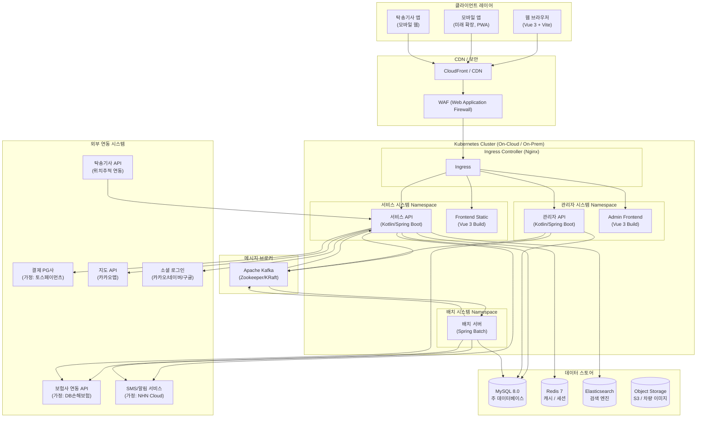
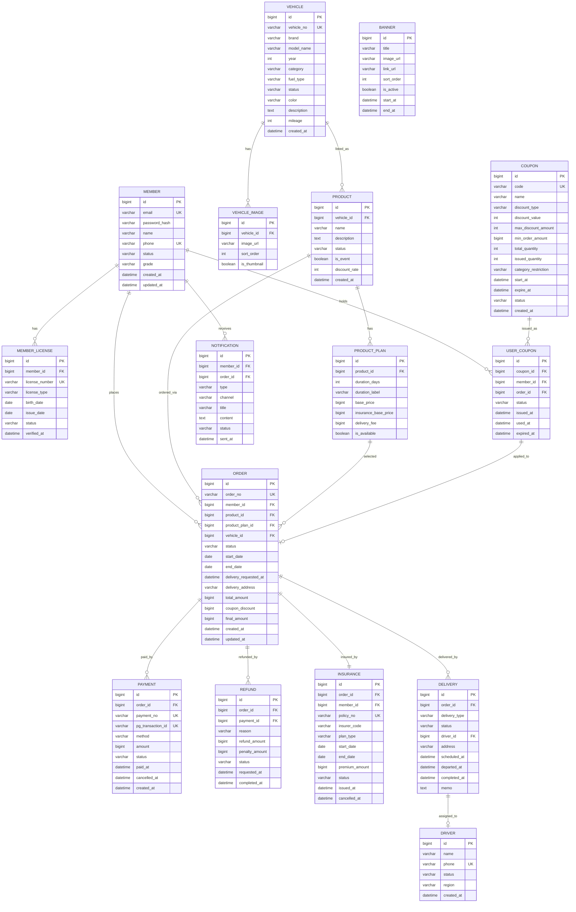

> **프로젝트명**: 프리카(FreeCar) 자동차 구독 이커머스 플랫폼
> **문서 버전**: v1.0
> **작성일**: 2026-09-18
> **작성자**: 수석 IT 컨설턴트 / SA

---

# 문서 2. 기술 규격서 (기술 아키텍처)

## 2.1 전체 시스템 아키텍처 다이어그램



---

## 2.2 기술 스택 상세 및 선정 이유

| 레이어 | 기술 | 버전 (가정) | 선정 이유 |
|---|---|---|---|
| **Frontend** | Vue.js + Vite | Vue 3.4 / Vite 5.x | 컴포넌트 기반 개발, Composition API로 코드 재사용성 향상. Vite는 빠른 빌드/HMR |
| **Frontend 상태관리** | Pinia | 2.x | Vuex 대비 경량, TypeScript 친화적, Composition API 호환 |
| **Frontend 라우팅** | Vue Router | 4.x | SPA 라우팅, Navigation Guard로 인증 처리 |
| **Backend API** | Kotlin + Spring Boot | Kotlin 1.9 / Spring Boot 3.x | JVM 생태계 활용, 간결한 코드, Spring 생태계(Security, Data JPA, Validation) 활용 |
| **배치** | Spring Batch | 5.x | Job/Step 모델, Chunk 처리, 재시작/스킵 기능, Spring Boot와 동일 생태계 |
| **ORM** | Spring Data JPA + QueryDSL | — | 복잡한 동적 쿼리는 QueryDSL, 기본 CRUD는 JPA |
| **RDB** | MySQL | 8.0 (**가정사항**) | 국내 서비스 레퍼런스 풍부, 트랜잭션 안정성, JSON 컬럼 지원 |
| **캐시** | Redis | 7.x (**가정사항**) | 세션 관리, 상품 캐싱, 분산락(Redisson), 실시간 재고 상태 |
| **검색** | Elasticsearch | 8.x (**가정사항**) | 차량 상품 full-text 검색, 필터/정렬 성능 |
| **메시징** | Apache Kafka | 3.x | 주문-보험-배송-회수 비동기 이벤트, 서비스 간 결합도 감소 |
| **컨테이너** | Docker | 24.x | 환경 일관성, CI/CD 이미지 배포 표준 |
| **오케스트레이션** | Kubernetes (k8s) | 1.29 | 자동 스케일링, 무중단 배포, 서비스 디스커버리 |
| **CI/CD** | GitHub Actions + ArgoCD | — (**가정사항**) | GitHub Actions로 빌드/테스트, ArgoCD로 GitOps 기반 k8s 배포 |
| **API Gateway** | Spring Cloud Gateway | — | 인증/라우팅/로드밸런싱 (향후 MSA 전환 시 적용) |
| **모니터링** | Prometheus + Grafana | — (**가정사항**) | 메트릭 수집, 대시보드 시각화 |
| **로그** | EFK (Elasticsearch + Fluentd + Kibana) | — (**가정사항**) | 중앙화 로그 수집 및 검색 |
| **PG** | 토스페이먼츠 | — (**가정사항**) | 국내 점유율 높음, 웹훅 지원 양호, 결제 취소/환불 API 안정적 |

---

## 2.3 MSA/모듈 분할 전략

> **가정사항**: 초기 런칭은 **모듈러 모놀리스** 형태로 진행하되, 도메인 경계를 명확히 분리하여 추후 MSA 전환을 용이하게 설계. Spring Boot 멀티모듈 구조 채택.

### 도메인 서비스 분리안

| 도메인 서비스 | 주요 책임 | 핵심 엔티티 | Phase |
|---|---|---|---|
| **auth-service** | 회원가입, 로그인, JWT 발급, 소셜 로그인 | Member, Token | MVP |
| **member-service** | 회원 정보 관리, 등급 관리, 면허 정보 | Member, MemberGrade, License | MVP |
| **vehicle-service** | 차량 정보 관리, 재고 상태 관리 | Vehicle, VehicleStock | MVP |
| **product-service** | 이용권 상품 구성, 카테고리, 요금 정책 | Product, ProductPlan, Category | MVP |
| **order-service** | 주문 생성, 상태 관리, 취소 | Order, OrderItem | MVP |
| **payment-service** | 결제, 환불, PG 연동 | Payment, Refund | MVP |
| **insurance-service** | 보험 가입 요청, 상태 관리, 해지 | Insurance, InsurancePlan | MVP |
| **delivery-service** | 배송/회수 스케줄, 기사 배정, 위치 추적 | Delivery, Driver, TrackingLog | MVP |
| **coupon-service** | 쿠폰 발급, 사용, 만료 | Coupon, UserCoupon | MVP |
| **notification-service** | SMS, 이메일, 앱푸시 알림 발송 | Notification, NotificationTemplate | MVP |
| **settlement-service** | 정산 계산, 정산 내역 관리 | Settlement, SettlementDetail | Phase 2 |
| **review-service** | 리뷰 등록, 관리, 평점 집계 | Review, ReviewImage | Phase 2 |
| **search-service** | ES 기반 상품 검색, 추천 | — | Phase 2 |

---

## 2.4 데이터베이스 설계 개요 및 ERD



---

## 2.5 API 설계 원칙 및 대표 API 명세

### 2.5.1 API 설계 원칙

- **RESTful 설계**: 자원(Resource) 중심 URL, HTTP 메서드로 행위 표현
- **URL 규칙**: `/api/v1/{resource}/{id}` 형태, 소문자 kebab-case
- **인증**: JWT Bearer Token (`Authorization: Bearer {token}`)
- **공통 응답 포맷**: 아래 표준 형식 준수
- **페이지네이션**: Cursor 기반 또는 Offset 기반 (상황에 따라 선택)
- **에러 코드**: 시스템 공통 에러코드 체계 적용 (`ERR-001` 형식)

#### 공통 응답 포맷

```json
{
  "success": true,
  "code": "SUCCESS",
  "message": "요청이 성공적으로 처리되었습니다.",
  "data": { ... },
  "timestamp": "2026-09-18T12:00:00+09:00"
}

// 에러 응답
{
  "success": false,
  "code": "ERR-ORDER-001",
  "message": "재고가 부족합니다.",
  "data": null,
  "timestamp": "2026-09-18T12:00:00+09:00"
}
```

---

### 2.5.2 핵심 API 명세 (최소 10개)

#### API-01. 상품(이용권) 목록 조회

```
GET /api/v1/products?category=ELECTRIC&sort=POPULAR&page=0&size=8
Authorization: (선택사항)
```

**Response 200**
```json
{
  "success": true,
  "code": "SUCCESS",
  "data": {
    "content": [
      {
        "productId": 1001,
        "vehicleId": 501,
        "name": "테슬라 Model 3 롱레인지",
        "category": "ELECTRIC",
        "thumbnail": "https://cdn.freeca.kr/vehicles/501/thumb.jpg",
        "brand": "Tesla",
        "modelName": "Model 3",
        "year": 2025,
        "minPrice": 60000,
        "plans": [
          { "durationDays": 7, "durationLabel": "7일", "basePrice": 840000 },
          { "durationDays": 30, "durationLabel": "1개월", "basePrice": 2850000 }
        ],
        "discountRate": 0,
        "isEvent": false,
        "reviewCount": 45,
        "avgRating": 4.7
      }
    ],
    "totalElements": 32,
    "totalPages": 4,
    "currentPage": 0
  }
}
```

---

#### API-02. 상품 상세 조회

```
GET /api/v1/products/{productId}
```

**Response 200**
```json
{
  "success": true,
  "code": "SUCCESS",
  "data": {
    "productId": 1001,
    "vehicle": {
      "vehicleId": 501,
      "vehicleNo": "12가3456",
      "brand": "Tesla",
      "modelName": "Model 3",
      "year": 2025,
      "category": "ELECTRIC",
      "fuelType": "ELECTRIC",
      "color": "Pearl White",
      "mileage": 12000,
      "description": "...",
      "images": [
        { "imageUrl": "https://cdn.freeca.kr/vehicles/501/img1.jpg", "isThumb": true }
      ]
    },
    "plans": [
      {
        "planId": 201,
        "durationDays": 7,
        "durationLabel": "7일",
        "basePrice": 840000,
        "insuranceBasePrice": 105000,
        "deliveryFee": 0,
        "totalPrice": 945000
      }
    ],
    "isAvailable": true
  }
}
```

---

#### API-03. 이용권 구매 (주문 생성)

```
POST /api/v1/orders
Authorization: Bearer {token}
Content-Type: application/json
```

**Request Body**
```json
{
  "productId": 1001,
  "planId": 201,
  "startDate": "2026-10-01",
  "deliveryAddress": "서울시 강남구 테헤란로 123, 101호",
  "deliveryScheduledAt": "2026-10-01T10:00:00",
  "insurancePlanType": "PREMIUM",
  "couponId": 55,
  "paymentMethod": "CARD"
}
```

**Response 201**
```json
{
  "success": true,
  "code": "SUCCESS",
  "data": {
    "orderId": 9001,
    "orderNo": "FC-20261001-000001",
    "status": "PAYMENT_PENDING",
    "finalAmount": 1260000,
    "couponDiscount": 50000,
    "pgClientKey": "client_key_from_pg",
    "pgOrderId": "pg-order-9001"
  }
}
```

---

#### API-04. 결제 승인 요청

```
POST /api/v1/payments/confirm
Authorization: Bearer {token}
Content-Type: application/json
```

**Request Body**
```json
{
  "orderId": 9001,
  "pgPaymentKey": "5EnNZRJGvaBX7zk2yd8ydw26XvwXMDJ1CMSPHpTb26drNLbpnBBnHFa8Cka",
  "amount": 1260000
}
```

**Response 200**
```json
{
  "success": true,
  "code": "SUCCESS",
  "data": {
    "paymentId": 8001,
    "paymentNo": "PAY-20261001-000001",
    "status": "PAID",
    "paidAt": "2026-10-01T10:05:30+09:00"
  }
}
```

---

#### API-05. 보험 가입 상태 조회

```
GET /api/v1/orders/{orderId}/insurance
Authorization: Bearer {token}
```

**Response 200**
```json
{
  "success": true,
  "code": "SUCCESS",
  "data": {
    "insuranceId": 7001,
    "orderId": 9001,
    "status": "ACTIVE",
    "policyNo": "DB-2026-0100001",
    "insurerCode": "DB_손해보험",
    "planType": "PREMIUM",
    "startDate": "2026-10-01",
    "endDate": "2026-10-08",
    "premiumAmount": 147000,
    "issuedAt": "2026-10-01T10:06:00+09:00"
  }
}
```

---

#### API-06. 배송 예약 조회

```
GET /api/v1/orders/{orderId}/delivery
Authorization: Bearer {token}
```

**Response 200**
```json
{
  "success": true,
  "code": "SUCCESS",
  "data": {
    "deliveryId": 6001,
    "deliveryType": "DELIVERY",
    "status": "SCHEDULED",
    "driver": {
      "driverId": 301,
      "name": "홍길동",
      "phone": "010-1234-5678"
    },
    "address": "서울시 강남구 테헤란로 123",
    "scheduledAt": "2026-10-01T10:00:00+09:00",
    "trackingUrl": "https://track.freeca.kr/6001"
  }
}
```

---

#### API-07. 환불 신청

```
POST /api/v1/orders/{orderId}/refunds
Authorization: Bearer {token}
Content-Type: application/json
```

**Request Body**
```json
{
  "reason": "개인 사정으로 인한 취소",
  "reasonDetail": "출장 일정이 변경되었습니다."
}
```

**Response 201**
```json
{
  "success": true,
  "code": "SUCCESS",
  "data": {
    "refundId": 5001,
    "orderId": 9001,
    "status": "PROCESSING",
    "refundAmount": 630000,
    "penaltyAmount": 630000,
    "expectedCompletedAt": "2026-10-05T00:00:00+09:00"
  }
}
```

---

#### API-08. 쿠폰 적용 가능 여부 확인

```
POST /api/v1/coupons/validate
Authorization: Bearer {token}
Content-Type: application/json
```

**Request Body**
```json
{
  "couponId": 55,
  "productId": 1001,
  "planId": 201,
  "orderAmount": 1260000
}
```

**Response 200**
```json
{
  "success": true,
  "code": "SUCCESS",
  "data": {
    "isValid": true,
    "discountAmount": 50000,
    "finalAmount": 1210000,
    "message": "쿠폰이 적용되었습니다."
  }
}
```

---

#### API-09. 내 이용권 목록 조회 (마이페이지)

```
GET /api/v1/mypage/subscriptions?status=ACTIVE&page=0&size=10
Authorization: Bearer {token}
```

**Response 200**
```json
{
  "success": true,
  "code": "SUCCESS",
  "data": {
    "content": [
      {
        "orderId": 9001,
        "orderNo": "FC-20261001-000001",
        "status": "IN_USE",
        "vehicle": {
          "brand": "Tesla",
          "modelName": "Model 3",
          "thumbnail": "https://cdn.freeca.kr/vehicles/501/thumb.jpg"
        },
        "startDate": "2026-10-01",
        "endDate": "2026-10-08",
        "daysRemaining": 5,
        "insurance": { "status": "ACTIVE", "planType": "PREMIUM" }
      }
    ],
    "totalElements": 1
  }
}
```

---

#### API-10. 회원가입

```
POST /api/v1/auth/register
Content-Type: application/json
```

**Request Body**
```json
{
  "email": "user@example.com",
  "password": "P@ssw0rd!",
  "name": "김현준",
  "phone": "01012345678",
  "birthDate": "1994-05-15",
  "licenseNumber": "11-AB-123456-78",
  "licenseType": "FIRST_CLASS_REGULAR",
  "licenseIssueDate": "2016-03-20",
  "agreeTerms": true,
  "agreePrivacy": true,
  "agreeMarketing": false
}
```

**Response 201**
```json
{
  "success": true,
  "code": "SUCCESS",
  "data": {
    "memberId": 1001,
    "email": "user@example.com",
    "name": "김현준",
    "grade": "FREE",
    "welcomeCouponIssued": true,
    "accessToken": "eyJhbGciOiJIUzI1NiJ9...",
    "refreshToken": "rt_abc123..."
  }
}
```

---

#### API-11. 찜하기 / 찜 해제

```
POST /api/v1/products/{productId}/wishlist    # 찜하기
DELETE /api/v1/products/{productId}/wishlist  # 찜 해제
Authorization: Bearer {token}
```

**Response 200**
```json
{
  "success": true,
  "code": "SUCCESS",
  "data": { "isWishlisted": true, "wishlistCount": 123 }
}
```

---

#### API-12. 차량 검색

```
GET /api/v1/search/products?q=테슬라&category=ELECTRIC&minPrice=0&maxPrice=1000000&sort=POPULAR
```

**Response 200**
```json
{
  "success": true,
  "code": "SUCCESS",
  "data": {
    "query": "테슬라",
    "content": [ /* 상품 목록 */ ],
    "totalElements": 8,
    "took": 12
  }
}
```

---

## 2.6 Kafka 토픽 설계

### 2.6.1 토픽 목록

| 토픽명 | 파티션 수 | 복제 계수 | 프로듀서 | 컨슈머 | 설명 |
|---|---|---|---|---|---|
| `order.created` | 6 | 3 | order-service | insurance-service, notification-service | 주문 결제 완료 이벤트 |
| `insurance.requested` | 6 | 3 | insurance-service | batch(보험가입처리) | 보험가입 요청 이벤트 |
| `insurance.completed` | 6 | 3 | batch | order-service, delivery-service, notification-service | 보험가입 완료 이벤트 |
| `insurance.failed` | 3 | 3 | batch | order-service, payment-service | 보험가입 실패 (보상 트랜잭션) |
| `delivery.scheduled` | 6 | 3 | delivery-service | notification-service, driver-app | 배송 예약 완료 |
| `delivery.started` | 3 | 3 | driver-app/delivery-service | notification-service | 배송 출발 이벤트 |
| `delivery.completed` | 6 | 3 | driver-app/delivery-service | order-service, notification-service | 차량 인도 완료 |
| `vehicle.returned` | 6 | 3 | driver-app/delivery-service | order-service, vehicle-service, notification-service | 차량 회수 완료 |
| `refund.requested` | 3 | 3 | order-service | payment-service, insurance-service | 환불 요청 |
| `refund.completed` | 3 | 3 | payment-service | order-service, notification-service | 환불 완료 |
| `coupon.expired` | 3 | 3 | batch(쿠폰만료) | notification-service | 쿠폰 만료 처리 |
| `subscription.expiring` | 3 | 3 | batch(만료예정) | notification-service, delivery-service | 이용권 만료 D-3/D-1 알림 |

### 2.6.2 이벤트 페이로드 예시

#### `order.created`
```json
{
  "eventId": "evt-uuid-001",
  "eventType": "ORDER_CREATED",
  "occurredAt": "2026-10-01T10:05:30+09:00",
  "payload": {
    "orderId": 9001,
    "orderNo": "FC-20261001-000001",
    "memberId": 1001,
    "productId": 1001,
    "vehicleId": 501,
    "planId": 201,
    "startDate": "2026-10-01",
    "endDate": "2026-10-08",
    "durationDays": 7,
    "insurancePlanType": "PREMIUM",
    "memberInfo": {
      "name": "김현준",
      "licenseNumber": "11-AB-123456-78",
      "licenseType": "FIRST_CLASS_REGULAR",
      "birthDate": "1994-05-15"
    },
    "finalAmount": 1260000
  }
}
```

#### `insurance.completed`
```json
{
  "eventId": "evt-uuid-002",
  "eventType": "INSURANCE_COMPLETED",
  "occurredAt": "2026-10-01T10:08:00+09:00",
  "payload": {
    "orderId": 9001,
    "insuranceId": 7001,
    "policyNo": "DB-2026-0100001",
    "insurerCode": "DB_손해보험",
    "status": "ACTIVE",
    "startDate": "2026-10-01",
    "endDate": "2026-10-08",
    "premiumAmount": 147000
  }
}
```

#### `delivery.scheduled`
```json
{
  "eventId": "evt-uuid-003",
  "eventType": "DELIVERY_SCHEDULED",
  "occurredAt": "2026-10-01T10:09:00+09:00",
  "payload": {
    "deliveryId": 6001,
    "orderId": 9001,
    "deliveryType": "DELIVERY",
    "driverId": 301,
    "address": "서울시 강남구 테헤란로 123",
    "scheduledAt": "2026-10-01T10:00:00",
    "memberPhone": "01012345678"
  }
}
```

#### `vehicle.returned`
```json
{
  "eventId": "evt-uuid-004",
  "eventType": "VEHICLE_RETURNED",
  "occurredAt": "2026-10-08T14:30:00+09:00",
  "payload": {
    "orderId": 9001,
    "vehicleId": 501,
    "driverId": 301,
    "returnedAt": "2026-10-08T14:30:00+09:00",
    "vehicleCondition": "NORMAL",
    "mileageAfter": 12450,
    "damageReported": false
  }
}
```

---

## 2.7 인프라 아키텍처

### 2.7.1 Docker 이미지 구성

| 이미지명 | Base 이미지 | 빌드 결과물 | 포트 |
|---|---|---|---|
| `freeca/service-api` | `eclipse-temurin:21-jre` | Spring Boot JAR | 8080 |
| `freeca/admin-api` | `eclipse-temurin:21-jre` | Spring Boot JAR | 8081 |
| `freeca/batch` | `eclipse-temurin:21-jre` | Spring Batch JAR | 없음 |
| `freeca/service-front` | `nginx:alpine` | Vue 3 빌드 결과물 | 80 |
| `freeca/admin-front` | `nginx:alpine` | Vue 3 Admin 빌드 결과물 | 80 |

### 2.7.2 Kubernetes 클러스터 구조

```yaml
# 가정: GKE 또는 EKS 기반 관리형 쿠버네티스

Namespaces:
  - freeca-service      # 서비스 시스템
  - freeca-admin        # 관리자 시스템
  - freeca-batch        # 배치 시스템
  - freeca-infra        # Kafka, Redis, MySQL (또는 외부 관리형 서비스)
  - monitoring          # Prometheus, Grafana
  - logging             # EFK Stack

# 서비스 시스템 (freeca-service)
Deployments:
  - service-api-deployment    # replicas: 3 (HPA: min 2, max 10)
  - service-front-deployment  # replicas: 2

Services:
  - service-api-svc           # ClusterIP
  - service-front-svc         # ClusterIP

HPA:
  - service-api-hpa           # CPU 70% 트리거

# Ingress
Ingress (nginx-ingress):
  - freeca.kr           → service-front-svc
  - api.freeca.kr       → service-api-svc
  - admin.freeca.kr     → admin-front-svc
  - admin-api.freeca.kr → admin-api-svc
  TLS: cert-manager (Let's Encrypt)
```

### 2.7.3 CI/CD 파이프라인 개요

```
[개발자 Push/PR]
     │
     ▼
[GitHub Actions — CI]
  1. Lint (ktlint, eslint)
  2. Unit Test (./gradlew test)
  3. Build (./gradlew build)
  4. Docker 이미지 빌드
  5. 이미지 Push (GitHub Container Registry / ECR)
     │
     ▼
[ArgoCD — CD (GitOps)]
  6. K8s 매니페스트 저장소 자동 이미지 태그 업데이트 (PR)
  7. ArgoCD Sync → k8s 클러스터 배포
  8. 헬스체크 / 롤백
```

---

## 2.8 비기능 요구사항

| 항목 | 요구사항 | 목표 수치 |
|---|---|---|
| **성능 — 응답시간** | 상품 목록/상세 API P95 응답시간 | ≤ 300ms |
| **성능 — 처리량** | 초당 동시 주문 처리 | ≥ 100 TPS |
| **가용성** | 서비스 시스템 연간 가용성 | 99.9% (≈ 8.7시간/년 다운타임) |
| **확장성** | 트래픽 3배 급증 시 자동 스케일아웃 | HPA 5분 이내 대응 |
| **보안 — 인증** | JWT + Refresh Token (RTR 전략) | AccessToken 만료: 30분 |
| **보안 — 통신** | 전 구간 TLS 1.2 이상 | 필수 |
| **보안 — 개인정보** | 주민번호 동급 정보 암호화 저장 | AES-256 |
| **보안 — 결제정보** | PAN(카드번호) 비저장, PCI-DSS 준수 | 토큰화 처리 |
| **개인정보** | 개인정보보호법 준수, 면허정보 암호화 | AES-256 + 접근 로그 |
| **로그** | 모든 API 요청/응답 로그 수집 | EFK 스택 |
| **모니터링** | 메트릭 수집 및 알람 | Prometheus + Grafana |
| **DR(재해복구)** | RTO ≤ 4시간, RPO ≤ 1시간 | MySQL 리플리케이션 + 스냅샷 |

---
