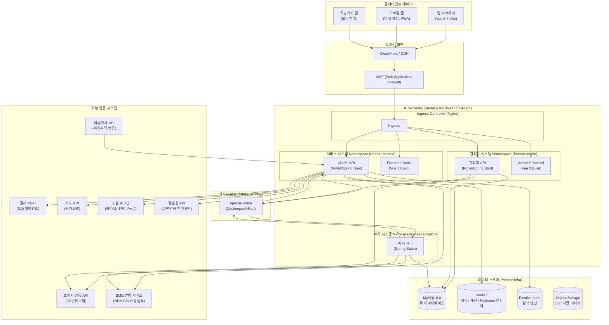

> **프로젝트명**: 프리카(FreeCar) 자동차 구독 이커머스 플랫폼
> **문서 버전**: v1.1 (DB 및 API 실무 프로덕션 수준 전면 고도화)
> **작성일**: 2026-09-18
> **작성자**: 수석 IT 컨설턴트 / SA

---

# 문서 2. 기술 규격서 (기술 아키텍처)

## 2.1 전체 시스템 아키텍처 다이어그램



---

## 2.2 기술 스택 상세 및 선정 이유

| 레이어 | 기술 | 버전 | 선정 이유 |
|---|---|---|---|
| **Frontend** | Vue.js + Vite | Vue 3.4 / Vite 5.x | 컴포넌트 기반 개발, Composition API로 비즈니스 로직 재사용성 향상. Vite의 빠른 HMR 및 번들링 |
| **Frontend 상태관리** | Pinia | 2.x | Vuex 대비 경량, 완전한 TypeScript 지원, Pinia 플러그인을 통한 로컬 스토리지 동기화 용이 |
| **Frontend 라우팅** | Vue Router | 4.x | SPA 라우팅 지원, Navigation Guard 기반 인증/면허 등록 체크 |
| **Backend API** | Kotlin + Spring Boot | Kotlin 1.9 / Spring Boot 3.x | 간결한 문법(Null Safety), Spring Data JPA/Security/Validation 풍부한 생태계 활용 |
| **분산락** | Redisson | 3.x | Redis 기반 분산락(@DistributedLock AOP)으로 멀티 Pod 환경에서 차량 예약 동시성 완벽 제어 |
| **배치** | Spring Batch | 5.x | Job/Step 청크(Chunk) 지향 처리, 실패 시 재시작 및 멱등성 보장, 대용량 만료/정산 자동화 |
| **ORM** | Spring Data JPA + QueryDSL | 5.x | 정적 타입 기반 동적 검색 쿼리 작성, N+1 방지 Fetch Join 최적화 |
| **RDB** | MySQL | 8.0 | InnoDB 엔진의 외래키 및 트랜잭션 무결성 보장, JSON 스냅샷 컬럼 지원 |
| **캐시/세션** | Redis | 7.x | 상품/플랜 데이터 캐싱, 토큰 블랙리스트, 장바구니 세션 보조 |
| **검색** | Elasticsearch | 8.x | 브랜드, 모델, 차종, 가격대 N-gram 기반 Full-Text 검색 및 집계 |
| **메시징** | Apache Kafka | 3.x | Saga 패턴 기반 주문-결제-보험-배송 간 완전한 비동기 이벤트 분리 및 높은 처리량 |
| **컨테이너/배포** | Docker + Kubernetes | Docker 24+ / k8s 1.29 | 컨테이너 표준화, HPA 자동 오토스케일링, RollingUpdate 무중단 배포 |
| **CI/CD** | GitHub Actions + ArgoCD | GitOps | 브랜치 푸시 시 자동 테스트/빌드 후 매니페스트 저장소 PR 기반 배포 |
| **결제(PG)** | 토스페이먼츠 | 최신 v1/v2 | 결제위젯 지원, 카드/간편결제 통합 승인, 가상계좌 웹훅, 완벽한 취소/환불 API |

---

## 2.3 MSA/모듈 분할 전략

초기 런칭은 **Spring Boot 멀티모듈 기반의 모듈러 모놀리스**로 운영하며, 도메인 패키지 경계를 명확히 설정하여 추후 트래픽 증가 시 독립적인 마이크로서비스(MSA)로 무중단 분리가 가능하도록 설계합니다.

| 도메인 서비스 | 주요 책임 | 핵심 엔티티 | MVP/Phase |
|---|---|---|---|
| **auth-service** | 회원가입, 로그인, JWT(Access/Refresh) 발급, 본인인증 | Member, Token | MVP |
| **member-service** | 회원 정보, 회원 등급, 운전면허 진위확인 | Member, MemberLicense | MVP |
| **vehicle-service** | 실물 차량 제원, 등록번호, 주행거리, 거점 차고지, 차량 상태 | Vehicle, VehicleSpec, VehicleImage | MVP |
| **product-service** | 구독 이용권 상품, 기간별 요금 플랜(7일~12개월), 카테고리 | Product, ProductPlan | MVP |
| **cart-service** | 장바구니 담기, 옵션 변경, 선택 체크, 실시간 합계 금액 산정 | Cart, CartItem | MVP |
| **coupon-service** | 정률/정액 쿠폰 발급, 사용, 주문 전 할인액 실시간 시뮬레이션 | Coupon, UserCoupon, OrderCoupon | MVP |
| **order-service** | 주문서 생성, Redisson 분산락 재고 선점, 주문항목 스냅샷 | Order, OrderItem, OrderStatusHistory | MVP |
| **payment-service** | PG 결제창 파라미터 발행, 결제 최종 승인, 결제 취소/환불 | Payment, Refund | MVP |
| **insurance-service** | 단기 의무/종합보험 자동 가입 요청, 증권번호 관리, 보험 해지 | Insurance, InsurancePolicy | MVP |
| **delivery-service** | 차량 탁송 및 만료 회수 스케줄링, 기사 자동 배정, 위치 관제 | Delivery, Driver | MVP |
| **notification-service** | 카카오 알림톡, SMS, 앱 푸시 알림 발송 및 이력 관리 | Notification, NotificationTemplate | MVP |
| **settlement-service** | 일별/월별 매출 집계, PG 수수료 정산, 보험료 대사 | Settlement, DailySettlement | Phase 2 |

---

## 2.4 데이터베이스 설계 개요 및 ERD

```mermaid
erDiagram
    MEMBER ||--o{ MEMBER_LICENSE : "면허등록"
    MEMBER ||--o| CART : "장바구니보유"
    MEMBER ||--o{ USER_COUPON : "쿠폰보유"
    MEMBER ||--o{ ORDER : "주문수행"
    MEMBER ||--o{ NOTIFICATION : "알림수신"

    CART ||--o{ CART_ITEM : "담긴아이템"

    VEHICLE ||--o| VEHICLE_SPEC : "제원옵션보유"
    VEHICLE ||--o{ VEHICLE_IMAGE : "차량이미지"
    VEHICLE ||--o{ PRODUCT : "상품매핑"
    VEHICLE ||--o{ ORDER_ITEM : "배정실물"

    PRODUCT ||--o{ PRODUCT_PLAN : "구독플랜"
    PRODUCT ||--o{ CART_ITEM : "담긴상품참조"
    PRODUCT ||--o{ ORDER_ITEM : "주문상품참조"

    PRODUCT_PLAN ||--o{ CART_ITEM : "선택플랜"
    PRODUCT_PLAN ||--o{ ORDER_ITEM : "체결플랜"

    COUPON ||--o{ USER_COUPON : "발급이력"
    USER_COUPON ||--o| ORDER_COUPON : "사용스냅샷"

    ORDER ||--o{ ORDER_ITEM : "주문상세항목"
    ORDER ||--o{ ORDER_STATUS_HISTORY : "상태전이이력"
    ORDER ||--o| ORDER_COUPON : "적용쿠폰스냅샷"
    ORDER ||--o{ PAYMENT : "결제승인내역"
    ORDER ||--o{ REFUND : "취소환불내역"
    ORDER ||--o{ INSURANCE : "보험계약체결"
    ORDER ||--o{ DELIVERY : "탁송회수스케줄"

    DELIVERY ||--o| DRIVER : "기사배정"

    MEMBER {
        bigint id PK "회원 고유 식별자"
        varchar email UK "로그인 이메일"
        varchar password_hash "BCrypt 암호화 해시"
        varchar name "회원 실명"
        varchar phone UK "휴대전화번호"
        varchar ci UK "본인인증 연계정보 (CI)"
        varchar di "본인인증 중복가입확인정보 (DI)"
        date birth_date "생년월일 (YYYY-MM-DD)"
        varchar gender "성별 (MALE, FEMALE)"
        varchar zipcode "기본 배송지 우편번호"
        varchar base_address "기본 배송지 도로명주소"
        varchar detail_address "기본 배송지 상세주소"
        varchar status "회원 상태 (ACTIVE, SUSPENDED, WITHDRAWN)"
        varchar grade "회원 등급 (FREE, SILVER, GOLD, PLATINUM)"
        bigint point_balance "보유 포인트/적립금 잔액"
        boolean marketing_agree "마케팅 정보 수신동의 여부"
        varchar suspended_reason "계정 정지 사유"
        datetime last_login_at "최근 로그인 일시"
        datetime withdrawn_at "회원 탈퇴 일시"
        datetime created_at "가입 일시"
        datetime updated_at "수정 일시"
    }

    MEMBER_LICENSE {
        bigint id PK "면허 정보 고유 식별자"
        bigint member_id FK,UK "회원 식별자"
        varchar license_number UK "면허증 번호 (암호화)"
        varchar license_type "면허 종별 (1종보통, 2종보통, 1종대형)"
        date birth_date "면허증 상 생년월일"
        date issue_date "면허 최초/재발급 일자"
        date aptitude_test_end_date "적성검사/갱신 만료일자"
        varchar verify_status "진위확인 상태 (UNVERIFIED, VERIFIED, REJECTED, EXPIRED)"
        varchar verify_code "경찰청 연계 진위확인 검증일련값"
        varchar reject_reason "면허 진위확인 실패/반려 사유"
        datetime verified_at "진위 검증 완료 일시"
        datetime created_at "등록 일시"
        datetime updated_at "수정 일시"
    }

    VEHICLE {
        bigint id PK "차량 실물 고유 식별자"
        varchar vehicle_no UK "차량 번호판 (예: 12가 3456)"
        varchar vin UK "차대번호 (17자리)"
        varchar brand "제조사 (현대, 기아, 제네시스, 테슬라, 포르쉐 등)"
        varchar model_name "차량 모델명"
        varchar trim_name "세부 트림명"
        int model_year "연식 (예: 2025)"
        varchar category "차종 (ELECTRIC, SPORTS, LUXURY, SUV, MINIVAN)"
        varchar fuel_type "연료 (EV, GASOLINE, DIESEL, HYBRID)"
        int displacement "배기량 (cc, EV는 0)"
        decimal battery_capacity "배터리 용량 (kWh)"
        int driving_range "1회 충전/주유 주행가능거리 (km)"
        varchar transmission "변속기 (AUTO, MANUAL)"
        varchar drive_type "구동방식 (2WD, AWD)"
        int seating_capacity "승차 정원"
        varchar exterior_color "외장 색상명"
        varchar interior_color "내장 시트 색상명"
        decimal fuel_efficiency "복합 연비 (km/l 또는 km/kWh)"
        int mileage "현재 누적 주행거리 (km)"
        varchar obd_device_id "차량 원격 OBD 관제 단말기 ID"
        varchar gps_device_id "실시간 GPS 단말기 ID"
        varchar hipass_card_no "하이패스 단말기 일련번호"
        varchar status "차량 상태 (AVAILABLE, RESERVED, IN_USE, MAINTENANCE, RETIRED)"
        varchar location_address "현재 보관 차고지 거점 주소"
        varchar registration_doc_url "자동차등록증 사본 CDN URL"
        date last_maintenance_date "최근 정기점검 완료일"
        date next_maintenance_date "다음 정기점검 예정일"
        datetime created_at "차량 등록 일시"
        datetime updated_at "차량 정보 수정 일시"
    }

    VEHICLE_SPEC {
        bigint id PK "차량 옵션 제원 고유 식별자"
        bigint vehicle_id FK,UK "차량 식별자"
        boolean has_smart_cruise "어댑티브 스마트 크루즈 컨트롤 유무"
        boolean has_around_view "360도 서라운드 뷰 모니터 유무"
        boolean has_hud "헤드업 디스플레이 (HUD) 유무"
        boolean has_ventilated_seat "1열 통풍 시트 유무"
        boolean has_heated_seat "열선 시트 유무"
        boolean has_sunroof "선루프 장착 유무"
        boolean has_built_in_cam "빌트인 캠 / 블랙박스 유무"
        varchar sound_system "프리미엄 오디오 시스템 브랜드"
        int wheel_inch "알로이 휠 크기 (인치)"
        varchar tire_condition "타이어 상태 (GOOD, FAIR, REPLACE)"
        datetime created_at "등록 일시"
        datetime updated_at "수정 일시"
    }

    VEHICLE_IMAGE {
        bigint id PK "차량 이미지 식별자"
        bigint vehicle_id FK "차량 식별자"
        varchar image_type "부위 구분 (THUMBNAIL, FRONT, REAR, SIDE, INTERIOR, DASHBOARD)"
        varchar image_url "CDN 고화질 원본 이미지 URL"
        varchar thumb_url "CDN 썸네일 압축 이미지 URL"
        int sort_order "화면 노출 정렬 순서"
        boolean is_primary "대표 메인 이미지 여부"
        datetime created_at "업로드 일시"
    }

    PRODUCT {
        bigint id PK "구독 상품 고유 식별자"
        bigint vehicle_id FK "매핑 실물 차량 식별자"
        varchar title "상품 노출 제목"
        varchar summary "상품 한줄 소개 요약"
        text description "상품 상세 소개 설명 (Markdown/HTML)"
        varchar category "카테고리 구분"
        bigint view_count "누적 상품 상세 조회수"
        int wish_count "누적 고객 찜하기 횟수"
        varchar status "상품 판매 상태 (ON_SALE, RESERVED, HIDDEN)"
        boolean is_featured "메인 페이지 추천 상품 노출 여부"
        datetime created_at "상품 등록 일시"
        datetime updated_at "상품 수정 일시"
    }

    PRODUCT_PLAN {
        bigint id PK "구독 기간 플랜 식별자"
        bigint product_id FK "구독 상품 식별자"
        int duration_days "구독 기간 일수 (7, 14, 30, 90, 180, 365)"
        varchar plan_name "플랜 표기명 (7일 체험권, 1개월 자유권 등)"
        bigint daily_base_rate "1일 환산 기본 대여료 (원)"
        bigint total_plan_amount "기간 총 차량 대여료 (원)"
        int discount_percentage "기간 할인율 (%)"
        int daily_mileage_limit "1일 기본 제공 주행거리 (km, 예: 100km)"
        int excess_mileage_fee_per_km "초과 주행거리 km당 과금 요율 (원/km)"
        bigint deposit_amount "구독 계약 보증금 (원, 반납 시 전액 환급)"
        bigint basic_insurance_daily_rate "기본보험 1일 요금 (원)"
        bigint premium_insurance_daily_rate "프리미엄보험 1일 요금 (원)"
        bigint delivery_fee "기본 왕복 탁송비 (원)"
        boolean is_roundtrip_delivery_free "왕복 무료 탁송 지원 프로모션 여부"
        boolean is_active "플랜 활성 여부"
    }

    CART {
        bigint id PK "장바구니 고유 식별자"
        bigint member_id FK,UK "소유 회원 식별자"
        datetime created_at "생성 일시"
        datetime updated_at "최근 수정 일시"
    }

    CART_ITEM {
        bigint id PK "장바구니 항목 식별자"
        bigint cart_id FK "장바구니 식별자"
        bigint product_id FK "상품 식별자"
        bigint product_plan_id FK "구독 기간 플랜 식별자"
        bigint vehicle_id FK "예약 대상 차량 식별자"
        varchar insurance_type "선택 보험 유형 (BASIC, PREMIUM)"
        date start_date "이용 시작 희망일자"
        date end_date "이용 종료 희망일자"
        int duration_days "이용 일수"
        varchar delivery_zipcode "탁송 도착지 우편번호"
        varchar delivery_address "탁송 도착지 도로명 기본주소"
        varchar delivery_detail_address "탁송 도착지 상세주소"
        datetime delivery_scheduled_at "차량 수령 희망 일시"
        varchar return_address "반납 희망 거점/주소 (편도 구독 지원)"
        boolean has_child_seat "부가옵션: 유아용 카시트 신청 여부"
        boolean has_hipass_rental "부가옵션: 후불 하이패스 카드 대여 여부"
        boolean is_checked "주문 대상 선택 체크 여부 (1:선택, 0:해제)"
        datetime item_expire_at "장바구니 담김 유효 만료 시각"
        datetime created_at "담은 일시"
        datetime updated_at "옵션 변경 일시"
    }

    COUPON {
        bigint id PK "쿠폰 템플릿 식별자"
        varchar code UK "쿠폰 고유 발급 코드 (예: WELCOME2026)"
        varchar name "쿠폰명"
        varchar discount_type "할인 유형 (PERCENTAGE:정률, FIXED_AMOUNT:정액)"
        int discount_value "할인 수치 (정률: %, 정액: 원)"
        bigint max_discount_amount "정률 할인 시 최대 감면 한도액 (원, NULL=무제한)"
        bigint min_order_amount "쿠폰 사용 가능 최소 주문 결제금액 (원)"
        varchar target_category "적용 가능 차종 (ALL, ELECTRIC, SPORTS, LUXURY, SUV)"
        varchar min_member_grade "사용 가능 최소 회원 등급"
        boolean is_duplicatable "타 쿠폰과 중복 적용 허용 여부"
        int total_issuable_qty "총 발행 한도 수량 (-1: 무제한)"
        int current_issued_qty "현재까지 누적 발급된 수량"
        int valid_duration_days "발급일 기준 유효 기간 일수"
        datetime start_at "쿠폰 사용 시작 가능 일시"
        datetime expire_at "쿠폰 운영 종료 일시"
        boolean is_active "쿠폰 활성 상태 여부"
        datetime created_at "쿠폰 생성 일시"
    }

    USER_COUPON {
        bigint id PK "회원 보유 쿠폰 식별자"
        bigint coupon_id FK "쿠폰 템플릿 식별자"
        bigint member_id FK "소유 회원 식별자"
        varchar status "쿠폰 상태 (AVAILABLE:사용가능, USED:사용완료, EXPIRED:기간만료)"
        datetime issued_at "회원 보관함 발급 일시"
        datetime used_at "실제 결제 사용 일시"
        datetime expired_at "쿠폰 사용 만료 일시"
        bigint used_order_id "사용 체결된 주문 식별자"
    }

    ORDER {
        bigint id PK "주문 고유 식별자"
        varchar order_no UK "주문번호 (FC-YYYYMMDD-XXXXXX)"
        bigint member_id FK "주문 회원 식별자"
        varchar order_status "주문 상태 (PAYMENT_PENDING, PAID, INSURANCE_PROCESSING, DELIVERY_SCHEDULED, IN_USE, RETURN_SCHEDULED, COMPLETED, CANCELLED, REFUNDED)"
        varchar order_title "주문 대표 타이틀명"
        bigint total_item_amount "차량 순수 대여료 합계 (원)"
        bigint total_insurance_amount "보험료 총합계 (원)"
        bigint total_delivery_fee "탁송/배송비 총합계 (원)"
        bigint total_addon_amount "부가서비스 옵션 합계 (원)"
        bigint total_deposit_amount "구독 계약 보증금 합계 (원)"
        bigint coupon_discount_amount "쿠폰 총 감면 할인액 (원)"
        bigint point_discount_amount "포인트/적립금 사용액 (원)"
        bigint final_payment_amount "최종 실결제 승인 금액 (원)"
        varchar orderer_name "주문 고객 성명"
        varchar orderer_phone "주문 고객 연락처"
        varchar recipient_name "차량 실제 수령인 성명"
        varchar recipient_phone "차량 실제 수령인 연락처"
        varchar recipient_emergency_phone "수령인 비상 연락처"
        varchar delivery_zipcode "탁송지 우편번호"
        varchar delivery_address "탁송지 도로명 기본주소"
        varchar delivery_detail_address "탁송지 상세주소"
        varchar delivery_memo "탁송 기사 전달 요청사항"
        datetime payment_due_at "주문 결제 유효 시한"
        datetime cancelled_at "주문 취소 일시"
        varchar cancel_reason "주문 취소 원인 사유"
        varchar order_ip "주문 인입 클라이언트 IP"
        datetime created_at "주문 생성 일시"
        datetime updated_at "주문 정보 수정 일시"
    }

    ORDER_ITEM {
        bigint id PK "주문 항목 상세 식별자"
        bigint order_id FK "주문 마스터 식별자"
        bigint product_id FK "상품 식별자"
        bigint product_plan_id FK "선택 플랜 식별자"
        bigint vehicle_id FK "배정 차량 식별자"
        json vehicle_snapshot "체결 시점 차량 제원/번호판/주행거리 JSON 스냅샷"
        varchar item_status "이용 상태 (ORDERED, PREPARING, IN_DELIVERY, IN_USE, RETURNING, RETURNED, CANCELLED)"
        date start_date "구독 시작 일자"
        date end_date "구독 종료 일자"
        datetime actual_return_at "실제 차량 반납 완료 일시"
        int duration_days "구독 이용 일수"
        bigint item_amount "해당 항목 차량 대여료 (원)"
        varchar insurance_type "보험 플랜 (BASIC, PREMIUM)"
        bigint insurance_amount "해당 항목 보험료 (원)"
        bigint delivery_fee "탁송료 (원)"
        bigint addon_fee "부가옵션 요금 (원)"
        bigint deposit_amount "보증금 (원)"
        int start_mileage "인수 시점 계기판 누적 주행거리 (km)"
        int end_mileage "반납 시점 계기판 누적 주행거리 (km)"
        int excess_mileage "약정 초과 주행거리 (km)"
        bigint excess_mileage_charge "초과 주행거리 추가 정산금 (원)"
        bigint fuel_settlement_charge "유류/충전 잔량 부족 정산금 (원)"
        bigint damage_charge "차량 파손 면책금/수리비 청구액 (원)"
        varchar return_zipcode "반납 회수지 우편번호"
        varchar return_address "반납 회수지 도로명주소"
        varchar return_detail_address "반납 회수지 상세주소"
        datetime created_at "항목 생성 일시"
    }

    ORDER_STATUS_HISTORY {
        bigint id PK "상태 전이 이력 식별자"
        bigint order_id FK "주문 식별자"
        varchar previous_status "전이 전 상태"
        varchar current_status "전이 후 상태"
        varchar change_reason "상태 변경 사유"
        varchar changed_by "상태 변경 주체 (SYSTEM, USER, ADMIN)"
        datetime created_at "상태 변경 발생 일시"
    }

    ORDER_COUPON {
        bigint id PK "주문 쿠폰 적용 스냅샷 식별자"
        bigint order_id FK,UK "주문 식별자"
        bigint user_coupon_id FK "사용한 회원 쿠폰 식별자"
        varchar coupon_code "적용 당시 쿠폰 코드"
        varchar coupon_name "적용 당시 쿠폰명"
        varchar discount_type "할인 유형 스냅샷 (PERCENTAGE, FIXED_AMOUNT)"
        int discount_value "할인율 또는 할인금액"
        bigint applied_discount_amount "실제 계산 감면된 할인금액 (원)"
        datetime applied_at "적용 체결 일시"
    }

    PAYMENT {
        bigint id PK "결제 마스터 고유 식별자"
        bigint order_id FK "주문 식별자"
        varchar payment_key UK "토스페이먼츠 PG 트랜잭션 고유키"
        varchar payment_method "결제 수단 (CARD, NAVER_PAY, KAKAO_PAY, TOSS_PAY, VIRTUAL_ACCOUNT)"
        bigint payment_amount "실제 결제 승인 금액 (원)"
        bigint cancelable_amount "현재 환불 가능한 잔액 (원)"
        varchar card_company_code "승인 카드사 코드"
        varchar card_company_name "승인 카드사명"
        varchar card_number_masked "마스킹된 카드번호 (앞6 뒤4)"
        int installment_months "할부 개월 수 (0:일시불)"
        varchar pg_receipt_url "전자영수증 매출전표 확인 URL"
        varchar payment_status "결제 상태 (READY, DONE, CANCELLED, PARTIAL_CANCELLED, FAILED)"
        datetime approved_at "PG 승인 완료 일시"
        text pg_raw_response "PG사 응답 원본 JSON 전문"
        datetime created_at "결제 생성 일시"
    }

    REFUND {
        bigint id PK "환불 고유 식별자"
        bigint payment_id FK "결제 식별자"
        bigint order_id FK "주문 식별자"
        varchar refund_no UK "환불 번호 (RF-YYYYMMDD-XXXXXX)"
        varchar refund_type "환불 유형 (FULL:전액환불, PARTIAL:부분환불)"
        bigint refund_amount "실제 결제 취소 환불금액 (원)"
        bigint penalty_amount "취소 위약금 공제액 (원)"
        bigint deposit_refund_amount "반환된 보증금액 (원)"
        varchar refund_reason_code "환불 사유 코드"
        varchar refund_reason_detail "환불 사유 상세 설명"
        varchar pg_cancel_key "PG사 취소 트랜잭션 고유키"
        varchar status "환불 처리 상태 (REQUESTED, PROCESSING, COMPLETED, FAILED)"
        datetime completed_at "환불 완료 일시"
        datetime created_at "환불 접수 일시"
    }

    INSURANCE {
        bigint id PK "보험 계약 고유 식별자"
        bigint order_id FK "주문 식별자"
        bigint order_item_id FK,UK "주문 항목 식별자"
        varchar policy_no UK "보험 증권번호 (발급 후 기입)"
        varchar insurer_code "보험사 코드 (DB_INSURANCE)"
        varchar insurer_name "보험사명 (DB손해보험)"
        varchar plan_type "가입 플랜 (BASIC, PREMIUM)"
        date coverage_start_date "보장 시작일자"
        date coverage_end_date "보장 만료일자"
        varchar bodily_injury_limit "대인 배상 한도 (무한)"
        bigint property_damage_limit "대물 배상 한도 (원, 1억 또는 3억)"
        bigint self_injury_limit "자기신체사고 배상 한도 (원)"
        bigint own_damage_deductible "자기차량손해 고객부담 면책금 (원, 5만 또는 30만)"
        bigint premium_amount "산정된 총 보험료 (원)"
        varchar status "보험 계약 상태 (PENDING, ACTIVE, CANCELLED, EXPIRED)"
        varchar policy_pdf_url "전자 보험 증권 사본 다운로드 URL"
        datetime issued_at "보험 증권 발급 일시"
        datetime created_at "보험 생성 일시"
    }

    DELIVERY {
        bigint id PK "탁송 배송/회수 고유 식별자"
        bigint order_id FK "주문 식별자"
        bigint order_item_id FK "주문 항목 식별자"
        bigint driver_id FK "배정 탁송기사 식별자"
        varchar delivery_type "구분 (DELIVERY:출고탁송, RETURN:만료회수)"
        varchar status "탁송 상태 (PENDING, ASSIGNED, DEPARTED, IN_TRANSIT, DELIVERED, CANCELLED)"
        datetime scheduled_at "탁송 예정 일시"
        datetime departed_at "기사 출발 일시"
        datetime completed_at "고객 인도/인수 완료 일시"
        varchar origin_address "탁송 출발지 주소"
        varchar destination_address "탁송 도착지 주소"
        decimal dest_latitude "도착지 GPS 위도"
        decimal dest_longitude "도착지 GPS 경도"
        int start_mileage "출발 시점 주행거리 (km)"
        int end_mileage "도착 시점 주행거리 (km)"
        int start_battery_fuel_percent "출발 시 배터리/유류 잔량 (%)"
        int end_battery_fuel_percent "도착 시 배터리/유류 잔량 (%)"
        json inspection_photo_urls "외관 검수 사진 6종 URLs (전/후/좌/우/휠/계기판)"
        varchar customer_signature_url "고객 전자서명 서명 이미지 CDN URL"
        datetime created_at "생성 일시"
    }

    DRIVER {
        bigint id PK "탁송 기사 고유 식별자"
        varchar name "기사 실명"
        varchar phone UK "기사 휴대전화번호"
        varchar agency_name "소속 탁송 전문 협력사명"
        varchar license_type "소지 면허 종별 (1종보통, 1종대형)"
        int driving_experience_years "운전 경력 (년)"
        varchar status "현재 가용 상태 (AVAILABLE, ASSIGNED, ON_DUTY, OFF_DUTY)"
        decimal current_latitude "현재 실시간 GPS 위도"
        decimal current_longitude "현재 실시간 GPS 경도"
        decimal rating_avg "기사 서비스 누적 평균 평점"
        int total_delivery_count "누적 탁송 완료 건수"
        datetime created_at "기사 등록 일시"
    }

    NOTIFICATION {
        bigint id PK "알림 발송 이력 식별자"
        bigint member_id FK "수신 회원 식별자"
        bigint order_id FK "관련 주문 식별자"
        varchar type "알림 유형 (ORDER_PAID, INSURANCE_DONE, DELIVERY_STARTED, RETURN_ALERT)"
        varchar channel "발송 채널 (ALIMTALK, SMS, PUSH)"
        varchar title "알림 제목"
        text content "알림 본문 내용"
        varchar status "발송 상태 (PENDING, SENT, FAILED)"
        datetime sent_at "발송 완료 일시"
        datetime created_at "알림 생성 일시"
    }
```

---

## 2.5 RESTful API 상세 규격서 (핵심 실무 API 16종)

### 2.5.1 API 공통 규약
- **Base URL**: `https://api.freecar.kr/api/v1`
- **인증 헤더**: `Authorization: Bearer {JWT_ACCESS_TOKEN}`
- **공통 응답 JSON 구조**:
  - 성공: `{ "success": true, "code": "SUCCESS", "message": "정상 처리되었습니다.", "data": { ... }, "timestamp": "ISO-8601" }`
  - 오류: `{ "success": false, "code": "ERR-XXX-001", "message": "상세 원인", "data": null, "timestamp": "ISO-8601" }`

---

### [장바구니 API]

#### API-01. 장바구니 목록 조회 및 실시간 금액 산정
- **Method & Path**: `GET /api/v1/carts`
- **Headers**: `Authorization: Bearer {token}`
- **Response 200**:
```json
{
  "success": true,
  "code": "SUCCESS",
  "data": {
    "cartId": 401,
    "items": [
      {
        "cartItemId": 1201,
        "productId": 1001,
        "productTitle": "[완전무결 신차급] 테슬라 Model 3 롱레인지",
        "vehicle": {
          "vehicleId": 501,
          "brand": "Tesla",
          "modelName": "Model 3",
          "modelYear": 2025,
          "thumbnailUrl": "https://cdn.freecar.kr/vehicles/501/thumb.jpg",
          "category": "ELECTRIC"
        },
        "plan": {
          "planId": 201,
          "planName": "1개월 자유권",
          "durationDays": 30,
          "dailyBaseRate": 95000,
          "itemAmount": 2850000
        },
        "insuranceType": "PREMIUM",
        "insuranceAmount": 450000,
        "deliveryFee": 50000,
        "subtotalAmount": 3350000,
        "startDate": "2026-10-01",
        "endDate": "2026-10-31",
        "deliveryScheduledAt": "2026-10-01T10:00:00",
        "deliveryAddress": "서울시 강남구 테헤란로 123",
        "deliveryDetailAddress": "101동 202호",
        "isChecked": true
      }
    ],
    "summary": {
      "totalItemCount": 1,
      "checkedItemCount": 1,
      "totalItemAmount": 2850000,
      "totalInsuranceAmount": 450000,
      "totalDeliveryFee": 50000,
      "estimatedFinalAmount": 3350000
    }
  }
}
```

#### API-02. 장바구니 담기
- **Method & Path**: `POST /api/v1/carts/items`
- **Request Body**:
```json
{
  "productId": 1001,
  "productPlanId": 201,
  "vehicleId": 501,
  "insuranceType": "PREMIUM",
  "startDate": "2026-10-01",
  "endDate": "2026-10-31",
  "durationDays": 30,
  "deliveryZipcode": "06234",
  "deliveryAddress": "서울시 강남구 테헤란로 123",
  "deliveryDetailAddress": "101동 202호",
  "deliveryScheduledAt": "2026-10-01T10:00:00"
}
```
- **Response 201**:
```json
{
  "success": true,
  "code": "SUCCESS",
  "message": "장바구니에 담겼습니다.",
  "data": { "cartItemId": 1201 }
}
```

#### API-03. 장바구니 항목 수정 (옵션 변경 및 선택 체크)
- **Method & Path**: `PATCH /api/v1/carts/items/{cartItemId}`
- **Request Body**:
```json
{
  "productPlanId": 202,
  "insuranceType": "BASIC",
  "isChecked": true,
  "deliveryScheduledAt": "2026-10-02T14:00:00"
}
```
- **Response 200**:
```json
{
  "success": true,
  "code": "SUCCESS",
  "message": "장바구니 옵션이 변경되었습니다.",
  "data": { "cartItemId": 1201, "isChecked": true }
}
```

#### API-04. 장바구니 선택 항목 삭제
- **Method & Path**: `DELETE /api/v1/carts/items`
- **Request Body**:
```json
{
  "cartItemIds": [1201, 1202]
}
```
- **Response 200**:
```json
{
  "success": true,
  "code": "SUCCESS",
  "message": "선택한 항목이 장바구니에서 삭제되었습니다.",
  "data": { "deletedCount": 2 }
}
```

---

### [쿠폰 & 결제금액 사전 계산 API]

#### API-05. 발급 가능 쿠폰 목록 조회
- **Method & Path**: `GET /api/v1/coupons`
- **Response 200**:
```json
{
  "success": true,
  "code": "SUCCESS",
  "data": [
    {
      "couponId": 10,
      "code": "WELCOME2026",
      "name": "신규 회원 가입 축하 20% 할인 쿠폰",
      "discountType": "PERCENTAGE",
      "discountValue": 20,
      "maxDiscountAmount": 100000,
      "minOrderAmount": 500000,
      "targetCategory": "ALL",
      "expireAt": "2026-12-31T23:59:59",
      "isDownloaded": false
    },
    {
      "couponId": 11,
      "code": "EV50000",
      "name": "전기차 전용 5만원 정액 할인권",
      "discountType": "FIXED_AMOUNT",
      "discountValue": 50000,
      "maxDiscountAmount": 50000,
      "minOrderAmount": 300000,
      "targetCategory": "ELECTRIC",
      "expireAt": "2026-11-30T23:59:59",
      "isDownloaded": true
    }
  ]
}
```

#### API-06. 쿠폰 다운로드(발급)
- **Method & Path**: `POST /api/v1/coupons/{couponId}/download`
- **Response 201**:
```json
{
  "success": true,
  "code": "SUCCESS",
  "message": "쿠폰이 발급되었습니다.",
  "data": {
    "userCouponId": 5001,
    "couponName": "신규 회원 가입 축하 20% 할인 쿠폰",
    "expiredAt": "2026-10-18T23:59:59"
  }
}
```

#### API-07. 내 보유 쿠폰 목록 조회
- **Method & Path**: `GET /api/v1/me/coupons?status=AVAILABLE`
- **Response 200**:
```json
{
  "success": true,
  "code": "SUCCESS",
  "data": [
    {
      "userCouponId": 5001,
      "couponCode": "WELCOME2026",
      "name": "신규 회원 가입 축하 20% 할인 쿠폰",
      "discountType": "PERCENTAGE",
      "discountValue": 20,
      "maxDiscountAmount": 100000,
      "minOrderAmount": 500000,
      "targetCategory": "ALL",
      "status": "AVAILABLE",
      "expiredAt": "2026-10-18T23:59:59",
      "dDay": 30
    }
  ]
}
```

#### API-08. [핵심] 주문서 진입 시 결제금액 및 쿠폰 사전 계산 시뮬레이션
- **Method & Path**: `POST /api/v1/orders/calculate-preview`
- **Description**: 선택된 장바구니 아이템 또는 단건 상품에 특정 쿠폰을 적용했을 때의 정률/정액 할인액, 최대 할인 한도액, 최소 주문 금액 만족 여부를 검증하고 최종 실결제액을 사전 시뮬레이션합니다.
- **Request Body**:
```json
{
  "cartItemIds": [1201],
  "userCouponId": 5001
}
```
- **Response 200**:
```json
{
  "success": true,
  "code": "SUCCESS",
  "data": {
    "totalItemAmount": 2850000,
    "totalInsuranceAmount": 450000,
    "totalDeliveryFee": 50000,
    "subtotalBeforeDiscount": 3350000,
    "couponValidation": {
      "userCouponId": 5001,
      "couponName": "신규 회원 가입 축하 20% 할인 쿠폰",
      "isValid": true,
      "discountType": "PERCENTAGE",
      "discountValue": 20,
      "rawCalculatedDiscount": 570000,
      "appliedDiscountAmount": 100000,
      "appliedRule": "MAX_LIMIT_REACHED (원 계산액 570,000원 중 최대한도 100,000원 적용)"
    },
    "finalPaymentAmount": 3250000
  }
}
```

---

### [주문 & 결제 승인 API]

#### API-09. [핵심] 주문서 생성 (Order & OrderItem 생성, Redisson 분산락 선점)
- **Method & Path**: `POST /api/v1/orders`
- **Description**: 차량 ID 기준으로 Redis Redisson 분산락을 획득하여 동일 차량 이중 예약을 원천 차단하고 `PAYMENT_PENDING` 상태의 주문을 생성합니다.
- **Request Body**:
```json
{
  "cartItemIds": [1201],
  "userCouponId": 5001,
  "recipientName": "홍길동",
  "recipientPhone": "010-1234-5678",
  "deliveryZipcode": "06234",
  "deliveryAddress": "서울시 강남구 테헤란로 123",
  "deliveryDetailAddress": "101동 202호",
  "deliveryMemo": "도착 전 전화 부탁드립니다."
}
```
- **Response 201**:
```json
{
  "success": true,
  "code": "SUCCESS",
  "message": "주문서가 생성되었습니다. 결제를 진행해 주세요.",
  "data": {
    "orderId": 9001,
    "orderNo": "FC-20261001-000001",
    "finalPaymentAmount": 3250000,
    "tossPgParams": {
      "orderId": "FC-20261001-000001",
      "orderName": "테슬라 Model 3 롱레인지 1개월 외 0건",
      "amount": 3250000,
      "successUrl": "https://freecar.kr/checkout/success",
      "failUrl": "https://freecar.kr/checkout/fail"
    }
  }
}
```

#### API-10. [핵심] 결제 최종 승인 요청 (토스페이먼츠 연동 및 Saga 발행)
- **Method & Path**: `POST /api/v1/payments/confirm`
- **Description**: 토스페이먼츠 결제위젯에서 리턴된 `paymentKey`, `orderId`, `amount`를 검증하고 PG 최종 승인을 처리합니다. 승인 완료 즉시 Kafka `order.paid` 이벤트를 발행하여 비동기 보험 가입 및 탁송 배차를 트리거합니다.
- **Request Body**:
```json
{
  "orderNo": "FC-20261001-000001",
  "paymentKey": "toss_pk_live_20261001_xxxxxx",
  "amount": 3250000
}
```
- **Response 200**:
```json
{
  "success": true,
  "code": "SUCCESS",
  "message": "결제가 안전하게 완료되었습니다. 차량 구독이 시작됩니다.",
  "data": {
    "paymentId": 8001,
    "orderNo": "FC-20261001-000001",
    "paymentMethod": "CARD",
    "approvedAmount": 3250000,
    "approvedAt": "2026-10-01T10:05:30+09:00",
    "orderStatus": "PAID",
    "nextStep": "INSURANCE_AND_DELIVERY_PROCESSING"
  }
}
```

#### API-11. 주문 상세 조회 (스냅샷, 보험, 탁송 배정 확인)
- **Method & Path**: `GET /api/v1/orders/{orderNo}`
- **Response 200**:
```json
{
  "success": true,
  "code": "SUCCESS",
  "data": {
    "orderId": 9001,
    "orderNo": "FC-20261001-000001",
    "orderStatus": "DELIVERY_SCHEDULED",
    "createdAt": "2026-10-01T10:00:00",
    "payment": {
      "paymentMethod": "CARD",
      "finalPaymentAmount": 3250000,
      "approvedAt": "2026-10-01T10:05:30"
    },
    "coupon": {
      "couponCode": "WELCOME2026",
      "discountAmount": 100000
    },
    "items": [
      {
        "orderItemId": 3001,
        "itemStatus": "PREPARING",
        "startDate": "2026-10-01",
        "endDate": "2026-10-31",
        "durationDays": 30,
        "itemAmount": 2850000,
        "vehicleSnapshot": {
          "vehicleNo": "12가 3456",
          "brand": "Tesla",
          "modelName": "Model 3 롱레인지",
          "modelYear": 2025,
          "color": "Pearl White",
          "mileageAtPurchase": 12000
        },
        "insurance": {
          "status": "ACTIVE",
          "policyNo": "DB-2026-0100001",
          "insurerName": "DB손해보험",
          "planType": "PREMIUM",
          "premiumAmount": 450000
        },
        "delivery": {
          "status": "ASSIGNED",
          "deliveryType": "DELIVERY",
          "driverName": "이탁송 기사",
          "driverPhone": "010-9876-5432",
          "scheduledAt": "2026-10-01T10:00:00",
          "trackingUrl": "https://track.freecar.kr/d/6001"
        }
      }
    ]
  }
}
```

#### API-12. 주문 취소 및 환불 요청
- **Method & Path**: `POST /api/v1/orders/{orderNo}/cancel`
- **Request Body**:
```json
{
  "reason": "단순 변심 및 일정 변경"
}
```
- **Response 200**:
```json
{
  "success": true,
  "code": "SUCCESS",
  "message": "주문 취소 및 환불 처리가 접수되었습니다.",
  "data": {
    "orderNo": "FC-20261001-000001",
    "orderStatus": "CANCELLED",
    "refundAmount": 3250000,
    "penaltyAmount": 0,
    "couponRestored": true
  }
}
```

---

### [차량/상품/배송 조회 API]

#### API-13. 차량 예약 가용성 실시간 조회
- **Method & Path**: `GET /api/v1/vehicles/{vehicleId}/availability?startDate=2026-10-01&endDate=2026-10-31`
- **Response 200**:
```json
{
  "success": true,
  "code": "SUCCESS",
  "data": {
    "vehicleId": 501,
    "isAvailable": true,
    "conflictingOrderCount": 0,
    "earliestAvailableDate": "2026-10-01"
  }
}
```

#### API-14. 상품 목록 조회 (필터/정렬/페이징)
- **Method & Path**: `GET /api/v1/products?category=ELECTRIC&sort=PRICE_ASC&page=0&size=10`
- **Response 200**:
```json
{
  "success": true,
  "code": "SUCCESS",
  "data": {
    "content": [
      {
        "productId": 1001,
        "title": "[완전무결 신차급] 테슬라 Model 3 롱레인지",
        "category": "ELECTRIC",
        "brand": "Tesla",
        "modelName": "Model 3",
        "thumbnailUrl": "https://cdn.freecar.kr/vehicles/501/thumb.jpg",
        "startingDailyRate": 60000,
        "availablePlans": [
          { "durationDays": 7, "dailyRate": 120000, "totalAmount": 840000 },
          { "durationDays": 30, "dailyRate": 95000, "totalAmount": 2850000 }
        ]
      }
    ],
    "totalElements": 24,
    "totalPages": 3,
    "currentPage": 0
  }
}
```

#### API-15. 실시간 탁송 위치 및 배송 추적
- **Method & Path**: `GET /api/v1/deliveries/{deliveryId}/tracking`
- **Response 200**:
```json
{
  "success": true,
  "code": "SUCCESS",
  "data": {
    "deliveryId": 6001,
    "orderNo": "FC-20261001-000001",
    "deliveryType": "DELIVERY",
    "status": "DEPARTED",
    "driver": {
      "name": "이탁송 기사",
      "phone": "010-9876-5432"
    },
    "currentLocation": {
      "latitude": 37.501234,
      "longitude": 127.039876,
      "address": "서울시 서초구 서초대로 인근 주행 중"
    },
    "estimatedArrivalTime": "2026-10-01T09:45:00",
    "departureMileage": 12000
  }
}
```

#### API-16. 회원가입 및 운전면허 진위확인
- **Method & Path**: `POST /api/v1/auth/register`
- **Request Body**:
```json
{
  "email": "user@example.com",
  "password": "Password1234!",
  "name": "김현준",
  "phone": "010-1234-5678",
  "license": {
    "licenseNumber": "11-AB-123456-78",
    "licenseType": "TYPE_1_NORMAL",
    "birthDate": "1994-05-15",
    "issueDate": "2016-03-20"
  },
  "marketingAgree": true
}
```
- **Response 201**:
```json
{
  "success": true,
  "code": "SUCCESS",
  "message": "회원가입 및 운전면허 진위확인이 완료되었습니다.",
  "data": {
    "memberId": 1001,
    "email": "user@example.com",
    "name": "김현준",
    "licenseVerified": true,
    "accessToken": "eyJhbGciOiJIUzI1NiJ9...",
    "refreshToken": "rt_uuid_xxxx"
  }
}
```

---

## 2.6 Kafka 이벤트 설계

### 2.6.1 토픽 및 페이로드 스펙

| 토픽명 | 파티션 | 프로듀서 | 주요 컨슈머 | 설명 |
|---|---|---|---|---|
| `order.paid` | 6 | order-service | batch(보험가입), delivery-service, notification-service | 결제 승인 완료 이벤트 (Saga 시작) |
| `insurance.requested` | 6 | insurance-service | batch(보험사API연동) | 단기 의무/종합보험 가입 요청 |
| `insurance.completed` | 6 | batch | order-service, delivery-service, notification-service | 보험 증권 발급 완료 이벤트 |
| `insurance.failed` | 3 | batch | order-service, payment-service (보상 트랜잭션) | 보험 거절 시 자동 환불 트리거 |
| `delivery.scheduled` | 6 | delivery-service | notification-service, driver-app | 탁송 배차 완료 알림 |
| `delivery.completed` | 6 | driver-app | order-service (상태 IN_USE 전환) | 차량 고객 인도 완료 |
| `coupon.expired` | 3 | batch | notification-service | 쿠폰 만료 일괄 처리 |

#### `order.paid` 이벤트 페이로드
```json
{
  "eventId": "evt-20261001-0001",
  "eventType": "ORDER_PAID",
  "occurredAt": "2026-10-01T10:05:30+09:00",
  "payload": {
    "orderId": 9001,
    "orderNo": "FC-20261001-000001",
    "memberId": 1001,
    "finalPaymentAmount": 3250000,
    "paymentKey": "toss_pk_live_20261001_xxxxxx",
    "items": [
      {
        "orderItemId": 3001,
        "vehicleId": 501,
        "productId": 1001,
        "productPlanId": 201,
        "insuranceType": "PREMIUM",
        "startDate": "2026-10-01",
        "endDate": "2026-10-31",
        "deliveryScheduledAt": "2026-10-01T10:00:00",
        "deliveryAddress": "서울시 강남구 테헤란로 123"
      }
    ]
  }
}
```

---

## 2.7 인프라 및 컨테이너 아키텍처

- **Docker 이미지 명**:
  - `freecar/service-api:latest` (포트 8080)
  - `freecar/admin-api:latest` (포트 8081)
  - `freecar/batch:latest` (Spring Batch)
  - `freecar/service-front:latest` (Nginx, 포트 80)
  - `freecar/admin-front:latest` (Nginx, 포트 80)
- **Kubernetes Namespace**: `freecar-service`, `freecar-admin`, `freecar-batch`, `freecar-infra`
- **도메인**: `freecar.kr` (프론트), `api.freecar.kr` (서비스 API), `admin.freecar.kr` (관리자 웹), `admin-api.freecar.kr` (관리자 API)
