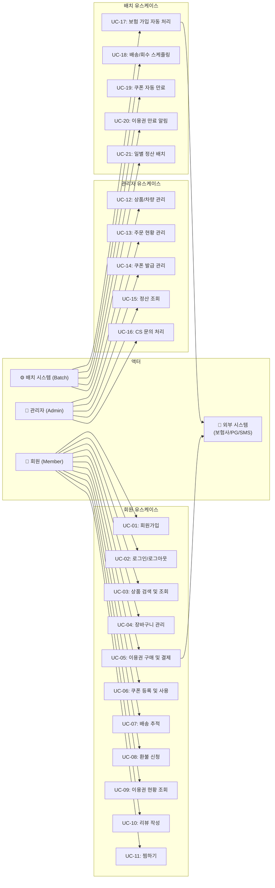
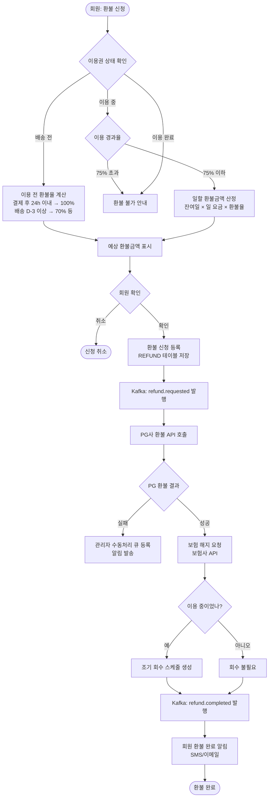
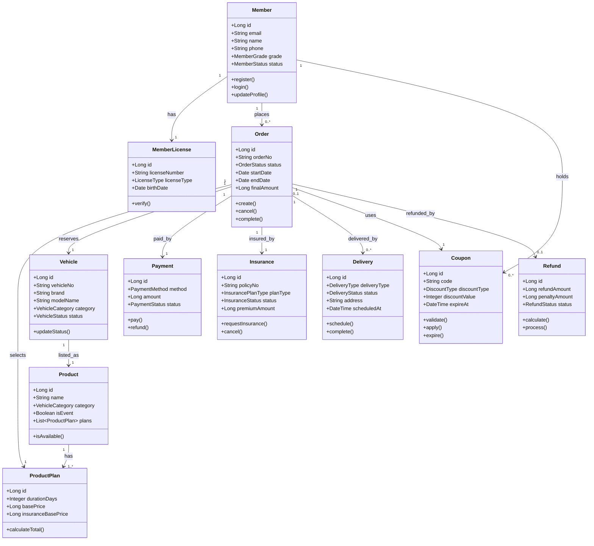

> **프로젝트명**: 프리카(FreeCar) 자동차 구독 이커머스 플랫폼
> **문서 버전**: v1.0
> **작성일**: 2026-09-18
> **작성자**: 수석 IT 컨설턴트 / SA

---

# 문서 3. 분석 단계 산출물

## 3.1 요구사항 정의서

### 3.1.1 기능 요구사항 (FR)

| ID | 요구사항명 | 상세 내용 | 우선순위 | 출처 | 도메인 |
|---|---|---|---|---|---|
| FR-001 | 회원가입 | 이메일/비밀번호 + 운전면허 정보 입력으로 가입. 이메일/휴대폰 인증 필수 | Must | 기획서 1.1 | 회원 |
| FR-002 | 소셜 로그인 | 카카오, 네이버, 구글 OAuth 2.0 로그인 지원 | Should | 기획서 1.1 | 회원 |
| FR-003 | 회원 정보 수정 | 주소, 연락처, 면허정보 수정 가능. 면허정보 변경 시 재인증 | Must | 기획서 | 회원 |
| FR-004 | 상품 목록 조회 | 카테고리별, 정렬(인기/신규/가격), 페이지네이션 지원 | Must | 기획서 1.4 | 상품 |
| FR-005 | 상품 상세 조회 | 차량 정보, 이미지, 기간별 요금, 보험 옵션 표시 | Must | 기획서 1.4 | 상품 |
| FR-006 | 상품 검색 | 키워드로 차량 브랜드/모델 검색, 카테고리/가격 필터 | Must | 기획서 1.4 | 검색 |
| FR-007 | 찜하기 | 상품을 찜 목록에 추가/제거, 찜 목록 조회 | Should | 기획서 | 상품 |
| FR-008 | 장바구니 | 이용권 장바구니 추가/제거, 최대 5개 | Should | 기획서 | 주문 |
| FR-009 | 이용권 구매 | 기간 선택 → 배송일시/장소 선택 → 보험 선택 → 결제 | Must | 기획서 1.3 | 주문 |
| FR-010 | 결제 처리 | PG사 연동 카드/간편결제, 결제 완료 후 보험가입 프로세스 자동 시작 | Must | 기획서 1.3 | 결제 |
| FR-011 | 보험 자동 가입 | 주문 완료 후 보험사 API 연동하여 자동 가입, 증권 발행 | Must | 기획서 1.3.2 | 보험 |
| FR-012 | 배송 예약 | 보험 가입 완료 후 지정 일시·장소에 차량 배달 예약 | Must | 기획서 1.3.3 | 배송 |
| FR-013 | 배송 추적 | 탁송기사 실시간 위치 추적 (배송 당일) | Should | 기획서 | 배송 |
| FR-014 | 차량 회수 | 만료 D-3/D-1/당일 알림, 지정 장소 자동 회수 스케줄링 | Must | 기획서 1.3.3 | 배송 |
| FR-015 | 환불 신청 | 이용 전/중 구간별 환불 정책 적용하여 환불 처리 | Must | 기획서 1.3.4 | 환불 |
| FR-016 | 쿠폰 발급/사용 | 쿠폰 코드 등록, 결제 시 쿠폰 적용, 만료 관리 | Must | 기획서 1.3.5 | 쿠폰 |
| FR-017 | 이용권 현황 조회 | 마이페이지에서 이용 중/예정/완료 이용권 목록 조회 | Must | 기획서 1.4 | 마이페이지 |
| FR-018 | 리뷰 작성 | 이용 완료 후 별점/사진/텍스트 리뷰 작성 | Could | 기획서 | 리뷰 |
| FR-019 | 알림 발송 | 주문완료/보험가입/배송출발/회수예정/쿠폰만료 SMS/앱푸시 알림 | Must | 기획서 | 알림 |
| FR-020 | 관리자 상품 관리 | 차량 등록/수정/삭제, 이용권 요금 설정 | Must | 기획서 1.6 | 관리자 |
| FR-021 | 관리자 주문 관리 | 전체 주문 조회, 상태 변경, CS 처리 | Must | 기획서 1.6 | 관리자 |
| FR-022 | 관리자 쿠폰 관리 | 쿠폰 발급, 조기 만료, 사용 현황 조회 | Must | 기획서 1.6 | 관리자 |
| FR-023 | 관리자 정산 관리 | 기간별 매출 집계, 정산 내역 다운로드 | Must | 기획서 1.6 | 관리자 |
| FR-024 | 배치 — 보험가입 처리 | 주문 이벤트 수신 후 보험사 API 호출하여 보험 가입 | Must | 기획서 1.1 | 배치 |
| FR-025 | 배치 — 만료회수 스케줄 | 이용권 만료일에 차량 회수 프로세스 자동 실행 | Must | 기획서 1.3.3 | 배치 |
| FR-026 | 배치 — 쿠폰 만료 | 만료일 도래한 쿠폰 자동 비활성화 | Must | 기획서 1.3.5 | 배치 |
| FR-027 | 배치 — 정산 | 매일 전일 매출/환불 집계 및 정산 데이터 생성 | Must | 기획서 1.6 | 배치 |
| FR-028 | 회원 등급 관리 | 월 1회 이용 실적 기반 회원 등급 재산정 | Should | 기획서 1.5 | 회원 |

### 3.1.2 비기능 요구사항 (NFR)

| ID | 요구사항명 | 상세 내용 | 우선순위 |
|---|---|---|---|
| NFR-001 | 성능 — 응답시간 | 상품 목록 P95 ≤ 300ms, 결제 API P95 ≤ 1000ms | Must |
| NFR-002 | 성능 — 동시접속 | 동시 접속자 1,000명 정상 처리 | Must |
| NFR-003 | 가용성 | 서비스 시스템 99.9% 이상 | Must |
| NFR-004 | 보안 — 개인정보 | 면허번호/생년월일 AES-256 암호화 저장 | Must |
| NFR-005 | 보안 — 통신 | 전 구간 TLS 1.2+ | Must |
| NFR-006 | 보안 — 결제 | PCI-DSS 준수, 카드정보 비저장 | Must |
| NFR-007 | 확장성 | HPA 기반 자동 스케일아웃, 배포 무중단 | Must |
| NFR-008 | 유지보수성 | 코드 커버리지 70% 이상, CI/CD 자동화 | Should |
| NFR-009 | 법규 준수 | 개인정보보호법, 전자상거래법, 보험업법 준수 | Must |
| NFR-010 | 로그/감사 | 민감 API 접근 로그 1년 이상 보관 | Must |

---

## 3.2 유스케이스 다이어그램 및 유스케이스 명세서

### 3.2.1 유스케이스 다이어그램

### 3.2.2 유스케이스 명세서 (핵심 5개 상세)

#### UC-05: 이용권 구매 및 결제

| 항목 | 내용 |
|---|---|
| **유스케이스 ID** | UC-05 |
| **유스케이스명** | 이용권 구매 및 결제 |
| **액터** | 회원 (주), PG사 (부) |
| **사전 조건** | 회원 로그인 상태, 운전면허 정보 등록 완료, 선택한 차량이 가용 상태 |
| **사후 조건** | 주문 생성, 결제 완료, 보험가입 요청 이벤트 발행, 배송 예약 시작 |
| **기본 흐름** | 1. 회원이 상품 상세 페이지에서 이용 기간 선택 → 2. 배송 일시/장소 입력 → 3. 보험 옵션 선택 → 4. 쿠폰 적용(선택) → 5. 결제 정보 입력 → 6. 결제 승인 요청 → 7. PG사 승인 → 8. 주문 완료, 보험가입 이벤트 발행 |
| **대안 흐름** | 5a. 재고 소진: 구매 불가 안내, 찜하기 유도. 6a. 결제 실패: 오류 메시지 표시, 재시도 유도 |
| **예외 흐름** | 결제 중 보험가입 조건 미충족 시 → 주문 자동 취소, 결제 환불 처리 |

#### UC-17: 보험 가입 자동 처리

| 항목 | 내용 |
|---|---|
| **유스케이스 ID** | UC-17 |
| **유스케이스명** | 보험 가입 자동 처리 |
| **액터** | 배치 시스템 (주), 보험사 API (부) |
| **사전 조건** | `order.created` Kafka 이벤트 수신 |
| **사후 조건** | 보험 증권 발행 완료, `insurance.completed` 이벤트 발행 또는 실패 시 `insurance.failed` 발행 |
| **기본 흐름** | 1. Kafka 이벤트 소비 → 2. 보험가입 요청 생성 → 3. 보험사 API 호출 → 4. 증권 발행 응답 수신 → 5. INSURANCE 테이블 업데이트 → 6. `insurance.completed` 발행 |
| **대안 흐름** | 3a. 보험사 API 타임아웃: 최대 3회 재시도(지수 백오프) |
| **예외 흐름** | 3회 재시도 후 실패: `insurance.failed` 발행 → Saga 보상 트랜잭션 (주문 취소, 결제 환불) |

#### UC-08: 환불 신청

| 항목 | 내용 |
|---|---|
| **유스케이스 ID** | UC-08 |
| **유스케이스명** | 환불 신청 |
| **액터** | 회원 (주) |
| **사전 조건** | 결제 완료 상태 주문 존재, 이용 완료(75% 초과) 상태가 아님 |
| **사후 조건** | 환불금액 산정, 환불 처리, 보험 해지, 차량 회수 스케줄 변경 |
| **기본 흐름** | 1. 마이페이지 → 이용권 상세 → 환불 신청 → 2. 환불 사유 선택 → 3. 예상 환불금액 확인 → 4. 환불 신청 → 5. `refund.requested` 이벤트 발행 → 6. PG 환불 처리 → 7. 보험 해지 요청 → 8. 회수 스케줄 생성 |
| **예외 흐름** | PG 환불 실패 시 관리자 수동 처리 큐에 등록 |

---

## 3.3 사용자 시나리오/User Journey

### 3.3.1 구매→보험가입→배송→이용→회수 전 과정 플로우

```mermaid
flowchart TD
    START([회원 로그인]) --> BROWSE[상품 목록/검색]
    BROWSE --> DETAIL[상품 상세 페이지]
    DETAIL --> SELECT_PLAN[이용 기간 선택]
    SELECT_PLAN --> CHECK_AVAIL{차량 가용 여부}
    CHECK_AVAIL -- 가용 --> SET_DELIVERY[배송 일시/장소 설정]
    CHECK_AVAIL -- 불가 --> NOTIFY_WISH[재고 알림 신청/찜]
    SET_DELIVERY --> SELECT_INS[보험 옵션 선택\n기본/프리미엄]
    SELECT_INS --> APPLY_COUPON{쿠폰 보유?}
    APPLY_COUPON -- 있음 --> COUPON_APPLY[쿠폰 적용]
    APPLY_COUPON -- 없음 --> PAYMENT_PAGE
    COUPON_APPLY --> PAYMENT_PAGE[결제 화면]
    PAYMENT_PAGE --> PAYMENT[결제 진행]
    PAYMENT --> PG_RESULT{PG 승인}
    PG_RESULT -- 실패 --> PAY_FAIL[결제 실패 안내\n재시도 유도]
    PG_RESULT -- 성공 --> ORDER_COMPLETE[주문 완료\n주문번호 발급]
    ORDER_COMPLETE --> KAFKA_ORDER[Kafka: order.created 발행]
    KAFKA_ORDER --> INS_REQUEST[보험가입 요청\n보험사 API 호출]
    INS_REQUEST --> INS_RESULT{보험 가입 결과}
    INS_RESULT -- 실패 --> INS_FAIL[보험가입 실패\n주문취소/환불 Saga]
    INS_RESULT -- 성공 --> INS_COMPLETE[보험 증권 발행\nKafka: insurance.completed]
    INS_COMPLETE --> DELIVERY_SCHEDULE[배송 스케줄 생성\n기사 배정]
    DELIVERY_SCHEDULE --> DELIVERY_NOTIFY[배송 예정 알림\nSMS/앱푸시]
    DELIVERY_NOTIFY --> WAIT_DELIVERY[이용 시작일 대기]
    WAIT_DELIVERY --> DRIVER_DEPART[배송 당일\n탁송기사 출발]
    DRIVER_DEPART --> TRACK[회원 배송 추적 가능]
    TRACK --> VEHICLE_DELIVERED[차량 인도 완료\n기사-회원 상태 확인]
    VEHICLE_DELIVERED --> IN_USE[이용 중]
    IN_USE --> EXPIRY_D3[만료 D-3 알림]
    EXPIRY_D3 --> EXPIRY_D1[만료 D-1 알림]
    EXPIRY_D1 --> EXPIRY_DAY[만료 당일 알림]
    EXPIRY_DAY --> RETURN_SCHEDULE[회수 스케줄 실행]
    RETURN_SCHEDULE --> VEHICLE_RETURNED[차량 회수 완료\nKafka: vehicle.returned]
    VEHICLE_RETURNED --> ORDER_CLOSED[이용권 이용 완료]
    ORDER_CLOSED --> REVIEW[리뷰 작성 유도]
    REVIEW --> END([종료])
```

### 3.3.2 환불 처리 플로우

---

## 3.4 도메인 모델 (개념 클래스 다이어그램)

---
