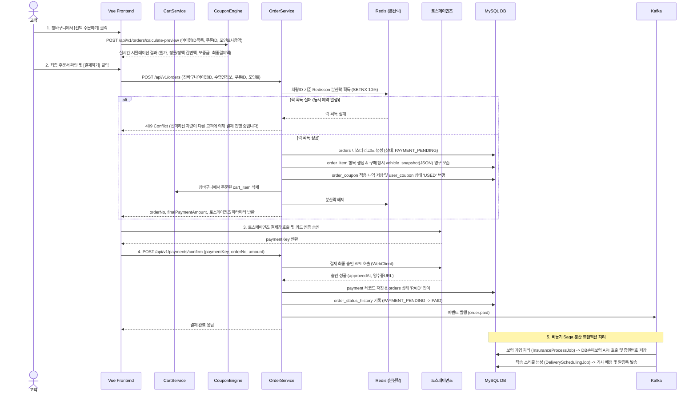

> **프로젝트명**: 프리카(FreeCar) 자동차 구독 이커머스 플랫폼
> **문서 버전**: v1.2 (전 테이블 모든 컬럼 포함 ERD 및 완전한 테이블 명세서 수록)
> **작성일**: 2026-09-18
> **작성자**: 수석 IT 컨설턴트 / SA

---

# 문서 4. 설계 단계 산출물

## 4.1 시스템 컴포넌트 설계

### 4.1.1 서비스 시스템 컴포넌트 설계 (service-api)

```
[service-api — Kotlin / Spring Boot 3.x]
├── presentation
│   ├── AuthController              # 로그인, 회원가입, JWT 갱신, PASS 본인인증 연계
│   ├── MemberController            # 내 정보 조회, 면허증 등록 및 적성검사 유효성 검증
│   ├── ProductController           # 이용권 상품 목록/상세, 기간 플랜별 요금표
│   ├── VehicleController           # 실시간 예약 가용성, 차고지 위치, 제원 조회
│   ├── SearchController            # Elasticsearch 연동 차량/옵션/가격 다차원 검색
│   ├── CartController              # 장바구니 목록 조회, 담기, 옵션변경, 선택삭제
│   ├── CouponController            # 발급 가능 쿠폰, 내 보유 쿠폰, 주문 전 할인액 시뮬레이션
│   ├── OrderController             # 주문서 생성 (Cart/단건), Redisson 분산락 재고 선점, 주문 상세/취소
│   ├── PaymentController           # PG 결제 파라미터 생성, 결제 최종 승인, 웹훅 수신
│   ├── InsuranceController         # 단기 의무/종합보험 상품 안내, 증권번호 조회
│   ├── DeliveryController          # 배송/회수 스케줄 조회, 실시간 탁송 위치 추적
│   ├── MyPageController            # 구독 이용권 현황, 주문 이력, 결제 영수증, 보증금 환급 내역
│   └── NotificationController      # 알림톡/SMS 수신 목록 조회, 읽음 처리
│
├── application (Service & Engine Layer)
│   ├── AuthService                 # 본인인증(CI/DI) 검증 및 JWT 발급/블랙리스트 관리
│   ├── MemberLicenseService        # 도로교통공단/경찰청 API 연계 면허 진위 및 적성검사 검증
│   ├── ProductService              # 상품/플랜/차량 제원 Redis 캐싱
│   ├── CartService                 # 장바구니 CRUD 및 실시간 합계 금액(대여료+보험+배송비) 계산
│   ├── CouponEngine                # 정률(%) / 정액(원) 할인 계산 엔진, 최대 할인한도 및 최소금액 검증
│   ├── OrderService                # Redisson 분산락 기반 차량 선점, 주문/주문항목 생성, 스냅샷 불변 보존
│   ├── PaymentService              # 토스페이먼츠 승인/망취소/부분환불/보증금 환급 처리
│   ├── InsuranceSagaHandler        # Kafka 이벤트 기반 보험 가입/해지 Saga 오케스트레이션
│   ├── DeliverySagaHandler         # 탁송 기사 자동 배정, 출발/도착 검수 사진 연동
│   └── NotificationService         # 알림톡(NHN Cloud) / SMS 발송
│
├── domain
│   ├── member                      # Member, MemberLicense, Grade
│   ├── vehicle                     # Vehicle, VehicleSpec, VehicleImage, Category
│   ├── product                     # Product, ProductPlan
│   ├── cart                        # Cart, CartItem
│   ├── coupon                      # Coupon, UserCoupon, OrderCoupon, DiscountPolicy
│   ├── order                       # Order, OrderItem, OrderStatusHistory
│   ├── payment                     # Payment, Refund, PaymentMethod
│   ├── insurance                   # Insurance, InsuranceCoverage
│   ├── delivery                    # Delivery, Driver, InspectionPhoto
│   └── notification                # Notification
│
├── infrastructure
│   ├── persistence                 # Spring Data JPA, QueryDSL Repository 구현체
│   ├── lock                        # Redisson 분산락 템플릿 (@DistributedLock AOP)
│   ├── kafka                       # KafkaEventProducer, OrderSagaConsumer
│   ├── cache                       # RedisCacheManager (@Cacheable)
│   └── external
│       ├── TossPaymentClient       # 토스페이먼츠 REST WebClient
│       ├── PoliceLicenseClient     # 운전면허 진위확인 연계 클라이언트
│       ├── DbInsuranceClient       # DB손해보험 단기보험 가입/해지 API 연동
│       ├── KakaoAlimtalkClient     # 알림톡 전송 클라이언트
│       └── KakaoMapClient          # 배송지 좌표 변환 및 경로 연산
│
└── config
    ├── SecurityConfig              # Spring Security + JWT 필터체인
    ├── RedissonConfig              # Redis 분산락 클러스터 설정
    ├── KafkaTopicConfig            # Saga 토픽 파티션 설정
    └── WebMvcConfig                # 공통 인터셉터, ArgumentResolver
```

---

## 4.2 전체 데이터베이스 ERD (모든 테이블 전 컬럼 100% 수록)

> 본 ERD는 시스템에 존재하는 **19개 핵심 엔티티의 모든 컬럼, 데이터 타입, 키(PK/FK/UK) 관계를 단 하나의 생략 없이 100% 완벽하게 표현**합니다.

```mermaid
erDiagram
    MEMBER ||--o{ MEMBER_LICENSE : "면허등록"
    MEMBER ||--o| CART : "장바구니보유"
    MEMBER ||--o{ USER_COUPON : "쿠폰보유"
    MEMBER ||--o{ ORDER : "주문수행"
    MEMBER ||--o{ NOTIFICATION : "알림수신"

    CART ||--o{ CART_ITEM : "담긴아이템"

    VEHICLE ||--o| VEHICLE_SPEC : "제원옵션보유"
    VEHICLE ||--o{ VEHICLE_IMAGE : "차량이미지"
    VEHICLE ||--o{ PRODUCT : "상품매핑"
    VEHICLE ||--o{ ORDER_ITEM : "배정실물"

    PRODUCT ||--o{ PRODUCT_PLAN : "구독플랜"
    PRODUCT ||--o{ CART_ITEM : "담긴상품참조"
    PRODUCT ||--o{ ORDER_ITEM : "주문상품참조"

    PRODUCT_PLAN ||--o{ CART_ITEM : "선택플랜"
    PRODUCT_PLAN ||--o{ ORDER_ITEM : "체결플랜"

    COUPON ||--o{ USER_COUPON : "발급이력"
    USER_COUPON ||--o| ORDER_COUPON : "사용스냅샷"

    ORDER ||--o{ ORDER_ITEM : "주문상세항목"
    ORDER ||--o{ ORDER_STATUS_HISTORY : "상태전이이력"
    ORDER ||--o| ORDER_COUPON : "적용쿠폰스냅샷"
    ORDER ||--o{ PAYMENT : "결제승인내역"
    ORDER ||--o{ REFUND : "취소환불내역"
    ORDER ||--o{ INSURANCE : "보험계약체결"
    ORDER ||--o{ DELIVERY : "탁송회수스케줄"

    DELIVERY ||--o| DRIVER : "기사배정"

    MEMBER {
        bigint id PK "회원 고유 식별자"
        varchar email UK "로그인 이메일"
        varchar password_hash "BCrypt 암호화 해시"
        varchar name "회원 실명"
        varchar phone UK "휴대전화번호"
        varchar ci UK "본인인증 연계정보 (CI)"
        varchar di "본인인증 중복가입확인정보 (DI)"
        date birth_date "생년월일 (YYYY-MM-DD)"
        varchar gender "성별 (MALE, FEMALE)"
        varchar zipcode "기본 배송지 우편번호"
        varchar base_address "기본 배송지 도로명주소"
        varchar detail_address "기본 배송지 상세주소"
        varchar status "회원 상태 (ACTIVE, SUSPENDED, WITHDRAWN)"
        varchar grade "회원 등급 (FREE, SILVER, GOLD, PLATINUM)"
        bigint point_balance "보유 포인트/적립금 잔액"
        boolean marketing_agree "마케팅 정보 수신동의 여부"
        varchar suspended_reason "계정 정지 사유"
        datetime last_login_at "최근 로그인 일시"
        datetime withdrawn_at "회원 탈퇴 일시"
        datetime created_at "가입 일시"
        datetime updated_at "수정 일시"
    }

    MEMBER_LICENSE {
        bigint id PK "면허 정보 고유 식별자"
        bigint member_id FK,UK "회원 식별자"
        varchar license_number UK "면허증 번호 (암호화)"
        varchar license_type "면허 종별 (1종보통, 2종보통, 1종대형)"
        date birth_date "면허증 상 생년월일"
        date issue_date "면허 최초/재발급 일자"
        date aptitude_test_end_date "적성검사/갱신 만료일자"
        varchar verify_status "진위확인 상태 (UNVERIFIED, VERIFIED, REJECTED, EXPIRED)"
        varchar verify_code "경찰청 연계 진위확인 검증일련값"
        varchar reject_reason "면허 진위확인 실패/반려 사유"
        datetime verified_at "진위 검증 완료 일시"
        datetime created_at "등록 일시"
        datetime updated_at "수정 일시"
    }

    VEHICLE {
        bigint id PK "차량 실물 고유 식별자"
        varchar vehicle_no UK "차량 번호판 (예: 12가 3456)"
        varchar vin UK "차대번호 (17자리)"
        varchar brand "제조사 (현대, 기아, 제네시스, 테슬라, 포르쉐 등)"
        varchar model_name "차량 모델명"
        varchar trim_name "세부 트림명"
        int model_year "연식 (예: 2025)"
        varchar category "차종 (ELECTRIC, SPORTS, LUXURY, SUV, MINIVAN)"
        varchar fuel_type "연료 (EV, GASOLINE, DIESEL, HYBRID)"
        int displacement "배기량 (cc, EV는 0)"
        decimal battery_capacity "배터리 용량 (kWh)"
        int driving_range "1회 충전/주유 주행가능거리 (km)"
        varchar transmission "변속기 (AUTO, MANUAL)"
        varchar drive_type "구동방식 (2WD, AWD)"
        int seating_capacity "승차 정원"
        varchar exterior_color "외장 색상명"
        varchar interior_color "내장 시트 색상명"
        decimal fuel_efficiency "복합 연비 (km/l 또는 km/kWh)"
        int mileage "현재 누적 주행거리 (km)"
        varchar obd_device_id "차량 원격 OBD 관제 단말기 ID"
        varchar gps_device_id "실시간 GPS 단말기 ID"
        varchar hipass_card_no "하이패스 단말기 일련번호"
        varchar status "차량 상태 (AVAILABLE, RESERVED, IN_USE, MAINTENANCE, RETIRED)"
        varchar location_address "현재 보관 차고지 거점 주소"
        varchar registration_doc_url "자동차등록증 사본 CDN URL"
        date last_maintenance_date "최근 정기점검 완료일"
        date next_maintenance_date "다음 정기점검 예정일"
        datetime created_at "차량 등록 일시"
        datetime updated_at "차량 정보 수정 일시"
    }

    VEHICLE_SPEC {
        bigint id PK "차량 옵션 제원 고유 식별자"
        bigint vehicle_id FK,UK "차량 식별자"
        boolean has_smart_cruise "어댑티브 스마트 크루즈 컨트롤 유무"
        boolean has_around_view "360도 서라운드 뷰 모니터 유무"
        boolean has_hud "헤드업 디스플레이 (HUD) 유무"
        boolean has_ventilated_seat "1열 통풍 시트 유무"
        boolean has_heated_seat "열선 시트 유무"
        boolean has_sunroof "선루프 장착 유무"
        boolean has_built_in_cam "빌트인 캠 / 블랙박스 유무"
        varchar sound_system "프리미엄 오디오 시스템 브랜드"
        int wheel_inch "알로이 휠 크기 (인치)"
        varchar tire_condition "타이어 상태 (GOOD, FAIR, REPLACE)"
        datetime created_at "등록 일시"
        datetime updated_at "수정 일시"
    }

    VEHICLE_IMAGE {
        bigint id PK "차량 이미지 식별자"
        bigint vehicle_id FK "차량 식별자"
        varchar image_type "부위 구분 (THUMBNAIL, FRONT, REAR, SIDE, INTERIOR, DASHBOARD)"
        varchar image_url "CDN 고화질 원본 이미지 URL"
        varchar thumb_url "CDN 썸네일 압축 이미지 URL"
        int sort_order "화면 노출 정렬 순서"
        boolean is_primary "대표 메인 이미지 여부"
        datetime created_at "업로드 일시"
    }

    PRODUCT {
        bigint id PK "구독 상품 고유 식별자"
        bigint vehicle_id FK "매핑 실물 차량 식별자"
        varchar title "상품 노출 제목"
        varchar summary "상품 한줄 소개 요약"
        text description "상품 상세 소개 설명 (Markdown/HTML)"
        varchar category "카테고리 구분"
        bigint view_count "누적 상품 상세 조회수"
        int wish_count "누적 고객 찜하기 횟수"
        varchar status "상품 판매 상태 (ON_SALE, RESERVED, HIDDEN)"
        boolean is_featured "메인 페이지 추천 상품 노출 여부"
        datetime created_at "상품 등록 일시"
        datetime updated_at "상품 수정 일시"
    }

    PRODUCT_PLAN {
        bigint id PK "구독 기간 플랜 식별자"
        bigint product_id FK "구독 상품 식별자"
        int duration_days "구독 기간 일수 (7, 14, 30, 90, 180, 365)"
        varchar plan_name "플랜 표기명 (7일 체험권, 1개월 자유권 등)"
        bigint daily_base_rate "1일 환산 기본 대여료 (원)"
        bigint total_plan_amount "기간 총 차량 대여료 (원)"
        int discount_percentage "기간 할인율 (%)"
        int daily_mileage_limit "1일 기본 제공 주행거리 (km, 예: 100km)"
        int excess_mileage_fee_per_km "초과 주행거리 km당 과금 요율 (원/km)"
        bigint deposit_amount "구독 계약 보증금 (원, 반납 시 전액 환급)"
        bigint basic_insurance_daily_rate "기본보험 1일 요금 (원)"
        bigint premium_insurance_daily_rate "프리미엄보험 1일 요금 (원)"
        bigint delivery_fee "기본 왕복 탁송비 (원)"
        boolean is_roundtrip_delivery_free "왕복 무료 탁송 지원 프로모션 여부"
        boolean is_active "플랜 활성 여부"
    }

    CART {
        bigint id PK "장바구니 고유 식별자"
        bigint member_id FK,UK "소유 회원 식별자"
        datetime created_at "생성 일시"
        datetime updated_at "최근 수정 일시"
    }

    CART_ITEM {
        bigint id PK "장바구니 항목 식별자"
        bigint cart_id FK "장바구니 식별자"
        bigint product_id FK "상품 식별자"
        bigint product_plan_id FK "구독 기간 플랜 식별자"
        bigint vehicle_id FK "예약 대상 차량 식별자"
        varchar insurance_type "선택 보험 유형 (BASIC, PREMIUM)"
        date start_date "이용 시작 희망일자"
        date end_date "이용 종료 희망일자"
        int duration_days "이용 일수"
        varchar delivery_zipcode "탁송 도착지 우편번호"
        varchar delivery_address "탁송 도착지 도로명 기본주소"
        varchar delivery_detail_address "탁송 도착지 상세주소"
        datetime delivery_scheduled_at "차량 수령 희망 일시"
        varchar return_address "반납 희망 거점/주소 (편도 구독 지원)"
        boolean has_child_seat "부가옵션: 유아용 카시트 신청 여부"
        boolean has_hipass_rental "부가옵션: 후불 하이패스 카드 대여 여부"
        boolean is_checked "주문 대상 선택 체크 여부 (1:선택, 0:해제)"
        datetime item_expire_at "장바구니 담김 유효 만료 시각"
        datetime created_at "담은 일시"
        datetime updated_at "옵션 변경 일시"
    }

    COUPON {
        bigint id PK "쿠폰 템플릿 식별자"
        varchar code UK "쿠폰 고유 발급 코드 (예: WELCOME2026)"
        varchar name "쿠폰명"
        varchar discount_type "할인 유형 (PERCENTAGE:정률, FIXED_AMOUNT:정액)"
        int discount_value "할인 수치 (정률: %, 정액: 원)"
        bigint max_discount_amount "정률 할인 시 최대 감면 한도액 (원, NULL=무제한)"
        bigint min_order_amount "쿠폰 사용 가능 최소 주문 결제금액 (원)"
        varchar target_category "적용 가능 차종 (ALL, ELECTRIC, SPORTS, LUXURY, SUV)"
        varchar min_member_grade "사용 가능 최소 회원 등급"
        boolean is_duplicatable "타 쿠폰과 중복 적용 허용 여부"
        int total_issuable_qty "총 발행 한도 수량 (-1: 무제한)"
        int current_issued_qty "현재까지 누적 발급된 수량"
        int valid_duration_days "발급일 기준 유효 기간 일수"
        datetime start_at "쿠폰 사용 시작 가능 일시"
        datetime expire_at "쿠폰 운영 종료 일시"
        boolean is_active "쿠폰 활성 상태 여부"
        datetime created_at "쿠폰 생성 일시"
    }

    USER_COUPON {
        bigint id PK "회원 보유 쿠폰 식별자"
        bigint coupon_id FK "쿠폰 템플릿 식별자"
        bigint member_id FK "소유 회원 식별자"
        varchar status "쿠폰 상태 (AVAILABLE:사용가능, USED:사용완료, EXPIRED:기간만료)"
        datetime issued_at "회원 보관함 발급 일시"
        datetime used_at "실제 결제 사용 일시"
        datetime expired_at "쿠폰 사용 만료 일시"
        bigint used_order_id "사용 체결된 주문 식별자"
    }

    ORDER {
        bigint id PK "주문 고유 식별자"
        varchar order_no UK "주문번호 (FC-YYYYMMDD-XXXXXX)"
        bigint member_id FK "주문 회원 식별자"
        varchar order_status "주문 상태 (PAYMENT_PENDING, PAID, INSURANCE_PROCESSING, DELIVERY_SCHEDULED, IN_USE, RETURN_SCHEDULED, COMPLETED, CANCELLED, REFUNDED)"
        varchar order_title "주문 대표 타이틀명"
        bigint total_item_amount "차량 순수 대여료 합계 (원)"
        bigint total_insurance_amount "보험료 총합계 (원)"
        bigint total_delivery_fee "탁송/배송비 총합계 (원)"
        bigint total_addon_amount "부가서비스 옵션 합계 (원)"
        bigint total_deposit_amount "구독 계약 보증금 합계 (원)"
        bigint coupon_discount_amount "쿠폰 총 감면 할인액 (원)"
        bigint point_discount_amount "포인트/적립금 사용액 (원)"
        bigint final_payment_amount "최종 실결제 승인 금액 (원)"
        varchar orderer_name "주문 고객 성명"
        varchar orderer_phone "주문 고객 연락처"
        varchar recipient_name "차량 실제 수령인 성명"
        varchar recipient_phone "차량 실제 수령인 연락처"
        varchar recipient_emergency_phone "수령인 비상 연락처"
        varchar delivery_zipcode "탁송지 우편번호"
        varchar delivery_address "탁송지 도로명 기본주소"
        varchar delivery_detail_address "탁송지 상세주소"
        varchar delivery_memo "탁송 기사 전달 요청사항"
        datetime payment_due_at "주문 결제 유효 시한"
        datetime cancelled_at "주문 취소 일시"
        varchar cancel_reason "주문 취소 원인 사유"
        varchar order_ip "주문 인입 클라이언트 IP"
        datetime created_at "주문 생성 일시"
        datetime updated_at "주문 정보 수정 일시"
    }

    ORDER_ITEM {
        bigint id PK "주문 항목 상세 식별자"
        bigint order_id FK "주문 마스터 식별자"
        bigint product_id FK "상품 식별자"
        bigint product_plan_id FK "선택 플랜 식별자"
        bigint vehicle_id FK "배정 차량 식별자"
        json vehicle_snapshot "체결 시점 차량 제원/번호판/주행거리 JSON 스냅샷"
        varchar item_status "이용 상태 (ORDERED, PREPARING, IN_DELIVERY, IN_USE, RETURNING, RETURNED, CANCELLED)"
        date start_date "구독 시작 일자"
        date end_date "구독 종료 일자"
        datetime actual_return_at "실제 차량 반납 완료 일시"
        int duration_days "구독 이용 일수"
        bigint item_amount "해당 항목 차량 대여료 (원)"
        varchar insurance_type "보험 플랜 (BASIC, PREMIUM)"
        bigint insurance_amount "해당 항목 보험료 (원)"
        bigint delivery_fee "탁송료 (원)"
        bigint addon_fee "부가옵션 요금 (원)"
        bigint deposit_amount "보증금 (원)"
        int start_mileage "인수 시점 계기판 누적 주행거리 (km)"
        int end_mileage "반납 시점 계기판 누적 주행거리 (km)"
        int excess_mileage "약정 초과 주행거리 (km)"
        bigint excess_mileage_charge "초과 주행거리 추가 정산금 (원)"
        bigint fuel_settlement_charge "유류/충전 잔량 부족 정산금 (원)"
        bigint damage_charge "차량 파손 면책금/수리비 청구액 (원)"
        varchar return_zipcode "반납 회수지 우편번호"
        varchar return_address "반납 회수지 도로명주소"
        varchar return_detail_address "반납 회수지 상세주소"
        datetime created_at "항목 생성 일시"
    }

    ORDER_STATUS_HISTORY {
        bigint id PK "상태 전이 이력 식별자"
        bigint order_id FK "주문 식별자"
        varchar previous_status "전이 전 상태"
        varchar current_status "전이 후 상태"
        varchar change_reason "상태 변경 사유"
        varchar changed_by "상태 변경 주체 (SYSTEM, USER, ADMIN)"
        datetime created_at "상태 변경 발생 일시"
    }

    ORDER_COUPON {
        bigint id PK "주문 쿠폰 적용 스냅샷 식별자"
        bigint order_id FK,UK "주문 식별자"
        bigint user_coupon_id FK "사용한 회원 쿠폰 식별자"
        varchar coupon_code "적용 당시 쿠폰 코드"
        varchar coupon_name "적용 당시 쿠폰명"
        varchar discount_type "할인 유형 스냅샷 (PERCENTAGE, FIXED_AMOUNT)"
        int discount_value "할인율 또는 할인금액"
        bigint applied_discount_amount "실제 계산 감면된 할인금액 (원)"
        datetime applied_at "적용 체결 일시"
    }

    PAYMENT {
        bigint id PK "결제 마스터 고유 식별자"
        bigint order_id FK "주문 식별자"
        varchar payment_key UK "토스페이먼츠 PG 트랜잭션 고유키"
        varchar payment_method "결제 수단 (CARD, NAVER_PAY, KAKAO_PAY, TOSS_PAY, VIRTUAL_ACCOUNT)"
        bigint payment_amount "실제 결제 승인 금액 (원)"
        bigint cancelable_amount "현재 환불 가능한 잔액 (원)"
        varchar card_company_code "승인 카드사 코드"
        varchar card_company_name "승인 카드사명"
        varchar card_number_masked "마스킹된 카드번호 (앞6 뒤4)"
        int installment_months "할부 개월 수 (0:일시불)"
        varchar pg_receipt_url "전자영수증 매출전표 확인 URL"
        varchar payment_status "결제 상태 (READY, DONE, CANCELLED, PARTIAL_CANCELLED, FAILED)"
        datetime approved_at "PG 승인 완료 일시"
        text pg_raw_response "PG사 응답 원본 JSON 전문"
        datetime created_at "결제 생성 일시"
    }

    REFUND {
        bigint id PK "환불 고유 식별자"
        bigint payment_id FK "결제 식별자"
        bigint order_id FK "주문 식별자"
        varchar refund_no UK "환불 번호 (RF-YYYYMMDD-XXXXXX)"
        varchar refund_type "환불 유형 (FULL:전액환불, PARTIAL:부분환불)"
        bigint refund_amount "실제 결제 취소 환불금액 (원)"
        bigint penalty_amount "취소 위약금 공제액 (원)"
        bigint deposit_refund_amount "반환된 보증금액 (원)"
        varchar refund_reason_code "환불 사유 코드"
        varchar refund_reason_detail "환불 사유 상세 설명"
        varchar pg_cancel_key "PG사 취소 트랜잭션 고유키"
        varchar status "환불 처리 상태 (REQUESTED, PROCESSING, COMPLETED, FAILED)"
        datetime completed_at "환불 완료 일시"
        datetime created_at "환불 접수 일시"
    }

    INSURANCE {
        bigint id PK "보험 계약 고유 식별자"
        bigint order_id FK "주문 식별자"
        bigint order_item_id FK,UK "주문 항목 식별자"
        varchar policy_no UK "보험 증권번호 (발급 후 기입)"
        varchar insurer_code "보험사 코드 (DB_INSURANCE)"
        varchar insurer_name "보험사명 (DB손해보험)"
        varchar plan_type "가입 플랜 (BASIC, PREMIUM)"
        date coverage_start_date "보장 시작일자"
        date coverage_end_date "보장 만료일자"
        varchar bodily_injury_limit "대인 배상 한도 (무한)"
        bigint property_damage_limit "대물 배상 한도 (원, 1억 또는 3억)"
        bigint self_injury_limit "자기신체사고 배상 한도 (원)"
        bigint own_damage_deductible "자기차량손해 고객부담 면책금 (원, 5만 또는 30만)"
        bigint premium_amount "산정된 총 보험료 (원)"
        varchar status "보험 계약 상태 (PENDING, ACTIVE, CANCELLED, EXPIRED)"
        varchar policy_pdf_url "전자 보험 증권 사본 다운로드 URL"
        datetime issued_at "보험 증권 발급 일시"
        datetime created_at "보험 생성 일시"
    }

    DELIVERY {
        bigint id PK "탁송 배송/회수 고유 식별자"
        bigint order_id FK "주문 식별자"
        bigint order_item_id FK "주문 항목 식별자"
        bigint driver_id FK "배정 탁송기사 식별자"
        varchar delivery_type "구분 (DELIVERY:출고탁송, RETURN:만료회수)"
        varchar status "탁송 상태 (PENDING, ASSIGNED, DEPARTED, IN_TRANSIT, DELIVERED, CANCELLED)"
        datetime scheduled_at "탁송 예정 일시"
        datetime departed_at "기사 출발 일시"
        datetime completed_at "고객 인도/인수 완료 일시"
        varchar origin_address "탁송 출발지 주소"
        varchar destination_address "탁송 도착지 주소"
        decimal dest_latitude "도착지 GPS 위도"
        decimal dest_longitude "도착지 GPS 경도"
        int start_mileage "출발 시점 주행거리 (km)"
        int end_mileage "도착 시점 주행거리 (km)"
        int start_battery_fuel_percent "출발 시 배터리/유류 잔량 (%)"
        int end_battery_fuel_percent "도착 시 배터리/유류 잔량 (%)"
        json inspection_photo_urls "외관 검수 사진 6종 URLs (전/후/좌/우/휠/계기판)"
        varchar customer_signature_url "고객 전자서명 서명 이미지 CDN URL"
        datetime created_at "생성 일시"
    }

    DRIVER {
        bigint id PK "탁송 기사 고유 식별자"
        varchar name "기사 실명"
        varchar phone UK "기사 휴대전화번호"
        varchar agency_name "소속 탁송 전문 협력사명"
        varchar license_type "소지 면허 종별 (1종보통, 1종대형)"
        int driving_experience_years "운전 경력 (년)"
        varchar status "현재 가용 상태 (AVAILABLE, ASSIGNED, ON_DUTY, OFF_DUTY)"
        decimal current_latitude "현재 실시간 GPS 위도"
        decimal current_longitude "현재 실시간 GPS 경도"
        decimal rating_avg "기사 서비스 누적 평균 평점"
        int total_delivery_count "누적 탁송 완료 건수"
        datetime created_at "기사 등록 일시"
    }

    NOTIFICATION {
        bigint id PK "알림 발송 이력 식별자"
        bigint member_id FK "수신 회원 식별자"
        bigint order_id FK "관련 주문 식별자"
        varchar type "알림 유형 (ORDER_PAID, INSURANCE_DONE, DELIVERY_STARTED, RETURN_ALERT)"
        varchar channel "발송 채널 (ALIMTALK, SMS, PUSH)"
        varchar title "알림 제목"
        text content "알림 본문 내용"
        varchar status "발송 상태 (PENDING, SENT, FAILED)"
        datetime sent_at "발송 완료 일시"
        datetime created_at "알림 생성 일시"
    }
```

---

## 4.3 전체 테이블 상세 명세서 (19개 테이블 정규 명세)

### [테이블 명세서 01] 회원 마스터 (`member`)

| 컬럼명 (Physical) | 논리명 (Logical) | 데이터 타입 & 길이 | Nullable | 기본값 | Key | 제약조건 및 상세 설명 |
|---|---|---|---|---|---|---|
| `id` | 회원 고유 식별자 | BIGINT | N | AUTO_INCREMENT | PK | 기본키 |
| `email` | 로그인 이메일 | VARCHAR(255) | N | - | UK | 로그인 계정 식별자 |
| `password_hash` | 비밀번호 해시 | VARCHAR(255) | Y | NULL | - | BCrypt 암호화 (소셜 계정은 NULL) |
| `name` | 회원 성명 | VARCHAR(100) | N | - | - | 실명 |
| `phone` | 휴대전화번호 | VARCHAR(20) | N | - | UK | 본인인증 완료된 연락처 |
| `ci` | 연계정보 (CI) | VARCHAR(100) | N | - | UK | KCB/NICE 본인확인 암호화 연계값 |
| `di` | 중복가입확인정보 (DI) | VARCHAR(100) | Y | NULL | - | 중복 가입 방지 식별값 |
| `birth_date` | 생년월일 | DATE | N | - | - | YYYY-MM-DD (만 21세 이상 가입제약) |
| `gender` | 성별 | VARCHAR(10) | N | - | - | `MALE`, `FEMALE` |
| `zipcode` | 기본 배송지 우편번호 | VARCHAR(10) | Y | NULL | - | 5자리 신우편번호 |
| `base_address` | 기본 배송지 도로명주소 | VARCHAR(255) | Y | NULL | - | 기본 배송 도로명주소 |
| `detail_address` | 기본 배송지 상세주소 | VARCHAR(255) | Y | NULL | - | 동/호수 등 상세 |
| `status` | 회원 상태 | VARCHAR(20) | N | 'ACTIVE' | - | `ACTIVE`, `SUSPENDED`, `WITHDRAWN` |
| `grade` | 회원 등급 | VARCHAR(20) | N | 'FREE' | - | `FREE`, `SILVER`, `GOLD`, `PLATINUM` |
| `point_balance` | 보유 포인트 잔액 | BIGINT | N | 0 | - | 적립금 잔액 (원 단위) |
| `marketing_agree` | 마케팅 수신동의 | TINYINT(1) | N | 0 | - | 1: 동의, 0: 미동의 |
| `suspended_reason` | 계정 정지 사유 | VARCHAR(255) | Y | NULL | - | 패널티/정지 원인 사유 |
| `last_login_at` | 최근 로그인 일시 | DATETIME | Y | NULL | - | 최근 접속 시간 |
| `withdrawn_at` | 탈퇴 일시 | DATETIME | Y | NULL | - | 회원 탈퇴 접수 시각 |
| `created_at` | 회원 가입 일시 | DATETIME | N | CURRENT_TIMESTAMP | - | 생성 시점 |
| `updated_at` | 회원 정보 수정 일시 | DATETIME | N | CURRENT_TIMESTAMP | - | ON UPDATE CURRENT_TIMESTAMP |

---

### [테이블 명세서 02] 회원 운전면허 (`member_license`)

| 컬럼명 (Physical) | 논리명 (Logical) | 데이터 타입 & 길이 | Nullable | 기본값 | Key | 제약조건 및 상세 설명 |
|---|---|---|---|---|---|---|
| `id` | 면허 식별자 | BIGINT | N | AUTO_INCREMENT | PK | 기본키 |
| `member_id` | 회원 식별자 | BIGINT | N | - | FK, UK | 회원당 1개의 면허 정보 |
| `license_number` | 운전면허 번호 | VARCHAR(100) | N | - | UK | AES-256 암호화 저장 |
| `license_type` | 면허 종별 | VARCHAR(20) | N | '1종보통' | - | `1종보통`, `2종보통`, `1종대형` |
| `birth_date` | 면허증 생년월일 | DATE | N | - | - | 면허증 기재 생년월일 |
| `issue_date` | 면허 발급 일자 | DATE | N | - | - | 면허 취득 후 1년 이상 경과 검증용 |
| `aptitude_test_end_date`| 적성검사 만료일자 | DATE | N | - | - | 갱신 기간 만료 여부 확인 |
| `verify_status` | 진위확인 상태 | VARCHAR(20) | N | 'UNVERIFIED' | - | `UNVERIFIED`, `VERIFIED`, `REJECTED`, `EXPIRED` |
| `verify_code` | 진위확인 일련번호 | VARCHAR(100) | Y | NULL | - | 도로교통공단/경찰청 승인 토큰 |
| `reject_reason` | 검증 실패 사유 | VARCHAR(255) | Y | NULL | - | 불일치/정지 면허 등 사유 |
| `verified_at` | 진위 검증 일시 | DATETIME | Y | NULL | - | 검증 성공 시각 |
| `created_at` | 등록 일시 | DATETIME | N | CURRENT_TIMESTAMP | - | |
| `updated_at` | 수정 일시 | DATETIME | N | CURRENT_TIMESTAMP | - | |

---

### [테이블 명세서 03] 실물 차량 마스터 (`vehicle`)

| 컬럼명 (Physical) | 논리명 (Logical) | 데이터 타입 & 길이 | Nullable | 기본값 | Key | 제약조건 및 상세 설명 |
|---|---|---|---|---|---|---|
| `id` | 차량 실물 식별자 | BIGINT | N | AUTO_INCREMENT | PK | 기본키 |
| `vehicle_no` | 차량 등록번호판 | VARCHAR(20) | N | - | UK | 예: 12가 3456 |
| `vin` | 차대번호 | VARCHAR(50) | N | - | UK | 국제표준 17자리 고유번호 |
| `brand` | 제조사 브랜드 | VARCHAR(50) | N | - | - | 현대, 기아, 제네시스, 테슬라, 포르쉐 등 |
| `model_name` | 차량 모델명 | VARCHAR(100) | N | - | - | 아이오닉 6, 모델 3, GV80 등 |
| `trim_name` | 세부 트림명 | VARCHAR(100) | N | - | - | 롱레인지 AWD, 3.5T 가솔린 등 |
| `model_year` | 연식 | INT | N | - | - | 2024, 2025, 2026 |
| `category` | 차종 카테고리 | VARCHAR(30) | N | - | - | `ELECTRIC`, `SPORTS`, `LUXURY`, `SUV`, `MINIVAN` |
| `fuel_type` | 연료 방식 | VARCHAR(30) | N | - | - | `EV`, `GASOLINE`, `DIESEL`, `HYBRID` |
| `displacement` | 배기량 (cc) | INT | N | 0 | - | EV는 0 |
| `battery_capacity` | 배터리 용량 | DECIMAL(5,1) | Y | NULL | - | 단위: kWh (전기차 전용) |
| `driving_range` | 완충 주행거리 | INT | N | - | - | 1회 충전/주유 시 공인 주행거리 (km) |
| `transmission` | 변속기 | VARCHAR(20) | N | 'AUTO' | - | `AUTO`, `MANUAL` |
| `drive_type` | 구동 방식 | VARCHAR(20) | N | '2WD' | - | `2WD`, `AWD` |
| `seating_capacity` | 탑승 정원 | INT | N | 5 | - | 승차 정원 |
| `exterior_color` | 외장 색상 | VARCHAR(50) | N | - | - | 펄 화이트, 미드나잇 블랙 등 |
| `interior_color` | 내장 색상 | VARCHAR(50) | N | - | - | 블랙 모노톤, 베이지 등 |
| `fuel_efficiency` | 복합 연비 | DECIMAL(4,1) | N | - | - | km/l 또는 km/kWh |
| `mileage` | 현재 누적 주행거리 | INT | N | 0 | - | 단위: km |
| `obd_device_id` | OBD 단말기 ID | VARCHAR(100) | Y | NULL | - | 원격 진단 단말기 번호 |
| `gps_device_id` | GPS 단말기 ID | VARCHAR(100) | Y | NULL | - | 실시간 위치 관제 단말기 번호 |
| `hipass_card_no` | 하이패스 단말 카드번호 | VARCHAR(50) | Y | NULL | - | 정산용 일련번호 |
| `status` | 차량 가용 상태 | VARCHAR(30) | N | 'AVAILABLE' | - | `AVAILABLE`, `RESERVED`, `IN_USE`, `MAINTENANCE`, `RETIRED` |
| `location_address` | 거점 차고지 주소 | VARCHAR(255) | N | - | - | 현재 보관 거점지 |
| `registration_doc_url` | 차량등록증 사본 URL | VARCHAR(500) | Y | NULL | - | CDN PDF/이미지 링크 |
| `last_maintenance_date` | 최근 정비일자 | DATE | Y | NULL | - | 소모품 교환/점검일 |
| `next_maintenance_date` | 다음 정비예정일 | DATE | Y | NULL | - | 정기 점검 알람용 |
| `created_at` | 등록 일시 | DATETIME | N | CURRENT_TIMESTAMP | - | |
| `updated_at` | 정보 수정 일시 | DATETIME | N | CURRENT_TIMESTAMP | - | |

---

### [테이블 명세서 04] 차량 제원 및 옵션 (`vehicle_spec`)

| 컬럼명 (Physical) | 논리명 (Logical) | 데이터 타입 & 길이 | Nullable | 기본값 | Key | 제약조건 및 상세 설명 |
|---|---|---|---|---|---|---|
| `id` | 제원 식별자 | BIGINT | N | AUTO_INCREMENT | PK | 기본키 |
| `vehicle_id` | 차량 식별자 | BIGINT | N | - | FK, UK | 1:1 차량 매핑 |
| `has_smart_cruise` | 스마트 크루즈 여부 | TINYINT(1) | N | 0 | - | 반자율 주행 지원 |
| `has_around_view` | 어라운드 뷰 여부 | TINYINT(1) | N | 0 | - | 360도 카메라 |
| `has_hud` | HUD 여부 | TINYINT(1) | N | 0 | - | 헤드업 디스플레이 |
| `has_ventilated_seat` | 통풍 시트 여부 | TINYINT(1) | N | 0 | - | 1열 통풍 시트 |
| `has_heated_seat` | 열선 시트 여부 | TINYINT(1) | N | 0 | - | 열선 시트 |
| `has_sunroof` | 선루프 여부 | TINYINT(1) | N | 0 | - | 파노라마 선루프 |
| `has_built_in_cam` | 빌트인 캠 여부 | TINYINT(1) | N | 0 | - | 블랙박스 내장형 |
| `sound_system` | 오디오 브랜드 | VARCHAR(50) | Y | '기본' | - | BOSE, 하만카돈, 뱅앤올룹슨 등 |
| `wheel_inch` | 휠 크기 | INT | N | 19 | - | 인치 단위 |
| `tire_condition` | 타이어 상태 | VARCHAR(20) | N | 'GOOD' | - | `GOOD`, `FAIR`, `REPLACE` |
| `created_at` | 생성 일시 | DATETIME | N | CURRENT_TIMESTAMP | - | |
| `updated_at` | 수정 일시 | DATETIME | N | CURRENT_TIMESTAMP | - | |

---

### [테이블 명세서 05] 차량 갤러리 이미지 (`vehicle_image`)

| 컬럼명 (Physical) | 논리명 (Logical) | 데이터 타입 & 길이 | Nullable | 기본값 | Key | 제약조건 및 상세 설명 |
|---|---|---|---|---|---|---|
| `id` | 이미지 식별자 | BIGINT | N | AUTO_INCREMENT | PK | 기본키 |
| `vehicle_id` | 차량 식별자 | BIGINT | N | - | FK | 소속 차량 |
| `image_type` | 부위 구분 | VARCHAR(30) | N | 'FRONT' | - | `THUMBNAIL`, `FRONT`, `REAR`, `SIDE`, `INTERIOR`, `DASHBOARD`, `WHEEL` |
| `image_url` | 원본 CDN URL | VARCHAR(500) | N | - | - | 고해상도 이미지 |
| `thumb_url` | 썸네일 CDN URL | VARCHAR(500) | N | - | - | 목록 노출용 경량 이미지 |
| `sort_order` | 노출 순서 | INT | N | 0 | - | 작을수록 우선 노출 |
| `is_primary` | 대표 이미지 여부 | TINYINT(1) | N | 0 | - | 1: 대표, 0: 일반 |
| `created_at` | 업로드 일시 | DATETIME | N | CURRENT_TIMESTAMP | - | |

---

### [테이블 명세서 06] 이용권 상품 마스터 (`product`)

| 컬럼명 (Physical) | 논리명 (Logical) | 데이터 타입 & 길이 | Nullable | 기본값 | Key | 제약조건 및 상세 설명 |
|---|---|---|---|---|---|---|
| `id` | 상품 식별자 | BIGINT | N | AUTO_INCREMENT | PK | 기본키 |
| `vehicle_id` | 대표 차량 식별자 | BIGINT | N | - | FK | 실물 차량 매핑 |
| `title` | 상품 노출명 | VARCHAR(150) | N | - | - | [신차급] 테슬라 모델 3 롱레인지 등 |
| `summary` | 상품 한줄 요약 | VARCHAR(255) | N | - | - | 무사고 비흡연 신차급 컨디션 등 |
| `description` | 상세 설명 | MEDIUMTEXT | N | - | - | Markdown / HTML 포맷 |
| `category` | 카테고리 | VARCHAR(30) | N | - | - | 차종 카테고리와 일치 |
| `view_count` | 누적 조회수 | BIGINT | N | 0 | - | 상세페이지 PV 집계 |
| `wish_count` | 찜 횟수 | INT | N | 0 | - | 위시리스트 담긴 수 |
| `status` | 판매 상태 | VARCHAR(20) | N | 'ON_SALE' | - | `ON_SALE`, `RESERVED`, `HIDDEN` |
| `is_featured` | 홈 추천 노출 | TINYINT(1) | N | 0 | - | 메인 기획전 노출 플래그 |
| `created_at` | 등록 일시 | DATETIME | N | CURRENT_TIMESTAMP | - | |
| `updated_at` | 수정 일시 | DATETIME | N | CURRENT_TIMESTAMP | - | |

---

### [테이블 명세서 07] 구독 기간 플랜 (`product_plan`)

| 컬럼명 (Physical) | 논리명 (Logical) | 데이터 타입 & 길이 | Nullable | 기본값 | Key | 제약조건 및 상세 설명 |
|---|---|---|---|---|---|---|
| `id` | 플랜 식별자 | BIGINT | N | AUTO_INCREMENT | PK | 기본키 |
| `product_id` | 상품 식별자 | BIGINT | N | - | FK | 소속 상품 |
| `duration_days` | 구독 기간 일수 | INT | N | - | - | 7, 14, 30, 90, 180, 365 |
| `plan_name` | 플랜 표기명 | VARCHAR(50) | N | - | - | 7일 체험권, 1개월 자유권 등 |
| `daily_base_rate` | 1일 기본 대여료 | BIGINT | N | - | - | 단위: 원 |
| `total_plan_amount` | 기간 총 대여료 | BIGINT | N | - | - | `daily_base_rate * duration_days * 할인` |
| `discount_percentage` | 기간 할인율 | INT | N | 0 | - | 0 ~ 50 (%) |
| `daily_mileage_limit` | 1일 기본 주행한도 | INT | N | 100 | - | 일일 기본 100km 제공 |
| `excess_mileage_fee_per_km`| 초과 주행 과금액 | INT | N | 150 | - | 1km 초과 시 150원 과금 |
| `deposit_amount` | 계약 보증금 | BIGINT | N | 300000 | - | 반납 검수 후 전액 환급 (원) |
| `basic_insurance_daily_rate`| 기본보험 일일요금 | BIGINT | N | 15000 | - | 자차 면책금 30만원 기준 |
| `premium_insurance_daily_rate`| 프리미엄보험 일일요금| BIGINT | N | 25000 | - | 자차 면책금 5만원 기준 |
| `delivery_fee` | 기본 탁송료 | BIGINT | N | 50000 | - | 왕복 기준 기본 요금 |
| `is_roundtrip_delivery_free`| 왕복 무료 탁송 여부 | TINYINT(1) | N | 0 | - | 1개월 이상 계약 시 무료 지원 등 |
| `is_active` | 플랜 활성 여부 | TINYINT(1) | N | 1 | - | 1: 사용, 0: 숨김 |

---

### [테이블 명세서 08] 장바구니 마스터 (`cart`)

| 컬럼명 (Physical) | 논리명 (Logical) | 데이터 타입 & 길이 | Nullable | 기본값 | Key | 제약조건 및 상세 설명 |
|---|---|---|---|---|---|---|
| `id` | 장바구니 식별자 | BIGINT | N | AUTO_INCREMENT | PK | 기본키 |
| `member_id` | 소유 회원 식별자 | BIGINT | N | - | FK, UK | 회원당 1개의 장바구니 |
| `created_at` | 생성 일시 | DATETIME | N | CURRENT_TIMESTAMP | - | |
| `updated_at` | 수정 일시 | DATETIME | N | CURRENT_TIMESTAMP | - | |

---

### [테이블 명세서 09] 장바구니 상세 항목 (`cart_item`)

| 컬럼명 (Physical) | 논리명 (Logical) | 데이터 타입 & 길이 | Nullable | 기본값 | Key | 제약조건 및 상세 설명 |
|---|---|---|---|---|---|---|
| `id` | 장바구니 항목 식별자 | BIGINT | N | AUTO_INCREMENT | PK | 기본키 |
| `cart_id` | 장바구니 식별자 | BIGINT | N | - | FK | 소속 장바구니 |
| `product_id` | 상품 식별자 | BIGINT | N | - | FK | 담긴 상품 |
| `product_plan_id` | 플랜 식별자 | BIGINT | N | - | FK | 선택 구독 플랜 |
| `vehicle_id` | 예약 대상 차량 | BIGINT | N | - | FK | 실물 차량 |
| `insurance_type` | 보험 옵션 | VARCHAR(20) | N | 'BASIC' | - | `BASIC`, `PREMIUM` |
| `start_date` | 이용 시작 희망일 | DATE | N | - | - | YYYY-MM-DD |
| `end_date` | 이용 종료 희망일 | DATE | N | - | - | YYYY-MM-DD |
| `duration_days` | 이용 일수 | INT | N | - | - | 7, 14, 30 등 |
| `delivery_zipcode` | 탁송지 우편번호 | VARCHAR(10) | N | - | - | 5자리 |
| `delivery_address` | 탁송지 도로명주소 | VARCHAR(255) | N | - | - | 차량 인도 희망 장소 |
| `delivery_detail_address`| 탁송지 상세주소 | VARCHAR(255) | N | - | - | 동/호수 또는 주차장 위치 |
| `delivery_scheduled_at` | 수령 희망 일시 | DATETIME | N | - | - | 인도 예약 시간 |
| `return_address` | 반납 희망 주소 | VARCHAR(255) | Y | NULL | - | 편도 구독 지원 (미입력 시 배송지와 동일) |
| `has_child_seat` | 유아용 카시트 | TINYINT(1) | N | 0 | - | 부가옵션 (일 3,000원) |
| `has_hipass_rental` | 후불 하이패스 대여 | TINYINT(1) | N | 0 | - | 부가옵션 (무료 장착) |
| `is_checked` | 선택 체크 여부 | TINYINT(1) | N | 1 | - | 1: 선택주문, 0: 보관 |
| `item_expire_at` | 아이템 유효 시한 | DATETIME | N | - | - | 담긴 시점 + 30일 |
| `created_at` | 담은 일시 | DATETIME | N | CURRENT_TIMESTAMP | - | |
| `updated_at` | 옵션 수정 일시 | DATETIME | N | CURRENT_TIMESTAMP | - | |

---

### [테이블 명세서 10] 프로모션 쿠폰 마스터 (`coupon`)

| 컬럼명 (Physical) | 논리명 (Logical) | 데이터 타입 & 길이 | Nullable | 기본값 | Key | 제약조건 및 상세 설명 |
|---|---|---|---|---|---|---|
| `id` | 쿠폰 식별자 | BIGINT | N | AUTO_INCREMENT | PK | 기본키 |
| `code` | 쿠폰 발급 코드 | VARCHAR(50) | N | - | UK | 예: WELCOME2026, EV50000 |
| `name` | 쿠폰 명칭 | VARCHAR(100) | N | - | - | 신규회원 20% 특별할인 등 |
| `discount_type` | 할인 종류 | VARCHAR(20) | N | - | - | `PERCENTAGE`(정률), `FIXED_AMOUNT`(정액) |
| `discount_value` | 할인 수치 | INT | N | - | - | 정률: 1~100 (%), 정액: 금액 (원) |
| `max_discount_amount` | 최대 할인 한도액 | BIGINT | Y | NULL | - | 정률 할인 시 최대 감면 상한 (원) |
| `min_order_amount` | 최소 주문 금액 | BIGINT | N | 0 | - | 쿠폰 사용 가능 기준금액 (원) |
| `target_category` | 적용 대상 차종 | VARCHAR(50) | N | 'ALL' | - | `ALL`, `ELECTRIC`, `SPORTS`, `LUXURY`, `SUV` |
| `min_member_grade` | 최소 회원 등급 | VARCHAR(20) | N | 'FREE' | - | `FREE`, `SILVER`, `GOLD`, `PLATINUM` |
| `is_duplicatable` | 중복 적용 여부 | TINYINT(1) | N | 0 | - | 타 쿠폰과 동시 적용 가능 여부 |
| `total_issuable_qty` | 총 발행 한도 | INT | N | -1 | - | -1: 무제한, 0 이상: 선착순 |
| `current_issued_qty` | 현재 발급 수량 | INT | N | 0 | - | 현재까지 다운로드된 수 |
| `valid_duration_days` | 발급일 기준 유효일 | INT | Y | NULL | - | 발급일로부터 N일 유효 |
| `start_at` | 프로모션 시작일 | DATETIME | N | - | - | 사용 시작 가능 시각 |
| `expire_at` | 프로모션 종료일 | DATETIME | N | - | - | 쿠폰 소멸 시각 |
| `is_active` | 활성 상태 | TINYINT(1) | N | 1 | - | 1: 활성, 0: 비활성/중단 |
| `created_at` | 등록 일시 | DATETIME | N | CURRENT_TIMESTAMP | - | |

---

### [테이블 명세서 11] 회원 발급 쿠폰 (`user_coupon`)

| 컬럼명 (Physical) | 논리명 (Logical) | 데이터 타입 & 길이 | Nullable | 기본값 | Key | 제약조건 및 상세 설명 |
|---|---|---|---|---|---|---|
| `id` | 보유 쿠폰 식별자 | BIGINT | N | AUTO_INCREMENT | PK | 기본키 |
| `coupon_id` | 쿠폰 마스터 식별자 | BIGINT | N | - | FK | 쿠폰 템플릿 참조 |
| `member_id` | 소유 회원 식별자 | BIGINT | N | - | FK | 발급 대상 회원 |
| `status` | 쿠폰 상태 | VARCHAR(20) | N | 'AVAILABLE' | - | `AVAILABLE`(사용가능), `USED`(사용완료), `EXPIRED`(기간만료) |
| `issued_at` | 발급 일시 | DATETIME | N | CURRENT_TIMESTAMP | - | 발급 수령 시각 |
| `used_at` | 사용 일시 | DATETIME | Y | NULL | - | 주문 결제 시점 |
| `expired_at` | 만료 일시 | DATETIME | N | - | - | 소멸 예정 시각 |
| `used_order_id` | 체결 주문 식별자 | BIGINT | Y | NULL | - | 사용된 주문 ID |

---

### [테이블 명세서 12] 주문 마스터 (`orders`)

| 컬럼명 (Physical) | 논리명 (Logical) | 데이터 타입 & 길이 | Nullable | 기본값 | Key | 제약조건 및 상세 설명 |
|---|---|---|---|---|---|---|
| `id` | 주문 고유 식별자 | BIGINT | N | AUTO_INCREMENT | PK | 기본키 |
| `order_no` | 주문 번호 | VARCHAR(50) | N | - | UK | `FC-YYYYMMDD-XXXXXX` |
| `member_id` | 주문 회원 식별자 | BIGINT | N | - | FK | 주문자 회원 ID |
| `order_status` | 주문 상태 | VARCHAR(30) | N | 'PAYMENT_PENDING' | - | `PAYMENT_PENDING`, `PAID`, `INSURANCE_PROCESSING`, `DELIVERY_SCHEDULED`, `IN_USE`, `RETURN_SCHEDULED`, `COMPLETED`, `CANCELLED`, `REFUNDED` |
| `order_title` | 주문 대표명 | VARCHAR(150) | N | - | - | 테슬라 Model 3 롱레인지 1개월 외 0건 등 |
| `total_item_amount` | 차량 대여료 합계 | BIGINT | N | 0 | - | 순수 차량 렌트비 (원) |
| `total_insurance_amount`| 총 보험료 합계 | BIGINT | N | 0 | - | 보험료 총액 (원) |
| `total_delivery_fee` | 총 탁송료 합계 | BIGINT | N | 0 | - | 탁송/배송비 (원) |
| `total_addon_amount` | 부가서비스 합계 | BIGINT | N | 0 | - | 카시트/하이패스 등 요금 (원) |
| `total_deposit_amount` | 보증금 합계 | BIGINT | N | 0 | - | 반납 시 환급 보증금 (원) |
| `coupon_discount_amount`| 쿠폰 할인 감면액 | BIGINT | N | 0 | - | 쿠폰 엔진 계산 할인액 (원) |
| `point_discount_amount` | 포인트 사용액 | BIGINT | N | 0 | - | 적립금 차감액 (원) |
| `final_payment_amount` | 최종 실결제 금액 | BIGINT | N | 0 | - | PG사에 결제 요청한 실 금액 |
| `orderer_name` | 주문 고객 성명 | VARCHAR(50) | N | - | - | 회원명 |
| `orderer_phone` | 주문 고객 연락처 | VARCHAR(20) | N | - | - | 주문자 휴대폰 |
| `recipient_name` | 실제 수령인 성명 | VARCHAR(50) | N | - | - | 차량 인수자 |
| `recipient_phone` | 실제 수령인 연락처 | VARCHAR(20) | N | - | - | 인수자 연락처 |
| `recipient_emergency_phone`| 비상 연락처 | VARCHAR(20) | Y | NULL | - | 가족/회사 비상 번호 |
| `delivery_zipcode` | 탁송지 우편번호 | VARCHAR(10) | N | - | - | 5자리 |
| `delivery_address` | 탁송지 기본주소 | VARCHAR(255) | N | - | - | 차량 도착지 |
| `delivery_detail_address`| 탁송지 상세주소 | VARCHAR(255) | N | - | - | 주차장/동호수 |
| `delivery_memo` | 탁송 요청 메모 | VARCHAR(255) | Y | NULL | - | 기사 전달사항 |
| `payment_due_at` | 결제 마감 시한 | DATETIME | N | - | - | 주문서 생성 + 30분 |
| `cancelled_at` | 주문 취소 일시 | DATETIME | Y | NULL | - | 결제 전 취소/환불 시각 |
| `cancel_reason` | 취소 사유 | VARCHAR(255) | Y | NULL | - | 고객/시스템 취소 사유 |
| `order_ip` | 인입 IP 주소 | VARCHAR(50) | N | - | - | 보안 및 이상거래 탐지 |
| `created_at` | 주문 일시 | DATETIME | N | CURRENT_TIMESTAMP | - | |
| `updated_at` | 수정 일시 | DATETIME | N | CURRENT_TIMESTAMP | - | |

---

### [테이블 명세서 13] 주문 상세 항목 & 차량 스냅샷 (`order_item`)

| 컬럼명 (Physical) | 논리명 (Logical) | 데이터 타입 & 길이 | Nullable | 기본값 | Key | 제약조건 및 상세 설명 |
|---|---|---|---|---|---|---|
| `id` | 주문 항목 식별자 | BIGINT | N | AUTO_INCREMENT | PK | 기본키 |
| `order_id` | 주문 마스터 식별자 | BIGINT | N | - | FK | 소속 주문 마스터 |
| `product_id` | 상품 식별자 | BIGINT | N | - | FK | 원 상품 |
| `product_plan_id` | 구독 플랜 식별자 | BIGINT | N | - | FK | 체결 플랜 |
| `vehicle_id` | 배정 차량 식별자 | BIGINT | N | - | FK | 배정된 실물 차량 |
| `vehicle_snapshot` | 차량 정보 스냅샷 | JSON | N | - | - | 주문 체결 시점 차량 제원/번호판/주행거리 JSON 영구 보존 |
| `item_status` | 이용 상태 | VARCHAR(30) | N | 'ORDERED' | - | `ORDERED`, `PREPARING`, `IN_DELIVERY`, `IN_USE`, `RETURNING`, `RETURNED`, `CANCELLED` |
| `start_date` | 구독 시작일 | DATE | N | - | - | 계약 개시일 |
| `end_date` | 구독 종료일 | DATE | N | - | - | 계약 만료일 |
| `actual_return_at` | 실제 반납 완료일시 | DATETIME | Y | NULL | - | 기사 회수 완료 시각 |
| `duration_days` | 이용 일수 | INT | N | - | - | 계약 일수 |
| `item_amount` | 차량 대여료 | BIGINT | N | - | - | 원 단위 |
| `insurance_type` | 보험 플랜 | VARCHAR(20) | N | 'BASIC' | - | `BASIC`, `PREMIUM` |
| `insurance_amount` | 보험료 | BIGINT | N | - | - | 원 단위 |
| `delivery_fee` | 탁송료 | BIGINT | N | - | - | 원 단위 |
| `addon_fee` | 부가서비스 요금 | BIGINT | N | 0 | - | 원 단위 |
| `deposit_amount` | 보증금 | BIGINT | N | 0 | - | 반납 시 환급액 |
| `start_mileage` | 인수 시 주행거리 | INT | Y | NULL | - | 단위: km (기사 검수) |
| `end_mileage` | 반납 시 주행거리 | INT | Y | NULL | - | 단위: km (기사 검수) |
| `excess_mileage` | 초과 주행거리 | INT | N | 0 | - | 단위: km |
| `excess_mileage_charge` | 초과 주행 정산금 | BIGINT | N | 0 | - | `excess_mileage * 초과요율` |
| `fuel_settlement_charge` | 유류/충전 정산금 | BIGINT | N | 0 | - | 잔량 부족 시 추가 청구액 |
| `damage_charge` | 파손 면책/수리비 | BIGINT | N | 0 | - | 사고 발생 시 자기부담금 |
| `return_zipcode` | 반납지 우편번호 | VARCHAR(10) | Y | NULL | - | 편도 구독 시 반납지 |
| `return_address` | 반납지 기본주소 | VARCHAR(255) | Y | NULL | - | 회수 희망 장소 |
| `return_detail_address`| 반납지 상세주소 | VARCHAR(255) | Y | NULL | - | |
| `created_at` | 생성 일시 | DATETIME | N | CURRENT_TIMESTAMP | - | |

---

### [테이블 명세서 14] 주문 상태 전이 이력 (`order_status_history`)

| 컬럼명 (Physical) | 논리명 (Logical) | 데이터 타입 & 길이 | Nullable | 기본값 | Key | 제약조건 및 상세 설명 |
|---|---|---|---|---|---|---|
| `id` | 이력 식별자 | BIGINT | N | AUTO_INCREMENT | PK | 기본키 |
| `order_id` | 주문 식별자 | BIGINT | N | - | FK | 주문 마스터 |
| `previous_status` | 이전 상태 | VARCHAR(30) | Y | NULL | - | 전이 전 상태 코드 |
| `current_status` | 변경 상태 | VARCHAR(30) | N | - | - | 전이 후 상태 코드 |
| `change_reason` | 변경 사유 | VARCHAR(255) | Y | NULL | - | 결제 완료, 보험 심사 완료 등 |
| `changed_by` | 처리 주체 | VARCHAR(50) | N | 'SYSTEM' | - | `SYSTEM`, `USER`, `ADMIN`, `BATCH` |
| `created_at` | 발생 일시 | DATETIME | N | CURRENT_TIMESTAMP | - | 상태 변경 기록 시간 |

---

### [테이블 명세서 15] 주문 적용 쿠폰 스냅샷 (`order_coupon`)

| 컬럼명 (Physical) | 논리명 (Logical) | 데이터 타입 & 길이 | Nullable | 기본값 | Key | 제약조건 및 상세 설명 |
|---|---|---|---|---|---|---|
| `id` | 스냅샷 식별자 | BIGINT | N | AUTO_INCREMENT | PK | 기본키 |
| `order_id` | 주문 식별자 | BIGINT | N | - | FK, UK | 주문당 1개 쿠폰 적용 |
| `user_coupon_id` | 회원 보유 쿠폰 | BIGINT | N | - | FK | 사용된 보유 쿠폰 ID |
| `coupon_code` | 쿠폰 코드 스냅샷 | VARCHAR(50) | N | - | - | 적용 시점 코드 |
| `coupon_name` | 쿠폰 명칭 스냅샷 | VARCHAR(100) | N | - | - | 적용 시점 쿠폰명 |
| `discount_type` | 할인 유형 | VARCHAR(20) | N | - | - | `PERCENTAGE`, `FIXED_AMOUNT` |
| `discount_value` | 할인 수치 | INT | N | - | - | % 또는 원 |
| `applied_discount_amount`| 실제 감면된 할인액 | BIGINT | N | - | - | 원 단위 실 차감액 |
| `applied_at` | 적용 체결 일시 | DATETIME | N | CURRENT_TIMESTAMP | - | 결제 체결 시점 |

---

### [테이블 명세서 16] 결제 마스터 (`payment`)

| 컬럼명 (Physical) | 논리명 (Logical) | 데이터 타입 & 길이 | Nullable | 기본값 | Key | 제약조건 및 상세 설명 |
|---|---|---|---|---|---|---|
| `id` | 결제 식별자 | BIGINT | N | AUTO_INCREMENT | PK | 기본키 |
| `order_id` | 주문 식별자 | BIGINT | N | - | FK | 결제 대상 주문 |
| `payment_key` | PG 결제 고유키 | VARCHAR(200) | N | - | UK | 토스페이먼츠 발급 결제키 |
| `payment_method` | 결제 수단 | VARCHAR(50) | N | - | - | `CARD`, `EASY_PAY`, `VIRTUAL_ACCOUNT` |
| `payment_amount` | 승인 금액 | BIGINT | N | - | - | 실 결제 승인 금액 (원) |
| `cancelable_amount` | 취소 가능 잔액 | BIGINT | N | - | - | 부분 취소 시 잔여 취소 가능액 |
| `card_company_code` | 카드사 코드 | VARCHAR(20) | Y | NULL | - | 41(신한), 51(삼성) 등 |
| `card_company_name` | 카드사 명칭 | VARCHAR(50) | Y | NULL | - | 신한카드, 현대카드 등 |
| `card_number_masked`| 마스킹 카드번호 | VARCHAR(30) | Y | NULL | - | 1234-56**-****-1234 |
| `installment_months` | 할부 개월 수 | INT | N | 0 | - | 0: 일시불, 2~12: 할부 |
| `pg_receipt_url` | 매출전표 영수증 URL | VARCHAR(500) | Y | NULL | - | 전자 영수증 웹 링크 |
| `payment_status` | 결제 상태 | VARCHAR(30) | N | 'READY' | - | `READY`, `DONE`, `CANCELLED`, `PARTIAL_CANCELLED`, `FAILED` |
| `approved_at` | PG 승인 일시 | DATETIME | Y | NULL | - | PG사 승인 완료 시각 |
| `pg_raw_response` | PG 원본 응답 로그 | TEXT | Y | NULL | - | 감사 추적용 JSON 전문 |
| `created_at` | 생성 일시 | DATETIME | N | CURRENT_TIMESTAMP | - | |

---

### [테이블 명세서 17] 결제 취소 및 환불 (`refund`)

| 컬럼명 (Physical) | 논리명 (Logical) | 데이터 타입 & 길이 | Nullable | 기본값 | Key | 제약조건 및 상세 설명 |
|---|---|---|---|---|---|---|
| `id` | 환불 식별자 | BIGINT | N | AUTO_INCREMENT | PK | 기본키 |
| `payment_id` | 결제 식별자 | BIGINT | N | - | FK | 원 결제 내역 |
| `order_id` | 주문 식별자 | BIGINT | N | - | FK | 소속 주문 |
| `refund_no` | 환불 번호 | VARCHAR(50) | N | - | UK | `RF-YYYYMMDD-XXXXXX` |
| `refund_type` | 환불 유형 | VARCHAR(20) | N | 'FULL' | - | `FULL`(전액), `PARTIAL`(부분) |
| `refund_amount` | 실 환불 금액 | BIGINT | N | - | - | 고객에게 실 환불된 원금 |
| `penalty_amount` | 취소 위약금 | BIGINT | N | 0 | - | 취소 수수료 공제액 |
| `deposit_refund_amount` | 반환 보증금 | BIGINT | N | 0 | - | 보증금 환급액 |
| `refund_reason_code` | 환불 사유 코드 | VARCHAR(50) | N | - | - | `CUSTOMER_CANCEL`, `INSURANCE_REJECT` 등 |
| `refund_reason_detail` | 상세 사유 | VARCHAR(255) | Y | NULL | - | 상세 설명 |
| `pg_cancel_key` | PG 취소 고유키 | VARCHAR(200) | Y | NULL | - | PG사 취소 트랜잭션 식별키 |
| `status` | 환불 상태 | VARCHAR(30) | N | 'REQUESTED' | - | `REQUESTED`, `PROCESSING`, `COMPLETED`, `FAILED` |
| `completed_at` | 환불 완료 일시 | DATETIME | Y | NULL | - | PG 취소 승인 완료 시각 |
| `created_at` | 접수 일시 | DATETIME | N | CURRENT_TIMESTAMP | - | |

---

### [테이블 명세서 18] 자동차 구독 보험 계약 (`insurance`)

| 컬럼명 (Physical) | 논리명 (Logical) | 데이터 타입 & 길이 | Nullable | 기본값 | Key | 제약조건 및 상세 설명 |
|---|---|---|---|---|---|---|
| `id` | 보험 계약 식별자 | BIGINT | N | AUTO_INCREMENT | PK | 기본키 |
| `order_id` | 주문 식별자 | BIGINT | N | - | FK | 소속 주문 |
| `order_item_id` | 주문 항목 식별자 | BIGINT | N | - | FK, UK | 항목당 1개 보험 계약 체결 |
| `policy_no` | 보험 증권번호 | VARCHAR(100) | Y | NULL | UK | 보험사 발급 증권번호 |
| `insurer_code` | 보험사 코드 | VARCHAR(50) | N | 'DB_INSURANCE'| - | 제휴 보험사 식별자 |
| `insurer_name` | 보험사 명칭 | VARCHAR(50) | N | 'DB손해보험' | - | DB손해보험 |
| `plan_type` | 보험 플랜 | VARCHAR(20) | N | 'BASIC' | - | `BASIC`, `PREMIUM` |
| `coverage_start_date` | 보장 시작일 | DATE | N | - | - | 차량 인수 시작일 |
| `coverage_end_date` | 보장 만료일 | DATE | N | - | - | 차량 반납 만료일 |
| `bodily_injury_limit` | 대인배상 한도 | VARCHAR(50) | N | '무한' | - | 대인 I, II (무한) |
| `property_damage_limit`| 대물배상 한도 | BIGINT | N | 100000000 | - | BASIC: 1억, PREMIUM: 3억 |
| `self_injury_limit` | 자기신체사고 한도 | BIGINT | N | 50000000 | - | 5천만원 또는 1억원 |
| `own_damage_deductible`| 자차 자기부담금 | BIGINT | N | 300000 | - | BASIC: 30만원, PREMIUM: 5만원 |
| `premium_amount` | 총 산정 보험료 | BIGINT | N | - | - | 원 단위 |
| `status` | 계약 상태 | VARCHAR(20) | N | 'PENDING' | - | `PENDING`, `ACTIVE`, `CANCELLED`, `EXPIRED` |
| `policy_pdf_url` | 증권 사본 PDF URL | VARCHAR(500) | Y | NULL | - | 전자 증권 다운로드 링크 |
| `issued_at` | 증권 발급 일시 | DATETIME | Y | NULL | - | 보험사 API 승인 시각 |
| `created_at` | 생성 일시 | DATETIME | N | CURRENT_TIMESTAMP | - | |

---

### [테이블 명세서 19] 차량 탁송 배송 및 회수 (`delivery`)

| 컬럼명 (Physical) | 논리명 (Logical) | 데이터 타입 & 길이 | Nullable | 기본값 | Key | 제약조건 및 상세 설명 |
|---|---|---|---|---|---|---|
| `id` | 탁송 식별자 | BIGINT | N | AUTO_INCREMENT | PK | 기본키 |
| `order_id` | 주문 식별자 | BIGINT | N | - | FK | 소속 주문 |
| `order_item_id` | 주문 항목 식별자 | BIGINT | N | - | FK | 소속 주문 항목 |
| `driver_id` | 배정 탁송기사 식별자 | BIGINT | Y | NULL | FK | 탁송 전문 기사 ID |
| `delivery_type` | 탁송 구분 | VARCHAR(20) | N | 'DELIVERY' | - | `DELIVERY`(출고탁송), `RETURN`(만료회수) |
| `status` | 탁송 진행 상태 | VARCHAR(30) | N | 'PENDING' | - | `PENDING`, `ASSIGNED`, `DEPARTED`, `IN_TRANSIT`, `DELIVERED`, `CANCELLED` |
| `scheduled_at` | 탁송 예정 일시 | DATETIME | N | - | - | 고객 약속 일시 |
| `departed_at` | 출발 일시 | DATETIME | Y | NULL | - | 거점 출발 시각 |
| `completed_at` | 인도 완료 일시 | DATETIME | Y | NULL | - | 고객 인도/서명 완료 시각 |
| `origin_address` | 출발지 주소 | VARCHAR(255) | N | - | - | 거점 차고지 |
| `destination_address` | 도착지 주소 | VARCHAR(255) | N | - | - | 고객 지정 장소 |
| `dest_latitude` | 도착지 GPS 위도 | DECIMAL(10,7) | Y | NULL | - | 경로 및 도착 안내용 |
| `dest_longitude` | 도착지 GPS 경도 | DECIMAL(10,7) | Y | NULL | - | 경로 및 도착 안내용 |
| `start_mileage` | 출발 시 주행거리 | INT | Y | NULL | - | 계기판 기록 (km) |
| `end_mileage` | 도착 시 주행거리 | INT | Y | NULL | - | 계기판 기록 (km) |
| `start_battery_fuel_percent`| 출발 시 잔량 | INT | Y | NULL | - | 0 ~ 100 (%) |
| `end_battery_fuel_percent` | 도착 시 잔량 | INT | Y | NULL | - | 0 ~ 100 (%) |
| `inspection_photo_urls` | 외관 검수 사진 | JSON | Y | NULL | - | 전/후/좌/우/휠/계기판 6종 CDN URLs |
| `customer_signature_url` | 고객 전자서명 URL | VARCHAR(500) | Y | NULL | - | 태블릿 전자서명 이미지 |
| `created_at` | 등록 일시 | DATETIME | N | CURRENT_TIMESTAMP | - | |

---

## 4.4 프로덕션 수준 MySQL 8.0 DDL SQL 스크립트

```sql
-- ====================================================================
-- FreeCar(프리카) 자동차 구독 이커머스 플랫폼 정식 DDL 스크립트
-- Engine: InnoDB, Charset: utf8mb4, Collation: utf8mb4_unicode_ci
-- ====================================================================

SET FOREIGN_KEY_CHECKS = 0;

-- 1. 회원 마스터
CREATE TABLE IF NOT EXISTS `member` (
    `id` BIGINT NOT NULL AUTO_INCREMENT COMMENT '회원 고유 PK',
    `email` VARCHAR(255) NOT NULL COMMENT '로그인 이메일 (UK)',
    `password_hash` VARCHAR(255) NULL COMMENT 'BCrypt 비밀번호 해시',
    `name` VARCHAR(100) NOT NULL COMMENT '회원 실명',
    `phone` VARCHAR(20) NOT NULL COMMENT '휴대전화번호 (UK)',
    `ci` VARCHAR(100) NOT NULL COMMENT '본인인증 연계정보 (CI UK)',
    `di` VARCHAR(100) NULL COMMENT '중복가입확인정보 (DI)',
    `birth_date` DATE NOT NULL COMMENT '생년월일 (YYYY-MM-DD)',
    `gender` VARCHAR(10) NOT NULL COMMENT '성별 (MALE, FEMALE)',
    `zipcode` VARCHAR(10) NULL COMMENT '기본 배송지 우편번호',
    `base_address` VARCHAR(255) NULL COMMENT '기본 배송지 도로명주소',
    `detail_address` VARCHAR(255) NULL COMMENT '기본 배송지 상세주소',
    `status` VARCHAR(20) NOT NULL DEFAULT 'ACTIVE' COMMENT '회원 상태 (ACTIVE, SUSPENDED, WITHDRAWN)',
    `grade` VARCHAR(20) NOT NULL DEFAULT 'FREE' COMMENT '회원 등급 (FREE, SILVER, GOLD, PLATINUM)',
    `point_balance` BIGINT NOT NULL DEFAULT 0 COMMENT '보유 적립 포인트 (원)',
    `marketing_agree` TINYINT(1) NOT NULL DEFAULT 0 COMMENT '마케팅 정보 수신동의',
    `suspended_reason` VARCHAR(255) NULL COMMENT '계정 정지 사유',
    `last_login_at` DATETIME NULL COMMENT '최근 로그인 일시',
    `withdrawn_at` DATETIME NULL COMMENT '회원 탈퇴 일시',
    `created_at` DATETIME NOT NULL DEFAULT CURRENT_TIMESTAMP COMMENT '가입 일시',
    `updated_at` DATETIME NOT NULL DEFAULT CURRENT_TIMESTAMP ON UPDATE CURRENT_TIMESTAMP COMMENT '정보 수정 일시',
    PRIMARY KEY (`id`),
    UNIQUE KEY `uk_member_email` (`email`),
    UNIQUE KEY `uk_member_phone` (`phone`),
    UNIQUE KEY `uk_member_ci` (`ci`),
    KEY `idx_member_status_grade` (`status`, `grade`)
) ENGINE=InnoDB DEFAULT CHARSET=utf8mb4 COLLATE=utf8mb4_unicode_ci COMMENT='회원 기본 정보';

-- 2. 회원 운전면허
CREATE TABLE IF NOT EXISTS `member_license` (
    `id` BIGINT NOT NULL AUTO_INCREMENT COMMENT '면허 PK',
    `member_id` BIGINT NOT NULL COMMENT '회원 FK (UK)',
    `license_number` VARCHAR(100) NOT NULL COMMENT '운전면허증 번호 (암호화, UK)',
    `license_type` VARCHAR(20) NOT NULL DEFAULT '1종보통' COMMENT '면허 종별',
    `birth_date` DATE NOT NULL COMMENT '면허 생년월일',
    `issue_date` DATE NOT NULL COMMENT '면허 발급 일자',
    `aptitude_test_end_date` DATE NOT NULL COMMENT '적성검사/갱신 만료일자',
    `verify_status` VARCHAR(20) NOT NULL DEFAULT 'UNVERIFIED' COMMENT '진위확인 상태',
    `verify_code` VARCHAR(100) NULL COMMENT '경찰청 진위확인 검증일련값',
    `reject_reason` VARCHAR(255) NULL COMMENT '검증 실패 사유',
    `verified_at` DATETIME NULL COMMENT '진위 검증 완료 일시',
    `created_at` DATETIME NOT NULL DEFAULT CURRENT_TIMESTAMP,
    `updated_at` DATETIME NOT NULL DEFAULT CURRENT_TIMESTAMP ON UPDATE CURRENT_TIMESTAMP,
    PRIMARY KEY (`id`),
    UNIQUE KEY `uk_license_member` (`member_id`),
    UNIQUE KEY `uk_license_number` (`license_number`),
    CONSTRAINT `fk_license_member` FOREIGN KEY (`member_id`) REFERENCES `member` (`id`) ON DELETE CASCADE
) ENGINE=InnoDB DEFAULT CHARSET=utf8mb4 COLLATE=utf8mb4_unicode_ci COMMENT='회원 운전면허증 및 진위확인 정보';

-- 3. 실물 차량 마스터
CREATE TABLE IF NOT EXISTS `vehicle` (
    `id` BIGINT NOT NULL AUTO_INCREMENT COMMENT '차량 실물 PK',
    `vehicle_no` VARCHAR(20) NOT NULL COMMENT '차량 번호판 (UK)',
    `vin` VARCHAR(50) NOT NULL COMMENT '차대번호 (UK)',
    `brand` VARCHAR(50) NOT NULL COMMENT '제조사 브랜드',
    `model_name` VARCHAR(100) NOT NULL COMMENT '차량 모델명',
    `trim_name` VARCHAR(100) NOT NULL COMMENT '세부 트림명',
    `model_year` INT NOT NULL COMMENT '연식',
    `category` VARCHAR(30) NOT NULL COMMENT '차종 (ELECTRIC, SPORTS, LUXURY, SUV, MINIVAN)',
    `fuel_type` VARCHAR(30) NOT NULL COMMENT '연료 (EV, GASOLINE, DIESEL, HYBRID)',
    `displacement` INT NOT NULL DEFAULT 0 COMMENT '배기량 (cc)',
    `battery_capacity` DECIMAL(5,1) NULL COMMENT '배터리 용량 (kWh)',
    `driving_range` INT NOT NULL COMMENT '1회 충전/주유 주행가능거리 (km)',
    `transmission` VARCHAR(20) NOT NULL DEFAULT 'AUTO' COMMENT '변속기',
    `drive_type` VARCHAR(20) NOT NULL DEFAULT '2WD' COMMENT '구동방식 (2WD, AWD)',
    `seating_capacity` INT NOT NULL DEFAULT 5 COMMENT '탑승 정원',
    `exterior_color` VARCHAR(50) NOT NULL COMMENT '외장 색상',
    `interior_color` VARCHAR(50) NOT NULL COMMENT '내장 색상',
    `fuel_efficiency` DECIMAL(4,1) NOT NULL COMMENT '복합 연비',
    `mileage` INT NOT NULL DEFAULT 0 COMMENT '현재 누적 주행거리 (km)',
    `obd_device_id` VARCHAR(100) NULL COMMENT 'OBD 단말기 ID',
    `gps_device_id` VARCHAR(100) NULL COMMENT 'GPS 단말기 ID',
    `hipass_card_no` VARCHAR(50) NULL COMMENT '하이패스 단말 카드번호',
    `status` VARCHAR(30) NOT NULL DEFAULT 'AVAILABLE' COMMENT '차량 상태',
    `location_address` VARCHAR(255) NOT NULL COMMENT '현재 차고지 주소',
    `registration_doc_url` VARCHAR(500) NULL COMMENT '자동차등록증 사본 URL',
    `last_maintenance_date` DATE NULL COMMENT '최근 정기정비일',
    `next_maintenance_date` DATE NULL COMMENT '다음 정비예정일',
    `created_at` DATETIME NOT NULL DEFAULT CURRENT_TIMESTAMP,
    `updated_at` DATETIME NOT NULL DEFAULT CURRENT_TIMESTAMP ON UPDATE CURRENT_TIMESTAMP,
    PRIMARY KEY (`id`),
    UNIQUE KEY `uk_vehicle_no` (`vehicle_no`),
    UNIQUE KEY `uk_vehicle_vin` (`vin`),
    KEY `idx_vehicle_cat_status` (`category`, `status`),
    KEY `idx_vehicle_mileage` (`mileage`)
) ENGINE=InnoDB DEFAULT CHARSET=utf8mb4 COLLATE=utf8mb4_unicode_ci COMMENT='실물 구독 차량 마스터';

-- 4. 차량 제원 및 옵션
CREATE TABLE IF NOT EXISTS `vehicle_spec` (
    `id` BIGINT NOT NULL AUTO_INCREMENT COMMENT '제원 PK',
    `vehicle_id` BIGINT NOT NULL COMMENT '차량 FK (UK)',
    `has_smart_cruise` TINYINT(1) NOT NULL DEFAULT 0 COMMENT '스마트 크루즈',
    `has_around_view` TINYINT(1) NOT NULL DEFAULT 0 COMMENT '어라운드 뷰',
    `has_hud` TINYINT(1) NOT NULL DEFAULT 0 COMMENT 'HUD',
    `has_ventilated_seat` TINYINT(1) NOT NULL DEFAULT 0 COMMENT '통풍 시트',
    `has_heated_seat` TINYINT(1) NOT NULL DEFAULT 0 COMMENT '열선 시트',
    `has_sunroof` TINYINT(1) NOT NULL DEFAULT 0 COMMENT '선루프',
    `has_built_in_cam` TINYINT(1) NOT NULL DEFAULT 0 COMMENT '빌트인 캠',
    `sound_system` VARCHAR(50) NULL DEFAULT '기본' COMMENT '오디오 브랜드',
    `wheel_inch` INT NOT NULL DEFAULT 19 COMMENT '휠 크기',
    `tire_condition` VARCHAR(20) NOT NULL DEFAULT 'GOOD' COMMENT '타이어 상태',
    `created_at` DATETIME NOT NULL DEFAULT CURRENT_TIMESTAMP,
    `updated_at` DATETIME NOT NULL DEFAULT CURRENT_TIMESTAMP ON UPDATE CURRENT_TIMESTAMP,
    PRIMARY KEY (`id`),
    UNIQUE KEY `uk_spec_vehicle` (`vehicle_id`),
    CONSTRAINT `fk_spec_vehicle` FOREIGN KEY (`vehicle_id`) REFERENCES `vehicle` (`id`) ON DELETE CASCADE
) ENGINE=InnoDB DEFAULT CHARSET=utf8mb4 COLLATE=utf8mb4_unicode_ci COMMENT='차량 세부 옵션 제원';

-- 5. 차량 이미지
CREATE TABLE IF NOT EXISTS `vehicle_image` (
    `id` BIGINT NOT NULL AUTO_INCREMENT,
    `vehicle_id` BIGINT NOT NULL,
    `image_type` VARCHAR(30) NOT NULL DEFAULT 'FRONT',
    `image_url` VARCHAR(500) NOT NULL COMMENT '고해상도 이미지 CDN URL',
    `thumb_url` VARCHAR(500) NOT NULL COMMENT '썸네일 CDN URL',
    `sort_order` INT NOT NULL DEFAULT 0,
    `is_primary` TINYINT(1) NOT NULL DEFAULT 0,
    `created_at` DATETIME NOT NULL DEFAULT CURRENT_TIMESTAMP,
    PRIMARY KEY (`id`),
    KEY `idx_vehicle_image_vid` (`vehicle_id`),
    CONSTRAINT `fk_vehicle_image_vid` FOREIGN KEY (`vehicle_id`) REFERENCES `vehicle` (`id`) ON DELETE CASCADE
) ENGINE=InnoDB DEFAULT CHARSET=utf8mb4 COLLATE=utf8mb4_unicode_ci COMMENT='차량 갤러리 이미지';

-- 6. 구독 상품
CREATE TABLE IF NOT EXISTS `product` (
    `id` BIGINT NOT NULL AUTO_INCREMENT COMMENT '상품 PK',
    `vehicle_id` BIGINT NOT NULL COMMENT '실물 차량 FK',
    `title` VARCHAR(150) NOT NULL COMMENT '상품 노출 제목',
    `summary` VARCHAR(255) NOT NULL COMMENT '한줄 요약',
    `description` MEDIUMTEXT NOT NULL COMMENT '상세 소개',
    `category` VARCHAR(30) NOT NULL,
    `view_count` BIGINT NOT NULL DEFAULT 0,
    `wish_count` INT NOT NULL DEFAULT 0,
    `status` VARCHAR(20) NOT NULL DEFAULT 'ON_SALE',
    `is_featured` TINYINT(1) NOT NULL DEFAULT 0,
    `created_at` DATETIME NOT NULL DEFAULT CURRENT_TIMESTAMP,
    `updated_at` DATETIME NOT NULL DEFAULT CURRENT_TIMESTAMP ON UPDATE CURRENT_TIMESTAMP,
    PRIMARY KEY (`id`),
    KEY `idx_product_status` (`status`, `is_featured`),
    CONSTRAINT `fk_product_vehicle` FOREIGN KEY (`vehicle_id`) REFERENCES `vehicle` (`id`)
) ENGINE=InnoDB DEFAULT CHARSET=utf8mb4 COLLATE=utf8mb4_unicode_ci COMMENT='구독 이용권 상품';

-- 7. 구독 기간 플랜
CREATE TABLE IF NOT EXISTS `product_plan` (
    `id` BIGINT NOT NULL AUTO_INCREMENT COMMENT '플랜 PK',
    `product_id` BIGINT NOT NULL COMMENT '상품 FK',
    `duration_days` INT NOT NULL COMMENT '이용 일수',
    `plan_name` VARCHAR(50) NOT NULL COMMENT '플랜명',
    `daily_base_rate` BIGINT NOT NULL COMMENT '1일 기본료 (원)',
    `total_plan_amount` BIGINT NOT NULL COMMENT '총 대여료 (원)',
    `discount_percentage` INT NOT NULL DEFAULT 0 COMMENT '할인율 (%)',
    `daily_mileage_limit` INT NOT NULL DEFAULT 100 COMMENT '1일 주행한도 (km)',
    `excess_mileage_fee_per_km` INT NOT NULL DEFAULT 150 COMMENT '초과 주행 요율 (원/km)',
    `deposit_amount` BIGINT NOT NULL DEFAULT 300000 COMMENT '보증금 (원)',
    `basic_insurance_daily_rate` BIGINT NOT NULL DEFAULT 15000 COMMENT '기본보험료/일',
    `premium_insurance_daily_rate` BIGINT NOT NULL DEFAULT 25000 COMMENT '프리미엄보험료/일',
    `delivery_fee` BIGINT NOT NULL DEFAULT 50000 COMMENT '기본 탁송비',
    `is_roundtrip_delivery_free` TINYINT(1) NOT NULL DEFAULT 0,
    `is_active` TINYINT(1) NOT NULL DEFAULT 1,
    PRIMARY KEY (`id`),
    KEY `idx_plan_product` (`product_id`),
    CONSTRAINT `fk_plan_product` FOREIGN KEY (`product_id`) REFERENCES `product` (`id`) ON DELETE CASCADE
) ENGINE=InnoDB DEFAULT CHARSET=utf8mb4 COLLATE=utf8mb4_unicode_ci COMMENT='구독 기간별 요금 정책';

-- 8. 장바구니 마스터
CREATE TABLE IF NOT EXISTS `cart` (
    `id` BIGINT NOT NULL AUTO_INCREMENT,
    `member_id` BIGINT NOT NULL,
    `created_at` DATETIME NOT NULL DEFAULT CURRENT_TIMESTAMP,
    `updated_at` DATETIME NOT NULL DEFAULT CURRENT_TIMESTAMP ON UPDATE CURRENT_TIMESTAMP,
    PRIMARY KEY (`id`),
    UNIQUE KEY `uk_cart_member` (`member_id`),
    CONSTRAINT `fk_cart_member` FOREIGN KEY (`member_id`) REFERENCES `member` (`id`) ON DELETE CASCADE
) ENGINE=InnoDB DEFAULT CHARSET=utf8mb4 COLLATE=utf8mb4_unicode_ci COMMENT='회원 장바구니 마스터';

-- 9. 장바구니 상세 항목
CREATE TABLE IF NOT EXISTS `cart_item` (
    `id` BIGINT NOT NULL AUTO_INCREMENT,
    `cart_id` BIGINT NOT NULL,
    `product_id` BIGINT NOT NULL,
    `product_plan_id` BIGINT NOT NULL,
    `vehicle_id` BIGINT NOT NULL,
    `insurance_type` VARCHAR(20) NOT NULL DEFAULT 'BASIC',
    `start_date` DATE NOT NULL,
    `end_date` DATE NOT NULL,
    `duration_days` INT NOT NULL,
    `delivery_zipcode` VARCHAR(10) NOT NULL,
    `delivery_address` VARCHAR(255) NOT NULL,
    `delivery_detail_address` VARCHAR(255) NOT NULL,
    `delivery_scheduled_at` DATETIME NOT NULL,
    `return_address` VARCHAR(255) NULL,
    `has_child_seat` TINYINT(1) NOT NULL DEFAULT 0,
    `has_hipass_rental` TINYINT(1) NOT NULL DEFAULT 0,
    `is_checked` TINYINT(1) NOT NULL DEFAULT 1,
    `item_expire_at` DATETIME NOT NULL,
    `created_at` DATETIME NOT NULL DEFAULT CURRENT_TIMESTAMP,
    `updated_at` DATETIME NOT NULL DEFAULT CURRENT_TIMESTAMP ON UPDATE CURRENT_TIMESTAMP,
    PRIMARY KEY (`id`),
    KEY `idx_cart_item_cart` (`cart_id`),
    CONSTRAINT `fk_cart_item_cart` FOREIGN KEY (`cart_id`) REFERENCES `cart` (`id`) ON DELETE CASCADE,
    CONSTRAINT `fk_cart_item_product` FOREIGN KEY (`product_id`) REFERENCES `product` (`id`),
    CONSTRAINT `fk_cart_item_plan` FOREIGN KEY (`product_plan_id`) REFERENCES `product_plan` (`id`),
    CONSTRAINT `fk_cart_item_vehicle` FOREIGN KEY (`vehicle_id`) REFERENCES `vehicle` (`id`)
) ENGINE=InnoDB DEFAULT CHARSET=utf8mb4 COLLATE=utf8mb4_unicode_ci COMMENT='장바구니 상세 항목';

-- 10. 프로모션 쿠폰 마스터
CREATE TABLE IF NOT EXISTS `coupon` (
    `id` BIGINT NOT NULL AUTO_INCREMENT,
    `code` VARCHAR(50) NOT NULL,
    `name` VARCHAR(100) NOT NULL,
    `discount_type` VARCHAR(20) NOT NULL,
    `discount_value` INT NOT NULL,
    `max_discount_amount` BIGINT NULL,
    `min_order_amount` BIGINT NOT NULL DEFAULT 0,
    `target_category` VARCHAR(50) NOT NULL DEFAULT 'ALL',
    `min_member_grade` VARCHAR(20) NOT NULL DEFAULT 'FREE',
    `is_duplicatable` TINYINT(1) NOT NULL DEFAULT 0,
    `total_issuable_qty` INT NOT NULL DEFAULT -1,
    `current_issued_qty` INT NOT NULL DEFAULT 0,
    `valid_duration_days` INT NULL,
    `start_at` DATETIME NOT NULL,
    `expire_at` DATETIME NOT NULL,
    `is_active` TINYINT(1) NOT NULL DEFAULT 1,
    `created_at` DATETIME NOT NULL DEFAULT CURRENT_TIMESTAMP,
    PRIMARY KEY (`id`),
    UNIQUE KEY `uk_coupon_code` (`code`),
    KEY `idx_coupon_validity` (`is_active`, `start_at`, `expire_at`)
) ENGINE=InnoDB DEFAULT CHARSET=utf8mb4 COLLATE=utf8mb4_unicode_ci COMMENT='프로모션 할인 쿠폰 템플릿';

-- 11. 회원 보유 쿠폰
CREATE TABLE IF NOT EXISTS `user_coupon` (
    `id` BIGINT NOT NULL AUTO_INCREMENT,
    `coupon_id` BIGINT NOT NULL,
    `member_id` BIGINT NOT NULL,
    `status` VARCHAR(20) NOT NULL DEFAULT 'AVAILABLE',
    `issued_at` DATETIME NOT NULL DEFAULT CURRENT_TIMESTAMP,
    `used_at` DATETIME NULL,
    `expired_at` DATETIME NOT NULL,
    `used_order_id` BIGINT NULL,
    PRIMARY KEY (`id`),
    KEY `idx_user_coupon_member` (`member_id`, `status`),
    KEY `idx_user_coupon_expire` (`status`, `expired_at`),
    CONSTRAINT `fk_user_coupon_coupon` FOREIGN KEY (`coupon_id`) REFERENCES `coupon` (`id`),
    CONSTRAINT `fk_user_coupon_member` FOREIGN KEY (`member_id`) REFERENCES `member` (`id`) ON DELETE CASCADE
) ENGINE=InnoDB DEFAULT CHARSET=utf8mb4 COLLATE=utf8mb4_unicode_ci COMMENT='회원 발급 쿠폰 보관함';

-- 12. 주문 마스터
CREATE TABLE IF NOT EXISTS `orders` (
    `id` BIGINT NOT NULL AUTO_INCREMENT,
    `order_no` VARCHAR(50) NOT NULL,
    `member_id` BIGINT NOT NULL,
    `order_status` VARCHAR(30) NOT NULL DEFAULT 'PAYMENT_PENDING',
    `order_title` VARCHAR(150) NOT NULL,
    `total_item_amount` BIGINT NOT NULL DEFAULT 0,
    `total_insurance_amount` BIGINT NOT NULL DEFAULT 0,
    `total_delivery_fee` BIGINT NOT NULL DEFAULT 0,
    `total_addon_amount` BIGINT NOT NULL DEFAULT 0,
    `total_deposit_amount` BIGINT NOT NULL DEFAULT 0,
    `coupon_discount_amount` BIGINT NOT NULL DEFAULT 0,
    `point_discount_amount` BIGINT NOT NULL DEFAULT 0,
    `final_payment_amount` BIGINT NOT NULL DEFAULT 0,
    `orderer_name` VARCHAR(50) NOT NULL,
    `orderer_phone` VARCHAR(20) NOT NULL,
    `recipient_name` VARCHAR(50) NOT NULL,
    `recipient_phone` VARCHAR(20) NOT NULL,
    `recipient_emergency_phone` VARCHAR(20) NULL,
    `delivery_zipcode` VARCHAR(10) NOT NULL,
    `delivery_address` VARCHAR(255) NOT NULL,
    `delivery_detail_address` VARCHAR(255) NOT NULL,
    `delivery_memo` VARCHAR(255) NULL,
    `payment_due_at` DATETIME NOT NULL,
    `cancelled_at` DATETIME NULL,
    `cancel_reason` VARCHAR(255) NULL,
    `order_ip` VARCHAR(50) NOT NULL,
    `created_at` DATETIME NOT NULL DEFAULT CURRENT_TIMESTAMP,
    `updated_at` DATETIME NOT NULL DEFAULT CURRENT_TIMESTAMP ON UPDATE CURRENT_TIMESTAMP,
    PRIMARY KEY (`id`),
    UNIQUE KEY `uk_orders_order_no` (`order_no`),
    KEY `idx_orders_member_status` (`member_id`, `order_status`),
    KEY `idx_orders_created` (`created_at`),
    CONSTRAINT `fk_orders_member` FOREIGN KEY (`member_id`) REFERENCES `member` (`id`)
) ENGINE=InnoDB DEFAULT CHARSET=utf8mb4 COLLATE=utf8mb4_unicode_ci COMMENT='주문 마스터';

-- 13. 주문 상세 항목 (스냅샷 보존)
CREATE TABLE IF NOT EXISTS `order_item` (
    `id` BIGINT NOT NULL AUTO_INCREMENT,
    `order_id` BIGINT NOT NULL,
    `product_id` BIGINT NOT NULL,
    `product_plan_id` BIGINT NOT NULL,
    `vehicle_id` BIGINT NOT NULL,
    `vehicle_snapshot` JSON NOT NULL,
    `item_status` VARCHAR(30) NOT NULL DEFAULT 'ORDERED',
    `start_date` DATE NOT NULL,
    `end_date` DATE NOT NULL,
    `actual_return_at` DATETIME NULL,
    `duration_days` INT NOT NULL,
    `item_amount` BIGINT NOT NULL,
    `insurance_type` VARCHAR(20) NOT NULL DEFAULT 'BASIC',
    `insurance_amount` BIGINT NOT NULL,
    `delivery_fee` BIGINT NOT NULL,
    `addon_fee` BIGINT NOT NULL DEFAULT 0,
    `deposit_amount` BIGINT NOT NULL DEFAULT 0,
    `start_mileage` INT NULL,
    `end_mileage` INT NULL,
    `excess_mileage` INT NOT NULL DEFAULT 0,
    `excess_mileage_charge` BIGINT NOT NULL DEFAULT 0,
    `fuel_settlement_charge` BIGINT NOT NULL DEFAULT 0,
    `damage_charge` BIGINT NOT NULL DEFAULT 0,
    `return_zipcode` VARCHAR(10) NULL,
    `return_address` VARCHAR(255) NULL,
    `return_detail_address` VARCHAR(255) NULL,
    `created_at` DATETIME NOT NULL DEFAULT CURRENT_TIMESTAMP,
    PRIMARY KEY (`id`),
    KEY `idx_order_item_order` (`order_id`),
    KEY `idx_order_item_veh_period` (`vehicle_id`, `start_date`, `end_date`),
    CONSTRAINT `fk_order_item_order` FOREIGN KEY (`order_id`) REFERENCES `orders` (`id`) ON DELETE CASCADE,
    CONSTRAINT `fk_order_item_product` FOREIGN KEY (`product_id`) REFERENCES `product` (`id`),
    CONSTRAINT `fk_order_item_plan` FOREIGN KEY (`product_plan_id`) REFERENCES `product_plan` (`id`),
    CONSTRAINT `fk_order_item_vehicle` FOREIGN KEY (`vehicle_id`) REFERENCES `vehicle` (`id`)
) ENGINE=InnoDB DEFAULT CHARSET=utf8mb4 COLLATE=utf8mb4_unicode_ci COMMENT='주문 상세 아이템 및 스냅샷';

-- 14. 주문 상태 전이 이력
CREATE TABLE IF NOT EXISTS `order_status_history` (
    `id` BIGINT NOT NULL AUTO_INCREMENT,
    `order_id` BIGINT NOT NULL,
    `previous_status` VARCHAR(30) NULL,
    `current_status` VARCHAR(30) NOT NULL,
    `change_reason` VARCHAR(255) NULL,
    `changed_by` VARCHAR(50) NOT NULL DEFAULT 'SYSTEM',
    `created_at` DATETIME NOT NULL DEFAULT CURRENT_TIMESTAMP,
    PRIMARY KEY (`id`),
    KEY `idx_order_status_history_order` (`order_id`),
    CONSTRAINT `fk_osh_order` FOREIGN KEY (`order_id`) REFERENCES `orders` (`id`) ON DELETE CASCADE
) ENGINE=InnoDB DEFAULT CHARSET=utf8mb4 COLLATE=utf8mb4_unicode_ci COMMENT='주문 상태 변경 이력';

-- 15. 주문 적용 쿠폰
CREATE TABLE IF NOT EXISTS `order_coupon` (
    `id` BIGINT NOT NULL AUTO_INCREMENT,
    `order_id` BIGINT NOT NULL,
    `user_coupon_id` BIGINT NOT NULL,
    `coupon_code` VARCHAR(50) NOT NULL,
    `coupon_name` VARCHAR(100) NOT NULL,
    `discount_type` VARCHAR(20) NOT NULL,
    `discount_value` INT NOT NULL,
    `applied_discount_amount` BIGINT NOT NULL,
    `applied_at` DATETIME NOT NULL DEFAULT CURRENT_TIMESTAMP,
    PRIMARY KEY (`id`),
    UNIQUE KEY `uk_order_coupon_order` (`order_id`),
    CONSTRAINT `fk_order_coupon_order` FOREIGN KEY (`order_id`) REFERENCES `orders` (`id`) ON DELETE CASCADE,
    CONSTRAINT `fk_order_coupon_uc` FOREIGN KEY (`user_coupon_id`) REFERENCES `user_coupon` (`id`)
) ENGINE=InnoDB DEFAULT CHARSET=utf8mb4 COLLATE=utf8mb4_unicode_ci COMMENT='주문 쿠폰 적용 스냅샷';

-- 16. 결제 마스터
CREATE TABLE IF NOT EXISTS `payment` (
    `id` BIGINT NOT NULL AUTO_INCREMENT,
    `order_id` BIGINT NOT NULL,
    `payment_key` VARCHAR(200) NOT NULL,
    `payment_method` VARCHAR(50) NOT NULL,
    `payment_amount` BIGINT NOT NULL,
    `cancelable_amount` BIGINT NOT NULL,
    `card_company_code` VARCHAR(20) NULL,
    `card_company_name` VARCHAR(50) NULL,
    `card_number_masked` VARCHAR(30) NULL,
    `installment_months` INT NOT NULL DEFAULT 0,
    `pg_receipt_url` VARCHAR(500) NULL,
    `payment_status` VARCHAR(30) NOT NULL DEFAULT 'READY',
    `approved_at` DATETIME NULL,
    `pg_raw_response` TEXT NULL,
    `created_at` DATETIME NOT NULL DEFAULT CURRENT_TIMESTAMP,
    PRIMARY KEY (`id`),
    UNIQUE KEY `uk_payment_key` (`payment_key`),
    KEY `idx_payment_order` (`order_id`),
    CONSTRAINT `fk_payment_order` FOREIGN KEY (`order_id`) REFERENCES `orders` (`id`)
) ENGINE=InnoDB DEFAULT CHARSET=utf8mb4 COLLATE=utf8mb4_unicode_ci COMMENT='결제 승인 마스터';

-- 17. 환불 내역
CREATE TABLE IF NOT EXISTS `refund` (
    `id` BIGINT NOT NULL AUTO_INCREMENT,
    `payment_id` BIGINT NOT NULL,
    `order_id` BIGINT NOT NULL,
    `refund_no` VARCHAR(50) NOT NULL,
    `refund_type` VARCHAR(20) NOT NULL DEFAULT 'FULL',
    `refund_amount` BIGINT NOT NULL,
    `penalty_amount` BIGINT NOT NULL DEFAULT 0,
    `deposit_refund_amount` BIGINT NOT NULL DEFAULT 0,
    `refund_reason_code` VARCHAR(50) NOT NULL,
    `refund_reason_detail` VARCHAR(255) NULL,
    `pg_cancel_key` VARCHAR(200) NULL,
    `status` VARCHAR(30) NOT NULL DEFAULT 'REQUESTED',
    `completed_at` DATETIME NULL,
    `created_at` DATETIME NOT NULL DEFAULT CURRENT_TIMESTAMP,
    PRIMARY KEY (`id`),
    UNIQUE KEY `uk_refund_no` (`refund_no`),
    KEY `idx_refund_order` (`order_id`),
    CONSTRAINT `fk_refund_payment` FOREIGN KEY (`payment_id`) REFERENCES `payment` (`id`),
    CONSTRAINT `fk_refund_order` FOREIGN KEY (`order_id`) REFERENCES `orders` (`id`)
) ENGINE=InnoDB DEFAULT CHARSET=utf8mb4 COLLATE=utf8mb4_unicode_ci COMMENT='결제 취소 및 환불 내역';

-- 18. 보험 계약
CREATE TABLE IF NOT EXISTS `insurance` (
    `id` BIGINT NOT NULL AUTO_INCREMENT,
    `order_id` BIGINT NOT NULL,
    `order_item_id` BIGINT NOT NULL,
    `policy_no` VARCHAR(100) NULL,
    `insurer_code` VARCHAR(50) NOT NULL DEFAULT 'DB_INSURANCE',
    `insurer_name` VARCHAR(50) NOT NULL DEFAULT 'DB손해보험',
    `plan_type` VARCHAR(20) NOT NULL DEFAULT 'BASIC',
    `coverage_start_date` DATE NOT NULL,
    `coverage_end_date` DATE NOT NULL,
    `bodily_injury_limit` VARCHAR(50) NOT NULL DEFAULT '무한',
    `property_damage_limit` BIGINT NOT NULL DEFAULT 100000000,
    `self_injury_limit` BIGINT NOT NULL DEFAULT 50000000,
    `own_damage_deductible` BIGINT NOT NULL DEFAULT 300000,
    `premium_amount` BIGINT NOT NULL,
    `status` VARCHAR(20) NOT NULL DEFAULT 'PENDING',
    `policy_pdf_url` VARCHAR(500) NULL,
    `issued_at` DATETIME NULL,
    `created_at` DATETIME NOT NULL DEFAULT CURRENT_TIMESTAMP,
    PRIMARY KEY (`id`),
    UNIQUE KEY `uk_insurance_policy_no` (`policy_no`),
    UNIQUE KEY `uk_insurance_item` (`order_item_id`),
    KEY `idx_insurance_order` (`order_id`),
    CONSTRAINT `fk_insurance_order` FOREIGN KEY (`order_id`) REFERENCES `orders` (`id`),
    CONSTRAINT `fk_insurance_item` FOREIGN KEY (`order_item_id`) REFERENCES `order_item` (`id`)
) ENGINE=InnoDB DEFAULT CHARSET=utf8mb4 COLLATE=utf8mb4_unicode_ci COMMENT='자동차 구독 보험 계약';

-- 19. 탁송 배송 및 회수
CREATE TABLE IF NOT EXISTS `delivery` (
    `id` BIGINT NOT NULL AUTO_INCREMENT,
    `order_id` BIGINT NOT NULL,
    `order_item_id` BIGINT NOT NULL,
    `driver_id` BIGINT NULL,
    `delivery_type` VARCHAR(20) NOT NULL DEFAULT 'DELIVERY',
    `status` VARCHAR(30) NOT NULL DEFAULT 'PENDING',
    `scheduled_at` DATETIME NOT NULL,
    `departed_at` DATETIME NULL,
    `completed_at` DATETIME NULL,
    `origin_address` VARCHAR(255) NOT NULL,
    `destination_address` VARCHAR(255) NOT NULL,
    `dest_latitude` DECIMAL(10,7) NULL,
    `dest_longitude` DECIMAL(10,7) NULL,
    `start_mileage` INT NULL,
    `end_mileage` INT NULL,
    `start_battery_fuel_percent` INT NULL,
    `end_battery_fuel_percent` INT NULL,
    `inspection_photo_urls` JSON NULL,
    `customer_signature_url` VARCHAR(500) NULL,
    `created_at` DATETIME NOT NULL DEFAULT CURRENT_TIMESTAMP,
    PRIMARY KEY (`id`),
    KEY `idx_delivery_order` (`order_id`),
    KEY `idx_delivery_status_time` (`status`, `scheduled_at`),
    CONSTRAINT `fk_delivery_order` FOREIGN KEY (`order_id`) REFERENCES `orders` (`id`),
    CONSTRAINT `fk_delivery_item` FOREIGN KEY (`order_item_id`) REFERENCES `order_item` (`id`),
    CONSTRAINT `fk_delivery_driver` FOREIGN KEY (`driver_id`) REFERENCES `driver` (`id`)
) ENGINE=InnoDB DEFAULT CHARSET=utf8mb4 COLLATE=utf8mb4_unicode_ci COMMENT='차량 탁송 배송 및 회수';

-- 20. 탁송 기사
CREATE TABLE IF NOT EXISTS `driver` (
    `id` BIGINT NOT NULL AUTO_INCREMENT,
    `name` VARCHAR(50) NOT NULL,
    `phone` VARCHAR(20) NOT NULL,
    `agency_name` VARCHAR(100) NOT NULL,
    `license_type` VARCHAR(20) NOT NULL DEFAULT '1종보통',
    `driving_experience_years` INT NOT NULL DEFAULT 5,
    `status` VARCHAR(20) NOT NULL DEFAULT 'AVAILABLE',
    `current_latitude` DECIMAL(10,7) NULL,
    `current_longitude` DECIMAL(10,7) NULL,
    `rating_avg` DECIMAL(3,2) NOT NULL DEFAULT 5.00,
    `total_delivery_count` INT NOT NULL DEFAULT 0,
    `created_at` DATETIME NOT NULL DEFAULT CURRENT_TIMESTAMP,
    PRIMARY KEY (`id`),
    UNIQUE KEY `uk_driver_phone` (`phone`),
    KEY `idx_driver_status` (`status`)
) ENGINE=InnoDB DEFAULT CHARSET=utf8mb4 COLLATE=utf8mb4_unicode_ci COMMENT='탁송 전문 기사 마스터';

-- 21. 알림 이력
CREATE TABLE IF NOT EXISTS `notification` (
    `id` BIGINT NOT NULL AUTO_INCREMENT,
    `member_id` BIGINT NOT NULL,
    `order_id` BIGINT NULL,
    `type` VARCHAR(50) NOT NULL,
    `channel` VARCHAR(20) NOT NULL DEFAULT 'ALIMTALK',
    `title` VARCHAR(150) NOT NULL,
    `content` TEXT NOT NULL,
    `status` VARCHAR(20) NOT NULL DEFAULT 'SENT',
    `sent_at` DATETIME NULL,
    `created_at` DATETIME NOT NULL DEFAULT CURRENT_TIMESTAMP,
    PRIMARY KEY (`id`),
    KEY `idx_noti_member` (`member_id`),
    CONSTRAINT `fk_noti_member` FOREIGN KEY (`member_id`) REFERENCES `member` (`id`) ON DELETE CASCADE
) ENGINE=InnoDB DEFAULT CHARSET=utf8mb4 COLLATE=utf8mb4_unicode_ci COMMENT='알림 발송 이력';

SET FOREIGN_KEY_CHECKS = 1;
```

---

## 4.5 화면 설계서 (주요 UI 컴포넌트)

### 4.5.1 장바구니 페이지 컴포넌트 (`CartPage.vue`)

```
CartPage.vue
├── CartHeader.vue                 # 전체 선택 체크박스, 선택 삭제 버튼, 장바구니 품목 수량 표시
├── CartItemList.vue               # 담긴 이용권 목록 래퍼
│   └── CartItemCard.vue           # 개별 품목 카드
│       ├── ItemCheckbox.vue       # 단일 선택 체크박스
│       ├── VehicleThumbnail.vue   # 차량 대표 사진, 브랜드, 모델명, 트림
│       ├── PlanBadge.vue          # 구독 플랜 라벨 (1개월 자유권, 12개월 장기권 등)
│       ├── OptionSelector.vue     # 보험 변경 (기본/프리미엄), 이용 일정 변경 팝업
│       ├── AddonToggle.vue        # 유아용 카시트, 후불 하이패스 부가옵션 토글
│       ├── DeliveryAddressBox.vue # 배송 도착지 주소 및 희망 예약 일시
│       ├── OneWayReturnBox.vue    # [신규] 편도 반납 장소 설정
│       ├── PriceBreakdownTag.vue  # 항목별 차량 대여료 + 보험료 + 탁송비 + 보증금 표시
│       └── DeleteButton.vue       # 단일 항목 삭제
└── CartOrderSummary.vue           # 하단/우측 고정 금액 결제 바
    ├── DepositNotice.vue          # 반납 시 환급되는 보증금 안내 툴팁
    ├── PriceCalculator.vue        # 선택 항목 차량 합계 + 보험 합계 + 배송비 합계 + 보증금 합계 실시간 계산
    └── CheckoutButton.vue         # [N건 주문하기 (총 ₩XXX,XXX원)] 버튼
```

### 4.5.2 주문/결제서 페이지 컴포넌트 (`CheckoutPage.vue`)

```
CheckoutPage.vue
├── OrderItemReview.vue            # 주문할 차량 및 플랜 목록 (체결 시점 스냅샷 미리보기)
├── DeliveryInfoForm.vue           # 주문자 성명/연락처, 실제 수령인 성명/연락처/비상연락처 입력
├── ReturnLocationForm.vue         # 차량 반납 장소 확인 (편도 탁송 지원)
├── DriverLicenseCheck.vue         # 면허 진위 확인 여부 뱃지 (미인증 시 즉시 인증 팝업 호출)
├── CouponSelectSection.vue        # [쿠폰 선택 및 할인 적용]
│   ├── CouponModal.vue            # 보유 쿠폰 목록 팝업 (정률/정액 할인액 및 최대할인한도 자동 계산 표기)
│   └── AppliedCouponBadge.vue     # 적용된 쿠폰명 및 감면액 (-₩100,000)
├── PointInputSection.vue          # 보유 포인트 조회 및 사용 입력창
├── PaymentBreakdownBox.vue        # 상세 투명 금액표
│   ├── 차량 기본 대여료 합계
│   ├── 자차/종합 보험료 합계
│   ├── 배송/탁송비 합계 (왕복 무료 프로모션 여부)
│   ├── 부가서비스 옵션 이용료 합계
│   ├── 구독 계약 보증금 합계 (반납 시 전액 환급)
│   ├── 쿠폰 할인 감면액 (-)
│   ├── 포인트 사용 감면액 (-)
│   └── 최종 결제 승인 금액 (강조)
├── TossPaymentWidget.vue          # 토스페이먼츠 통합 결제창 위젯 (신용카드, 카카오페이, 네이버페이, 토스페이)
└── PaySubmitButton.vue            # [₩XXX,XXX원 결제 및 구독 시작]
```

---

## 4.6 시퀀스 다이어그램: 장바구니 ~ 주문 ~ 쿠폰엔진 ~ 결제 및 분산 트랜잭션(Saga)


