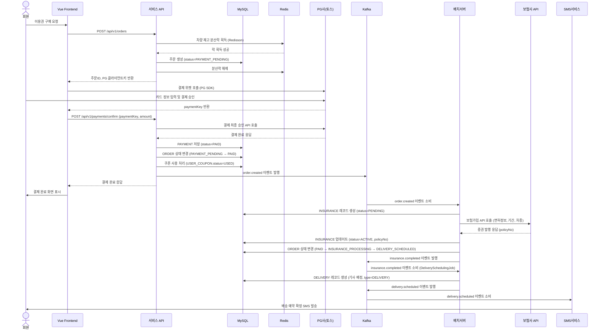
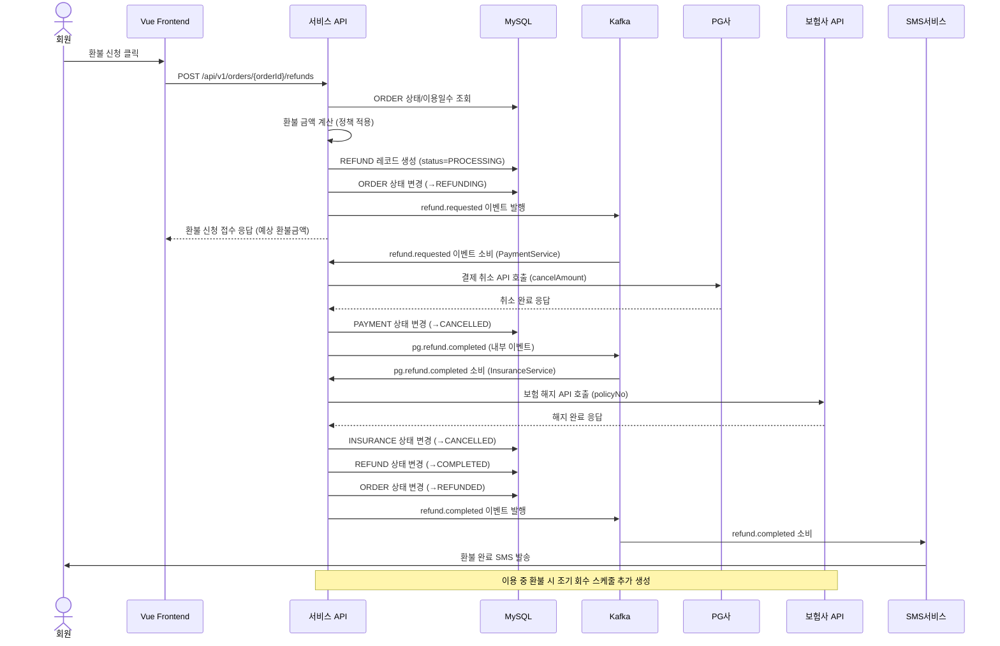

> **프로젝트명**: 프리카(FreeCar) 자동차 구독 이커머스 플랫폼
> **문서 버전**: v1.0
> **작성일**: 2026-09-18
> **작성자**: 수석 IT 컨설턴트 / SA

---

# 문서 4. 설계 단계 산출물

## 4.1 시스템 설계서

### 4.1.1 서비스 시스템 컴포넌트 설계

```
[service-api — Spring Boot]
├── presentation
│   ├── AuthController         # 로그인, 회원가입, 토큰갱신
│   ├── ProductController      # 상품 목록, 상세 조회
│   ├── SearchController       # 상품 검색 (ES 연동)
│   ├── OrderController        # 주문 생성, 상태 조회
│   ├── PaymentController      # 결제 승인, PG 웹훅 수신
│   ├── InsuranceController    # 보험 정보 조회
│   ├── DeliveryController     # 배송 정보 조회, 추적
│   ├── CouponController       # 쿠폰 조회, 유효성 검증
│   ├── MyPageController       # 마이페이지 통합 API
│   └── NotificationController # 알림 목록 조회
│
├── application (Service Layer)
│   ├── AuthService
│   ├── ProductService          # 캐시 적용 (Redis)
│   ├── OrderService            # 주문 생성, 재고 락(Redis Redisson)
│   ├── PaymentService          # PG 연동
│   ├── CouponService           # 쿠폰 검증/적용
│   └── MyPageService
│
├── domain
│   ├── member/                 # Member, MemberLicense, 값 객체
│   ├── vehicle/
│   ├── product/
│   ├── order/
│   ├── payment/
│   ├── insurance/
│   ├── delivery/
│   └── coupon/
│
├── infrastructure
│   ├── persistence/            # JPA Repository 구현
│   ├── kafka/                  # KafkaProducer, KafkaConsumer
│   ├── cache/                  # Redis CacheManager
│   ├── external/
│   │   ├── PgClient            # 토스페이먼츠 API 클라이언트
│   │   ├── SmsClient           # SMS 발송
│   │   ├── OAuthClient         # 소셜 로그인
│   │   └── MapClient           # 카카오맵
│   └── search/
│       └── ElasticsearchClient
│
└── config/
    ├── SecurityConfig          # Spring Security + JWT
    ├── KafkaConfig
    ├── RedisConfig
    └── SwaggerConfig
```

### 4.1.2 관리자 시스템 컴포넌트 설계

```
[admin-api — Spring Boot]
├── presentation
│   ├── DashboardController
│   ├── ProductAdminController  # 상품 CRUD
│   ├── VehicleAdminController  # 차량 재고 관리
│   ├── OrderAdminController    # 주문 관리, 상태 변경
│   ├── InsuranceAdminController
│   ├── DeliveryAdminController # 기사 배정, 스케줄 관리
│   ├── MemberAdminController
│   ├── CouponAdminController   # 쿠폰 발급, 관리
│   ├── SettlementAdminController
│   ├── BannerAdminController
│   ├── EventAdminController
│   ├── ReviewAdminController
│   ├── InquiryAdminController
│   └── BatchAdminController    # 배치 수동 실행
│
├── application
│   ├── ProductAdminService
│   ├── OrderAdminService
│   ├── CouponAdminService
│   └── SettlementService
│
└── [공통 infra 레이어 공유 — 별도 모듈]
```

### 4.1.3 배치 시스템 컴포넌트 설계

```
[batch — Spring Batch]
├── job
│   ├── InsuranceProcessJob         # 보험가입 처리
│   ├── DeliverySchedulingJob       # 배송 스케줄링
│   ├── ExpiredVehicleReturnJob     # 만료 차량 회수
│   ├── CouponExpiryJob             # 쿠폰 만료
│   ├── SubscriptionExpiryAlertJob  # 이용권 만료 알림
│   └── DailySettlementJob          # 일별 정산
│
├── step
│   ├── InsuranceRequestStep        # 보험 API 호출
│   ├── InsuranceSyncStep           # 보험 상태 동기화
│   ├── DeliveryAssignStep          # 기사 자동 배정
│   ├── CouponExpireStep
│   └── SettlementAggregateStep
│
├── reader / processor / writer    # Chunk 기반 처리
├── listener                        # Job 실행 로그, 알람
└── config
    ├── BatchSchedulerConfig        # @Scheduled 또는 Quartz
    └── BatchDataSourceConfig       # 배치 메타 DB 설정
```

---

## 4.2 상세 ERD 및 테이블 정의서

### 4.2.1 주요 테이블 상세 정의

#### MEMBER 테이블

| 컬럼명 | 데이터 타입 | Null | 기본값 | 설명 |
|---|---|---|---|---|
| id | BIGINT AUTO_INCREMENT | NOT NULL | — | PK |
| email | VARCHAR(255) | NOT NULL | — | 이메일 (UK) |
| password_hash | VARCHAR(255) | NULL | — | bcrypt 해시 (소셜로그인 시 NULL) |
| name | VARCHAR(100) | NOT NULL | — | 회원명 |
| phone | VARCHAR(20) | NOT NULL | — | 휴대폰 (UK, 암호화) |
| status | ENUM('ACTIVE','SUSPENDED','WITHDRAWN') | NOT NULL | 'ACTIVE' | 회원 상태 |
| grade | ENUM('FREE','SILVER','GOLD','PLATINUM') | NOT NULL | 'FREE' | 회원 등급 |
| marketing_agree | TINYINT(1) | NOT NULL | 0 | 마케팅 수신 동의 |
| created_at | DATETIME | NOT NULL | CURRENT_TIMESTAMP | 생성일시 |
| updated_at | DATETIME | NOT NULL | CURRENT_TIMESTAMP ON UPDATE | 수정일시 |

**인덱스**:
- PK: `id`
- UK: `email`, `phone`
- IDX: `status`, `grade`

---

#### ORDER 테이블

| 컬럼명 | 데이터 타입 | Null | 기본값 | 설명 |
|---|---|---|---|---|
| id | BIGINT AUTO_INCREMENT | NOT NULL | — | PK |
| order_no | VARCHAR(50) | NOT NULL | — | 주문번호 (UK, FC-YYYYMMDD-000001) |
| member_id | BIGINT | NOT NULL | — | FK → MEMBER |
| product_id | BIGINT | NOT NULL | — | FK → PRODUCT |
| product_plan_id | BIGINT | NOT NULL | — | FK → PRODUCT_PLAN |
| vehicle_id | BIGINT | NOT NULL | — | FK → VEHICLE |
| status | ENUM('PAYMENT_PENDING','PAID','INSURANCE_PROCESSING','INSURANCE_FAILED','DELIVERY_SCHEDULED','IN_USE','RETURN_SCHEDULED','COMPLETED','CANCELLED','REFUNDING','REFUNDED') | NOT NULL | 'PAYMENT_PENDING' | 주문 상태 |
| start_date | DATE | NOT NULL | — | 이용 시작일 |
| end_date | DATE | NOT NULL | — | 이용 종료일 |
| delivery_address | VARCHAR(500) | NOT NULL | — | 배송 주소 |
| delivery_scheduled_at | DATETIME | NOT NULL | — | 배송 예약 일시 |
| total_amount | BIGINT | NOT NULL | — | 주문 금액 합계 |
| coupon_discount | BIGINT | NOT NULL | 0 | 쿠폰 할인 금액 |
| final_amount | BIGINT | NOT NULL | — | 최종 결제 금액 |
| created_at | DATETIME | NOT NULL | CURRENT_TIMESTAMP | |
| updated_at | DATETIME | NOT NULL | CURRENT_TIMESTAMP ON UPDATE | |

**인덱스**:
- PK: `id`
- UK: `order_no`
- IDX: `member_id`, `vehicle_id`, `status`, `start_date`, `end_date`

---

#### INSURANCE 테이블

| 컬럼명 | 데이터 타입 | Null | 기본값 | 설명 |
|---|---|---|---|---|
| id | BIGINT AUTO_INCREMENT | NOT NULL | — | PK |
| order_id | BIGINT | NOT NULL | — | FK → ORDER (UK) |
| member_id | BIGINT | NOT NULL | — | FK → MEMBER |
| policy_no | VARCHAR(100) | NULL | — | 보험 증권번호 (UK, 발급 후 저장) |
| insurer_code | VARCHAR(50) | NOT NULL | — | 보험사 코드 |
| plan_type | ENUM('BASIC','PREMIUM') | NOT NULL | — | 보험 상품 유형 |
| start_date | DATE | NOT NULL | — | 보험 시작일 |
| end_date | DATE | NOT NULL | — | 보험 종료일 |
| premium_amount | BIGINT | NOT NULL | — | 보험료 |
| status | ENUM('PENDING','ACTIVE','CANCELLED','EXPIRED') | NOT NULL | 'PENDING' | 보험 상태 |
| request_payload | JSON | NULL | — | 보험사 요청 payload (감사 목적) |
| response_payload | JSON | NULL | — | 보험사 응답 payload |
| issued_at | DATETIME | NULL | — | 증권 발행일시 |
| cancelled_at | DATETIME | NULL | — | 해지일시 |
| created_at | DATETIME | NOT NULL | CURRENT_TIMESTAMP | |

---

## 4.3 화면 설계서 (주요 화면 UI 요소)

### 4.3.1 메인 페이지 컴포넌트 구조

```
MainPage.vue
├── AppHeader.vue
│   ├── LogoArea.vue
│   ├── GnbMenu.vue             # 카테고리 메뉴 (전기차/스포츠카/럭셔리카/SUV/미니밴/이벤트)
│   ├── SearchBar.vue           # 검색 인풋 + 자동완성
│   └── HeaderActions.vue       # 로그인/장바구니/찜/마이페이지 아이콘
│
├── MainBanner.vue              # Swiper 기반 롤링 배너 (자동 5초, 수동 컨트롤)
│   └── BannerSlide.vue
│
├── ProductSection.vue [전기차]  # 섹션 공통 컴포넌트 (title, more 버튼, 상품 카드 그리드)
│   └── ProductCard.vue         # 차량 썸네일, 이름, 최저가격, 할인율, 찜버튼
│
├── ProductSection.vue [스포츠카]
├── ProductSection.vue [럭셔리카]
├── ProductSection.vue [SUV]
├── ProductSection.vue [미니밴]
│
├── EventSection.vue            # 특별할인 이벤트 섹션 (할인 강조 UI)
│   └── EventProductCard.vue    # 할인율 뱃지, 원가/할인가 병기
│
└── AppFooter.vue
    ├── CompanyInfo.vue
    ├── FooterLinks.vue          # 약관/개인정보처리방침
    └── SnsLinks.vue
```

### 4.3.2 상품 상세 페이지 컴포넌트 구조

```
ProductDetail.vue
├── VehicleGallery.vue          # 이미지 갤러리 (메인 이미지 + 썸네일 롤)
├── VehicleInfo.vue             # 차량 기본 정보 (브랜드, 모델, 연식, 연료, 색상, 주행거리)
├── PlanSelector.vue            # 이용 기간 선택 탭 (7일/14일/1개월/3개월/6개월/12개월)
├── InsuranceSelector.vue       # 보험 옵션 선택 (기본/프리미엄, 보장 내역 비교 모달)
├── DeliveryPicker.vue          # 배송 날짜/시간/주소 입력
├── PriceSummary.vue            # 총 금액 요약 (차량요금 + 보험료 + 배송비 - 쿠폰)
├── ActionButtons.vue           # [장바구니 담기] [지금 구매하기] [찜하기]
└── ReviewSection.vue           # 리뷰 목록 (별점 분포, 리뷰 카드)
```

### 4.3.3 결제 페이지 컴포넌트 구조

```
CheckoutPage.vue
├── OrderSummary.vue            # 선택한 차량, 기간, 금액 요약
├── PersonalInfoForm.vue        # 이름, 연락처, 면허번호 (자동 채움 가능)
├── DeliveryInfoForm.vue        # 배송 주소/일시 확인 및 수정
├── InsuranceInfoDisplay.vue    # 선택한 보험 옵션 확인
├── CouponSelector.vue          # 쿠폰 선택/적용 (보유 쿠폰 드롭다운)
├── PriceBreakdown.vue          # 항목별 금액 내역 (차량/보험/배송/쿠폰할인/최종)
├── PaymentMethodSelector.vue   # 결제 수단 (카드/카카오페이/네이버페이)
├── TermsAgreement.vue          # 약관 동의 체크박스
└── SubmitButton.vue            # [결제하기] 버튼
```

### 4.3.4 마이페이지 이용권 현황 컴포넌트

```
SubscriptionStatus.vue
├── StatusTabs.vue              # [이용 중] [예정] [완료] 탭
├── SubscriptionList.vue
│   └── SubscriptionCard.vue
│       ├── VehicleThumbnail
│       ├── StatusBadge.vue     # 이용 중/배송 예정/완료 등 상태 뱃지
│       ├── DateRange.vue       # 이용 기간 D-day 표시
│       ├── InsuranceStatus.vue # 보험 상태
│       └── ActionButtons.vue   # [배송 추적] [환불 신청] [리뷰 작성]
└── Pagination.vue
```

---

## 4.4 배치 설계서

### 4.4.1 배치 Job/Step 설계

#### Job 1. InsuranceProcessJob (보험가입 처리)

| 항목 | 내용 |
|---|---|
| **트리거** | Kafka `insurance.requested` 이벤트 수신 (상시 소비) + 실패 재처리 1분 주기 |
| **처리 대상** | INSURANCE.status = 'PENDING' 레코드 |
| **Chunk Size** | 10 |
| **Steps** | InsuranceRequestStep → InsuranceStatusUpdateStep |

```
InsuranceRequestStep:
  - ItemReader: JPA — INSURANCE WHERE status='PENDING'
  - ItemProcessor: 보험사 API 호출 (가정 스펙, 타임아웃 10초, 최대 3회 재시도)
  - ItemWriter: INSURANCE 테이블 업데이트 (policy_no, status, issued_at)
              + Kafka 발행 (insurance.completed 또는 insurance.failed)

실패 처리:
  - Skip: InsuranceApiException (최대 3회)
  - Retry 전략: Exponential Backoff (1초, 2초, 4초)
  - 3회 초과 실패: status='FAILED', insurance.failed 이벤트 발행
```

#### Job 2. DeliverySchedulingJob (배송 스케줄링)

| 항목 | 내용 |
|---|---|
| **트리거** | `insurance.completed` 이벤트 수신 시 즉시 실행 |
| **처리 대상** | INSURANCE.status = 'ACTIVE' 이고 DELIVERY 미생성 주문 |
| **Steps** | DriverAssignStep → DeliveryCreateStep → NotificationStep |

```
DriverAssignStep:
  - 배송 지역 코드 기준 가용 기사(DRIVER.status='AVAILABLE') 자동 배정
  - 배정 불가 시: 관리자 알림, 수동 배정 큐에 등록

DeliveryCreateStep:
  - DELIVERY 레코드 생성 (type='DELIVERY', scheduled_at=주문의 delivery_scheduled_at)
  - Kafka: delivery.scheduled 이벤트 발행

NotificationStep:
  - 회원 SMS/앱푸시: 배송 예약 확정 알림
```

#### Job 3. ExpiredVehicleReturnJob (만료 차량 회수)

| 항목 | 내용 |
|---|---|
| **트리거** | 매일 오전 06:00 (Cron: `0 0 6 * * *`) |
| **처리 대상** | ORDER.end_date = TODAY AND status = 'IN_USE' |
| **Steps** | ReturnScheduleCreateStep → NotificationStep |

```
ReturnScheduleCreateStep:
  - DELIVERY 레코드 생성 (type='RETURN', scheduled_at=고객 지정 회수 시간)
  - ORDER.status → 'RETURN_SCHEDULED'
  - 기사 자동 배정
```

#### Job 4. CouponExpiryJob (쿠폰 만료)

| 항목 | 내용 |
|---|---|
| **트리거** | 매일 자정 00:05 (Cron: `0 5 0 * * *`) |
| **처리 대상** | USER_COUPON WHERE status='ISSUED' AND expired_at < NOW() |
| **Chunk Size** | 1000 |
| **Steps** | CouponExpireStep |

```
CouponExpireStep:
  - ItemReader: JPA 페이징 — 만료 쿠폰 조회
  - ItemProcessor: status = 'EXPIRED', expired_at = now()
  - ItemWriter: BulkUpdate + Kafka coupon.expired 이벤트 발행 (알림 대상만)
```

#### Job 5. DailySettlementJob (일별 정산)

| 항목 | 내용 |
|---|---|
| **트리거** | 매일 01:00 (Cron: `0 0 1 * * *`) |
| **처리 대상** | 전일 PAYMENT.status='PAID' 및 REFUND.status='COMPLETED' |
| **Steps** | SalesAggregateStep → RefundAggregateStep → SettlementSaveStep |

```
SalesAggregateStep:
  - 전일 결제 완료 주문 집계 (총 매출, 건수, 카테고리별)
RefundAggregateStep:
  - 전일 환불 완료 집계 (환불금액, 위약금 합계)
SettlementSaveStep:
  - SETTLEMENT 테이블 저장 (date, totalSales, totalRefund, netSales)
  - CSV 파일 생성 → S3 업로드
```

---

## 4.5 시퀀스 다이어그램

### 4.5.1 이용권 구매 ~ 보험가입 ~ 배송예약 흐름



### 4.5.2 환불 처리 흐름



---

## 4.6 예외/오류 처리 설계 (Saga 패턴)

### 4.6.1 Saga 패턴 적용 시나리오

```
[주문-보험-배송 Choreography Saga]

정상 흐름:
ORDER.created → INSURANCE.requested → INSURANCE.completed → DELIVERY.scheduled

보상 트랜잭션 흐름 (보험가입 실패):
INSURANCE.failed →
  1. order-service: ORDER 취소 (status → CANCELLED)
  2. payment-service: 결제 환불 처리 (PG 취소 API 호출)
  3. notification-service: 회원 알림 (보험 가입 실패로 주문 자동 취소 및 환불 안내)

보상 트랜잭션 흐름 (결제 실패):
  - 주문 자동 취소 (status → CANCELLED)
  - 생성된 재고 예약 해제
  - 적용된 쿠폰 복원 (쿠폰 상태 → ISSUED 복원)
```

### 4.6.2 오류 처리 코드 체계

| 오류 코드 | 설명 | HTTP Status | 처리 방안 |
|---|---|---|---|
| ERR-AUTH-001 | 인증 토큰 만료 | 401 | 클라이언트 Refresh Token으로 재발급 |
| ERR-AUTH-002 | 권한 없음 | 403 | 로그인 유도 |
| ERR-PRODUCT-001 | 상품 미존재 | 404 | 404 페이지 |
| ERR-PRODUCT-002 | 차량 재고 없음 | 409 | 재고 알림 신청 유도 |
| ERR-ORDER-001 | 주문 생성 실패 | 500 | 재시도 안내, 문의 유도 |
| ERR-PAY-001 | 결제 실패 | 400 | PG 오류 메시지 전달 |
| ERR-PAY-002 | 결제금액 불일치 | 400 | 주문 취소, 재주문 유도 |
| ERR-INS-001 | 보험 가입 실패 | 500 | Saga 보상 트랜잭션 (주문취소/환불) |
| ERR-INS-002 | 보험 가입 조건 불충족 | 400 | 조건 안내 |
| ERR-REFUND-001 | 환불 불가 구간 | 400 | 환불 정책 안내 |
| ERR-COUPON-001 | 쿠폰 유효하지 않음 | 400 | 사유 안내 (만료/이미사용/미충족) |

---
